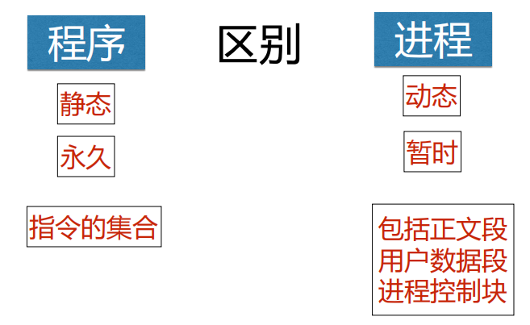

## 1. 进程描述

### 1.1 程序的执行

##### 程序顺序执行

##### 程序并发执行

### 1.2 进程的概念

进程定义：一个并发执行的程序**在数据集合上的运行过程**

进程的结构：正文段  +  用户数据段  +  **进程控制块（PCB）**

### 1.3 进程的特征

- 并发性：多个进程实体能**在一段时间间隔内同时运行**，是**进程和现代操作系统的重要特征**
- 动态性：进程是程序的**执行过程** （执行程序—>创建进程、获得CPU—>执行指令、运行中止—>被撤销）
- 异步性：进程的执行时断时续，何时执行、何时暂停都**无法预知**
- 独立性：独立运行和资源**调度的基本单位**（不包含线程）
- 结构特征：进程实体包括用户**正文段**、**用户数据段** 和 **[进程控制块](#1.5 进程控制块-PCB)** 

### 1.4 进程和程序的区别与区别

​								

​								

### 1.5 进程控制块-PCB

在进程概念中提到，进程的结构特征将进程实体分为 **正文段、用户数据段、进程控制块PCB**。

进程控制块：是**进程实体的一部分**，是操作系统中**最重要的数据结构**。它记录了用于描述进程及控制进程运行所需的全部信息，包含以下四个部分：

- **进程标识符信息**：用于唯一标识一个进程。

- **CPU 状态信息**：包括通用寄存器（指令寄存器）、指令计数器（对应CPU的程序计数器）、程序状态字PSW（两种状态） 和用户栈指针（进程栈的指针）。

- **进程调度信息**：进程状态信息、进程优先级和进程调度所需的其他信息。

- **进程控制信息**：程序和数据的地址、进程同步和通信机制、资源清单，以及链接指针。

### 1.6 进程的状态

## 2. 进程的控制

## 3. 操作系统内核

## 4. 进程同步

## 5. 进程通信

## 6. 线程

