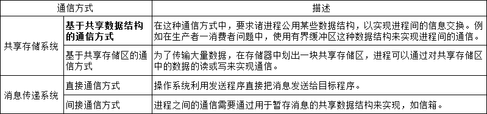

[toc]

## 一. 进程描述

### 1. 程序的执行

#### 1.1 顺序执行

#### 1.2 并发执行

### 2. 进程的概念

进程定义：一个并发执行的程序**在数据集合上的运行过程**

进程的结构：正文段（机器指令）  +  用户数据段（操作系统的用户数据）  +  **进程控制块（PCB）**（运行环境）

### 3. 进程的特征

- 并发性：多个进程实体能**在一段时间间隔内同时运行**，是**进程和现代操作系统的重要特征**
- 动态性：进程是程序的**执行过程** （执行程序—>创建进程、获得CPU—>执行指令、运行中止—>被撤销）
- 异步性：进程的执行时断时续，何时执行、何时暂停都**无法预知**
- 独立性：独立运行和资源**调度的基本单位**（在没有引入线程概念的操作系统中）
- 结构特征：进程实体包括用户**正文段**、**用户数据段** 和 **[进程控制块](#1.5 进程控制块-PCB)** 

### 4. 进程和程序的比较

#### 4.1 区别

#### 4.2 联系

​								

### 5. 进程控制块-PCB

在进程概念中提到，进程的结构特征将进程实体分为 **正文段、用户数据段、进程控制块PCB**。

进程控制块：是**进程实体的一部分**，是操作系统中**最重要的数据结构**。它记录了用于描述进程及控制进程运行所需的全部信息，包含以下四个部分：

- **进程标识符信息**：用于唯一标识一个进程。

- **CPU 状态信息**：包括通用寄存器（即 IR）、指令计数器（即 PC）、**程序状态字PSW**（两种状态） 和用户栈指针（进程栈的指针）。

- **进程调度信息**：**进程状态**信息、进程**优先级**和进程**调度**所需的其他信息。

- **进程控制信息**：程序和数据的地址、**进程同步**和**通信机制**、资源清单，以及链接指针。

### 6. 进程的状态

**进程的三种状态：执行态、就绪态、阻塞态**

### 7. 进程的组织

**进程的组织方式：链接方式、索引方式、进程队列**。

​	

## 二. 进程的控制

**进程的控制：创建、阻塞、唤醒、终止，进程经历的整个生命周期**

### 1. 创建进程

#### 1.1 创建时机

- 用户登陆

- 作业调度（外存调度到内存然后执行作业）

- 提供服务（系统服务）

- 应用请求（打开QQ、微信）

#### 1.2 创建步骤

1. **申请空白 PCB**
2. **为 新进程分配资源**
3. **初始化 PCB（赋值）**
4. **将新进程/PCB插入 就绪队列**

### 2. 阻塞进程

#### 2.1 阻塞时机

- 请求系统服务
- 启动某种操作
- 新数据尚未到达（I/O等待）
- 无新工作可做

#### 2.2 阻塞步骤

1. **将进程的状态改为阻塞态**
2. **将新进程/PCB插入 阻塞队列**
3. **转到进程调度程序，从就绪队列选择进程为其分配 CPU**

### 3. 唤醒进程

#### 3.1 唤醒步骤

1. **将进程从阻塞队列中移出**

2. **将进程状态由阻塞态改为就绪态**

3. **将进程插入就绪队列**

### 4. 终止进程

#### 4.1 终止时机

进程正常执行完毕

#### 4.2 终止步骤

1. **从进程PCB读取进程状态**
2. **若进程正在执行，则终止执行**
3. **释放资源**
4. **将终止进程的PCB从进程队列中移除**

## 三. 操作系统内核

操作系统是一种系统软件，所以操作系统内核是该系统软件的**底层核心的代码**。

操作系统内核：是计算机硬件的第一次扩充，内核执行操作系统**与硬件关系密切**，**执行频率高**的模块，**常驻内存**。

操作系统内核功能：

- **支撑功能**（中断处理、时钟管理、原语操作）
- **资源管理功能**（进程管理、存储管理、设备管理）。

### 1. 中断

##### 中断概念

定义：中断是 改变 CPU 执行指令顺序 的一种事件。这样的事件与 CPU 芯片内外部硬件电路产生的电信号相对应。

出现中断时，计算机停止现在程序的运行，转向对这些中断事件的处理，处理结束后再返回到现行程序的间断处

##### 为什么需要中断呢？

[查看I/O中断控制方式](./IO设备管理)

- 引入中断机制前，当在CPU上执行的程序遇到I/O时， CPU采取反复轮询的方式，检测本次I/O是否结束。

- 引入中断机制后，CPU可以与其他设备并行工作，能有效提高CPU的利用率，改善系统性能，支持系统的异步操作。

##### 中断分类与原因

##### 中断处理过程

### 2. 时钟管理

定义：时钟是计算机系统的脉搏，计算机的很多活动都是由定时测量来驱动的。

##### 计算机系统中的时钟

- 实时时钟（RTC）：计算机开机加电后，操作系统通过 BIOS 获取 当前RTC时钟为初始时间。
- OS时钟：产生于PC主板上的定时/计数芯片，在开机时有效，由操作系统控制

##### 操作系统的定时测量机制

- **保存当前的日期和时间**，由时钟硬件PIT支持

  

-  **维持定时器（时间间隔）**：由时钟驱动程序（时钟中断处理程序）支持，每产生一次时钟中断信号，操作系统内核要执行时钟驱动程序。

  

### 3. 系统调用

##### 系统调用概念

定义：系统调用是操作系统预先定义好的一个模块（内核），提供一条通道让用户应用程序调用的程序接口来得到核心服务。

定义2：系统调用是系统程序与用户程序之间的接口，在类UNIX 系统中，系统调用多使用 C 语言提供的库函数作为接口。

内存空间

- 系统（内核）空间（区）：操作系统内核进程所在的地址空间。
- 用户空间（区）：用户进程所在的地址空间。

运行状态

- 系统（内核）态：CPU执行系统核心代码时，称该进程处于系统态执行。
- 用户态：CPU执行用户空间的代码时，称该进程处于用户态执行。

##### 系统调用与一般函数调用

- 系统调用运行在系统态，一般函数运行在用户态

- 执行过程不同，系统调用执行时，当前进程被中断，然后进入系统态执行对应的程序

- 系统调用进行中断处理，多了系统开销

##### 系统调用类型

- 进程控制类：创建、撤销进程；获得、改变进程属性。
- 文件操纵类：创建文件、删除文件、打开文件、关闭文件和读/写文件。
- 设备管理类：请求、释放设备。
- 通信类：打开、关闭连接，交换信息。
- 信息维护类：返回系统当前日期、时间、版本号、用户数、空闲内存和磁盘大小等信息。

## 四. 进程同步

### 1. 基本概念

定义：保证并发执行的进程在访问共享资源的情况下，程序执行能得到正确的结果。

竞争资源关系：保证各进程以**互斥**的方式访问临界资源。

临界区：必须**以互斥方式访问**的共享资源称为**临界资源**，进程中**访问临界资源**的那段**代码**称为**临界区**

### 2. 同步准则

### 3. 信号量实现同步

同步原理：用信号量的值来表示资源的使用情况，并以此为基础提供原子操作该变量实现进程同步。信号量类型有整型、记录型、AND型。

##### 整型信号量

原理：定义一个变量，且由特殊的原子操作操作变量，**初始值为 1**（>0 表示可用; <=0 表示没有可用，需等待）。

- 申请资源：wait()

- 释放资源：signal()

##### 记录型信号量

原理：记录型信号量数据结构由一个资源数量Value 和阻塞队列List组成。

- s.value >= 0 表示资源数量
- s.value < 0，绝对值表示等待队列中阻塞进程的数量

##### 经典同步和协调案例

- 生产者—消费者问题，实现任意两个进程对缓冲池的互斥访问；实现对生产者进程和消费者进程的“协调”。

  信号量的设置：设置一个互斥的信号量 mutex 初值为 1；设置两个资源信号量。

  

- 读者-写者问题，允许多个进程同时读 D区，仅允许一个进程写 D 区；且有进程写 D 区时，不能有任何其他进程读或写 D 区

  设置全局变量 readcount 用于对进入共享区的读进程计数；互斥信号量rmulex 用于对多个进程共享的全局变量readcount 的互斥访问；互斥信号量 wmutex用于实现读操作与写操作的互斥，以及写操作与写操作的互斥。

  

### 4. Monitor(管程)实现同步

> 管程在并发编程领域被广泛使用，其中C/C++、C#、Java等都支持管程。其中Java1.5之前提供的synchronized关键字、wait、notify、notifyAll等都是基于管程并发原语的实现。而在Java1.5之后的JUC并发包也大都基于管程或者信号量实现。

**定义1：**Monitor(管程)，指的是管理共享变量并及其操作过程。它是描述共享资源的数据结构和在数据结构上的共享资源管理程序的集合。

对比信号量的P(S)和V(S)操作大量分散各处，不宜管理，极易发生死锁，而管程封装了同步操作，隐蔽了繁琐同步细节

对管程的说明：

- 管程是可供程序员调用的模块。
- 每次只有一个进程调用管程执行。
- 管程是一种编程语言的构件，所以编译器知道它们很特殊，并可以调用与其他过程不同的方法来处理它们

管程属性：

- 共享性：管程可被系统范围内的进程互斥访问，属于共享资源

- 安全性：管程的局部变量只能由管程的过程访问，不允许进程或其它管程直接访问，管程也不能访问非局部于它的变量。

- 互斥性：多个进程对管程的访问是互斥的。任一时刻，管程中只能有一个活跃进程。

- 封装性：管程内的数据结构是私有的，只能在管程内使用，管程内的过程也只能使用管程内的数据结构。进程通过调用管程的过程使用临界资源。

## 五. 进程通信

## 六. 线程

### 1. 线程概念

##### 定义

线程是进程中的一个实体，是被系统独立调度和分派的基本单位。

线程只拥有在运行中必需的资源，包括程序计数器、一组寄存器和栈，但它可与同一进程的其他线程共享进程所拥有的全部资源。

##### 进程与线程区别

##### 线程分类

- 用户级线程：不依赖操作系统内核

- 内核级线程：依赖操作系统内核

##### 组织方式

线程控制块通常采用链接方式来组织，把同一进程中具有相同状态的TCB用指针链接成队列。

### 2. 线程状态

### 3. 线程控制块

### 4. 线程与进程关系

### 5. 线程的控制

