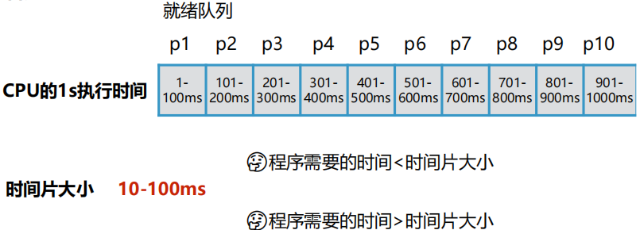
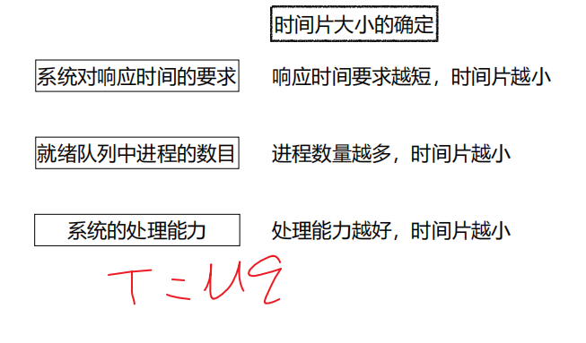
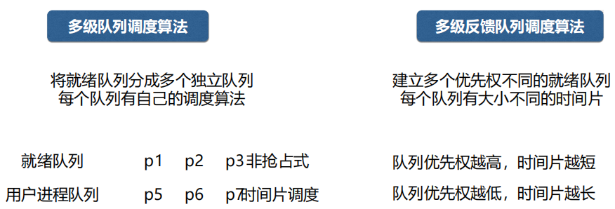

[toc]

## 一、进程调度

### 1. 进程调度功能

#### 调度是谁的功能？

A：进程调度是操作系统的进程调度程序来完成的。

#### 调度的作用？

A：按照某种算法和策略从就绪队列中挑选一个进程为其分配 CPU 去运行

#### 调度的时机?

- 时间片用完
- 有更高优先级的进程到来
- 进程发生阻塞
- 进程异常结束
- 进程正常结束

### 2. 进程调度算法

#### 调度算法种类介绍

- 先来先服务调度算法-FCFS
- 短进程优先调度算法-SPF
- 优先权调度算法
- 时间片轮转调度算法
- 多级队列调度算法
- 多级队列反馈调度算法

#### 调度算法好坏准则

其中周转时间 = 外存等待时间 + 就绪队列等待时间 + 执行时间 + I/O操作阻塞时间

周转时间相关计算如下：

#### 先来先服务调度算法FCFS

定义：从就绪队列的队首**选择就绪队列中最先到达的进程**，为该进程分配CPU

缺点：适合长进程，不利于短进程，**短进程等待时间相对运行时间而言太长**。

#### 短进程优先调度算法SPF

定义：从就绪队列中**选择估计运行时间最短的进程**，为该进程分配CPU。

优点：与FCFS算法相比，短进程优先算法有效**降低进程的平均等待时间，提高系统吞吐量**

缺点：

- 对长进程不利，可导致长进程长时间饥饿无法得到 CPU。

- 不能保证紧迫进程的处理。

- 进程长短由用户估计，不一定准确。

#### 优先权调度算法

定义：从就绪队列中**选择优先权最高的进程**，为该进程分配CPU。

**存在问题：**低优先权进程无穷阻塞（饥饿问题）

**解决方案：**动态调整优先权（等待时间越长优先权不断调高） - 老化技术

#### 时间片轮转调度算法Round-Robin

定义：系统将所有就绪进程按先来先服务的原则，排成一个队列，每次调度时把CPU分给队首进程，并令其执行一个时间片。当时间片用完时，调度程序终止当前进程的执行，并将它送到就绪队列的队尾。

时间片轮转调度算法在分时系统中广泛使用。

时间片过大：相当于FCFS调度算法

时间片过小：CPU切换进程和调度的开销 越大

#### 多级队列调度算法 & 多级队列反馈调度算法

### 3. 实时系统的调度算法

### 4. 多处理器的调度算法

## 二、死锁

