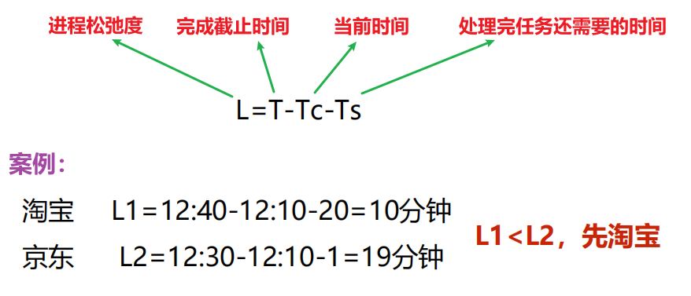

[toc]

## 一、进程调度

### 1. 进程调度功能

#### 1.1 调度是谁的功能？

A：进程调度是操作系统的进程调度程序来完成的。

#### 1.2 调度的作用？

A：按照某种算法和策略从就绪队列中挑选一个进程为其分配 CPU 去运行

#### 1.3 调度的时机?

- 时间片用完
- 有更高优先级的进程到来
- 进程发生阻塞
- 进程异常结束
- 进程正常结束

### 2. 进程调度算法

#### 2.1 调度算法种类介绍

- 先来先服务调度算法-FCFS
- 短进程优先调度算法-SPF
- 优先权调度算法
- 时间片轮转调度算法
- 多级队列调度算法
- 多级队列反馈调度算法

#### 2.2 调度算法好坏准则

其中周转时间 = 外存等待时间 + 就绪队列等待时间 + 执行时间 + I/O操作阻塞时间

周转时间相关计算如下：

#### 2.3 先来先服务调度算法FCFS

**定义：**从就绪队列的队首**选择就绪队列中最先到达的进程**，为该进程分配CPU

缺点：适合长进程，不利于短进程，**短进程等待时间相对运行时间而言太长**。

#### 2.4 短进程优先调度算法SPF

**定义：**从就绪队列中**选择估计运行时间最短的进程**，为该进程分配CPU。

优点：与FCFS算法相比，短进程优先算法有效**降低进程的平均等待时间，提高系统吞吐量**

缺点：

- 对长进程不利，可导致长进程长时间饥饿无法得到 CPU。

- 不能保证紧迫进程的处理。

- 进程长短由用户估计，不一定准确。

#### 2.5 优先权调度算法

**定义：**从就绪队列中**选择优先权最高的进程**，为该进程分配CPU。

**存在问题：**低优先权进程无穷阻塞（饥饿问题）

**解决方案：**动态调整优先权（等待时间越长优先权不断调高） - 老化技术

#### 2.6 时间片轮转调度算法Round-Robin

**定义：**系统将所有就绪进程按先来先服务的原则，排成一个队列，每次调度时把CPU分给队首进程，并令其执行一个时间片。当时间片用完时，调度程序终止当前进程的执行，并将它送到就绪队列的队尾。

时间片轮转调度算法在分时系统中广泛使用。

时间片大小的确定，与系统响应时间、进程数目的关系。

**时间片过大：**相当于FCFS调度算法

**时间片过小：**CPU频繁切换和调度进程，开销大

#### 2.7 多级队列调度算法

**定义：**将就绪队列分成多个独立队列，**每个队列都有自己的调度算法。**

#### 2.8 多级队列反馈调度算法

**定义：**将就绪队列分成多个**优先权不同的队列**，每个队列有**大小不同的时间片**

### 3. 实时系统的调度算法

#### 3.1 实时调度基本条件

- **提供必要的调度信息：**就绪时间、开始截止时间、完成截止时间、处理时间、 资源要求、优先级

- **系统处理能力强：**在实时系统中，通常**有多个实时进程**，CPU需要有足够**强的处理能力**，来保证多个实时进程能得到及时响应和处理。

- **采用抢占式调度机制：**当一个优先权更高的进程到达时，允许将当前进程暂时挂起，而令高优先权进程立即投入运行。

  抢占式调度算法根据抢占 CPU 的时机不同，可以分为 基于  时钟中断的抢占  和   立即抢占

- **具有快速切换机制：**对外部中断的快速响应能力、快速的进程切换能力

#### 3.2 实时调度算法

##### 3.2.1 最早截止时间优先算法EDF

开始截止时间越早，进程优先级越高，越优先获得CPU

##### 3.2.2 最低松弛度优先算法LLF

用**松弛度** 来 表示一个实时进程的紧迫程度。松弛度**越低**，表示进程**越紧迫**

调度程序在调度时机到来时，每次选择松弛度 L 最小的进程，把 CPU分配给该进程。

### 4. 多处理器的调度

#### 4.1 多处理器系统的类型

#### 4.2 多处理器系统中进程的分配方式

##### 4.2.1 对称多核CPU分配方式

##### 4.2.2 非对称多核CPU分配方式

#### 4.3 多处理器系统的进程（线程）的调度方式

多核系统中进程/线程的调度方式有三种，分别为 自调度、成组调度、专用处理器分配。

##### 4.3.1 自调度

优点：自调度实现简单、易移植、不会出现CPU忙闲不均衡的情况，即CPU利用率高。

缺点：多次更换CPU、某些线程因其合作的线程未获得CPU而阻塞导致进程、线程切换

##### 4.3.2 成组调度

时间分配有两种方式：面向所有的应用程序平均分配处理器时间和面向所有的线程平均分配处理器时间。

优点：减少线程调度、切换的开销。

##### 4.3.3 专用处理器分配

在一个应用程序执行期间，专门为该应用程序分配一组处理器，每个线程一个，这组处理器供该应用程序专用，直至应用程序完成。

优点：程序的运行速度加快、避免了进程切换。

缺点：**严重浪费CPU资源**。

## 二、进程切换

**定义：**当前正在执行的进程成为被替换进程，让出其所使用的CPU，以运行被进程调度程序选中的新进程

### 1. 切换步骤

1. 保存 CPU 上下文环境（包括程序计数器、和一些寄存器）。

2. 更新被替换进程的 PCB（更新进程控制块中进CPU状态、调度、控制等信息）。

3. 修改进程状态，把执行态改为 就绪态 或者 阻塞态。

   

4. 将被替换进程的进程控制块移到就绪队列 或 阻塞队列。

   

5. 执行通过进程调度程序选择的新进程，并更新该进程的进程控制块。

6. 更新内存管理的数据结构。

7. 恢复被调度程序选中的进程的CPU上下文。

## 三、死锁

### 1. 定义及产生

由于多个进程竞争共享资源而引起的进程不能向前推进的僵死状态称为**死锁**

#### 产生原因

多进程/线程竞争有限的共享资源，且分配资源不当。

#### 必须条件

### 2. 死锁的处理

#### 2.1 死锁预防

通过**破坏死锁的产生条件**来保证不发生死锁。

#### 2.2 死锁避免

通过**算法合理分配资源**使系统处于**安全状态**，来保证不发生死锁

安全状态：能够找到一个进程**执行序列**，按照这个序列为每个进程分配资源，就可以保证进程资源分配和执行顺利完成，**不会发生死锁**。

- 安全状态至少能找到一个安全执行序列，不会死锁
- 不安全状态找不到安全执行序列，可能发生死锁

##### 银行家算法

在检测到系统剩余资源量可满足进程需求时才进行分配。

#### 2.3 死锁检测

检测使用系统的资源分配图能不能完全简化。

完全简化 -》 所有连线都没了，即每个点都是独立

#### 2.4 死锁解除

检测到系统有死锁后进行解除

不过比较复杂，问题如下 ：

- 去哪个进程抢？
- 抢哪个进程代价小
- 容易被抢的进程一直被抢，处于饥饿状态

