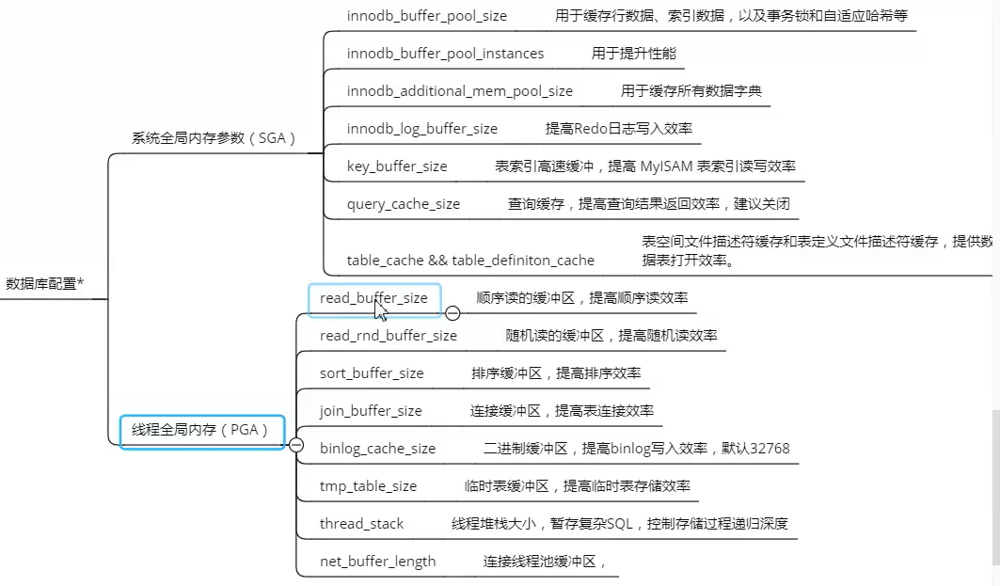

[toc]


### 一、硬件升级

- 内存
- CPU
- 磁盘
- 网络带宽


### 二、==数据库配置==

#### 1.可配置参数大致如下：



#### 2. 数据库预热

默认情况，仅仅有某条数据被读取一次，才会缓存在 innodb_buffer_pool。所以，数据库刚刚启动，须要进行数据预热，将磁盘上的全部数据缓存到内存中，提高读取速度，步骤如下：

**1）预热SQL脚本：loadtomem.sql**

```sql
SELECT DISTINCT
	CONCAT( 'SELECT ', ndxcollist, ' FROM ', db, '.', tb, ' ORDER BY ', ndxcollist, ';' ) SelectQueryToLoadCache 
FROM
	(
		SELECTengine,
		table_schema db,
		table_name tb,
		index_name,
		GROUP_CONCAT( column_name ORDER BY seq_in_index ) ndxcollistFROM (
			SELECTB.ENGINE,
			A.table_schema,
			A.table_name,
			A.index_name,
			A.column_name,
			A.seq_in_index FROMinformation_schema.statistics A
			INNER JOIN ( SELECT ENGINE, table_schema, table_name FROM information_schema.TABLES WHERE ENGINE = 'InnoDB' ) B USING ( table_schema, table_name ) 
		WHERE
			B.table_schema NOT IN ( 'information_schema', 'mysql' ) 
		ORDER BY
			table_schema,
			table_name,
			index_name,
			seq_in_index 
		) A 
	GROUP BY
		table_schema,
		table_name,
		index_name 
	) AA 
ORDER BY
	db,
	tb;
```

**2）执行命令`mysql -uroot -proot -AN < /root/loadtomem.sql > /root/loadtomem.sql `**

**3）在需要数据预热时，比如重启数据库  `mysql -uroot < /root/loadtomem.sql > /dev/null 2>&1`**


### 三、==SQL 优化==

#### 1.查看慢查询日志，定位慢查询SQL

#### 2. 使用Explain分析执行计划

#### 3. SQL优化

- **利用覆盖索引来进行查询操作，避免回表**

- **In和 not in可使用join 关联索引字段优化**
  
  - not in优化前：`select colname … from A表 where a.id not in (select b.id from B表) `
  - join优化后：`select colname … from A表 Left join B表 on where a.id = b.id where b.id is null`
  - in 优化前：`select count(id) num , address from tbiguser where address in (select distinct address from tuser1) or address in (select distinct address from tuser2) group by address order by address; `
  - join优化后：`select count(x.id),x.address from (select distinct b.* from tuser1 a,tbiguser b where a.address=b.address union all select distinct b.* from tuser2 a,tbiguser b where a.address=b.address) x group by x.address;`
  
- **IN包含的值不应过多，若太多可使用join优化**

  MySQL对于IN做了相应的优化，即将IN中的常量全部存储在一个数组里面，而且这个数组是排好序的。但是如果数值较多，产生的消耗也是比较大的。

- **超过三个表禁止 join，且多表关联查询时，保证被关联的字段需要有索引**

- **SELECT语句务必指明字段名称**

  尽量只取自己需要的字段，减少内存、网络带宽等消耗，而且尽量覆盖索引

- **当只需要一条数据的时候，使用limit 1**

  limit 是可以停止全表扫描的

- **如果限制条件中其他字段没有索引，尽量少用or**

  or两边的字段中，如果有一个不是索引字段，会造成该查询不走索引的情况。

- **尽量用union all代替union**

  union和union all的差异主要是前者需要将结果集合并后再进行唯一性过滤操作，这就会涉及到排序，增加大量的CPU运算，加大资源消耗及延迟。当然，union all的前提条件是两个结果集没有重复数据

- **不使用ORDER BY RAND()**

  ORDER BY RAND() 不走索引

- **区分in和exists、not in和not exists**

  - exists先执行外层查询，适合于外表小而内表大的情况

  - IN先执行子查询，适合于外表大而内表小的情况

- **使用主键索引子查询提高分页的效率**

  `SELECT t1.* FROM t1, (select id from t1 where ... LIMIT 100000,20 ) as t2 where t1.id=t2.id`

  利用主键的定位，可以减小m的值

- **分段查询**

  查询的行记录数量过多，可以通过程序，分段进行查询，循环遍历，将结果合并处理进行展示

- **不建议使用%前缀模糊查询**

  会导致索引失效而进行全表扫描

- **避免在where子句中对字段进行表达式操作**

  造成引擎放弃使用索引

- **组合索引，要遵守最左前缀法则**

- **必要时可以使用force index来强制查询走某个索引**

- **order by排序避免出现filesorted，应该配合组合索引，并且放在组合索引的最后一位**

  where a=? and b=? order by c; 索引：a_b_c

  **注意：**索引如果存在范围查询，那么索引有序性无法利用，如：WHERE a>10 ORDER BY b; 索引 a_b 无法排序

- **禁止使用存储过程，存储过程难以调试和扩展，更没有移植性**


### 四、==开发规范==(见阿里巴巴开发手册)

- **避免复杂的多表关联查询**

  可能导致索引失效而全表扫描及全表锁定

- **禁止存储过程、触发器等**

  存储过程难以调试和扩展，更没有移植性

- **避免重复索引**

- **尽量少使用select**


### 五、==表设计优化==

- 字段尽量使用NOT NULL并且设置默认值为空字符串或0，NULL值需要额外占用空间

- 表中字段尽可能少

  字段太多行记录跨页存储，影响IO、内存性能，更新时产生大binlog，增大主从同步延时

- 对于字段太多的大表，考虑**拆表**（比如一个表有100多个字段）

- 字段类型，能用数值类型就用数值类型，因为数值类型处理起来的速度要比文本类型快得多

- 每张表建议都要有一个主键（**主键索引**），而且主键类型最好是 **int类型**，建议自增主键（**此处不考虑分布式数据库**）。

- 时间字段使用datetime

- varchar不要使用过长的声明

- 少用text大字段

- 为减少关联查询，创建合理的**冗余字段**（创建冗余字段还需要注意**数据一致性问题**）


### 六、==减少数据库访问==

- 本地缓存（Guava）
- 分布式缓存


### 七、架构优化

- 主从架构

  读写分离

- 分库分表

  单库表数量控制在2000以内

  单表分表控制在1024以内

  单表字段控制在50以内