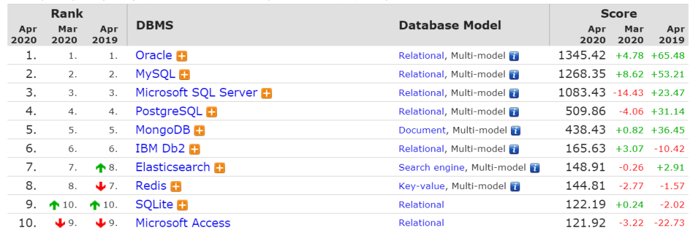
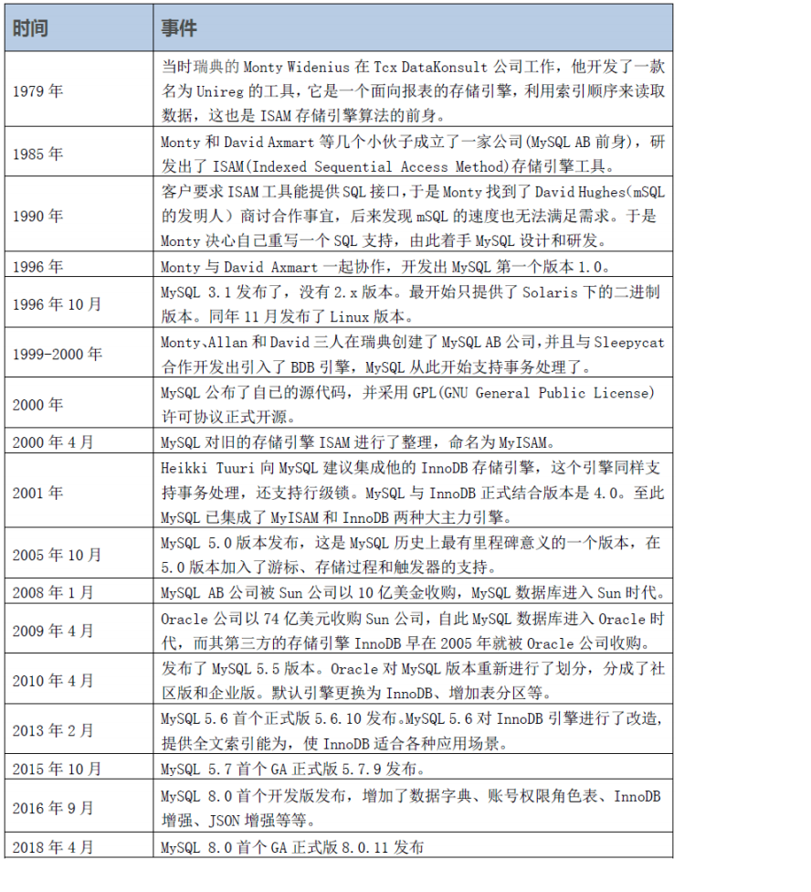
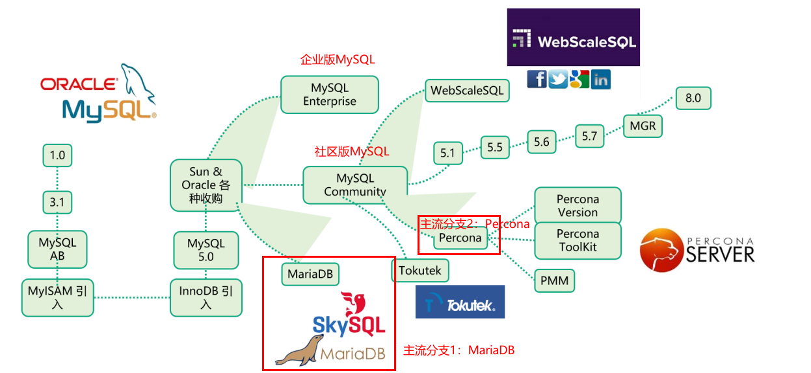

[toc]

## 一、MySQL起源与分支

### 1. 各主流数据库的占比 

MySQL 是最流行的**关系型数据库**软件之一，由于其体积小、速度快、开源免费、简单易用、维护成本低等，在集群架构中易于扩展、高可用，因此深受开发者和企业的欢迎。

**==Oracle==**和**==MySQL==**是世界**==市场占比最高的两种数据库==**。

### 2. 21世纪初大型企业转向信息化，大都采购 IOE 的产品

IOE，即**==IBM的服务器==**，**==Oracle数据库==**，**==EMC存储设备==**。都是有钱的公司产品采购，例如银行、电信、石油、证券等大企业。

**Oracle**：有钱的大企业采用，售后保障，**互联网企业之外使用第一**。

**MySQL**：互联网高速发展，免费开源，**互联网企业使用第一**。

### 3. MySQL发展历程如下

### 4. MySQL主流分支如下图所示

## 二、

## 三、

