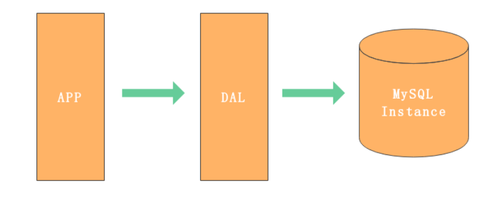
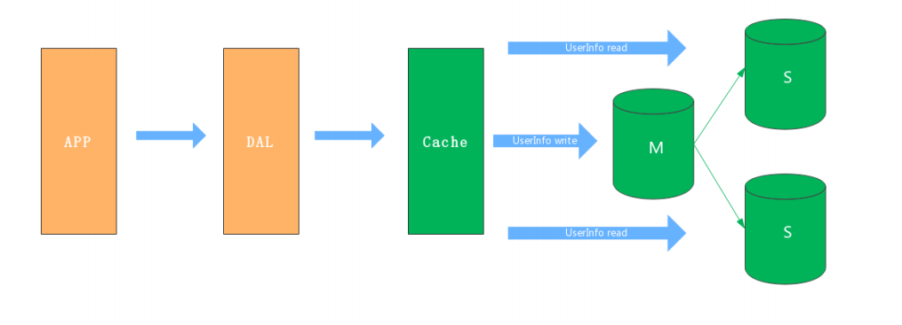
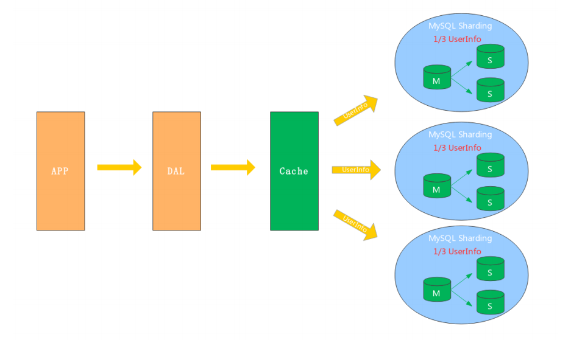
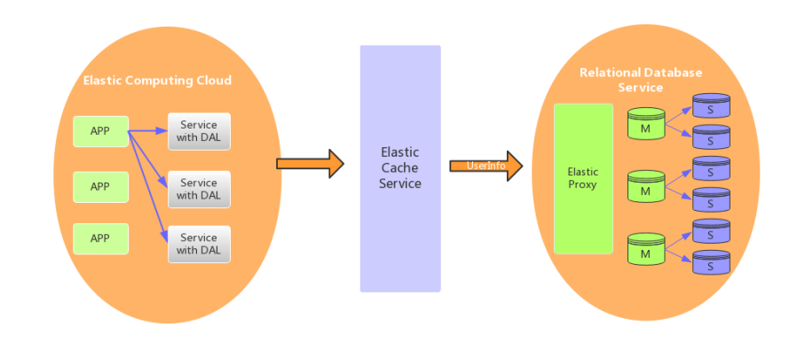

[toc]

## 一、MySQL起源与分支

### 1. 各主流数据库的占比 

MySQL 是最流行的**关系型数据库**软件之一，由于其体积小、速度快、开源免费、简单易用、维护成本低等，在集群架构中易于扩展、高可用，因此深受开发者和企业的欢迎。

**==Oracle==**和**==MySQL==**是世界**==市场占比最高的两种数据库==**。

### 2. 21世纪初大型企业转向信息化，大都采购 IOE 的产品

IOE，即**==IBM的服务器==**，**==Oracle数据库==**，**==EMC存储设备==**。都是有钱的公司产品采购，例如银行、电信、石油、证券等大企业。

**Oracle**：有钱的大企业采用，售后保障，**互联网企业之外使用第一**。

**MySQL**：互联网高速发展，免费开源，**互联网企业使用第一**。

### 3. MySQL发展历程如下

- MySQL Server自 1996 年发布 1.0 后，跳过2.x，版本直接来到了3.1
- 2000年整合旧 ISAM 存储引擎，升级为了MyISAM存储引擎
- 2001年 引入大三房存储引擎 InnoDB
- 2005年 发布MySQL 5.0，第三方存储引擎 InnoDB被Oracle收购
- MySQL 创始人 Monty 基于原来的思路开发了一套新的数据库 MariaDB，将InnoDB 作业主要存储引擎
- 2009 被 Oracle 收购，MySQL被划分成 企业版 和 社区版
- 技术支持公司 Percona 基于社区版推出 Percona Server数据库
- 2010年 发布MySQL 5.5，默认存储引擎更换为 InnoDB
- 2013年 发布MySQL 5.6，优化InnoDB使其支持 FullText 全文索引
- 2016-2018 发布MySQL 8.x 开发版 和 正式版

## 二、MySQL 架构演变

之前介绍了互联网产品的架构演变及微服务架构，现在我们来看看存储层的架构演变

### V1. 单机单库

#### 1.1 架构介绍

一个小型的网站或应用背后的架构可以非常简单, 数据存储只需要一个MySQL Instance就能满足数据读取和写入需求（这里忽略掉了数据备份的实例），处于这个的阶段系统，一般会把所有的信息存到一个MySQL Instance里面。

#### 1.2 瓶颈

- 数据量太大，超出一台服务器承受

- 读写操作量太大，超出一台服务器承受

- 一台服务器挂了，应用也会挂掉（可用性差）

### V2. 主从架构

#### 2.1 架构介绍

有较高的高可用性和读扩展性，通过给 Instance 挂载从库解决读取的压力，主库宕机也可以通过主从切换保障高可用。在MySQL的场景下就是通过主从结构（双主结构也属于特殊的主从），主库抗写压力，通过从库来分担读压力，适用于写少读多的应用场景

#### 2.2 瓶颈

- 数据量太大，超出一台服务器承受
- 写操作太大，超出一台主服务器承受

### V3. 分库分表

#### 3.1 架构介绍

对于主从架构的写操作瓶颈和存储瓶颈，分库分表架构使用水平拆分来解决。

- 垂直拆分：拆分后的任何实例，都有全部且完整的数据
- 水平拆分：拆分后的任何实例，只有全量数据的 1/n 的数据，

以下图所示，将Userinfo拆分为3个Sharding，每个Sharding持有总量的1/3数据，3个Sharding数据的总和等于一份完整数据

#### 3.2 难点

- 数据如何路由成为一个关键问题， 一般可以采用范围拆分，List拆分、Hash拆分等。

- 如何保持数据的一致性

### V4. 云数据库

云数据库（云计算）现在是各大IT公司内部作为节约成本的一个突破口，对于数据存储的MySQL来说，如何让其成为一个saas（Software as a Service）是关键点。MySQL作为一个saas服务，服务提供商负责解决可配置性，可扩展性，多用户存储结构设计等这些疑难问题

