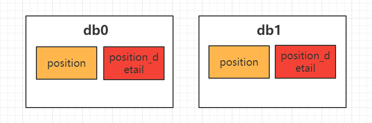
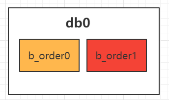
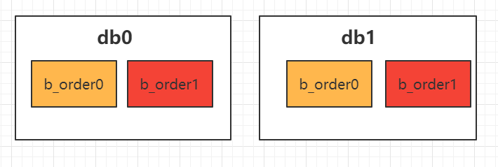

[toc]

### 一、分库分表

#### 父Maven依赖

```xml
<?xml version="1.0" encoding="UTF-8"?>
<project xmlns="http://maven.apache.org/POM/4.0.0"
         xmlns:xsi="http://www.w3.org/2001/XMLSchema-instance"
         xsi:schemaLocation="http://maven.apache.org/POM/4.0.0 http://maven.apache.org/xsd/maven-4.0.0.xsd">
    <modelVersion>4.0.0</modelVersion>

    <groupId>org.example</groupId>
    <artifactId>mysql-example</artifactId>
    <packaging>pom</packaging>
    <version>1.0-SNAPSHOT</version>
    <modules>
        <module>sharding-jdbc-example</module>
        <module>sharding-proxy-example</module>
    </modules>

    <properties>
        <project.build.sourceEncoding>UTF-8</project.build.sourceEncoding>
        <project.compile.sourceEncoding>UTF-8</project.compile.sourceEncoding>
        <shardingsphere.version>4.1.0</shardingsphere.version>
        <springboot.version>2.2.5.RELEASE</springboot.version>
    </properties>
    <dependencyManagement>

        <dependencies>

            <dependency>
                <groupId>org.springframework.boot</groupId>
                <artifactId>spring-boot-starter-jdbc</artifactId>
                <version>${springboot.version}</version>
            </dependency>

            <dependency>
                <groupId>org.springframework.boot</groupId>
                <artifactId>spring-boot-starter-data-jpa</artifactId>
                <version>${springboot.version}</version>
            </dependency>

            <dependency>
                <groupId>org.springframework.boot</groupId>
                <artifactId>spring-boot-starter-test</artifactId>
                <version>${springboot.version}</version>
                <scope>test</scope>
            </dependency>

            <dependency>
                <groupId>mysql</groupId>
                <artifactId>mysql-connector-java</artifactId>
                <version>5.1.48</version>
            </dependency>

            <dependency>
                <groupId>org.apache.shardingsphere</groupId>
                <artifactId>sharding-jdbc-spring-boot-starter</artifactId>
                <version>${shardingsphere.version}</version>
            </dependency>

        </dependencies>

    </dependencyManagement>

    <build>
        <plugins>
            <plugin>
                <groupId>org.apache.maven.plugins</groupId>
                <artifactId>maven-compiler-plugin</artifactId>
                <configuration>
                    <source>1.8</source>
                    <target>1.8</target>
                    <testSource>1.8</testSource>
                    <testTarget>1.8</testTarget>
                </configuration>
                <version>3.8.1</version>
            </plugin>
        </plugins>
    </build>

</project>
```

#### Sharding-JDBC实战子Mvaen依赖

```xml
<?xml version="1.0" encoding="UTF-8"?>
<project xmlns="http://maven.apache.org/POM/4.0.0"
         xmlns:xsi="http://www.w3.org/2001/XMLSchema-instance"
         xsi:schemaLocation="http://maven.apache.org/POM/4.0.0 http://maven.apache.org/xsd/maven-4.0.0.xsd">
    <parent>
        <artifactId>mysql-example</artifactId>
        <groupId>org.example</groupId>
        <version>1.0-SNAPSHOT</version>
    </parent>
    <modelVersion>4.0.0</modelVersion>

    <artifactId>sharding-jdbc-example</artifactId>

    <dependencies>

        <dependency>
            <groupId>org.springframework.boot</groupId>
            <artifactId>spring-boot-starter-jdbc</artifactId>
        </dependency>

        <dependency>
            <groupId>org.springframework.boot</groupId>
            <artifactId>spring-boot-starter-data-jpa</artifactId>
        </dependency>

        <dependency>
            <groupId>org.springframework.boot</groupId>
            <artifactId>spring-boot-starter-test</artifactId>
            <scope>test</scope>
        </dependency>

        <dependency>
            <groupId>mysql</groupId>
            <artifactId>mysql-connector-java</artifactId>
        </dependency>

        <dependency>
            <groupId>org.apache.shardingsphere</groupId>
            <artifactId>sharding-transaction-xa-core</artifactId>
            <version>4.0.0-RC2</version>
        </dependency>


        <dependency>
            <groupId>io.shardingsphere</groupId>
            <artifactId>sharding-transaction-base-saga</artifactId>
            <version>4.0.0-RC2</version>
        </dependency>

        <dependency>
            <groupId>org.apache.shardingsphere</groupId>
            <artifactId>sharding-jdbc-spring-boot-starter</artifactId>
        </dependency>

    </dependencies>

</project>
```

#### 数据表DDL

```sql

CREATE TABLE `position` (
  `Id` bigint(11) NOT NULL AUTO_INCREMENT,
  `name` varchar(256) DEFAULT NULL,
  `salary` varchar(50) DEFAULT NULL,
  `city` varchar(256) DEFAULT NULL,
  PRIMARY KEY (`Id`)
) ENGINE=InnoDB DEFAULT CHARSET=utf8mb4;


CREATE TABLE `position_detail` (
  `Id` bigint(11) NOT NULL AUTO_INCREMENT,
  `pid` bigint(11) NOT NULL DEFAULT '0',
  `description` text DEFAULT NULL,
  PRIMARY KEY (`Id`)
) ENGINE=InnoDB DEFAULT CHARSET=utf8mb4;

CREATE TABLE `city` (
  `Id` bigint(11) NOT NULL AUTO_INCREMENT,
  `name` varchar(256) DEFAULT NULL,
  `province` varchar(256) DEFAULT NULL,
  PRIMARY KEY (`Id`)
) ENGINE=InnoDB DEFAULT CHARSET=utf8mb4;


CREATE TABLE `b_order`(
    `id`              bigint(20)   NOT NULL AUTO_INCREMENT,
    `is_del`          bit(1)       NOT NULL DEFAULT 0 COMMENT '是否被删除',
    `company_id`      int(11)      NOT NULL COMMENT '公司ID',
    `position_id`     bigint(11)      NOT NULL COMMENT '职位ID',
    `user_id`         int(11)      NOT NULL COMMENT '用户id',
    `publish_user_id` int(11)      NOT NULL COMMENT '职位发布者id',
    `resume_type`     int(2)       NOT NULL DEFAULT 0 COMMENT '简历类型：0 附件 1 在线',
    `status`          varchar(256) NOT NULL COMMENT '投递状态 投递状态 WAIT-待处理 AUTO_FILTER-自动过滤 PREPARE_CONTACT-待沟通 REFUSE-拒绝 ARRANGE_INTERVIEW-通知面试',
    `create_time`     datetime     NOT NULL COMMENT '创建时间',
    `operate_time`    datetime     NOT NULL COMMENT '操作时间',
    `work_year`       varchar(100)          DEFAULT NULL COMMENT '工作年限',
    `name`            varchar(256)          DEFAULT NULL COMMENT '投递简历人名字',
    `position_name`   varchar(256)          DEFAULT NULL COMMENT '职位名称',
    `resume_id`        int(10)               DEFAULT NULL COMMENT '投递的简历id（在线和附件都记录，通过resumeType进行区别在线还是附件）',
    PRIMARY KEY (`id`),
    KEY `index_createTime` (`create_time`),
    KEY `index_companyId_status` (`company_id`, `status`(255), `is_del`),
    KEY `i_comId_pub_ctime` (`company_id`, `publish_user_id`, `create_time`),
    KEY `index_companyId_positionId` (`company_id`, `position_id`) USING BTREE
) ENGINE = InnoDB DEFAULT CHARSET = utf8mb4;

CREATE TABLE `c_order`(
    `id`              bigint(20)   NOT NULL AUTO_INCREMENT,
    `is_del`          bit(1)       NOT NULL DEFAULT 0 COMMENT '是否被删除',
    `user_id`         int(11)      NOT NULL COMMENT '用户id',
    `company_id`      int(11)      NOT NULL COMMENT '公司id',
    `publish_user_id` int(11)      NOT NULL COMMENT 'B端用户id',
    `position_id`     int(11)      NOT NULL COMMENT '职位ID',
    `resume_type`     int(2)       NOT NULL DEFAULT 0 COMMENT '简历类型：0 附件 1 在线',
    `status`          varchar(256) NOT NULL COMMENT '投递状态 投递状态 WAIT-待处理 AUTO_FILTER-自动过滤 PREPARE_CONTACT-待沟通 REFUSE-拒绝 ARRANGE_INTERVIEW-通知面试',
    `create_time`     datetime     NOT NULL COMMENT '创建时间',
    `update_time`     datetime     NOT NULL COMMENT '处理时间',
    PRIMARY KEY (`id`),
    KEY `index_userId_positionId` (`user_id`, `position_id`),
    KEY `idx_userId_operateTime` (`user_id`, `update_time`)
) ENGINE = InnoDB DEFAULT CHARSET = utf8mb4;

CREATE TABLE `c_user` (
  `Id` bigint(11) NOT NULL AUTO_INCREMENT,
  `name` varchar(256) DEFAULT NULL,
  `pwd_plain` varchar(256) DEFAULT NULL,
  `pwd_cipher` varchar(256) DEFAULT NULL,
  PRIMARY KEY (`Id`)
) ENGINE=InnoDB DEFAULT CHARSET=utf8mb4;
```


#### 1. 场景一：仅分库

对 `position` 和 `position_detail` 分别进行分库，如下图所示



##### 思路

- 在 `db0`和 `db1`中创建都这两个表，存在关联查询
  - `position` 使用 `id`作为分片键
  - `position_detail`使用 `pid`作为分片键。**保证同个职位及详细信息分配在一个库中**
- 使用 `Inline`分片算法，分别对两个表进行分库
- 关联查询时，根据条件中 `职位id` 定位到对应的库，该库中的职位和详细记录都是关联的
- `city`配置为广播表

##### 1.1 实体类

**职位**

```java
import javax.persistence.*;
import java.io.Serializable;

@Entity
@Table(name="position")
public class Position implements Serializable {

    @Id
    @Column(name = "id")
    @GeneratedValue(strategy = GenerationType.IDENTITY)
    private long id;

    @Column(name = "name")
    private String name;

    @Column(name = "salary")
    private String salary;

    @Column(name = "city")
    private String city;

    public long getId() {
        return id;
    }

    public void setId(long id) {
        this.id = id;
    }

    public String getName() {
        return name;
    }

    public void setName(String name) {
        this.name = name;
    }

    public String getSalary() {
        return salary;
    }

    public void setSalary(String salary) {
        this.salary = salary;
    }

    public String getCity() {
        return city;
    }

    public void setCity(String city) {
        this.city = city;
    }
}
```

**职位详情**

```java
import javax.persistence.*;
import java.io.Serializable;

@Entity
@Table(name = "position_detail")
public class PositionDetail implements Serializable {

    @Id
    @Column(name = "id")
    @GeneratedValue(strategy = GenerationType.IDENTITY)
    private long id;

    @Column(name = "pid")
    private long pid;

    @Column(name = "description")
    private String description;

    public long getId() {
        return id;
    }

    public void setId(long id) {
        this.id = id;
    }

    public long getPid() {
        return pid;
    }

    public void setPid(long pid) {
        this.pid = pid;
    }

    public String getDescription() {
        return description;
    }

    public void setDescription(String description) {
        this.description = description;
    }
}
```

**城市**

```java
import javax.persistence.*;
import java.io.Serializable;

@Entity
@Table(name = "city")
public class City implements Serializable {

    @Id
    @Column(name = "id")
    @GeneratedValue(strategy = GenerationType.IDENTITY)
    private long id;

    @Column(name = "name")
    private String name;

    @Column(name = "province")
    private String province;

    public long getId() {
        return id;
    }

    public void setId(long id) {
        this.id = id;
    }

    public String getName() {
        return name;
    }

    public void setName(String name) {
        this.name = name;
    }

    public String getProvince() {
        return province;
    }

    public void setProvince(String province) {
        this.province = province;
    }
}
```


##### 1.2 Repository类

```java
import com.tangdi.entity.Position;
import org.springframework.data.jpa.repository.JpaRepository;
import org.springframework.data.jpa.repository.Query;
import org.springframework.data.repository.query.Param;

import java.util.List;

public interface PositionRepository  extends JpaRepository<Position,Long> {

    @Query(nativeQuery = true,value = "select p.id,p.name,p.salary,p.city,pd.description from position p join position_detail pd on(p.id=pd.pid) where p.id=:id")
    public Object findPositionsById(@Param("id") long id);

}
```

```java
import com.tangdi.entity.PositionDetail;
import org.springframework.data.jpa.repository.JpaRepository;

public interface PositionDetailRepository extends JpaRepository<PositionDetail,Long> {
}
```

```java
import com.tangdi.entity.City;
import org.springframework.data.jpa.repository.JpaRepository;

public interface CityRepository extends JpaRepository<City,Long> {
}

```


##### 1.3 自定义主键

实现接口ShardingKeyGenerator即可，getType()方法返回的就是自定义主键策略

```java
import org.apache.shardingsphere.core.strategy.keygen.SnowflakeShardingKeyGenerator;
import org.apache.shardingsphere.spi.keygen.ShardingKeyGenerator;

import java.util.Properties;

public class MyLagouId implements ShardingKeyGenerator {

    private  SnowflakeShardingKeyGenerator snow = new SnowflakeShardingKeyGenerator();

    @Override
    public Comparable<?> generateKey() {
        System.out.println("------执行了自定义主键生成器MyLagouId-------");
        return snow.generateKey();
    }

    @Override
    public String getType() {
        return "LAGOUKEY";
    }

    @Override
    public Properties getProperties() {
        return null;
    }

    @Override
    public void setProperties(Properties properties) {

    }
}
```


##### 1.4 配置

```properties
spring.shardingsphere.props.sql.show=true

#datasource
spring.shardingsphere.datasource.names=ds0,ds1

spring.shardingsphere.datasource.ds0.type=com.zaxxer.hikari.HikariDataSource
spring.shardingsphere.datasource.ds0.driver-class-name=com.mysql.jdbc.Driver
#spring.shardingsphere.datasource.ds0.jdbc-url=jdbc:mysql://192.168.95.130:3306/db0
spring.shardingsphere.datasource.ds0.jdbc-url=jdbc:mysql://localhost:3306/db0
spring.shardingsphere.datasource.ds0.username=root
spring.shardingsphere.datasource.ds0.password=root

spring.shardingsphere.datasource.ds1.type=com.zaxxer.hikari.HikariDataSource
spring.shardingsphere.datasource.ds1.driver-class-name=com.mysql.jdbc.Driver
#spring.shardingsphere.datasource.ds1.jdbc-url=jdbc:mysql://192.168.95.132:3306/db1
spring.shardingsphere.datasource.ds1.jdbc-url=jdbc:mysql://localhost:3306/db1
spring.shardingsphere.datasource.ds1.username=root
spring.shardingsphere.datasource.ds1.password=root

#sharding-database，配置需要被分库的表的分片策略（分片键、分片算法）
spring.shardingsphere.sharding.tables.position.database-strategy.inline.sharding-column=id
spring.shardingsphere.sharding.tables.position.database-strategy.inline.algorithm-expression=ds$->{id % 2}
spring.shardingsphere.sharding.tables.position_detail.database-strategy.inline.sharding-column=pid
spring.shardingsphere.sharding.tables.position_detail.database-strategy.inline.algorithm-expression=ds$->{pid % 2}

#指定主键及生成策略
spring.shardingsphere.sharding.tables.position.key-generator.column=id
#spring.shardingsphere.sharding.tables.position.key-generator.type=SNOWFLAKE
spring.shardingsphere.sharding.tables.position.key-generator.type=LAGOUKEY
spring.shardingsphere.sharding.tables.position_detail.key-generator.column=id
spring.shardingsphere.sharding.tables.position_detail.key-generator.type=SNOWFLAKE

#broadcast广播表，多个可用逗号隔开
spring.shardingsphere.sharding.broadcast-tables=city
spring.shardingsphere.sharding.tables.city.key-generator.column=id
spring.shardingsphere.sharding.tables.city.key-generator.type=SNOWFLAKE
```

##### 1.5 测试

```java
package dao;

import com.tangdi.RunBoot;
import com.tangdi.entity.BOrder;
import com.tangdi.entity.City;
import com.tangdi.entity.Position;
import com.tangdi.entity.PositionDetail;
import com.tangdi.repository.BOrderRepository;
import com.tangdi.repository.CityRepository;
import com.tangdi.repository.PositionDetailRepository;
import com.tangdi.repository.PositionRepository;
import org.junit.Test;
import org.junit.runner.RunWith;
import org.springframework.boot.test.context.SpringBootTest;
import org.springframework.test.annotation.Repeat;
import org.springframework.test.context.junit4.SpringRunner;

import javax.annotation.Resource;
import java.util.Date;
import java.util.List;
import java.util.Random;

@RunWith(SpringRunner.class)
@SpringBootTest(classes = RunBoot.class)
public class TestShardingDatabase {

    @Resource
    private PositionRepository positionRepository;

    @Resource
    private PositionDetailRepository positionDetailRepository;

    @Resource
    private CityRepository cityRepository;

    @Resource
    private BOrderRepository orderRepository;

    @Test
    public void testAdd(){
        for (int i=1;i<=20;i++){
            Position position = new Position();
//            position.setId(i);
            position.setName("lagou"+i);
            position.setSalary("1000000");
            position.setCity("beijing");
            positionRepository.save(position);
        }
    }

    @Test
    public void testAdd2(){
        for (int i=1;i<=20;i++){
            Position position = new Position();
            position.setName("lagou"+i);
            position.setSalary("1000000");
            position.setCity("beijing");
            positionRepository.save(position);

            PositionDetail positionDetail = new PositionDetail();
            positionDetail.setPid(position.getId());
            positionDetail.setDescription("this is a message "+i);
            positionDetailRepository.save(positionDetail);
        }
    }

    @Test
    public void testLoad(){
        Object object = positionRepository.findPositionsById(470186138993164289L);
        Object[] position = (Object[])object;
        System.out.println(position[0]+" "+position[1]+" "+position[2]+" "+position[3]+" "+position[4]);
    }

    @Test
    public void testBroadCast(){
        City city = new City();
        city.setName("beijing");
        city.setProvince("beijing");
        cityRepository.save(city);
    }
}
```


#### 2. 场景二：仅分表

对 `BOrder` 进行分表，如下图所示



##### 思路

- 在 `db0`中创建  `b_order0`和 `b_order1`
- 指定分表的分片键
  - 将 `id` 作为 `BOrder`进行分表的分片键
- 使用 `Inline`分片算法
- 配置真实的数据节点

##### 2.1 实体类

**订单**

```java
import javax.persistence.*;
import java.io.Serializable;
import java.util.Date;

@Entity
@Table(name = "b_order")
public class BOrder implements Serializable {

    @Id
    @Column(name = "id")
    @GeneratedValue(strategy = GenerationType.IDENTITY)
    private long id;

    @Column(name = "is_del")
    private Boolean isDel;

    @Column(name = "company_id")
    private Integer companyId;

    @Column(name = "position_id")
    private long positionId;

    @Column(name = "user_id")
    private Integer userId;

    @Column(name = "publish_user_id")
    private Integer publishUserId;

    @Column(name = "resume_type")
    private Integer resumeType;

    @Column(name = "status")
    private String status;

    @Column(name = "create_time")
    private Date createTime;

    @Column(name = "operate_time")
    private Date operateTime;

    @Column(name = "work_year")
    private String workYear;

    @Column(name = "name")
    private String name;

    @Column(name = "position_name")
    private String positionName;

    @Column(name = "resume_id")
    private Integer resumeId;

    public long getId() {
        return id;
    }

    public void setId(long id) {
        this.id = id;
    }

    public Boolean getDel() {
        return isDel;
    }

    public void setDel(Boolean del) {
        isDel = del;
    }

    public Integer getCompanyId() {
        return companyId;
    }

    public void setCompanyId(Integer companyId) {
        this.companyId = companyId;
    }

    public long getPositionId() {
        return positionId;
    }

    public void setPositionId(long positionId) {
        this.positionId = positionId;
    }

    public Integer getUserId() {
        return userId;
    }

    public void setUserId(Integer userId) {
        this.userId = userId;
    }

    public Integer getPublishUserId() {
        return publishUserId;
    }

    public void setPublishUserId(Integer publishUserId) {
        this.publishUserId = publishUserId;
    }

    public Integer getResumeType() {
        return resumeType;
    }

    public void setResumeType(Integer resumeType) {
        this.resumeType = resumeType;
    }

    public String getStatus() {
        return status;
    }

    public void setStatus(String status) {
        this.status = status;
    }

    public Date getCreateTime() {
        return createTime;
    }

    public void setCreateTime(Date createTime) {
        this.createTime = createTime;
    }

    public Date getOperateTime() {
        return operateTime;
    }

    public void setOperateTime(Date operateTime) {
        this.operateTime = operateTime;
    }

    public String getWorkYear() {
        return workYear;
    }

    public void setWorkYear(String workYear) {
        this.workYear = workYear;
    }

    public String getName() {
        return name;
    }

    public void setName(String name) {
        this.name = name;
    }

    public String getPositionName() {
        return positionName;
    }

    public void setPositionName(String positionName) {
        this.positionName = positionName;
    }

    public Integer getResumeId() {
        return resumeId;
    }

    public void setResumeId(Integer resumeId) {
        this.resumeId = resumeId;
    }
}
```


##### 2.2 Repository类

```java
import com.tangdi.entity.BOrder;
import org.springframework.data.jpa.repository.JpaRepository;

public interface BOrderRepository extends JpaRepository<BOrder,Long> {
}
```


##### 2.3 配置

```properties
spring.shardingsphere.props.sql.show=true

#datasource
spring.shardingsphere.datasource.names=ds0

spring.shardingsphere.datasource.ds0.type=com.zaxxer.hikari.HikariDataSource
spring.shardingsphere.datasource.ds0.driver-class-name=com.mysql.jdbc.Driver
#spring.shardingsphere.datasource.ds0.jdbc-url=jdbc:mysql://192.168.95.130:3306/db0
spring.shardingsphere.datasource.ds0.jdbc-url=jdbc:mysql://localhost:3306/db0
spring.shardingsphere.datasource.ds0.username=root
spring.shardingsphere.datasource.ds0.password=root


#sharding-table，配置需要被分表的表的分片策略（分片键、分片算法）
#配置分表策略（根据分片键及分片算法）
spring.shardingsphere.sharding.tables.b_order.table-strategy.inline.sharding-column=id
spring.shardingsphere.sharding.tables.b_order.table-strategy.inline.algorithm-expression=b_order${id % 2}
#配置分表的数据节点
spring.shardingsphere.sharding.tables.b_order.actual-data-nodes=ds0.b_order${0..1}
spring.shardingsphere.sharding.tables.b_order.key-generator.column=id
spring.shardingsphere.sharding.tables.b_order.key-generator.type=SNOWFLAKE

```


##### 2.4 测试

```java
import com.tangdi.RunBoot;
import com.tangdi.entity.BOrder;
import com.tangdi.entity.City;
import com.tangdi.entity.Position;
import com.tangdi.entity.PositionDetail;
import com.tangdi.repository.BOrderRepository;
import com.tangdi.repository.CityRepository;
import com.tangdi.repository.PositionDetailRepository;
import com.tangdi.repository.PositionRepository;
import org.junit.Test;
import org.junit.runner.RunWith;
import org.springframework.boot.test.context.SpringBootTest;
import org.springframework.test.annotation.Repeat;
import org.springframework.test.context.junit4.SpringRunner;

import javax.annotation.Resource;
import java.util.Date;
import java.util.List;
import java.util.Random;

@RunWith(SpringRunner.class)
@SpringBootTest(classes = RunBoot.class)
public class TestShardingDatabase {

    @Resource
    private BOrderRepository orderRepository;

    @Test
    @Repeat(100)
    public void testShardingBOrder(){
        Random random = new Random();
        int companyId = random.nextInt(10);
        BOrder order = new BOrder();
        order.setDel(false);
        order.setCompanyId(companyId);
        order.setPositionId(3242342);
        order.setUserId(2222);
        order.setPublishUserId(1111);
        order.setResumeType(1);
        order.setStatus("AUTO");
        order.setCreateTime(new Date());
        order.setOperateTime(new Date());
        order.setWorkYear("2");
        order.setName("lagou");
        order.setPositionName("Java");
        order.setResumeId(23233);
        orderRepository.save(order);
    }

}
```


#### 3. 场景三：分库分表

对 `BOrder` 进行分库+分表，如下图所示



##### 思路

- 在 `db0`和 `db1`中创建都这两个表
- 分别指定分库和分表的分片键
  - 将 `company_id`作为 `BOrder`分库的分片键，保证同一个企业的订单在同一个库中
  - 将 `id` 作为 `BOrder`进行分表的分片键
- 使用 `Inline`分片算法
- 配置真实的数据节点

##### 3.1 实体类

同分表的实体类


##### 3.2 Repository类

同分表的 `Repository`类


##### 3.3 配置

```properties
spring.shardingsphere.props.sql.show=true

#datasource
spring.shardingsphere.datasource.names=ds0,ds1

spring.shardingsphere.datasource.ds0.type=com.zaxxer.hikari.HikariDataSource
spring.shardingsphere.datasource.ds0.driver-class-name=com.mysql.jdbc.Driver
#spring.shardingsphere.datasource.ds0.jdbc-url=jdbc:mysql://192.168.95.130:3306/db0
spring.shardingsphere.datasource.ds0.jdbc-url=jdbc:mysql://localhost:3306/db0
spring.shardingsphere.datasource.ds0.username=root
spring.shardingsphere.datasource.ds0.password=root

spring.shardingsphere.datasource.ds1.type=com.zaxxer.hikari.HikariDataSource
spring.shardingsphere.datasource.ds1.driver-class-name=com.mysql.jdbc.Driver
#spring.shardingsphere.datasource.ds1.jdbc-url=jdbc:mysql://192.168.95.132:3306/db1
spring.shardingsphere.datasource.ds1.jdbc-url=jdbc:mysql://localhost:3306/db1
spring.shardingsphere.datasource.ds1.username=root
spring.shardingsphere.datasource.ds1.password=root


#sharding-database-table，配置需要被分库分表的表的分片策略（分片键、分片算法）
#先配置分库策略（根据分片键及分片算法）
spring.shardingsphere.sharding.tables.b_order.database-strategy.inline.sharding-column=company_id
spring.shardingsphere.sharding.tables.b_order.database-strategy.inline.algorithm-expression=ds$->{company_id % 2}
#再配置分表策略（根据分片键及分片算法）
spring.shardingsphere.sharding.tables.b_order.table-strategy.inline.sharding-column=id
spring.shardingsphere.sharding.tables.b_order.table-strategy.inline.algorithm-expression=b_order${id % 2}
#配置分库分表的数据节点
spring.shardingsphere.sharding.tables.b_order.actual-data-nodes=ds${0..1}.b_order${0..1}
spring.shardingsphere.sharding.tables.b_order.key-generator.column=id
spring.shardingsphere.sharding.tables.b_order.key-generator.type=SNOWFLAKE

```


##### 3.4 测试

同分表测试

