[toc]

### 一、ShardingSphere简介

Apache ShardingSphere是一款**开源的分布式数据库中间件**组成的生态圈。它由**Sharding-JDBC**、**Sharding-Proxy**和**Sharding-Sidecar**（规划中）这3款相互独立的产品组成。 他们均**提供标准化的数据分片**、**分布式事务**和**数据库治理**功能，可适用于如Java同构、异构语言、容器、云原生等各种多样化的应用场景

#### 1. 组成

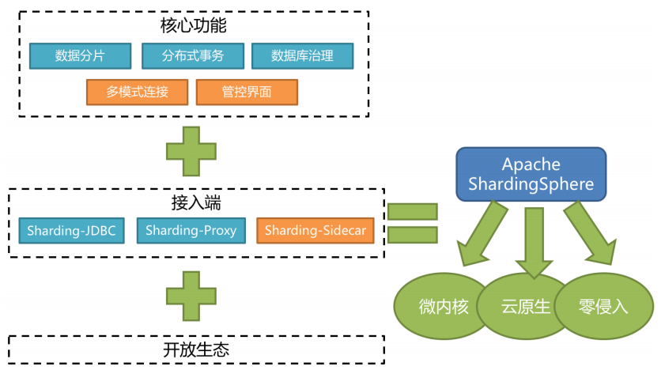

- **Sharding-JDBC**

  被定位为轻量级Java框架，在Java的JDBC层提供的额外服务，以jar包形式使用

- **Sharding-Proxy**

  被定位为透明化的数据库代理端，提供封装了数据库二进制协议的服务端版本，用于完成对异构语言的支持

- **Sharding-Sidecar**

  被定位为Kubernetes或Mesos的云原生数据库代理，以DaemonSet的形式代理所有对数据库的访问


#### 2. 职能

Sharding-JDBC：作为JDBC中间件接入应用端，负责数据分片及路由

Sharding-Proxy：作为代理中间件接入服务端，方便数据库可视化工具维护及管理

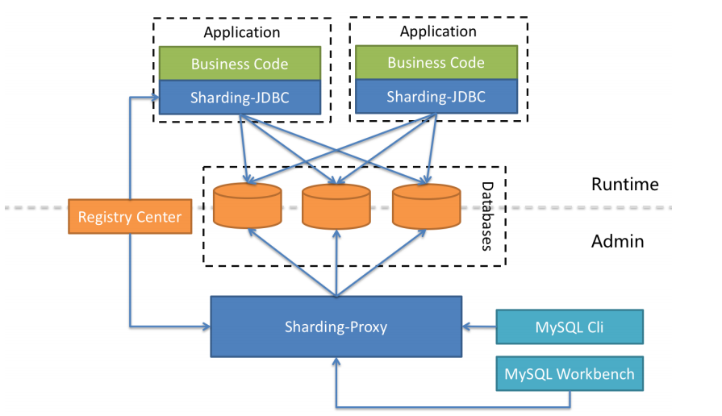


#### 3. 技术支持

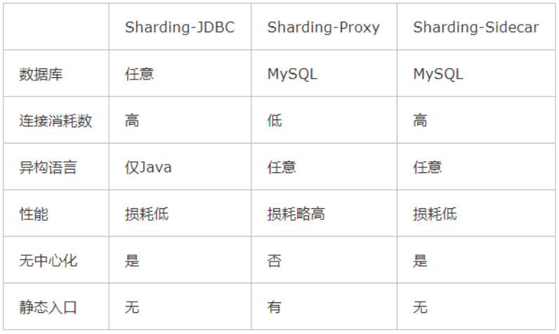


#### 4. 下载

ShardingSphere安装包下载：https://shardingsphere.apache.org/document/current/cn/downloads/

使用Git下载工程：git clone https://github.com/apache/incubator-shardingsphere.git


### 二、Sharding-JDBC基础及工作原理

**Sharding-JDBC定位为轻量级Java框架**，在Java的 **JDBC 层提供的额外服务**。 它使用客户端直连数据库，以 **jar包形式提供服务**，无需额外部署和依赖，可理解为**增强版的JDBC驱动**，**完全兼容JDBC和各种ORM框架的使用**。

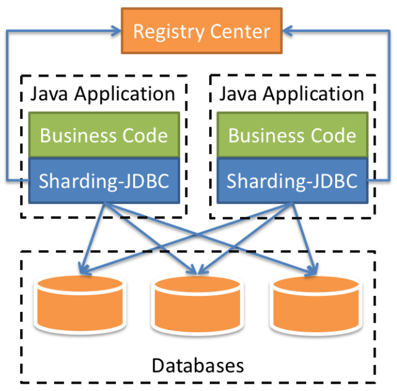


#### 1. 适用技术

- 适用于任何基于Java的ORM框架，如：JPA, Hibernate, Mybatis, Spring JDBC Template或直接使用JDBC。

- 适用任何第三方的数据库连接池，如：DBCP, C3P0, BoneCP, Druid, HikariCP等。

- 支持任意实现JDBC规范的数据库。目前支持MySQL，Oracle，SQLServer和PostgreSQL


#### 2. 主要功能

##### 2.1 数据分片

- 分库分表

- 读写分离

- 分片策略

- 分布式主键

##### 2.2 分布式事务

- 标准化的事务接口

- XA强一致性事务

- 柔性事务

##### 2.3 数据库治理

- 配置动态化

- 编排和治理

- 数据脱敏

- 可视化链路追踪


#### 3. 内部结构

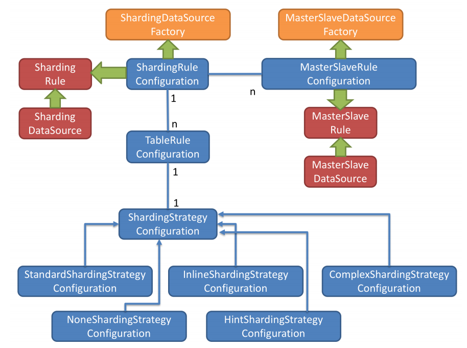

- 黄色部分

  **Sharding-JDBC的入口API**，采用工厂方法的形式提供

  - **ShardingDataSourceFactory**：支持分库分表、读写分离操作
  - **MasterSlaveDataSourceFactory**：支持读写分离操作

- 蓝色部分

  **Sharding-JDBC的 JavaConfig**，*ShardingRuleConfiguration*是分库分表配置的核心和入口，包含多个*TableRuleConfiguration*和*MasterSlaveRuleConfiguration*

  - **TableRuleConfiguration**封装的是表的分片配置信息，有5种配置形式对应不同的Configuration类型
  - **MasterSlaveRuleConfiguration**封装的是读写分离配置信息

- 红色部分

  内部对象，由Sharding-JDBC内部使用，应用开发者无需关注。

  **ShardingDataSource**和**MasterSlaveDataSource**实现了DataSource接口，是JDBC的完整实现方案

  两种不同DataSource的实现，分别调用**ShardingRuleConfiguration**和**MasterSlaveRuleConfiguration**配置类生成真正规则对象

  

#### 4. 工作流程

- 根据配置的分片策略生成Configuration对象

- 通过Factory会将Configuration对象传递给Rule对象

- 通过Factory会将Rule对象与DataSource对象封装

- Sharding-JDBC使用DataSource进行分库分表和读写分离操作


#### 5. 使用方式

##### 5.1 引入maven依赖

```xml
<dependency> 
    <groupId>org.apache.shardingsphere</groupId> 
    <artifactId>sharding-jdbc-core</artifactId> 
    <version>${latest.release.version}</version> 
</dependency>
```

##### 5.2 规则配置

Sharding-JDBC可以通过JavaConfig，YAML，Spring命名空间（spring-application.xml）和Spring Boot Starter四种方式配置，开发者可根据场景选择适合的配置方式

##### 5.3 创建DataSource

通过ShardingDataSourceFactory工厂和规则配置对象获取ShardingDataSource，然后即可通过DataSource选择使用原生JDBC开发，或者使用 JPA, MyBatis等ORM工具。


### 三、 功能

#### 1. 数据分片（分库分表）

##### 1.1 表概念

- **真实表**：数据库中真实存在的物理表。例如b_order0、b_order1

- **逻辑表**：在分片之后，同一类表的名称。例如b_order。

- **数据节点**：在分片之后，数据源和数据表组成数据节点。例如ds0.b_order1

- **绑定表**：

  由于单个库中存在分表，而又进行关联查询时，由于条件的分片键只对应一个表，所以被关联表无法定位路由。所以需要用到绑定表。那么被关联的表怎么定位库呢？直接由条件中的分片键定位库即可。

  指的是分片规则一致的关系表（主表、子表），例如b_order和b_order_item，均按照order_id分片，则此两个表互为绑定表关系。绑定表之间的多表关联查询不会出现笛卡尔积关联，可以提升关联查询效率

  ```sql
  b_order：b_order0、b_order1 
  b_order_item：b_order_item0、b_order_item1 
  select * from b_order o join b_order_item i on(o.order_id=i.order_id) where o.order_id in (10,11);
  ```

  如果不配置绑定表关系，采用笛卡尔积关联，会生成4个SQL

  ```sql
  select * from b_order0 o join b_order_item0 i on(o.order_id=i.order_id) where o.order_id in (10,11); 
  select * from b_order0 o join b_order_item1 i on(o.order_id=i.order_id) where o.order_id in (10,11); 
  select * from b_order1 o join b_order_item0 i on(o.order_id=i.order_id) where o.order_id in (10,11); 
  select * from b_order1 o join b_order_item1 i on(o.order_id=i.order_id) where o.order_id in (10,11);
  ```

  如果配置绑定表关系，只会生成2个SQL

  ```sql
  select * from b_order0 o join b_order_item0 i on(o.order_id=i.order_id) where o.order_id in (10,11);
  select * from b_order1 o join b_order_item1 i on(o.order_id=i.order_id) where o.order_id in (10,11);
  ```


- **广播表**：

  有些表没必要做分片，例如**字典表、省份信息**等，因为他们数据量不大，而且这种表可能需要与海量数据的表进行关联查询。**广播表会在不同的数据节点上进行存储，存储的表结构和数据完全相同**。


##### 1.2 分片算法（ShardingAlgorithm）

分片算法和业务实现紧密相关，因此**并未提供内置分片算法**，而是通过分片策略将各种场景提炼出来，提供更高层级的抽象，并提供接口让应用开发者自行实现分片算法。目前提供4种分片算法。


- **PreciseShardingAlgorithm(精确分片算法)**

  用于处理使用单一键作为分片键的=与IN进行分片的场景。

- **RangeShardingAlgorithm(范围分片算法)**

  用于处理使用单一键作为分片键的BETWEEN AND、>、<、>=、<=进行分片的场景。

- **ComplexKeysShardingAlgorithm(复合分片算法)**

  使用多键作为分片键进行分片的场景，多个分片键的逻辑较复杂，需要应用开发者自行处理其中的复杂度

- **HintShardingAlgorithm(Hint分片算法)**

  由其他外置条件决定的场景，可使用SQL Hint灵活的注入分片字段。例：内部系统，按照员工登录主键分库，而数据库中并无此字段。SQL Hint支持通过Java API和SQL注释两种方式使用

##### 1.3 分片策略

分片策略包含分片键和分片算法，真正可用于分片操作的是分片键 + 分片算法，也就是分片策略。目前提供5种分片策略。

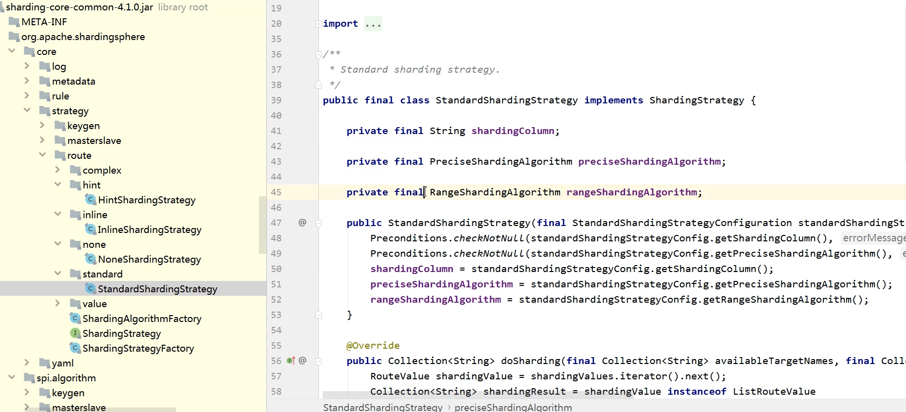

- **StandardShardingStrategy(标准分片策略)**

  只支持单分片键，提供对SQL语句中的=, >, <, >=, <=, IN和BETWEEN AND的分片操作支持。

  提供PreciseShardingAlgorithm和RangeShardingAlgorithm两个分片算法。

  PreciseShardingAlgorithm是必选的，RangeShardingAlgorithm是可选的。但是SQL中使用了范围操作，如果不配置RangeShardingAlgorithm会采用全库路由扫描，效率低。

- ComplexShardingStrategy(复合分片策略)

  支持多分片键。提供对SQL语句中的=, >, <, >=, <=, IN和BETWEEN AND的分片操作支持。由于多分片键之间的关系复杂，因此并未进行过多的封装，而是直接将分片键值组合以及分片操作符透传至分片算法，完全由应用开发者实现，提供最大的灵活度

- **InlineShardingStrategy(行表达式分片策略)**

  只支持单分片键。使用Groovy的表达式，提供对SQL语句中的=和IN的分片操作支持，对于简单的分片算法，可以通过简单的配置使用，从而避免繁琐的Java代码开发。如: t_user_$->{u_id % 8} 表示t_user表根据u_id模8，而分成8张表，表名称为t_user_0到t_user_7。

- **HintShardingStrategy(Hint分片策略)**

  通过Hint指定分片值而非从SQL中提取分片值的方式进行分片的策略。

- NoneShardingStrategy(不分片策略)


##### 1.4 分片流程

ShardingSphere 3个产品的数据分片功能主要流程是完全一致的，如下图所示。

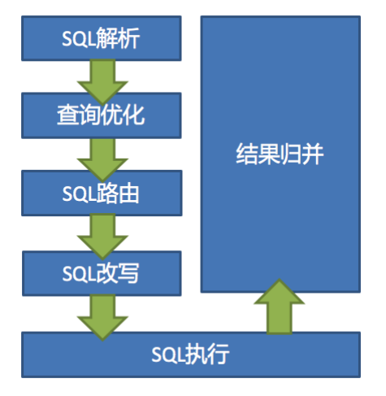

- **SQL解析**

  Sharding-JDBC采用不同的解析器对SQL进行解析，解析器类型如下

  - MySQL解析器（支持MariaDB）
  - Oracle解析器
  - SQLServer解析器
  - PostgreSQL解析器
  - 默认解析器（采用SQL92标准）

- **查询优化**

  负责合并和优化分片条件，如OR优化为UNION ALL等。

- **SQL路由**

  根据解析上下文匹配用户配置的分片策略，并生成路由路径。

- **SQL改写**

  将SQL改写为在真实数据库中可以正确执行的语句。

- SQL执行

  通过多线程执行器异步执行SQL

- 结果归并

  将多个执行结果集归并以便于通过统一的JDBC接口输出。包括流式归并、内存归并和使用装饰者模式的追加归并这几种方式


##### 1.5 分片SQL规范

**支持项**

- 路由至单数据节点时，目前MySQL数据库100%全兼容，其他数据库完善中。

- 支持分页子查询

  ```sql
  SELECT COUNT(*) FROM (SELECT * FROM b_order o);
  ```

  

**不支持项**

- 路由至多数据节点，不支持CASE WHEN、HAVING、UNION (ALL)

- 关联查询 不支持跨库关联

- 除了分页子查询，不支持其他子查询，无论嵌套多少层，只能解析至第一个包含数据表的子查询，一旦在下层嵌套中再次找到包含数据表的子查询将直接抛出解析异常

  ```sql
  SELECT COUNT(*) FROM (SELECT * FROM b_order o WHERE o.id IN (SELECT id FROM b_order WHERE status = ?))
  ```

- 由于归并限制，子查询中不支持聚合函数

- 不支持包含schema的SQL

- 分片键不要使用表达式或函数，否则无法获得真正的路由值，而将采用全路由的形式获取结果

- VALUES语句不支持运算 表达式

  ```sql
  INSERT INTO tbl_name (col1, col2, …) VALUES(1+2, ?, …) 
  ```

- 不支持同时使用普通聚合函数 和DISTINCT

  ```sql
  SELECT SUM(DISTINCT col1), SUM(col1) FROM tbl_name
  ```


##### 1.6 分页查询

如果可以保证ID的连续性，通过ID进行分页是比较好的解决方案

```sql
SELECT * FROM b_order WHERE id > 1000000 AND id <= 1000010 ORDER BY id
```

或通过记录上次查询结果的最后一条记录的ID进行下一页的查询：

```sql
SELECT * FROM b_order WHERE id > 1000000 LIMIT 10
```


##### 1.7 InlineShardingStrategy（行内分片策略）

语法格式：在配置中使用 `${expression}` 或​ `$->{expression}`标识行表达式

- 表示区间

  ```
  ${begin..end}
  ```

- 表示枚举

  ```
  ${[unit1, unit2, unit_x]}
  ```

- 多个表达式笛卡尔(积)组合

  ```
  ${['online', 'offline']}_table${1..3}     ————> online_table1, online_table2, online_table3
  $->{['online', 'offline']}_table$->{1..3}  ————> offline_table1, offline_table2, offline_table3
  ```

- 均匀数据节点配置

  ```
  db0
   	├── b_order2 
   	└── b_order1 
  db1
  	├── b_order2 
  	└── b_order1
  	
  db${0..1}.b_order${1..2} 
  db$->{0..1}.b_order$->{1..2}
  ```

- 不均匀数据节点配置

  ```
  db0
  	├── b_order0 
  	└── b_order1 
  db1
  	├── b_order2 
  	├── b_order3 
  	└── b_order4
  
  db0.b_order${0..1},db1.b_order${2..4}
  ```

- 分片算法配置

  行表达式内部的表达式本质上是一段Groovy代码，可以根据分片键进行计算的方式，返回相应的真实数据源或真实表名称。

  ds0、ds1、ds2... ds9数据源使用如下分片算法配置

  ```
  ds${id % 10} 
  ds$->{id % 10}
  ```

  

##### 1.8 分布式主键生成策略

ShardingSphere提供了内置的分布式主键生成器，例如UUID、SNOWFLAKE，还抽离出分布式主键生成器的接口，方便用户自行实现自定义的自增主键生成器。

- **UUID**

- **SNOWFLAKE**

- **自定义主键生成策略**

  - 实现ShardingKeyGenerator接口

  - 按SPI规范配置自定义主键类

    在resources目录下新建META-INF文件夹，再新建services文件夹，然后新建文件的名字为org.apache.shardingsphere.spi.keygen.ShardingKeyGenerator，打开文件，复制自定义主键类全路径到文件中保存

  - 自定义主键类应用配置

    ```properties
    #对应主键字段名 
    spring.shardingsphere.sharding.tables.t_book.key-generator.column=id 
    #对应主键类getType返回内容 
    spring.shardingsphere.sharding.tables.t_book.key- generator.type=MYKEY
    ```

    


#### 2. 读写分离


#### 3. 强制路由


#### 4. 数据脱敏

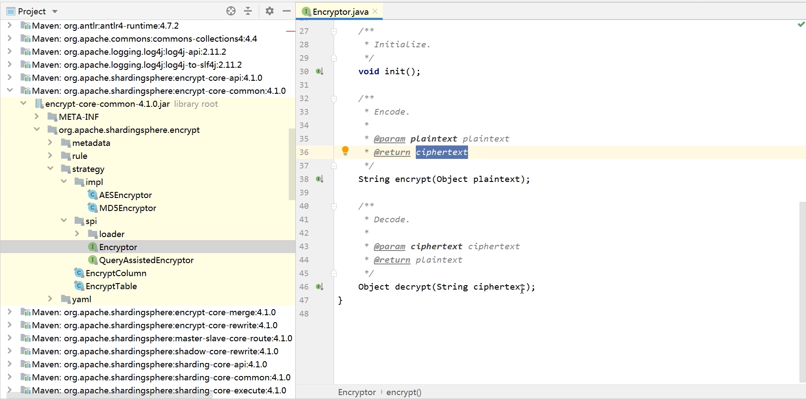

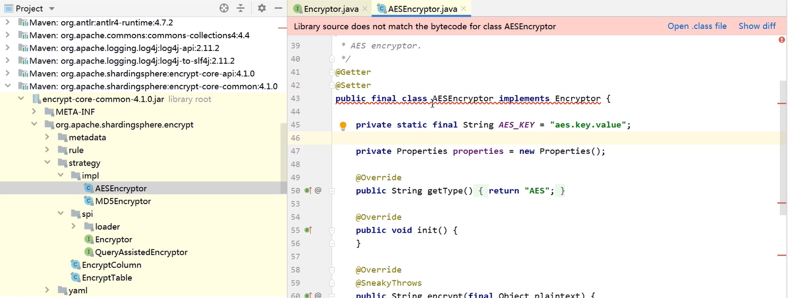

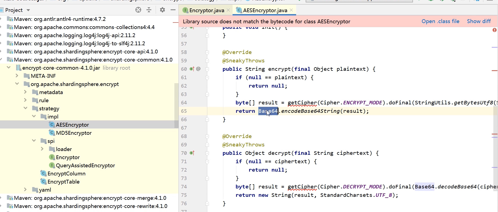


MD5是不可逆的，所以数据库查到密文后返回的还是密文

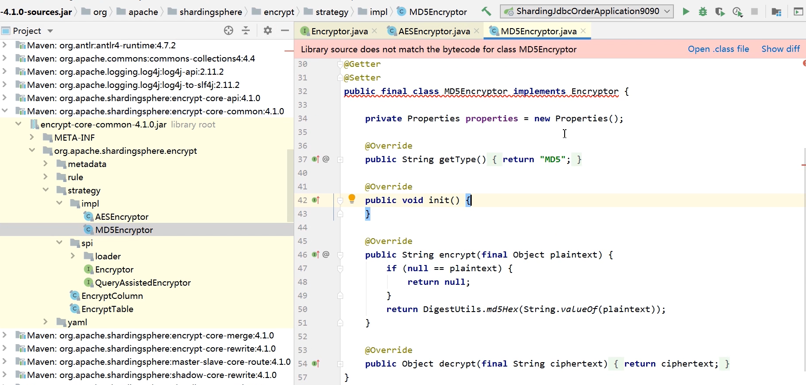


只提供了一种思想和接口，需要开发者自己实现

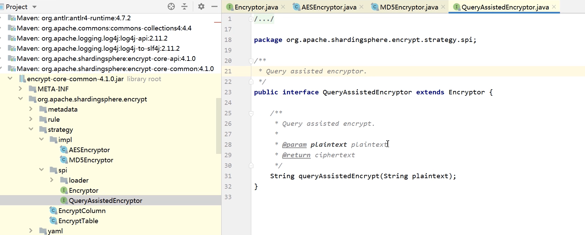

#### 5. 分布式事务控制


#### 6. SPI加载


#### 7. 编排治理


Sharding-JDBC自带主键生成器

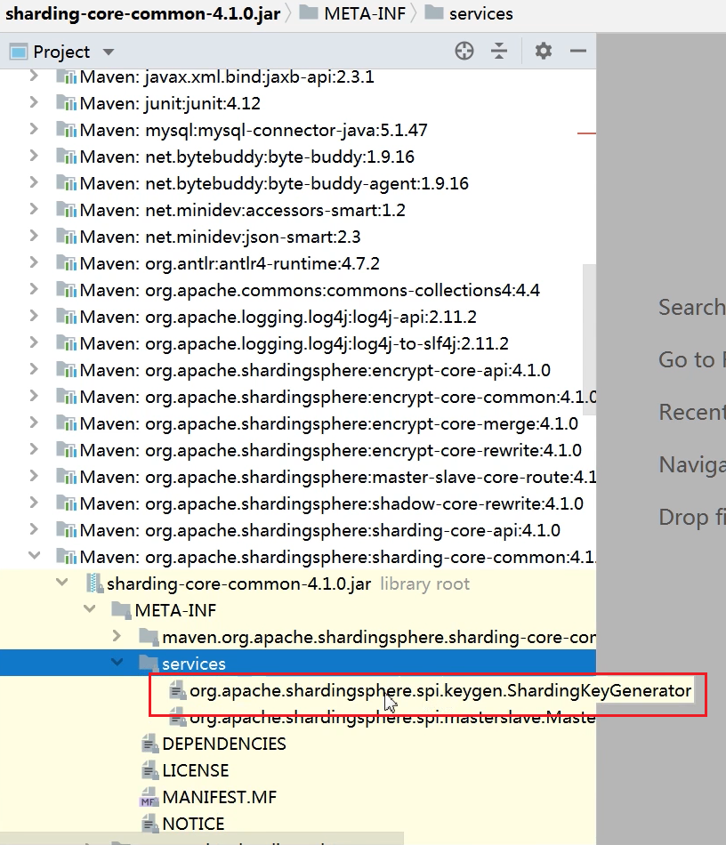


自定义主键生成器

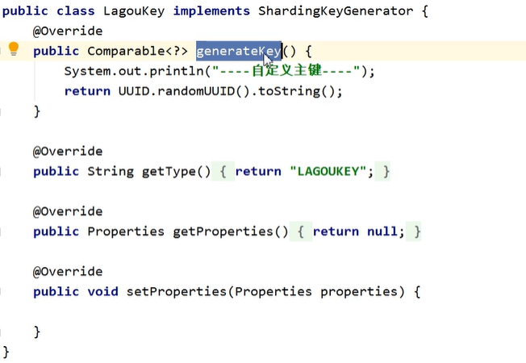

1. 数据库集群架构新增，混合模式（分库+主从、分表+主从、分库分表+主从）
2. 完成分库分表概念、原理及功能实现笔记
3. 同一线程且同一数据库连接内，保证数据一致性。即写入操作后且从库未同步完成时，同线程和连接内读操作，都将从主库读取数据。
