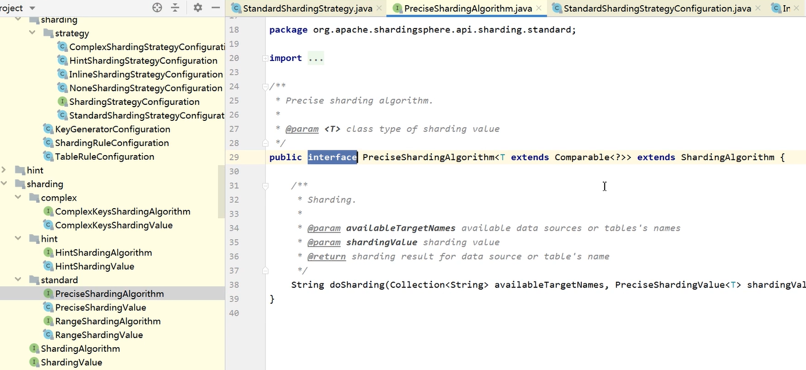

[toc]

### 一、ShardingSphere简介

Apache ShardingSphere是一款**开源的分布式数据库中间件**组成的生态圈。它由**Sharding-JDBC**、**Sharding-Proxy**和**Sharding-Sidecar**（规划中）这3款相互独立的产品组成。 他们均**提供标准化的数据分片**、**分布式事务**和**数据库治理**功能，可适用于如Java同构、异构语言、容器、云原生等各种多样化的应用场景

#### 1. 组成


- **Sharding-JDBC**

  被定位为轻量级Java框架，在Java的JDBC层提供的额外服务，以jar包形式使用

- **Sharding-Proxy**

  被定位为透明化的数据库代理端，提供封装了数据库二进制协议的服务端版本，用于完成对异构语言的支持

- **Sharding-Sidecar**

  被定位为Kubernetes或Mesos的云原生数据库代理，以DaemonSet的形式代理所有对数据库的访问


#### 2. 职能

Sharding-JDBC：作为JDBC中间件接入应用端，负责数据分片及路由

Sharding-Proxy：作为代理中间件接入服务端，方便数据库可视化工具维护及管理


#### 3. 技术支持


#### 4. 下载

ShardingSphere安装包下载：https://shardingsphere.apache.org/document/current/cn/downloads/

使用Git下载工程：git clone https://github.com/apache/incubator-shardingsphere.git


### 二、Sharding-JDBC基础及工作原理

**Sharding-JDBC定位为轻量级Java框架**，在Java的 **JDBC 层提供的额外服务**。 它使用客户端直连数据库，以 **jar包形式提供服务**，无需额外部署和依赖，可理解为**增强版的JDBC驱动**，**完全兼容JDBC和各种ORM框架的使用**。


#### 1. 适用技术

- 适用于任何基于Java的ORM框架，如：JPA, Hibernate, Mybatis, Spring JDBC Template或直接使用JDBC。

- 适用任何第三方的数据库连接池，如：DBCP, C3P0, BoneCP, Druid, HikariCP等。

- 支持任意实现JDBC规范的数据库。目前支持MySQL，Oracle，SQLServer和PostgreSQL


#### 2. 主要功能

##### 2.1 数据分片

- 分库、分表

- 读写分离

- 分片策略

- 分布式主键

##### 2.2 分布式事务

- 标准化的事务接口

- XA强一致性事务

- 柔性事务

##### 2.3 数据库治理

- 配置动态化

- 编排和治理

- 数据脱敏

- 可视化链路追踪


#### 3. 内部结构


- 黄色部分

  **Sharding-JDBC的入口API**，采用工厂方法的形式提供

  - **ShardingDataSourceFactory**：支持分库分表、读写分离操作
  - **MasterSlaveDataSourceFactory**：支持读写分离操作

- 蓝色部分

  **Sharding-JDBC的 JavaConfig**，*ShardingRuleConfiguration*是分库分表配置的核心和入口，包含多个*TableRuleConfiguration*和*MasterSlaveRuleConfiguration*

  - **TableRuleConfiguration**封装的是表的分片配置信息，有5种配置形式对应不同的Configuration类型
  - **MasterSlaveRuleConfiguration**封装的是读写分离配置信息

- 红色部分

  内部对象，由Sharding-JDBC内部使用，应用开发者无需关注。

  **ShardingDataSource**和**MasterSlaveDataSource**实现了DataSource接口，是JDBC的完整实现方案

  两种不同DataSource的实现，分别调用**ShardingRuleConfiguration**和**MasterSlaveRuleConfiguration**配置类生成真正规则对象

  

#### 4. 工作流程

- 根据配置的分片策略生成Configuration对象

- 通过Factory会将Configuration对象传递给Rule对象

- 通过Factory会将Rule对象与DataSource对象封装

- Sharding-JDBC使用DataSource进行分库分表和读写分离操作


#### 5. 使用方式

##### 5.1 引入maven依赖

```xml
<dependency> 
    <groupId>org.apache.shardingsphere</groupId> 
    <artifactId>sharding-jdbc-core</artifactId> 
    <version>${latest.release.version}</version> 
</dependency>
```

##### 5.2 规则配置

Sharding-JDBC可以通过JavaConfig，YAML，Spring命名空间（spring-application.xml）和Spring Boot Starter四种方式配置，开发者可根据场景选择适合的配置方式

##### 5.3 创建DataSource

通过ShardingDataSourceFactory工厂和规则配置对象获取ShardingDataSource，然后即可通过DataSource选择使用原生JDBC开发，或者使用 JPA, MyBatis等ORM工具。


### 三、 数据分片

#### 1. 分片核心概念

- **真实表**：数据库中真实存在的物理表。例如b_order0、b_order1

- **逻辑表**：在分片之后，同一类表的名称。例如b_order。

- **数据节点**：在分片之后，数据源和数据表组成数据节点。例如ds0.b_order1

- **绑定表**：

  指的是分片规则一致的关系表（主表、子表），例如b_order和b_order_item，均按照order_id分片，则此两个表互为绑定表关系。绑定表之间的多表关联查询不会出现笛卡尔积关联，可以提升关联查询效率

  ```sql
  b_order：b_order0、b_order1 
  b_order_item：b_order_item0、b_order_item1 
  select * from b_order o join b_order_item i on(o.order_id=i.order_id) where o.order_id in (10,11);
  ```

  如果不配置绑定表关系，采用笛卡尔积关联，会生成4个SQL

  ```sql
  select * from b_order0 o join b_order_item0 i on(o.order_id=i.order_id) where o.order_id in (10,11); 
  select * from b_order0 o join b_order_item1 i on(o.order_id=i.order_id) where o.order_id in (10,11); 
  select * from b_order1 o join b_order_item0 i on(o.order_id=i.order_id) where o.order_id in (10,11); 
  select * from b_order1 o join b_order_item1 i on(o.order_id=i.order_id) where o.order_id in (10,11);
  ```

  如果配置绑定表关系，只会生成2个SQL

  ```sql
  select * from b_order0 o join b_order_item0 i on(o.order_id=i.order_id) where o.order_id in (10,11);
  select * from b_order1 o join b_order_item1 i on(o.order_id=i.order_id) where o.order_id in (10,11);
  ```

- **广播表**：

  有些表没必要做分片，例如**字典表、省份信息**等，因为他们数据量不大，而且这种表可能需要与海量数据的表进行关联查询。**广播表会在不同的数据节点上进行存储，存储的表结构和数据完全相同**。


#### 2. 分片算法（ShardingAlgorithm）

分片算法和业务实现紧密相关，因此**并未提供内置分片算法**，而是通过分片策略将各种场景提炼出来，提供更高层级的抽象，并提供接口让应用开发者自行实现分片算法。目前提供4种分片算法。



- **PreciseShardingAlgorithm(精确分片算法)**

  用于处理使用单一键作为分片键的=与IN进行分片的场景。

- **RangeShardingAlgorithm(范围分片算法)**

  用于处理使用单一键作为分片键的BETWEEN AND、>、<、>=、<=进行分片的场景。

- **ComplexKeysShardingAlgorithm(复合分片算法)**

  使用多键作为分片键进行分片的场景，多个分片键的逻辑较复杂，需要应用开发者自行处理其中的复杂度

- **HintShardingAlgorithm(Hint分片算法)**

  由其他外置条件决定的场景，可使用SQL Hint灵活的注入分片字段。例：内部系统，按照员工登录主键分库，而数据库中并无此字段。SQL Hint支持通过Java API和SQL注释两种方式使用

#### 3. 分片策略


### 四、读写分离


### 五、强制路由


### 六、数据脱敏


### 七、分布式事务控制


### 八、SPI加载


### 九、编排治理


MySQL解析器（支持MariaDB）

默认解析器（采用SQL92标准）


Sharding-JDBC自带主键生成器


自定义主键生成器


1. 数据库集群架构新增，混合模式（分库+主从、分表+主从、分库分表+主从）
2. 完成分库分表概念、原理及功能实现笔记
3. 同一线程且同一数据库连接内，保证数据一致性。即写入操作后且从库未同步完成时，同线程和连接内读操作，都将从主库读取数据。
