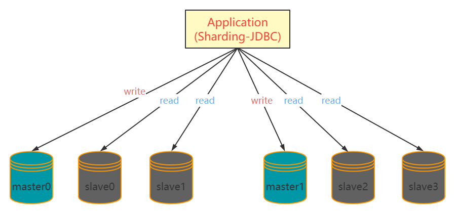

[toc]

### 一、读写分离+分库分表

#### 父Maven依赖

```xml
<?xml version="1.0" encoding="UTF-8"?>
<project xmlns="http://maven.apache.org/POM/4.0.0"
         xmlns:xsi="http://www.w3.org/2001/XMLSchema-instance"
         xsi:schemaLocation="http://maven.apache.org/POM/4.0.0 http://maven.apache.org/xsd/maven-4.0.0.xsd">
    <modelVersion>4.0.0</modelVersion>

    <groupId>org.example</groupId>
    <artifactId>mysql-example</artifactId>
    <packaging>pom</packaging>
    <version>1.0-SNAPSHOT</version>
    <modules>
        <module>sharding-jdbc-example</module>
        <module>sharding-proxy-example</module>
    </modules>

    <properties>
        <project.build.sourceEncoding>UTF-8</project.build.sourceEncoding>
        <project.compile.sourceEncoding>UTF-8</project.compile.sourceEncoding>
        <shardingsphere.version>4.1.0</shardingsphere.version>
        <springboot.version>2.2.5.RELEASE</springboot.version>
    </properties>
    <dependencyManagement>

        <dependencies>

            <dependency>
                <groupId>org.springframework.boot</groupId>
                <artifactId>spring-boot-starter-jdbc</artifactId>
                <version>${springboot.version}</version>
            </dependency>

            <dependency>
                <groupId>org.springframework.boot</groupId>
                <artifactId>spring-boot-starter-data-jpa</artifactId>
                <version>${springboot.version}</version>
            </dependency>

            <dependency>
                <groupId>org.springframework.boot</groupId>
                <artifactId>spring-boot-starter-test</artifactId>
                <version>${springboot.version}</version>
                <scope>test</scope>
            </dependency>

            <dependency>
                <groupId>mysql</groupId>
                <artifactId>mysql-connector-java</artifactId>
                <version>5.1.48</version>
            </dependency>

            <dependency>
                <groupId>org.apache.shardingsphere</groupId>
                <artifactId>sharding-jdbc-spring-boot-starter</artifactId>
                <version>${shardingsphere.version}</version>
            </dependency>

        </dependencies>

    </dependencyManagement>

    <build>
        <plugins>
            <plugin>
                <groupId>org.apache.maven.plugins</groupId>
                <artifactId>maven-compiler-plugin</artifactId>
                <configuration>
                    <source>1.8</source>
                    <target>1.8</target>
                    <testSource>1.8</testSource>
                    <testTarget>1.8</testTarget>
                </configuration>
                <version>3.8.1</version>
            </plugin>
        </plugins>
    </build>

</project>
```

#### Sharding-JDBC实战子Mvaen依赖

```xml
<?xml version="1.0" encoding="UTF-8"?>
<project xmlns="http://maven.apache.org/POM/4.0.0"
         xmlns:xsi="http://www.w3.org/2001/XMLSchema-instance"
         xsi:schemaLocation="http://maven.apache.org/POM/4.0.0 http://maven.apache.org/xsd/maven-4.0.0.xsd">
    <parent>
        <artifactId>mysql-example</artifactId>
        <groupId>org.example</groupId>
        <version>1.0-SNAPSHOT</version>
    </parent>
    <modelVersion>4.0.0</modelVersion>

    <artifactId>sharding-jdbc-example</artifactId>

    <dependencies>

        <dependency>
            <groupId>org.springframework.boot</groupId>
            <artifactId>spring-boot-starter-jdbc</artifactId>
        </dependency>

        <dependency>
            <groupId>org.springframework.boot</groupId>
            <artifactId>spring-boot-starter-data-jpa</artifactId>
        </dependency>

        <dependency>
            <groupId>org.springframework.boot</groupId>
            <artifactId>spring-boot-starter-test</artifactId>
            <scope>test</scope>
        </dependency>

        <dependency>
            <groupId>mysql</groupId>
            <artifactId>mysql-connector-java</artifactId>
        </dependency>

        <dependency>
            <groupId>org.apache.shardingsphere</groupId>
            <artifactId>sharding-transaction-xa-core</artifactId>
            <version>4.0.0-RC2</version>
        </dependency>


        <dependency>
            <groupId>io.shardingsphere</groupId>
            <artifactId>sharding-transaction-base-saga</artifactId>
            <version>4.0.0-RC2</version>
        </dependency>

        <dependency>
            <groupId>org.apache.shardingsphere</groupId>
            <artifactId>sharding-jdbc-spring-boot-starter</artifactId>
        </dependency>

    </dependencies>

</project>
```


#### 1. 场景一：仅读写分离

##### 思路

- 实体类、Repository类同分片实战相同
- 通过配置实现读写分离即可

##### 1.1 配置

```properties
spring.shardingsphere.props.sql.show=true

#datasource
spring.shardingsphere.datasource.names=master,slave0

spring.shardingsphere.datasource.master.type=com.zaxxer.hikari.HikariDataSource
spring.shardingsphere.datasource.master.driver-class-name=com.mysql.jdbc.Driver
spring.shardingsphere.datasource.master.jdbc-url=jdbc:mysql://localhost:3306/db0
spring.shardingsphere.datasource.master.username=root
spring.shardingsphere.datasource.master.password=root

spring.shardingsphere.datasource.slave0.type=com.zaxxer.hikari.HikariDataSource
spring.shardingsphere.datasource.slave0.driver-class-name=com.mysql.jdbc.Driver
spring.shardingsphere.datasource.slave0.jdbc-url=jdbc:mysql://localhost:3306/db1
spring.shardingsphere.datasource.slave0.username=root
spring.shardingsphere.datasource.slave0.password=root

#master-slave
#仅读写分离，单个主从组合可随意取名
spring.shardingsphere.masterslave.name=datasource
spring.shardingsphere.masterslave.master-data-source-name=master
spring.shardingsphere.masterslave.slave-data-source-names=slave0
#从库负载均衡模式设置为轮询（官方提供的方式有:轮询或随机）
spring.shardingsphere.masterslave.load-balance-algorithm-type=ROUND_ROBIN

spring.shardingsphere.sharding.tables.city.key-generator.column=id
spring.shardingsphere.sharding.tables.city.key-generator.type=SNOWFLAKE
```


##### 1.2 测试

```java
import com.tangdi.RunBoot;
import com.tangdi.entity.City;
import com.tangdi.repository.CityRepository;
import org.junit.Test;
import org.junit.runner.RunWith;
import org.springframework.boot.test.context.SpringBootTest;
import org.springframework.test.context.junit4.SpringRunner;

import javax.annotation.Resource;
import java.util.List;

@RunWith(SpringRunner.class)
@SpringBootTest(classes = RunBoot.class)
public class TestMasterSlave {

    @Resource
    private CityRepository cityRepository;

    @Test
    public void testAdd(){
        City city = new City();
        city.setName("shanghai");
        city.setProvince("shanghai");
        cityRepository.save(city);
    }

    @Test
    public void testFind(){
        List<City> list = cityRepository.findAll();
        list.forEach(city->{
            System.out.println(city.getId()+" "+city.getName()+" "+city.getProvince());
        });
    }

}
```


#### 2. 场景二：读写分离+分库分表

1个`master` 主库提供写操作，并通过分库分表，将master分为 `master0`和 `master1`

2个`slave` 从库提供读操作，并通过分库分表，将2个slave分为 `slave0/slave1` 和 `slave2/slave3`



##### 思路

- 实体类、Repository类同分片实战相同
- 通过配置实现读写分离即可

##### 2.1 配置

```properties
spring.shardingsphere.props.sql.show=true

#数据源
spring.shardingsphere.datasource.names=master0,slave0,slave1,master1,slave2,slave3

spring.shardingsphere.datasource.master0.type=com.zaxxer.hikari.HikariDataSource
spring.shardingsphere.datasource.master0.driver-class-name=com.mysql.jdbc.Driver
spring.shardingsphere.datasource.master0.jdbc-url=jdbc:mysql://localhost:3306/master0?useUnicode=true&characterEncoding=utf-8&useSSL=false
spring.shardingsphere.datasource.master0.username=root
spring.shardingsphere.datasource.master0.password=root

spring.shardingsphere.datasource.slave0.type=com.zaxxer.hikari.HikariDataSource
spring.shardingsphere.datasource.slave0.driver-class-name=com.mysql.jdbc.Driver
spring.shardingsphere.datasource.slave0.jdbc-url=jdbc:mysql://localhost:3306/slave0?useSSL=false
spring.shardingsphere.datasource.slave0.username=root
spring.shardingsphere.datasource.slave0.password=root

spring.shardingsphere.datasource.slave1.type=com.zaxxer.hikari.HikariDataSource
spring.shardingsphere.datasource.slave1.driver-class-name=com.mysql.jdbc.Driver
spring.shardingsphere.datasource.slave1.jdbc-url=jdbc:mysql://localhost:3306/slave1?useSSL=false
spring.shardingsphere.datasource.slave1.username=root
spring.shardingsphere.datasource.slave1.password=root

spring.shardingsphere.datasource.master1.type=com.zaxxer.hikari.HikariDataSource
spring.shardingsphere.datasource.master1.driver-class-name=com.mysql.jdbc.Driver
spring.shardingsphere.datasource.master1.jdbc-url=jdbc:mysql://localhost:3306/master1?useUnicode=true&characterEncoding=utf-8&useSSL=false
spring.shardingsphere.datasource.master1.username=root
spring.shardingsphere.datasource.master1.password=root

spring.shardingsphere.datasource.slave2.type=com.zaxxer.hikari.HikariDataSource
spring.shardingsphere.datasource.slave2.driver-class-name=com.mysql.jdbc.Driver
spring.shardingsphere.datasource.slave2.jdbc-url=jdbc:mysql://localhost:3306/slave2?useSSL=false
spring.shardingsphere.datasource.slave2.username=root
spring.shardingsphere.datasource.slave2.password=root

spring.shardingsphere.datasource.slave3.type=com.zaxxer.hikari.HikariDataSource
spring.shardingsphere.datasource.slave3.driver-class-name=com.mysql.jdbc.Driver
spring.shardingsphere.datasource.slave3.jdbc-url=jdbc:mysql://localhost:3306/slave3?useSSL=false
spring.shardingsphere.datasource.slave3.username=root
spring.shardingsphere.datasource.slave3.password=root

#分库分表
#配置分库以及分表策略
#配置主库的数据节点即可
spring.shardingsphere.sharding.tables.b_order.database-strategy.inline.sharding-column=company_id
spring.shardingsphere.sharding.tables.b_order.database-strategy.inline.algorithm-expression=master$->{company_id % 2}
spring.shardingsphere.sharding.tables.b_order.actual-data-nodes=master$->{0..1}.b_order$->{0..1}
spring.shardingsphere.sharding.tables.b_order.table-strategy.inline.sharding-column=id
spring.shardingsphere.sharding.tables.b_order.table-strategy.inline.algorithm-expression=b_order$->{id % 2}

#读写分离，多个主从组合有别于仅仅读写分离的单组合配置
spring.shardingsphere.sharding.master-slave-rules.master0.master-data-source-name=master0
spring.shardingsphere.sharding.master-slave-rules.master0.slave-data-source-names=slave0, slave1
spring.shardingsphere.sharding.master-slave-rules.master1.master-data-source-name=master1
spring.shardingsphere.sharding.master-slave-rules.master1.slave-data-source-names=slave2, slave3
```


##### 2.2 测试

略
