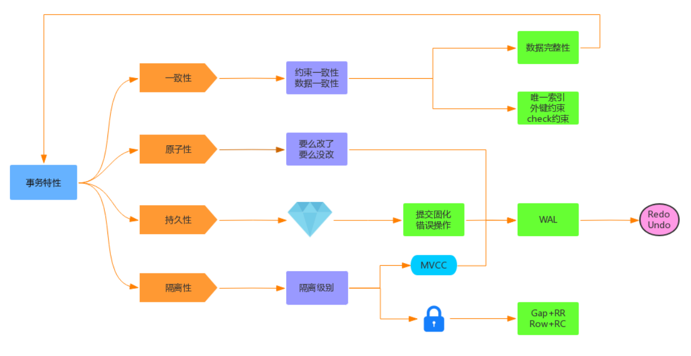
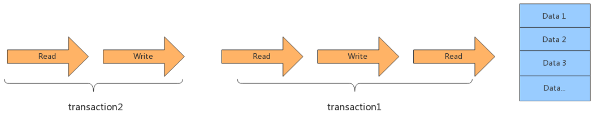
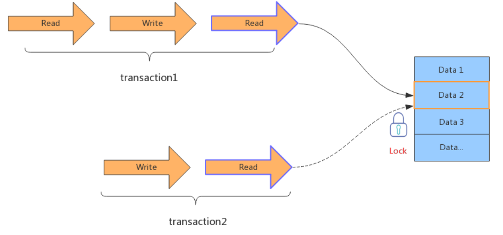
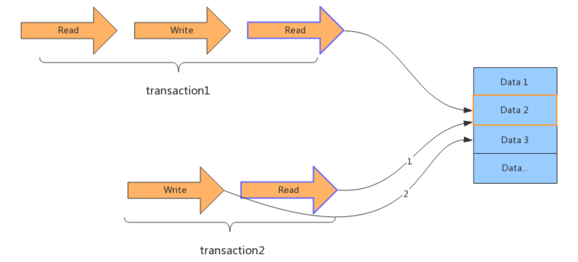
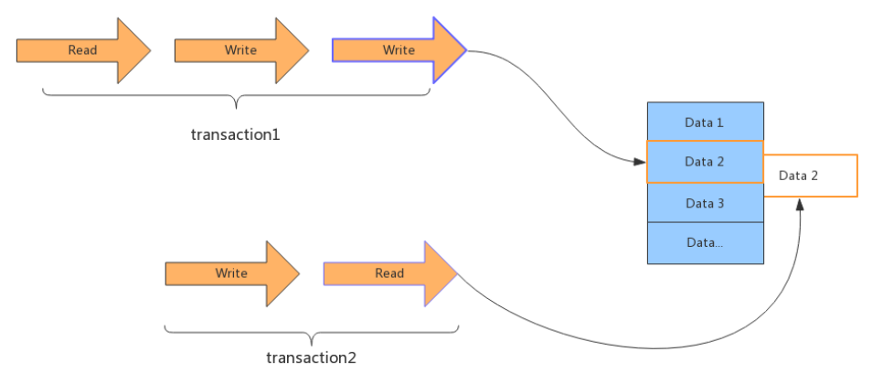
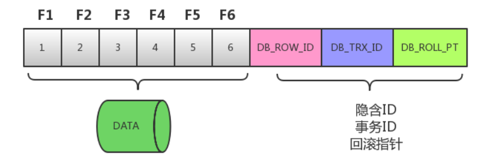
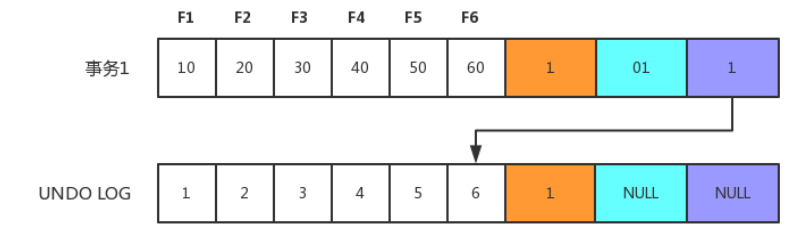
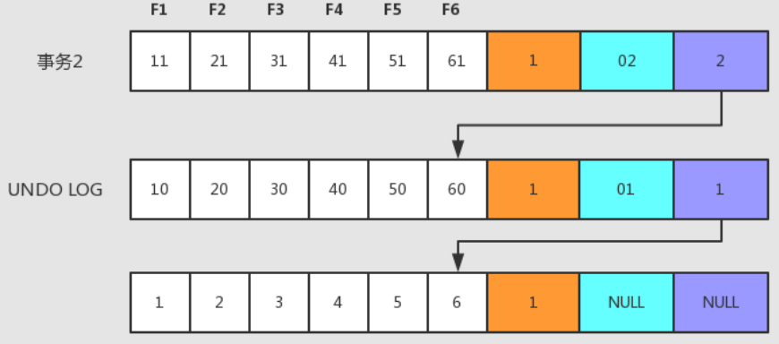

[toc]

### 一、事务的特性

在关系型数据库管理系统中，一个逻辑工作单元要成为事务，必须满足这 4 个特性，即所谓的 ACID：原子性（Atomicity）、一致性（Consistency）、隔离性（Isolation）和持久性（Durability）

#### 1. 原子性

事务是一个原子操作单元，其对数据的修改，要么全都执行，要么全都不执行

##### 事务原子性的实现原理：在[innoDB存储引擎的Undo log](../架构与存储原理/MySQL存储引擎及Binlog)中已经讲过。此处不在过多赘叙

#### 2. 持久性

指的是一个事务一旦提交，它对数据库中数据的改变就应该是永久性的，后续的操作或故障不应该对其有任何影响，不会丢失

如下图所示，一个“提交”动作触发的操作有：binlog落地、发送binlog、存储引擎提交、flush_logs，check_point、事务提交标记等。这些都是数据库保证其数据完整性、持久性的手段。

##### 事务持久性的实现原理：由innoDB存储引擎的刷盘机制和Redo log的Crash-safe共同实现

#### 3. 隔离性

指的是一个事务的执行不能被其他事务干扰，即一个事务内部的操作及使用的数据对其他的并发事务是隔离的

InnoDB 支持的隔离性有 4 种，隔离性从低到高分别为：读未提交、读提交、可重复读、可串行化。

##### 事务隔离性的实现原理：锁和多版本并发控制（MVCC）保障了事务的隔离性

#### 4. 一致性

指的是事务开始之前和事务结束之后，数据库的完整性限制未被破坏。一致性包括两方面的内容，分别是==约束一致性==和==数据一致性==

**事务一致性的实现原理：通过原子性、隔离性、持久性共同实现**

**InnoDB事务一致性协议采用的是两阶段提交模式。一个阶段是prepare（执行sql，生成undolog、redolog、binlog），另一个是commit**

#### 5. ACID关系图

4个特性中有3个与 WAL 有关系，都需要通过 Redo、Undo 日志来保证等。

WAL的全称为Write-Ahead Logging，先写日志，再写磁盘。

### 二、事务并发问题及并发控制手段的演进

#### 1. 事务并发问题

- **更新丢失**

  当两个或多个事务更新同一行记录，会产生更新丢失现象。可以分为回滚覆盖和提交覆盖

  - 回滚覆盖：一个事务回滚操作，把其他事务已提交的数据给覆盖了
  - 提交覆盖：一个事务提交操作，把其他事务已提交的数据给覆盖了

- **脏读**

  一个事务读取到了另一个事务修改但未提交的数据

- **不可重复读**

  事务A多次**读取同一行记录不一致**，后面读取的跟前面读取的不一致（因为事务B**修改了记录并提交了**）

- **幻读**

  事务A多次范围查询结果条数不同，后面读到的记录数可能比前面读的多或者少（因为**事务B添加了记录并提交了**）

#### 2. 事务并发控制手段

##### 2.1 排队

完全顺序执行所有事务的数据库操作，不需要加锁，即全局排队。序列化执行所有的事务单元，==数据库某个时刻只处理一个事务操作==，特点是==强一致性，处理性能低==

##### 2.2 排他锁（互斥锁/独占锁）

引入锁之后就可以支持并发处理事务，如果==事务之间涉及到相同的数据项时==，会==使用排他锁==，先进入的事务==独占数据==，其他事务被阻塞，等待前面的事务==结束并释放锁==。

##### 2.3 读/写锁

读锁（共享锁/S锁）：==事务A添加读锁后==，==其他读事务依然可以加读锁并可以并发访问该加锁数据==，==而当前事务或其他事务的写操作必须得等读写释放==才能访问

写锁（排他锁/互斥锁/X锁）：==添加写锁后==，即使用了==排他锁==，其他==任何事务都无法访问==该数据

读写锁就是进一步细化锁的颗粒度，区分读操作和写操作，读和读并行，而读和写、写和读、写和写这几种之间还是要加排他锁。

##### 2.4 多版本并发控制-MVCC（隔离级别RC和RR的默认实现）

MVCC最大的好处是读不加锁，读写不冲突。现阶段几乎所有的关系型数据库都支持 MVCC 的原因，不过目前 ==MVCC只在 Read Commited 和 Repeatable Read 两种隔离级别下工作==

多版本并发控制==MVCC==，也就是==**Copy on Write**==的思想。MVCC除了支持==读和读==并行，还支持==读和写==、==写和读==的并行，但为了保证一致性，==写和写是无法并行==的。

在事务1开始写操作的时候会copy一个记录的副本，其他事务读操作会读取这个记录副本，因此不会影响其他事务对此记录的读取，实现写和读并行，在下方进行MVCC详细的介绍

### 三、MVCC

#### 1. 概念

MVCC（Multi Version Concurrency Control）被称为多版本控制，是指在数据库中==为了实现**高并发的数据访问，对数据进行多版本处理**==，并通过事务的可见性来==保证事务能看到自己应该看到的数据版本==。多版本控制很巧妙地将稀缺资源的独占互斥转换为并发，大大提高了数据库的吞吐量及读写性能。

如何生成的多版本？**每次事务修改操作之前**，都会**在Undo日志中记录修改之前的数据状态和事务号**，该备份记录可以用于其他事务的读取，也可以进行必要时的数据回滚。**[innoDB存储引擎的Undo log](../架构与存储原理/MySQL存储引擎及Binlog)中已经陈述过**

#### 2. 原理

MVCC最大的好处是读不加锁，读写不冲突。现阶段几乎所有的关系型数据库都支持 MVCC 的原因，不过目前 ==MVCC只在 Read Commited 和 Repeatable Read 两种隔离级别下工作==

在 MVCC 并发控制中，读操作可以分为两类: 快照读（Snapshot Read）与当前读 （Current Read）

- **快照读：**读取的是记录的快照版本（有可能是历史版本），不用加锁。（平时的select ...查询都是快照读）

- **当前读：**==读取的是记录的最新版本==，并且当前读返回的记录，都会==加排他锁==，保证其他事务不会再并发修改这条记录。（select ... for update 或lock in share mode 都是当前读，包括 insert/delete/update操作都含当前读-DML操作也得先读数据）

**RC和RR两种隔离级别的MVCC快照读的区别**

- **RC隔离级别：**一个事务中，每次读都会重新生成一致性视图（read view）。所以，可能读到更新后的数据，即存在不可重复读的问题
- **RR隔离级别：**一个事务中，第一次读生成一致性视图（read view），后续再读将不在重新生成view。所以，不会读到更新后的数据，解决了不可重复读的问题

#### 3. MVCC 实现示例

假设 F1～F6 是表中字段的名字，1～6 是其对应的数据。后面三个隐含字段分别对应该行的隐含ID、事务号和回滚指针，如下图所示

**具体的更新过程如下：**

1. 初始的行记录：DB_ROW_ID 为 1，事务ID和回滚指针为NULL

2. 事务 1 更改该行的数据值时，会进行如下操作，如下图所示

   

   - 用排他锁锁定该行；记录 Redo log；
   - 把该行修改前的值复制到 Undo log，即图中下面的行；
   - 修改当前行的值，填写事务编号，使回滚指针指向 Undo log 中修改前的行。

3. 接下来事务2操作，过程与事务 1 相同，此时 Undo log 中会有两行记录，并且通过回滚指针连在一起，通过当前记录的回滚指针回溯到该行创建时的初始内容，如下图所示。

#### 4. 使用并发场景

==**MVCC适用于读读、读写、写读的并发处理**==，如果想进一步解决 ==写写冲突==，可以采用下面两种方案：

- **乐观锁**

- **悲观锁**

### 四、事务的隔离级别

#### 1. 隔离级别描述

事务隔离级别是SQL92定制的标准，相当于==事务并发控制的整体解决方案==，本质上是==对锁和MVCC使用的封装==，隐藏了底层细节。==不同级别对应解决不同并发问题==，如上文提到的“更新丢失”、”脏读”、“不可重复读”和“幻读”等

数据库系统提供了以下 4 种事务隔离级别供用户选择，级别越高，并发问题越小，但并发处理能力越差，

- 读未提交（Read Uncommitted ）

- 读已提交（Read Committed） 

  **Oracle、SQLServer默认隔离级别**

- 可重复读（Repeatable Read） 

  **MySQL默认隔离级别**

- 串行化（Serializable） 

**注意1：**一般使用时，建议采用默认隔离级别，==然后存在的一些并发问题，可以通过悲观锁、乐观锁等实现==处理。

**注意2：**MySQL InnoDB的默认隔离级别是RR，由于MySQL的RR**采用了next-key lock间隙锁的原因**（[锁基础及原理查看间隙锁](./锁基础及原理)）。所以RR隔离级别中，一个**事务只有进行快照读可解决幻读**；但如果这个事务还进行了当前读**（快照读-当前读-快照读）操作，则第二次读还是会发生幻读。**

#### 2. 事务隔离级别和锁的关系

- 事务隔离级别是SQL92定制的标准，相当于事务并发控制的整体解决方案，本质上是==对锁和MVCC使用的封装==，隐藏了底层细节。

- 锁是数据库实现并发控制的基础，事务隔离 级别是采用锁来实现，==对相应操作加不同的锁==，就可以防止其他事务同时对数据进行读写操作。
  - **==针对读读：使用读锁==**
  - **==针对读写/写读：使用MVCC==**

- 对用户来讲，首先选择使用隔离级别，当选用的**==隔离级别不能解决并发问题或需求时，才有必要在开发中手动的编码设置锁（悲观锁、乐观锁）==**。

#### 3. 隔离级别配置

- 查看MySQL当前数据库的事务隔离级别命令如下：

**`show variables like 'tx_isolation';`**

- 设置事务隔离级别可以如下命令：

  **`set tx_isolation='READ-UNCOMMITTED'; `
  `set tx_isolation='READ-COMMITTED'; `
  `set tx_isolation='REPEATABLE-READ'; `
  `set tx_isolation='SERIALIZABLE';`**

