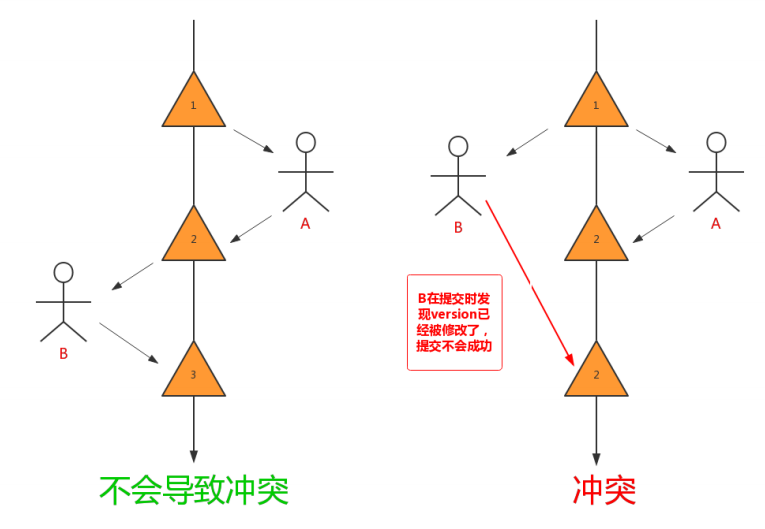

[toc]

### 一、锁的分类

#### 1. 从操作的粒度划分

- **表级锁**

  每次操作锁住整张表。锁定粒度大，发生锁冲突的概率最高，并发度最低。应用在MyISAM、InnoDB、BDB 等存储引擎中

- **行级锁**

  每次操作锁住一行数据。锁定粒度最小，发生锁冲突的概率最低，并发度最高。应用在InnoDB 存储引擎中

- **页级锁**

  每次锁定相邻的一组记录，锁定粒度界于表锁和行锁之间，开销和加锁时间界于表锁和行锁之间，并发度一般。应用在BDB 存储引擎中

#### 2. 从操作的类型划分

##### 2.1 针对行锁

- **读锁（共享锁/S锁）**

  事务A添加读锁后，==其他读事务依然可以加读锁并可以并发访问该加锁数据==，而==当前事务的写操作会报错==，==其他写事务会阻塞==

- **写锁（排他锁/互斥锁/独占锁/X锁）**

  当前写操作没有完成前，它==会阻塞其他写锁和读锁==

##### 2.2 针对表锁

- **意向读锁（IS）**

  在对某个表的行记录添加S锁之前，会先对表添加IS锁

- **意向写锁（IX）**

  在对某个表的行记录添加X锁之前，会先对表添加IX锁

#### 3. 从操作的性能划分

- **乐观锁**

  一般的实现方式是==对记录数据版本进行比对==，在数据==更新提交的时候才会进行冲突检测==，如果发现冲突了，则==提示错误信息==

- **悲观锁**

  在对一条数据修改的时候，为了避免同时被其他人修改，在修改数据之前先锁定，再修改的控制方式。共享锁和排他锁是悲观锁的不同实现，但都属于悲观锁范畴。

### 二、行锁

#### 1. 行锁的实现

==行锁又分为读锁（共享锁）和写锁（排他锁）==。**InnoDB行锁是通过对索引数据页上的记录加锁实现的**，主要实现算法有一下三种：

- **RecordLock锁：**锁定单个行记录的锁。（记录锁，==RC、RR隔离级别都支持==）
- **GapLock锁：**间隙锁，锁定索引记录间隙，确保索引记录的间隙不变。（范围锁，==RR隔离级别支持==）
- **Next-key Lock 锁：**记录锁和间隙锁组合，同时锁住数据，并且锁住数据前后范围。（记录锁+范围锁，==RR隔离级别支持==）

在**RR隔离级别**，InnoDB对于记录加锁行为都是**先采用Next-Key Lock**，但是当SQL **条件语句含有唯一索引时**，Innodb会对Next-Key Lock进行优化，**降级为RecordLock**，**仅锁住索引本身而非范围**。

若条件没有索引，则锁全表

#### 2. SQL语句中使用行锁（默认隔离级别为RR）

- **select ... from 语句**

  InnoDB引擎==采用MVCC机制实现非阻塞读==，所以对于==普通的select语句，InnoDB不加锁==

- **select ... from ... where ...lock in share mode语句**

  追加了==共享锁==，InnoDB会==使用Next-Key Lock锁==进行处理，如果扫描发现==唯一索引==，可以==降级为RecordLock锁==。

- **select ... from ... where ... for update语句**

  追加了==排他锁==，InnoDB会==使用Next-Key Lock锁==进行处理，如果扫描发现唯一索引，可以降级为RecordLock锁

- **update ... where 语句（InnoDB 自动添加了for update）**

  追加了==排他锁==，InnoDB会==使用Next-Key Lock锁==进行处理，如果扫描发现唯一索引，可以降级为RecordLock锁

- **delete ... where 语句（InnoDB 自动添加了for update）**

  追加了==排他锁==，InnoDB会==使用Next-Key Lock锁==进行处理，如果扫描发现唯一索引，可以降级为RecordLock锁

- **insert语句**

  追加了==排他锁==，InnoDB会在将要==插入的那行设置一个排他的RecordLock锁==

#### 3. 不同索引对 加行锁的影响

下面以 **`update t1 set name=‘XX’ where id=10`** 操作为例，举例分析下 InnoDB ==对不同索引的加锁行为==，==以RR隔离级别为例==

- 主键加锁

  加锁行为：仅在id=10的主键索引记录上加X锁（降级为了记录锁）

  

- 唯一索引加锁

  加锁行为：现在唯一索引id上加X锁，然后在id=10的主键索引记录上加X锁（降级为记录锁）

- 非唯一索引加锁

  加锁行为：对满足id=10条件的记录和主键分别加X锁，然后在(6,c)-(10,b)、(10,b)-(10,d)、(10,d)-(11,f)范围分别加Gap Lock（范围锁/间隙锁），锁住间隙保持不变

- 无索引加锁

  加锁行为：表里所有行和间隙都会加X锁。（当没有索引时，会导致==全表锁定==，因为InnoDB引擎行锁机制是基于索引实现的记录锁定）

  

### 三、悲观锁（写写并发需自行编码处理）

*悲观锁和乐观锁都可以解决事务 ==写写并发==，比如对并发率要求高的选择乐观锁；对于并发率要求低的可以选择悲观锁*

**写写并发**

#### 1. 概念

指在数据处理过程，将数据处于锁定状态，一般使用数据库的锁机制实现

从广义上来讲，前面提到的行锁、表锁、读锁/共享锁、写锁/排他锁/互斥锁 等，这些都属于悲观锁范畴。

#### 2. 悲观锁的使用

- **==表级锁==**

  表级读锁会阻塞写操作，但是不会阻塞读操作。而写锁则会把读和写操作都阻塞

  - 手动加表锁：**`lock table 表名称 read|write,表名称2 read|write; `**

  - 手动释放表锁：**`unlock tables;`**
  - 查看表表锁：**`show open tables;`**

- **==共享锁（行级锁-读锁）==**

  事务使用了共享锁（读锁），当前事务只能读取不能修改，其他读事务可以访问，其他写事务被阻塞

  - 查询时加行级共享锁： **`select ... lock in share mode`**

- **==排他锁（行级锁-写锁）==**

  排他锁又称为写锁、X锁。排他锁就是不能与其他锁并存，如一个事务获取了一个行记录的排他锁，其他事务就不能对该行记录做其他操作，也不能获取该行的锁

  - 使用排他锁：在SQL末尾加上 **`for update`**，行级锁的实现其实是依靠其对应的索引，所以如果操作没用到索引的查询，那么会锁住全表记录

### 四、乐观锁（写写并发需自行编码处理）

*悲观锁和乐观锁都可以解决事务 ==写写并发==，比如对并发率要求高的选择乐观锁；对于并发率要求低的可以选择悲观锁*

**写写并发**

#### 1. 概念

乐观锁是相对于悲观锁而言的，它不是数据库提供的功能，需要开发者自己去实现。

在数据库操作时，想法很乐观，认为这次的操作不会导致冲突，因此在数据库操作时不加锁，而是在进行事务提交时再去判断是否有冲突了

#### 2. 乐观锁的使用

- **==使用版本字段（version）==**

  数据表增加一个版本(version) 字段，每update一次，将那条记录的版本号加 1。

  version是用来查看被读的记录有无变化，作用是防止记录在业务处理期间被其他事务修改

  1. 查询商品信息，`select (quantity,version) from products where id=1;`
  2. 根据商品信息生成订单：`insert into orders ... `
  3. 修改商品库存：`update products set quantity=quantity-1,version=version+1 where id=1 and version=#{version} and quantity >= 1;`

- **==使用时间戳（Timestamp）==**

  与使用version版本字段相似，同样需要给在数据表增加一个字段，字段类型使用timestamp时间戳。也是在更新提交的时候检查当前数据库中数据的时间戳和自己更新前取到的时间戳进行对比，如果一致则提交更新，否则就是版本冲突，取消操作

- 除了自己手动实现乐观锁之外，==许多数据库访问框架也封装了乐观锁的实==现，比如==hibernate==框架。MyBatis框架大家可以使用==OptimisticLocker插件==来扩展。

### 五、死锁解决方案

#### 1. 死锁场景及解决方案

##### 1.1 ==表级锁死锁==

**原因**

- 事务1 访问表A（锁住了表A），然后又访问表B；事务2 访问表B（锁住了表B），然后企图访问表A；此时事务1和2相互等待多方的表锁，造成了死锁

**解决方案**

- 调整的程序的逻辑，对于数据库的多表操作时，尽量按照相同的顺序进行处理
- 同一个事务中，同时锁定所有所操作的资源表

##### 1.2 ==行级锁死锁==

**原因1**

- 事务中执行了一条没有索引条件的查询，导致全表扫描，然后行锁升级为全表锁 ，这样很容易造成死锁

**原因2**

- 事务1访问A记录（锁住了A行），然后又访问B记录；事务2访问B记录（锁住了B），然后访问A记录；此时事务1和2相互等待对方的行级锁，造成死锁

  

**解决方案1**

- 使用Explain分析执行计划，避免复杂的多表关联查询，条件语句的列上建立合适的索引，避免全面扫描和全表锁定

**解决方案2**

- 按照行记录排序的顺序进行处理
- 同一个事务中，同时锁定所有所操作的行记录

##### 1.3 ==共享锁与排他锁死锁==

**原因**

- 事务A 查询一条纪录，然后更新该条纪录；此时事务B 也更新该条纪录，这时事务B 的排他锁由于事务A 有共享锁，必须等A 释放共享锁后才可以获取，只能排队等待。事务A 再执行更新操作时，此处发生死锁，因为事务A 需要排他锁来做更新操作。但是，无法授予该锁请求，因为事务B 已经有一个排他锁请求，并且正在等待事务A 释放其共享锁。

**解决方案**

- 对于按钮等控件，点击立刻失效，不让用户重复点击，避免引发同时对同一条记录多次操作；
- 使用乐观锁进行控制。乐观锁机制避免了长事务中的数据库加锁开销，大大提升了大并发量下的系统性能。需要注意的是，由于乐观锁机制是在我们的系统中实现，来自外部系统的用户更新操作不受我们系统的控制，因此可能会造成脏数据被更新到数据库中；

#### 2. 排查死锁

MySQL提供了几个与锁有关的参数和命令，可以辅助我们优化锁操作，减少死锁发生

- **查看近期死锁日志信息**

  通过  **`show engine innodb status\G`** 命令查看近期死锁日志信息（找到LATEST DETECTED DEADLOCK信息），如下图所示

  

  

- **使用explain查看下SQL执行计划**

  根据InnoDB死锁日志中的SQL，查看执行计划，是否被全表锁定等等

- **查看锁状态变量**

  通过  **`show status like'innodb_row_lock%‘`**  命令检查状态变量，分析系统中的行锁的争夺情况

  - Innodb_row_lock_current_waits：当前正在等待锁的数量

  - Innodb_row_lock_time：从系统启动到现在锁定总时间长度

  - Innodb_row_lock_time_avg： 每次等待锁的平均时间

  - Innodb_row_lock_time_max：从系统启动到现在等待最长的一次锁的时间

  - Innodb_row_lock_waits：系统启动后到现在总共等待的次数

