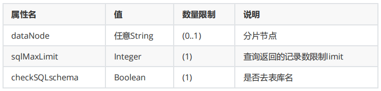
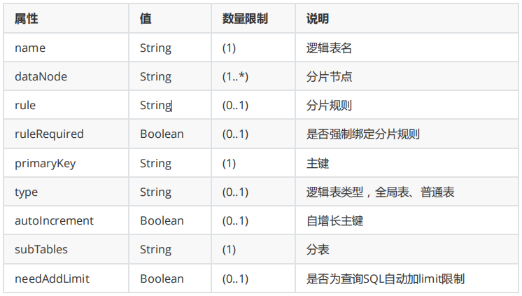
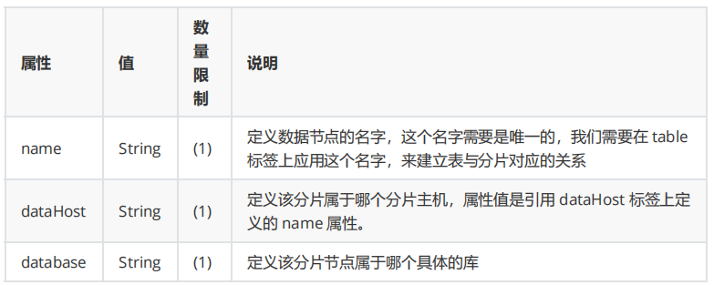
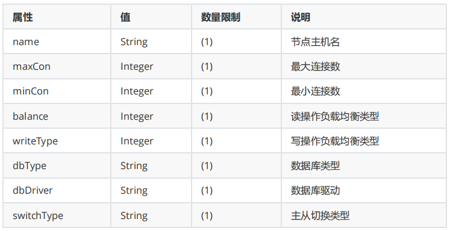
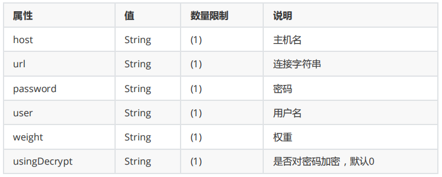
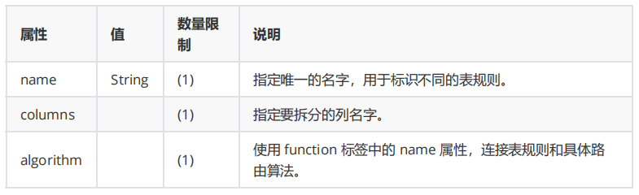
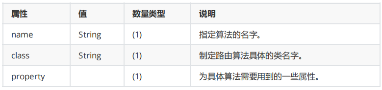

[toc]

### 1. Mycat 简介

Mycat 是一个强大的**数据库中间件**，不仅可以用作**读写分离、分表分库、容灾备份**，还可用于**多用户应用开发、云平台基础设施**、让系统架构具备很强的适应性和灵活性，借助于即将发布的 **Mycat 智能优化模块，系统的数据访问瓶颈和热点一目了然**，根据这些统计分析数据，可以自动或手工调整后端存储，将不同的 表映射到不同存储引擎上，**整个应用的代码一行也不用改变。**

Mycat 具有数据库代理功能，可看成 MySQL 的数据库服务器，**可使用 MySQL GUI工具、命令行或MySQL 原生协议、JDBC 协议访问**（除了端 口不同，默认的 **Mycat 端口是 8066** 而非 MySQL 的 3306，因此需要在连接字符串上增加端口信息），支持大部分ORM框架。对于分片表，尽量使用基础的 SQL 语句，因为这样能 达到最佳性能，特别是几千万甚至几百亿条记录的情况下。


### 2. Mycat 核心概念


### 3. Mycat server.xml配置

server.xml几乎保存了所有 mycat 需要的系统配置信息。

##### 3.1 user 标签

主要用于定义登录 mycat 的用户和权限。

例如下面的例子中，定义了一个用户，用户名 user、密码也为 user，可访问的 schema为orderdb。

```xml
<user name="user" defaultAccount="true">
    <property name="password">user</property>
    <property name="schemas">orderdb</property>
    <property name="readOnly">true</property>
    <property name="defaultSchema">orderdb</property>
    <!--No MyCAT Database selected 错误前会尝试使用该schema作为schema，不设置则为null,报错 -->

    <!-- 表级 DML 权限设置 -->
    <!-- 		
  <privileges check="false">
   <schema name="TESTDB" dml="0110" >
    <table name="tb01" dml="0000"></table>
    <table name="tb02" dml="1111"></table>
   </schema>
  </privileges>		
   -->
</user>
```


##### 3.2 firewall 标签

```xml
<!-- 全局SQL防火墙设置 -->
<!--白名单可以使用通配符%或着*-->
<!--这些配置情况下对于127.0.0.1都能以root账户登录-->
<firewall>
    <whitehost>
        <host host="1*7.0.0.*" user="root"/>
        <!--<host host="127.0.0.*" user="root"/>-->
		<!--<host host="127.0.*" user="root"/>-->
		<!--<host host="127.*" user="root"/>-->
		<!--<host host="1*7.*" user="root"/>-->
    </whitehost>
    <!-- <blacklist check="false">
    </blacklist>-->
    <!-- 黑名单允许的 权限 后面为默认 --> 
    <blacklist check="true"> 
        <property name="selelctAllow">false</property> 
        <property name="selelctIntoAllow">false</property> 
        <property name="updateAllow">false</property> 
        <property name="insertAllow">false</property> 
        <property name="deletetAllow">false</property> 
        <property name="dropAllow">false</property> 
    </blacklist>
</firewall>
```


##### 3.3 全局序列号

对于分库分表所需分布式主键的全局唯一性，Mycat 提供了全局sequence，并且提供了包含本地配置和数据库配置等多种实现方式

```xml
<system> 
    <property name="sequnceHandlerType">0</property> 
</system>
```

- 0表示使用本地文件方式
- 1表示使用数据库方式生成
- 2表示使用本地时间戳方式
- 3表示基于ZK与本地配置的分布式ID生成器
- 4表示使用zookeeper递增方式生成

###### 本地文件方式

此方式 Mycat 将 sequence 配置到文件中，当使用到 sequence 中的配置后，Mycat 会更下 classpath中的 sequence_conf.properties 文件中 sequence 当前的值。

```properties
#default global sequence
GLOBAL.HISIDS=
GLOBAL.MINID=10001
GLOBAL.MAXID=20000
GLOBAL.CURID=10000

# self define sequence
COMPANY.HISIDS=
COMPANY.MINID=1001
COMPANY.MAXID=2000
COMPANY.CURID=1000

CUSTOMER.HISIDS=
CUSTOMER.MINID=1001
CUSTOMER.MAXID=2000
CUSTOMER.CURID=1000

ORDER.HISIDS=
ORDER.MINID=1001
ORDER.MAXID=2000
ORDER.CURID=1000

HOTNEWS.HISIDS=
HOTNEWS.MINID=1001
HOTNEWS.MAXID=2000
HOTNEWS.CURID=1000
```

###### 数据库方式

在数据库中建立一张表， sequence 名称（name），sequence 当前值（current_value），步长（increment） 等信息。

```sql
CREATE TABLE MYCAT_SEQUENCE ( 
    name VARCHAR(64) NOT NULL, 
    current_value BIGINT(20) NOT NULL, 
    increment INT NOT NULL DEFAULT 1, 
    PRIMARY KEY (name) 
) ENGINE = InnoDB;
```

###### 本地时间戳方式

ID为64 位二进制 ，42（毫秒）+5（机器 ID）+5（业务编码）+12（重复累加）换算成十进制为 18 位数的 long 类型，每毫秒可以并发 12 位二进制的累加。在 Mycat 下配置sequence_time_conf.properties文件

每个Mycat 配置的 WORKID、DATAACENTERID 不同，组成唯一标识，总共支持32*32=1024 种组合。

```properties
# 0-31 任意整数
WORKID= 0
# 0-31 任意整数
DATAACENTERID= 0
```

###### 分布式 ZK ID 生成器

Zk 的连接信息统一在 `myid.properties` 的 `zkURL `属性中配置。基于 ZK 与本地配置的分布式 ID 生成器，InstanceID可以通过ZK自动获取，也可以通过配置文件配置。在 `sequence_distributed_conf.properties`，只要配置 `INSTANCEID=ZK`就表示从 ZK 上获取 InstanceID。ID 最大为63位二进制，可以承受单机房单机器单线程 1000*(2^6)=640000 的并发。结构如下

- current time millis（微秒时间戳 38 位，可以使用 17 年）

- clusterId（机房或者 ZKid，通过配置文件配置，5 位）

- instanceId（实例 ID，可以通过 ZK 或者配置文件获取，5 位）

- threadId（线程 ID，9 位）

- increment（自增，6 位）

###### ZK 递增方式

Zk 的连接信息统一在 `myid.properties` 的 `zkURL `属性中配置。需要配置`sequence_conf.properties`文件 

- TABLE.MINID 某线程当前区间内最小值

- TABLE.MAXID 某线程当前区间内最大值

- TABLE.CURID 某线程当前区间内当前值


### 4. Mycat schema.xml配置

schema.xml 管理着 Mycat 的逻辑库、表、分片节点、主机等信息。

##### 4.1 schema 标签

**定义 Mycat 实例中的逻辑库**，Mycat 可以有多个逻辑库，每个逻辑库都有自己的相关配置。可以使用 schema 标签来划分这些不同的逻辑库。

```xml
<!-- 逻辑库 -->
<schema name="order_db" checkSQLschema="true" sqlMaxLimit="100" dataNode="dn1">
    <!--splitTableNames 启用<table name 属性使用逗号分割配置多个表,即多个表使用这个配置-->
    <!--fetchStoreNodeByJdbc 启用ER表使用JDBC方式获取DataNode-->
    <table name="b_order" primaryKey="id" dataNode="dn1,dn2" rule="b_order_rule" autoIncrement="true" fetchStoreNodeByJdbc="false"></table>
</schema>
```




##### 4.2 table 标签（schema子标签）

**定义了 Mycat 中的逻辑表**，所有需要拆分的表都需要在这个标签中定义

```xml
<!--fetchStoreNodeByJdbc 启用ER表使用JDBC方式获取DataNode-->
<table name="b_order" primaryKey="id" dataNode="dn1,dn2" rule="b_order_rule" autoIncrement="true" fetchStoreNodeByJdbc="false"></table>
```




##### 4.3 dataNode 标签

**定义了 MyCat 中的分片节点**，区别与ShardingJDBC数据节点（数据库.表），Mycat的分片节点指的是数据库

```xml
<dataNode name="dn1" dataHost="order_db1" database="order_db1" />
<dataNode name="dn2" dataHost="order_db1" database="order_db2" />
```




##### 4.4 dataHost 标签

**dataHost标签在 Mycat 逻辑库中属于最底层的标签，直接定义了具体的数据库实例、读写分离配置和心跳语句**

```xml
<dataHost name="order_db1" maxCon="1000" minCon="10" balance="1" writeType="0" dbType="mysql" dbDriver="jdbc" switchType="1"  slaveThreshold="100">
    <heartbeat>select user()</heartbeat>
    <!-- can have multi write hosts -->
    <writeHost host="M1" url="localhost:3306" user="root" password="123456"> 
        <readHost host="S1" url="localhost:3307" user="root" password="123456" 
                  weight="1"/> 
    </writeHost> 
</dataHost>
```



**balance 参数**

- 0 ： 所有读操作都发送到当前可用的writeHost

- 1 ：所有读操作都随机发送到readHost和stand by writeHost
- 2 ：所有读操作都随机发送到writeHost和readHost
- 3 ：所有读操作都随机发送到writeHost对应的readHost上，但是writeHost不负担读压力

**writeType 参数：**

- 0 ：所有写操作都发送到可用的writeHost

- 1 ：所有写操作都随机发送到readHost

- 2 ：所有写操作都随机发送到writeHost，readHost

**switchType 参数：**

- -1： 表示不自动切换
- 1 ：表示自动切换
- 2 ：基于MySQL主从同步状态决定是否切换
- 3 ：基于MySQL cluster集群切换机制


##### 4.5 heartbeat标签（dataHost 子标签）

heartbeat标签内指明用于和后端数据库进行心跳检查的语句。例如：MySQL 可以使用 select user()、Oracle 可以 使用 select 1 from dual 等

```xml
<heartbeat>select user()</heartbeat>
```


##### 4.6 writeHost 和 readHost 标签（dataHost 子标签）

writeHost和readHost标签都指定后端数据库的相关配置给 mycat，用于实例化后端连接池。

不同的是，writeHost 指定写实例、readHost 指定读实例。

在一个 dataHost 内可以定义多个 writeHost 和 readHost。但是，如果 writeHost 指定的后端数据库宕机， 那么这个 writeHost 绑定的所有 readHost都将不可用。另一方面，由于这个 writeHost 宕机系统会自动的检测 到，并切换到备用的 writeHost上去。

```xml
<writeHost host="hostM1" url="jdbc:mysql://localhost:3306" user="root" password="root"></writeHost>
<writeHost host="hostM2" url="localhost:3316" user="root" password="123456"/>
```




### 5. Mycat rule.xml配置

rule.xml用于定义Mycat的分片规则。

##### 5.1 tableRule 标签

```xml
<tableRule name="b_order_rule">
    <rule>
        <columns>company_id</columns>
        <algorithm>partitionByOrderFunc</algorithm>
    </rule>
</tableRule>
```




##### 5.2 function 标签

```xml
<function name="partitionByOrderFunc" class="io.mycat.route.function.PartitionByMod">
    <property name="seed">0</property><!-- 默认是0 -->
    <property name="count">2</property><!-- 要分片的数据库节点数量，必须指定，否则没法分片 -->
    <property name="virtualBucketTimes">160</property><!-- 一个实际的数据库节点被映射为这么多虚拟节点，默认是160倍，也就是虚拟节点数是物理节点数的160倍 -->
    <!-- <property name="weightMapFile">weightMapFile</property> 节点的权重，没有指定权重的节点默认是1。以properties文件的格式填写，以从0开始到count-1的整数值也就是节点索引为key，以节点权重值为值。所有权重值必须是正整数，否则以1代替 -->
    <!-- <property name="bucketMapPath">/etc/mycat/bucketMapPath</property>
   用于测试时观察各物理节点与虚拟节点的分布情况，如果指定了这个属性，会把虚拟节点的murmur hash值与物理节点的映射按行输出到这个文件，没有默认值，如果不指定，就不会输出任何东西 -->
</function>
```



