[toc]


### 一、Sharding-JDBC基础及工作原理

**Sharding-JDBC定位为轻量级Java框架**，在Java的 **JDBC 层提供的额外服务**。 它使用客户端直连数据库，以 **jar包形式提供服务**，无需额外部署和依赖，可理解为**增强版的JDBC驱动**，**完全兼容JDBC和各种ORM框架的使用**。


#### 1. 适用技术

- 适用于任何基于Java的ORM框架，如：JPA, Hibernate, Mybatis, Spring JDBC Template或直接使用JDBC。

- 适用任何第三方的数据库连接池，如：DBCP, C3P0, BoneCP, Druid, HikariCP等。

- 支持任意实现JDBC规范的数据库。目前支持MySQL，Oracle，SQLServer和PostgreSQL


#### 2. 主要功能

##### 2.1 数据分片

- [分库分表](#1. 数据分片（分库分表）)

- [读写分离](#2. 读写分离)

- [分片策略](#1.3 分片策略)

- [分布式主键](#1.8 分布式主键生成策略)

##### 2.2 分布式事务

- 标准化的事务接口

- XA强一致性事务

- 柔性事务

##### 2.3 数据库治理

- 配置动态化

- 编排和治理

- [数据脱敏](#4. 数据脱敏)

- 可视化链路追踪


#### 3. 内部结构


- 黄色部分

  **Sharding-JDBC的入口API**，采用工厂方法的形式提供

  - **ShardingDataSourceFactory**：支持分库分表、读写分离操作
  - **MasterSlaveDataSourceFactory**：支持读写分离操作

- 蓝色部分

  **Sharding-JDBC的 JavaConfig**，*ShardingRuleConfiguration*是分库分表配置的核心和入口，包含多个*TableRuleConfiguration*和*MasterSlaveRuleConfiguration*

  - **TableRuleConfiguration**封装的是表的分片配置信息，有5种配置形式对应不同的Configuration类型
  - **MasterSlaveRuleConfiguration**封装的是读写分离配置信息

- 红色部分

  内部对象，由Sharding-JDBC内部使用，应用开发者无需关注。

  **ShardingDataSource**和**MasterSlaveDataSource**实现了DataSource接口，是JDBC的完整实现方案

  两种不同DataSource的实现，分别调用**ShardingRuleConfiguration**和**MasterSlaveRuleConfiguration**配置类生成真正规则对象

  

#### 4. 工作流程

- 根据配置的分片策略生成Configuration对象

- 通过Factory会将Configuration对象传递给Rule对象

- 通过Factory会将Rule对象与DataSource对象封装

- Sharding-JDBC使用DataSource进行分库分表和读写分离操作


#### 5. 使用方式

##### 5.1 引入maven依赖

```xml
<dependency> 
    <groupId>org.apache.shardingsphere</groupId> 
    <artifactId>sharding-jdbc-core</artifactId> 
    <version>${latest.release.version}</version> 
</dependency>
```

##### 5.2 规则配置

Sharding-JDBC可以通过JavaConfig，YAML，Spring命名空间（spring-application.xml）和Spring Boot Starter四种方式配置，开发者可根据场景选择适合的配置方式

##### 5.3 创建DataSource

通过ShardingDataSourceFactory工厂和规则配置对象获取ShardingDataSource，然后即可通过DataSource选择使用原生JDBC开发，或者使用 JPA, MyBatis等ORM工具。


### 二、功能详述

#### 1. 数据分片（分库分表）

##### 1.1 表概念

- **真实表**：数据库中真实存在的物理表。例如b_order0、b_order1

- **逻辑表**：在分片之后，同一类表的名称。例如b_order。

- **数据节点**：在分片之后，数据源和数据表组成数据节点。例如ds0.b_order1

- **绑定表**：

  由于单个库中存在分表，而又进行关联查询时，由于条件的分片键只对应一个表，所以被关联表无法定位路由。所以需要用到绑定表。那么被关联的表怎么定位库呢？直接由条件中的分片键定位库即可。

  指的是分片规则一致的关系表（主表、子表），例如b_order和b_order_item，均按照order_id分片，则此两个表互为绑定表关系。绑定表之间的多表关联查询不会出现笛卡尔积关联，可以提升关联查询效率

  ```sql
  b_order：b_order0、b_order1 
  b_order_item：b_order_item0、b_order_item1 
  select * from b_order o join b_order_item i on(o.order_id=i.order_id) where o.order_id in (10,11);
  ```

  如果不配置绑定表关系，采用笛卡尔积关联，会生成4个SQL

  ```sql
  select * from b_order0 o join b_order_item0 i on(o.order_id=i.order_id) where o.order_id in (10,11); 
  select * from b_order0 o join b_order_item1 i on(o.order_id=i.order_id) where o.order_id in (10,11); 
  select * from b_order1 o join b_order_item0 i on(o.order_id=i.order_id) where o.order_id in (10,11); 
  select * from b_order1 o join b_order_item1 i on(o.order_id=i.order_id) where o.order_id in (10,11);
  ```

  如果配置绑定表关系，只会生成2个SQL

  ```sql
  select * from b_order0 o join b_order_item0 i on(o.order_id=i.order_id) where o.order_id in (10,11);
  select * from b_order1 o join b_order_item1 i on(o.order_id=i.order_id) where o.order_id in (10,11);
  ```


- **广播表**：

  有些表没必要做分片，例如**字典表、省份信息**等，因为他们数据量不大，而且这种表可能需要与海量数据的表进行关联查询。**广播表会在不同的数据节点上进行存储，存储的表结构和数据完全相同**。


##### 1.2 分片算法（ShardingAlgorithm）

分片算法和业务实现紧密相关，因此**并未提供内置分片算法**，而是通过分片策略将各种场景提炼出来，提供更高层级的抽象，并提供接口让应用开发者自行实现分片算法。目前提供4种分片算法。

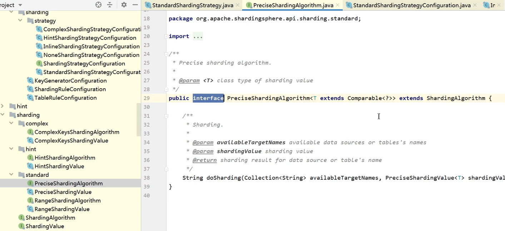

- **PreciseShardingAlgorithm(精确分片算法)**

  用于处理使用单一键作为分片键的=与IN进行分片的场景。

- **RangeShardingAlgorithm(范围分片算法)**

  用于处理使用单一键作为分片键的BETWEEN AND、>、<、>=、<=进行分片的场景。

- **ComplexKeysShardingAlgorithm(复合分片算法)**

  使用多键作为分片键进行分片的场景，多个分片键的逻辑较复杂，需要应用开发者自行处理其中的复杂度

- **HintShardingAlgorithm(Hint分片算法)**

  由其他外置条件决定的场景，可使用SQL Hint灵活的注入分片字段。例：内部系统，按照员工登录主键分库，而数据库中并无此字段。SQL Hint支持通过Java API和SQL注释两种方式使用

##### 1.3 分片策略

分片策略包含分片键和分片算法，真正可用于分片操作的是分片键 + 分片算法，也就是分片策略。目前提供5种分片策略。

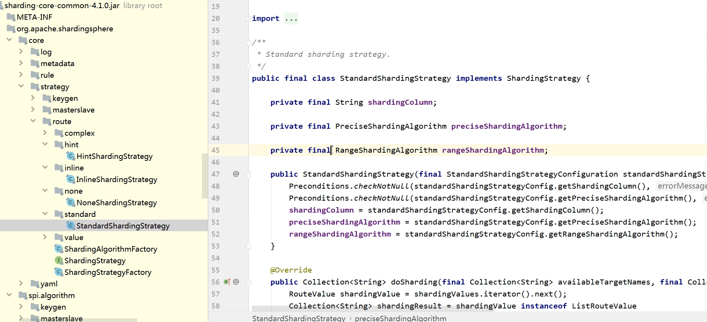

- **StandardShardingStrategy(标准分片策略)**

  只支持单分片键，提供对SQL语句中的=, >, <, >=, <=, IN和BETWEEN AND的分片操作支持。

  提供PreciseShardingAlgorithm和RangeShardingAlgorithm两个分片算法。

  PreciseShardingAlgorithm是必选的，RangeShardingAlgorithm是可选的。但是SQL中使用了范围操作，如果不配置RangeShardingAlgorithm会采用全库路由扫描，效率低。

- ComplexShardingStrategy(复合分片策略)

  支持多分片键。提供对SQL语句中的=, >, <, >=, <=, IN和BETWEEN AND的分片操作支持。由于多分片键之间的关系复杂，因此并未进行过多的封装，而是直接将分片键值组合以及分片操作符透传至分片算法，完全由应用开发者实现，提供最大的灵活度

- **InlineShardingStrategy(行表达式分片策略)**

  只支持单分片键。使用Groovy的表达式，提供对SQL语句中的=和IN的分片操作支持，对于简单的分片算法，可以通过简单的配置使用，从而避免繁琐的Java代码开发。如: t_user_$->{u_id % 8} 表示t_user表根据u_id模8，而分成8张表，表名称为t_user_0到t_user_7。

- **HintShardingStrategy(Hint分片策略)**

  通过Hint指定分片值而非从SQL中提取分片值的方式进行分片的策略。

- NoneShardingStrategy(不分片策略)


##### 1.4 分片流程

ShardingSphere 3个产品的数据分片功能主要流程是完全一致的，如下图所示。

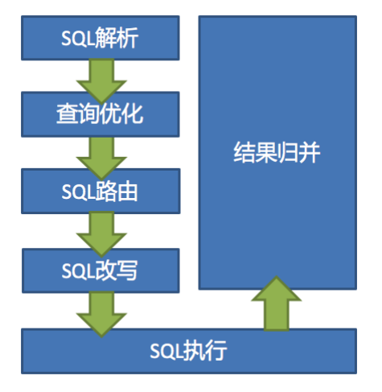

- **SQL解析**

  Sharding-JDBC采用不同的解析器对SQL进行解析，解析器类型如下

  - MySQL解析器（支持MariaDB）
  - Oracle解析器
  - SQLServer解析器
  - PostgreSQL解析器
  - 默认解析器（采用SQL92标准）

- **查询优化**

  负责合并和优化分片条件，如OR优化为UNION ALL等。

- **SQL路由**

  根据解析上下文匹配用户配置的分片策略，并生成路由路径。

- **SQL改写**

  将SQL改写为在真实数据库中可以正确执行的语句。

- SQL执行

  通过多线程执行器异步执行SQL

- 结果归并

  将多个执行结果集归并以便于通过统一的JDBC接口输出。包括流式归并、内存归并和使用装饰者模式的追加归并这几种方式


##### 1.5 分片SQL规范

**支持项**

- 路由至单数据节点时，目前MySQL数据库100%全兼容，其他数据库完善中。

- 支持分页子查询

  ```sql
  SELECT COUNT(*) FROM (SELECT * FROM b_order o);
  ```

  

**不支持项**

- 路由至多数据节点，不支持CASE WHEN、HAVING、UNION (ALL)

- 关联查询 不支持跨库关联

- 除了分页子查询，不支持其他子查询，无论嵌套多少层，只能解析至第一个包含数据表的子查询，一旦在下层嵌套中再次找到包含数据表的子查询将直接抛出解析异常

  ```sql
  SELECT COUNT(*) FROM (SELECT * FROM b_order o WHERE o.id IN (SELECT id FROM b_order WHERE status = ?))
  ```

- 由于归并限制，子查询中不支持聚合函数

- 不支持包含schema的SQL

- 分片键不要使用表达式或函数，否则无法获得真正的路由值，而将采用全路由的形式获取结果

- VALUES语句不支持运算 表达式

  ```sql
  INSERT INTO tbl_name (col1, col2, …) VALUES(1+2, ?, …) 
  ```

- 不支持同时使用普通聚合函数 和DISTINCT

  ```sql
  SELECT SUM(DISTINCT col1), SUM(col1) FROM tbl_name
  ```


##### 1.6 分页查询

如果可以保证ID的连续性，通过ID进行分页是比较好的解决方案

```sql
SELECT * FROM b_order WHERE id > 1000000 AND id <= 1000010 ORDER BY id
```

或通过记录上次查询结果的最后一条记录的ID进行下一页的查询：

```sql
SELECT * FROM b_order WHERE id > 1000000 LIMIT 10
```


##### 1.7 InlineShardingStrategy（行内分片策略）

语法格式：在配置中使用 `${expression}` 或​ `$->{expression}`标识行表达式

- 表示区间

  ```
  ${begin..end}
  ```

- 表示枚举

  ```
  ${[unit1, unit2, unit_x]}
  ```

- 多个表达式笛卡尔(积)组合

  ```
  ${['online', 'offline']}_table${1..3}     ————> online_table1, online_table2, online_table3
  $->{['online', 'offline']}_table$->{1..3}  ————> offline_table1, offline_table2, offline_table3
  ```

- 均匀数据节点配置

  ```
  db0
   	├── b_order2 
   	└── b_order1 
  db1
  	├── b_order2 
  	└── b_order1
  	
  db${0..1}.b_order${1..2} 
  db$->{0..1}.b_order$->{1..2}
  ```

- 不均匀数据节点配置

  ```
  db0
  	├── b_order0 
  	└── b_order1 
  db1
  	├── b_order2 
  	├── b_order3 
  	└── b_order4
  
  db0.b_order${0..1},db1.b_order${2..4}
  ```

- 分片算法配置

  行表达式内部的表达式本质上是一段Groovy代码，可以根据分片键进行计算的方式，返回相应的真实数据源或真实表名称。

  ds0、ds1、ds2... ds9数据源使用如下分片算法配置

  ```
  ds${id % 10} 
  ds$->{id % 10}
  ```

  

##### 1.8 分布式主键生成策略

ShardingSphere提供了内置的分布式主键生成器，例如UUID、SNOWFLAKE，还抽离出分布式主键生成器的接口，方便用户自行实现自定义的自增主键生成器。

ShardingJDBC内置分布式主键生成器

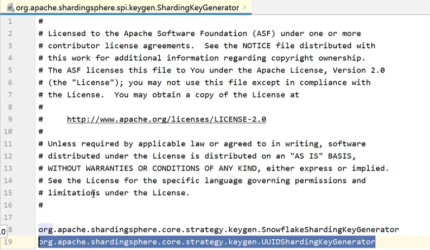

- **UUID**

- **SNOWFLAKE**

- **自定义主键生成策略**

  

  - 实现ShardingKeyGenerator接口

  - 按SPI规范配置自定义主键类

    在resources目录下新建META-INF文件夹，再新建services文件夹，然后新建文件的名字为org.apache.shardingsphere.spi.keygen.ShardingKeyGenerator，打开文件，复制自定义主键类全路径到文件中保存

  - 自定义主键类应用配置
  
    ```properties
    #对应主键字段名 
    spring.shardingsphere.sharding.tables.t_book.key-generator.column=id 
    #对应主键类getType返回内容 
    spring.shardingsphere.sharding.tables.t_book.key- generator.type=MYKEY
    ```
  
    


#### 2. 读写分离

透明化读写分离所带来的影响，让使用方尽量像使用一个数据库一样使用主从数据库集群，是ShardingSphere读写分离模块的主要设计目标。

##### 2.1 核心功能

- **可配置一主多从的读写分离，也可结合分库分表使用**

- **独立使用读写分离，支持SQL透传**。不需要SQL改写流程

- **同一线程且同一数据库连接内，保证数据一致性。即写入操作后且从库未同步完成时，同线程和连接内读操作，都将从主库读取数据。**

- 基于Hint的强制主库路由。可以强制路由走主库查询实时数据，避免主从同步数据延迟

  **使用 `hintManager.setMasterRouteOnly `设置主库路由即可**

##### 2.2 不支持项

- 主库和从库的数据同步

- 主库和从库的数据同步延迟

- 主库双写或多写

- 跨主库和从库之间的事务的数据不一致。建议在主从架构中，事务中的读写均用主库操作。

##### 2.3 读写分离

在数据量不是很多的情况下，我们可以将数据库进行读写分离，以应对高并发的需求，通过水平扩展从库，来缓解查询的压力。如下：

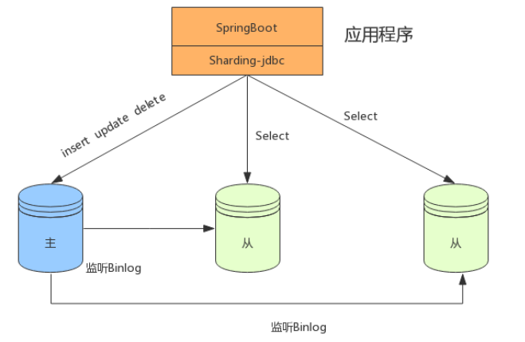

##### 2.4 读写分离+分表

在数据量达到500万的时候，这时数据量预估千万级别，我们可以将数据进行分表存储。

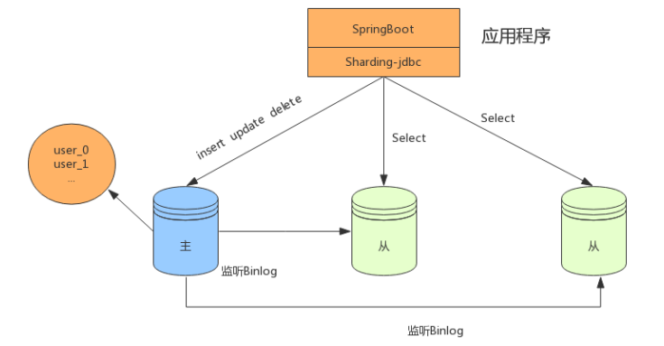

##### 2.5 读写分离+分库分表

在数据量继续扩大，这时可以考虑分库分表，将数据存储在不同数据库的不同表中，如下：

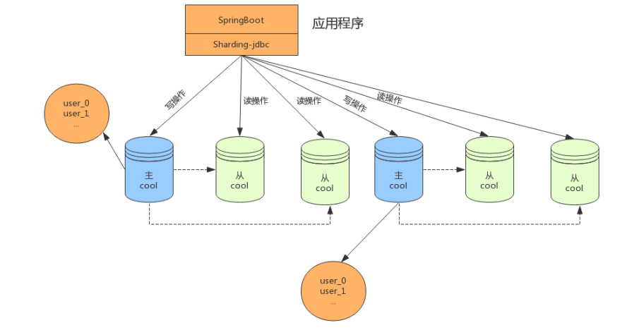


#### 3. 强制路由

在一些应用场景中，分片条件并不存在于SQL，而存在于外部业务逻辑。因此需要提供一种通过在外部业务代码中指定路由配置的一种方式，在ShardingSphere中叫做Hint。如果使用Hint指定了强制分片路由，那么SQL将会无视原有的分片逻辑，直接路由至指定的数据节点操作。HintManager主要使用ThreadLocal管理分片键信息，进行hint强制路由。在代码中向HintManager添加的配置信息只能在当前线程内有效。

HintManager主要使用ThreadLocal管理分片键信息，进行hint强制路由。在代码中向HintManager添加的配置信息只能在当前线程内有效。

HintShardingStrategy策略为强制路由策略，它会忽略该表已配的其他分库分表策略，而强制使用Hint策略

Hint算法需要自己实现

##### 3.1 使用场景

- 数据分片操作，如果分片键没有在SQL或数据表中，而是在业务逻辑代码中

- 读写分离操作，如果强制在主库进行某些数据操作

##### 3.2 使用方法

- 编写分库或分表路由策略，实现HintShardingAlgorithm接口

  ```java
  public class MyHintShardingAlgorithm implements HintShardingAlgorithm<Long> {
      @Override
      public Collection<String> doSharding(
              Collection<String> availableTargetNames,
              HintShardingValue<Long> shardingValue) {
          Collection<String> result = new ArrayList<>();
          for (String each : availableTargetNames){
              for (Long value : shardingValue.getValues()){
                  if(each.endsWith(String.valueOf(value % 2))){
                      result.add(each);
                  }
              }
          }
          return result;
      }
  }
  ```

- 在配置文件指定分库或分表策略

  ```properties
  #强制路由库
  #spring.shardingsphere.sharding.tables.city.database-strategy.hint.algorithm-class-name=com.lagou.hint.MyHintShardingAlgorithm
  
  #强制路由库和表 
  spring.shardingsphere.sharding.tables.b_order.database-strategy.hint.algorithm-class-name=com.lagou.hint.MyHintShardingAlgorithm
  spring.shardingsphere.sharding.tables.b_order.table-strategy.hint.algorithm-class-name=com.lagou.hint.MyHintShardingAlgorithm
  spring.shardingsphere.sharding.tables.b_order.actual-data-nodes=ds${0..1}.b_order${0..1}
  ```

- 代码中使用HintManager设置策略值

  - 分库不分表情况下，强制路由至某一个分库时，可使用`hintManager.setDatabaseShardingValue`方式添加分片，通过此方式添加分片键值后，将跳过SQL解析和改写阶段，从而提高整体执行效率。
  - 分库分表时，使用`hintManager.addDatabaseShardingValue("db",1) `和 `hintManager.addTableShardingValue("b_order",1)`

  ```java
  public void test1(){
      HintManager hintManager = HintManager.getInstance();
      hintManager.addDatabaseShardingValue("db",1);  //由于算法中匹配value%2，所以强制路由到db1
      hintManager.addTableShardingValue("b_order",1); //由于算法中匹配value%2，所以强制路由到b_order1
      //hintManager.setDatabaseShardingValue(0L); //由于算法中匹配value%2，所以强制路由到db0
      //hintManager.setDatabaseShardingValue(1L); //由于算法中匹配value%2，所以强制路由到db1
      List<City> list = cityRepository.findAll();
      list.forEach(city->{
          System.out.println(city.getId()+" "+city.getName()+" "+city.getProvince());
      });
  }
  ```


#### 4. 数据脱敏

ShardingSphere使用Encrypt-JDBC封装对 JDBC编程，自动化&透明化了数据脱敏过程，让用户无需关注数据脱敏的实现细节，像使用普通数据那样使用脱敏数据

- 在更新操作时，对SQL进行解析，并根据脱敏配置对SQL进行改写，从而实现对原文数据进行加密，并将密文数据存储到底层数据库
- 在查询数据时，它又从数据库中取出密文数据，并对其解密，最终将解密后的原始数据返回给用户

##### 4.1 内部原理

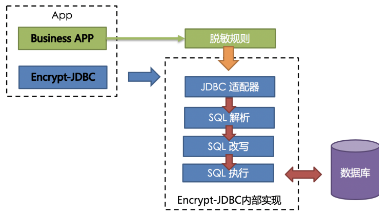

1. Encrypt-JDBC 将SQL进行拦截，并通过SQL语法解析器进行解析
2. 依据用户的脱敏规则，找出需要脱敏的字段和所使用的加解密器对目标字段进行加解密处理
3. 执行SQL


##### 4.2 脱敏规则配置

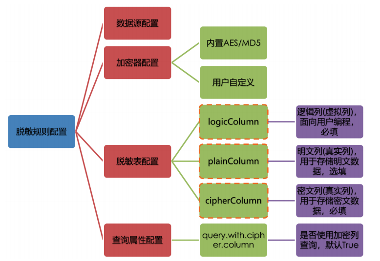

- 配置数据源

- 配置加密器

  加密策略，目前ShardingSphere内置了AES和MD5

- 配置脱敏字段

  指定存储密文的字段（cipherColumn）、存储明文的字段（plainColumn）和应用端对应的逻辑字段（logicColumn）。plainColumn为非必选配置

- 配置脱敏字段

  指定是否使用密文字段查询


##### 4.3 工作流程

ShardingSphere将逻辑列与明文列和密文列进行了列名映射

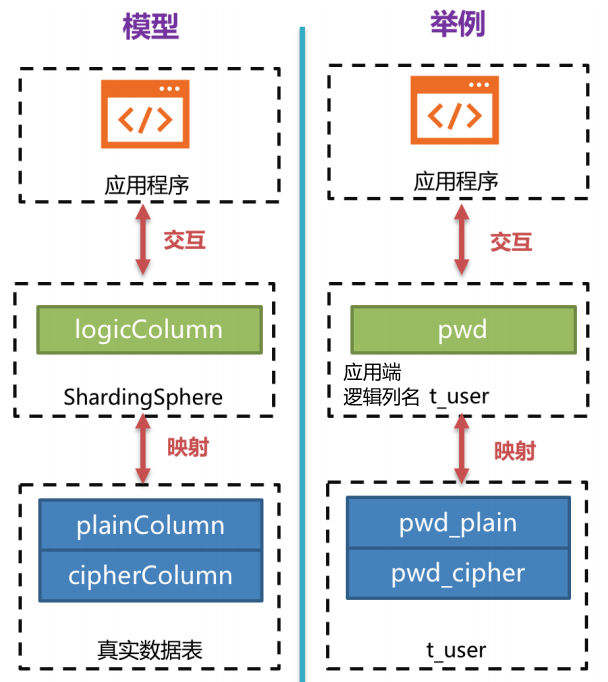

**示例**

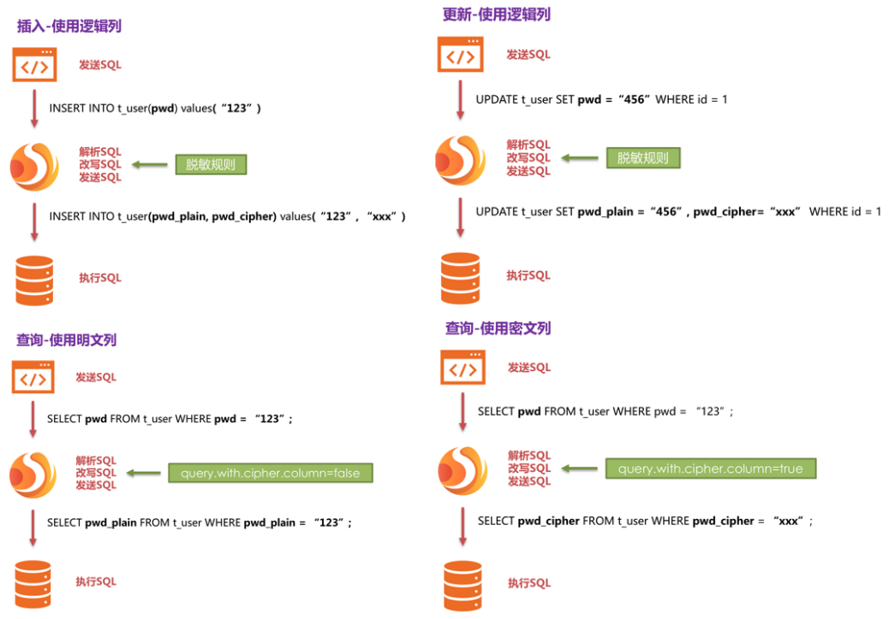


##### 4.4 自定义加密策略

ShardingSphere提供了两种加密策略用于数据脱敏，分别为 `Encryptor`接口 和 `QueryAssistedEncryptor`接口

- **Encryptor**

  内置的加密器：MD5(不可逆) 和 AES(可逆)都是基于该方案实现

  - DML操作时，Encrypt-JDBC会拦截SQL并调用加密器 `encypt()` 进行加密处理；

  - 当为查询操作时，通过 `decrypt()`进行解密处理。

  

  

- **QueryAssistedEncryptor**

  **理念：**即使是相同的敏感数据，在数据库里存储的脱敏数据也应当是不一样的。这种理念更有利于保护用户信息，防止撞库成功

  该方案并没有实现，而是提供了接口以及`` encrypt(), decrypt(), queryAssistedEncrypt()``三个方法，需用户自己实现。

  - encrypt()：设置某个变动种子，例如时间戳。原始数据+变动种子组合的内容进行加密，保证原始数据相同，但因变动种子的存在，使加密后的脱敏数据不一样。
  - decrypt()：依据之前规定的加密算法，利用种子数据进行解密。
  - queryAssistedEncrypt()：用于生成辅助查询列，用于原始数据的查询过程。


#### 5. 分片后的分布式事务

[分布式事务理论及一致性协议](../../../../../架构/分布式架构设计/分布式理论基础与一致性算法)

ShardingSphere整合了XA、Saga和Seata模式后，为分布式事务控制提供了极大的便利，我们可以在应用程序编程时，采用以下统一模式进行使用。

##### 5.1 引入maven依赖

```xml
//XA模式
<dependency>
    <groupId>org.apache.shardingsphere</groupId>
    <artifactId>sharding-transaction-xa-core</artifactId>
    <version>4.0.0-RC2</version>
</dependency>
//Saga模式
<dependency>
    <groupId>io.shardingsphere</groupId>
    <artifactId>sharding-transaction-base-saga</artifactId>
    <version>4.0.0-RC2</version>
</dependency>
//Seata模式 
<dependency> 
    <groupId>org.apache.shardingsphere</groupId> 
    <artifactId>sharding-transaction-base-seata-at</artifactId> 
    <version>${sharding-sphere.version}</version> 
</dependency>
```


##### 5.2 启动类添加注解@EnableShardingTransaction

```java
@EnableTransactionManagement
@SpringBootApplication
public class xxx{
    ...
}
```


##### 5.3 分片事务方法添加注解

- 强一致事务
  - 事务方法添加注解@ShardingTransactionType(TransactionType.XA)
  - 事务方法第一行代码设置事务TransactionTypeHolder.set(TransactionType.XA); 
- 弱事务
  - 事务方法添加注解@ShardingTransactionType(TransactionType.BASE)
  - 事务方法第一行代码设置事务TransactionTypeHolder.set(TransactionType.BASE);

```java
import com.tangdi.RunBoot;
import com.tangdi.entity.Position;
import com.tangdi.entity.PositionDetail;
import com.tangdi.repository.PositionDetailRepository;
import com.tangdi.repository.PositionRepository;
import org.apache.shardingsphere.transaction.annotation.ShardingTransactionType;
import org.apache.shardingsphere.transaction.core.TransactionType;
import org.apache.shardingsphere.transaction.core.TransactionTypeHolder;
import org.junit.Test;
import org.junit.runner.RunWith;
import org.springframework.boot.test.context.SpringBootTest;
import org.springframework.test.context.junit4.SpringRunner;
import org.springframework.transaction.annotation.Transactional;

import javax.annotation.Resource;

@RunWith(SpringRunner.class)
@SpringBootTest(classes = RunBoot.class)
public class TestShardingTransaction {

    @Resource
    private PositionRepository positionRepository;

    @Resource
    private PositionDetailRepository positionDetailRepository;

    @Test
    @Transactional
    @ShardingTransactionType(TransactionType.XA)
    //@ShardingTransactionType(TransactionType.BASE)
    public void test1(){
        for (int i=1;i<=5;i++){
            Position position = new Position();
            position.setName("root"+i);
            position.setSalary("1000000");
            position.setCity("beijing");
            positionRepository.save(position);

            if (i==3){
                throw new RuntimeException("人为制造异常");
            }

            PositionDetail positionDetail = new PositionDetail();
            positionDetail.setPid(position.getId());
            positionDetail.setDescription("this is a root "+i);
            positionDetailRepository.save(positionDetail);
        }
    }

}
```


##### 5.4 XA模式的AT配置

ShardingSphere默认的XA事务管理器为Atomikos，通过在项目的classpath中添加jta.properties来定制化Atomikos配置项。具体的配置规则如下：

```properties
#指定是否启动磁盘日志，默认为true。在生产环境下一定要保证为true，否则数据的完整性无法保证
com.atomikos.icatch.enable_logging=true 

#JTA/XA资源是否应该自动注册 
com.atomikos.icatch.automatic_resource_registration=true 

#JTA事务的默认超时时间，默认为10000ms 
com.atomikos.icatch.default_jta_timeout=10000 

#事务的最大超时时间，默认为300000ms。这表示事务超时时间由 UserTransaction.setTransactionTimeout()较大者决定。
#4.x版本之后，指定为0的话则表示不设置超时时间 
com.atomikos.icatch.max_timeout=300000 

#指定在两阶段提交时，是否使用不同的线程(意味着并行)。3.7版本之后默认为false，更早的版本 默认为true。如果为false，则提交将按照事务中访问资源的顺序进行。
com.atomikos.icatch.threaded_2pc=false 

#指定最多可以同时运行的事务数量，默认值为50，负数表示没有数量限制。
#在调用 UserTransaction.begin()方法时，可能会抛出一个”Max number of active transactions reached”异常信息，表示超出最大事务数限制 
com.atomikos.icatch.max_actives=50 

#是否支持subtransaction，默认为true 
com.atomikos.icatch.allow_subtransactions=true 

#指定在可能的情况下，否应该join 子事务(subtransactions)，默认值为true。
#如果设置为 false，对于有关联的不同subtransactions，不会调用XAResource.start(TM_JOIN) 
com.atomikos.icatch.serial_jta_transactions=true 

#指定JVM关闭时是否强制(force)关闭事务管理器，默认为false 
com.atomikos.icatch.force_shutdown_on_vm_exit=false 

#在正常关闭(no-force)的情况下，应该等待事务执行完成的时间，默认为Long.MAX_VALUE 
com.atomikos.icatch.default_max_wait_time_on_shutdown=9223372036854775807 

#########################日志记录配置#########################
#事务日志目录，默认为./
com.atomikos.icatch.log_base_dir=./ 

#事务日志文件前缀，默认为tmlog。事务日志存储在文件中，文件名包含一个数字后缀，日志文件以.log为扩展名，如tmlog1.log。
#遇到checkpoint时，新的事务日志文件会被创建，数字增加。 
com.atomikos.icatch.log_base_name=tmlog 

#指定两次checkpoint的时间间隔，默认为500 
com.atomikos.icatch.checkpoint_interval=500 

#########################日志恢复配置#########################
#指定在多长时间后可以清空无法恢复的事务日志(orphaned)，默认86400000ms
com.atomikos.icatch.forget_orphaned_log_entries_delay=86400000

#指定两次恢复扫描之间的延迟时间。默认值为与com.atomikos.icatch.default_jta_timeout 相同
com.atomikos.icatch.recovery_delay=${com.atomikos.icatch.default_jta_timeout}

#提交失败时，再抛出一个异常之前，最多可以重试几次，默认值为5
com.atomikos.icatch.oltp_max_retries=5

#提交失败时，每次重试的时间间隔，默认10000ms 
com.atomikos.icatch.oltp_retry_interval=10000
```


##### 5.5 Saga模式配置

Saga可以通过在项目的classpath中添加 saga.properties 来定制化Saga事务的配置项。配置项的属性及说明如下：

| 属性名称                                            | 默认值      | 说明                                 |
| --------------------------------------------------- | ----------- | ------------------------------------ |
| saga.actuator.executor.size                         | 5           | 使用的线程池大小                     |
| saga.actuator.transaction.max.retries               | 5           | 失败SQL的最大重试次数                |
| saga.actuator.compensation.max.retries              | 5           | 失败SQL的最大尝试补偿次数            |
| saga.actuator.transaction.retry.delay.milliseconds  | 5000        | 失败SQL的重试间隔，单位毫秒          |
| saga.actuator.compensation.retry.delay.milliseconds | 3000        | 失败SQL的补偿间隔，单位毫秒          |
| saga.persistence.enabled                            | false       | 是否对日志进行持久化                 |
| saga.persistence.ds.url                             | 无          | 事务日志数据库JDBC连接               |
| saga.persistence.ds.username                        | 无          | 事务日志数据库用户名                 |
| saga.persistence.ds.password                        | 无          | 事务日志数据库密码                   |
| saga.persistence.ds.max.pool.size                   | 50          | 事务日志连接池最大连接数             |
| saga.persistence.ds.min.pool.size                   | 1           | 事务日志连接池最小连接数             |
| saga.persistence.ds.max.life.time.milliseconds      | 0（无限制） | 事务日志连接池最大存活时间，单位毫秒 |
| saga.persistence.ds.idle.timeout.milliseconds       | 60 * 1000   | 事务日志连接池空闲回收时间，单位毫秒 |
| saga.persistence.ds.connection.timeout.milliseconds | 30 * 1000   | 事务日志连接池超时时间，单位毫秒     |


#### 6. SPI加载

在Apache ShardingSphere中，很多功能实现类的加载方式是通过SPI注入的方式完成的。ServiceProvider Interface （SPI）是Java提供的一套被第三方实现或扩展的API，它可以用于实现框架扩展或组件替换。

##### 6.1 SQL解析

主要接口是 **`SQLParserEntry`**，其内置实现类有**`MySQLParserEntry`**，**`PostgreSQLParserEntry`**，**`SQLServerParserEntry `**和 **`OracleParserEntry`**。

##### 6.2 数据库协议

用于 Sharding-Proxy 解析与适配访问数据库的协议

主要接口是**`DatabaseProtocolFrontendEngine`**，其内置实现类有**`MySQLProtocolFrontendEngine`**和**`PostgreSQLProtocolFrontendEngine`**。

##### 6.3 数据脱敏

主要接口有两个是**`Encryptor`**和**`QueryAssistedEncryptor`**，其中**`Encryptor`**的内置实现类有 **`AESEncryptor`**和**`MD5Encryptor`**。

##### 6.4 分布式主键

主要接口为**`ShardingKeyGenerator`**，其内置实现类有**`UUIDShardingKeyGenerator`**和**`SnowflflakeShardingKeyGenerator`**。

##### 6.5 分布式事务

分布式事务的接口主要用于规定如何将分布式事务适配为本地事务接口。

主要接口为**`ShardingTransactionManager`**，其内置实现类有**`XAShardingTransactionManager`**和**`SeataATShardingTransactionManager`**。

##### 6.6 XA事务管理器

XA事务管理器的接口主要用于规定如何将XA事务的实现者适配为统一的XA事务接口。

主要接口为**`XATransactionManager`**，其内置实现类有**`AtomikosTransactionManager`**，**`NarayanaXATransactionManager`**和**`BitronixXATransactionManager`**。

##### 6.7 注册中心

注册中心的接口主要用于规定注册中心初始化、存取数据、更新数据、监控等行为。

主要接口为**`RegistryCenter`**，其内置实现类有**`Zookeeper`**。


#### 7. 编排治理

编排治理模块提供配置中心/注册中心（以及规划中的元数据中心）、配置动态化、数据库熔断禁用、调用链路等治理能力。

##### 7.1 配置中心

- 配置中心数据结构

  配置中心在定义的命名空间的confifig下，以YAML格式存储，包括数据源，数据分片，读写分离

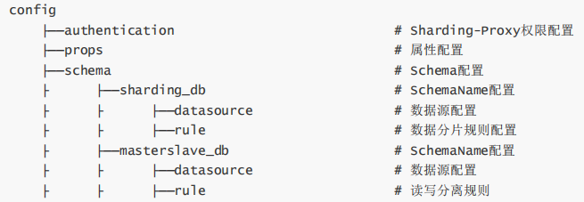

- config/authentication

  ```yaml
  password: root 
  username: root
  ```

- config/sharding/props

  ```yaml
  sql.show: true
  ```

- config/schema/schemeName/datasource

  多个数据库连接池的集合，不同数据库连接池属性自适配（例如：DBCP，C3P0，Druid,HikariCP）。

  ```yaml
  ds_0:
    dataSourceClassName: com.zaxxer.hikari.HikariDataSource
      properties:
        url: jdbc:mysql://127.0.0.1:3306/demo1?serverTimezone=UTC&useSSL=false
        password: root 
        username: root 
        maxPoolSize: 50 
        minPoolSize: 1
  ds_1:
    dataSourceClassName: com.zaxxer.hikari.HikariDataSource
      properties:
        url: jdbc:mysql://127.0.0.1:3306/demo2?serverTimezone=UTC&useSSL=false
        password: root 
        username: root 
        maxPoolSize: 50 
        minPoolSize: 1
  ```

- config/schema/sharding_db/rule

  ```yaml
  tables: 
    b_order: 
      actualDataNodes: ds_${0..1}.b_order_${0..1} 
      databaseStrategy:
        inline:
          shardingColumn: user_id 
          algorithmExpression: ds_${user_id % 2}
      keyGenerator: 
        column: order_id
      logicTable: b_order
      tableStrategy: 
        inline: 
          shardingColumn: order_id 
          algorithmExpression: b_order_${order_id % 2}
    b_order_item: 
      actualDataNodes: ds_${0..1}.b_order_item_${0..1} 
      databaseStrategy:
        inline: 
          shardingColumn: user_id 
          algorithmExpression: ds_${user_id % 2}
      keyGenerator: 
        column: order_item_id
      logicTable: b_order_item
      tableStrategy: 
        inline: 
          shardingColumn: order_id 
          algorithmExpression: b_order_item_${order_id % 2}
  ```

- config/schema/masterslave/rule读写分离独立使用时使用该配置

  ```yaml
  name: ds_ms 
  masterDataSourceName: master 
  slaveDataSourceNames: 
    - ds_slave0 
    - ds_slave1 
  loadBalanceAlgorithmType: ROUND_ROBIN
  ```

- 动态生效

  在注册中心上修改、删除、新增相关配置，会动态推送到生产环境并立即生效

  

##### 7.2 注册中心

注册中心存放运行时的动态/临时状态数据，比如可用的proxy的实例，需要禁用或熔断的datasource实例。通过注册中心，可以提供熔断数据库访问程序对数据库的访问和禁用从库的访问的编排治理能力。治理仍然有大量未完成的功能

- 注册中心数据结构

  注册中心在定义的命名空间的state下，创建数据库访问对象运行节点，用于区分不同数据库访问实例。包括instances和datasources节点。

  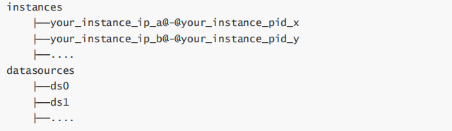

- state/instances

  运行实例标识由运行服务器的IP地址和PID构成。运行实例标识均为临时节点，当实例上线时注册，下线时自动清理。注册中心监控这些节点的变化来治理运行中实例对数据库的访问等。

- state/datasources

  可以控制读写分离，可动态添加删除以及禁用

- 熔断实例

  可在IP地址@-@PID节点写入DISABLED（忽略大小写）表示禁用该实例，删除DISABLED表示启用。

  Zookeeper命令如下：

  ```shell
  [zk: localhost:2181(CONNECTED) 0] set /your_zk_namespace/your_app_name/state/instances/your_instance_ip_a@-@your_instance_pid_x DISABLED
  ```

  

- 禁用从库

  在读写分离场景下，可在数据源名称子节点中写入DISABLED表示禁用从库数据源，删除DISABLED或节点表示启用。

  Zookeeper命令如下：

  ```shell
  [zk: localhost:2181(CONNECTED) 0] set /your_zk_namespace/your_app_name/state/datasources/your_slave_datasource_nam e DISABLED
  ```

  

##### 7.3 支持的配置中心和注册中心

数据库治理模块**使用SPI方式载入数据到配置中心/注册中心**，进行**实例熔断**和**数据库禁用**。 目前，ShardingSphere内部支持**Zookeeper**和**Etcd**这种常用的配置中心/注册中心。 此外，您可以使用其他第三方配置中心/注册中心，例如**Apollo**、**Nacos**等，**并通过SPI的方式注入到ShardingSphere**，从而使用该配置中心/注册中心，实现数据库治理功能。

##### 7.4 APM（应用性能监控）

ShardingSphere仅负责产生具有价值的数据，并通过标准协议递交至相关系统。ShardingSphere可以通过两种方式对接应用性能监控系统。

- OpenTracing API发送性能追踪数据

  面向OpenTracing协议的APM产品都可以和ShardingSphere自动对接，比如SkyWalking，Zipkin和Jaeger。

- SkyWalking的自动探针

   ShardingSphere团队与SkyWalking团队共同合作，在SkyWalking中实现了ShardingSphere自动探针，可以将相关的应用性能数据自动发送到SkyWalking中。

