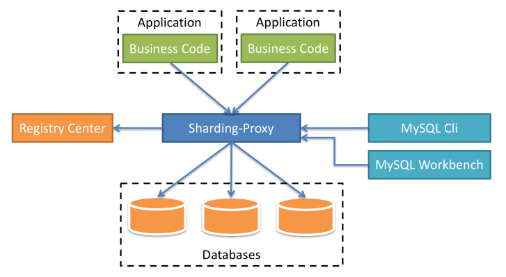

[toc]

### 1. 简介

Sharding-Proxy是ShardingSphere的第二个产品，定位为透明化的数据库代理端，提供封装了数据库二进制协议的服务端版本，用于完成对异构语言的支持。

 **目前只提供MySQL版本**，兼容任意MySQL协议的访问客户端（MySQL Command Client, MySQL Workbench、Navicat）操作数据，对DBA更加友好。

- 向应用程序完全透明，可直接当做MySQL使用
- 适用于任何兼容MySQL协议的客户端
- 支持任意异构语言
- DBA友好，分库分表场景下通过ShardingProxy代理并聚合所有分库分表的数据，方便数据维护和管理

### 2. 使用

- 下载Sharding-Proxy的最新发行版；

- 解压缩后**修改conf/server.yaml和以config-前缀开头的文件**，进行分片规则、读写分离规则配置

  编辑 **`%SHARDING_PROXY_HOME%\conf\config-xxx.yaml`**

  编辑 **`%SHARDING_PROXY_HOME%\conf\server.yaml`**

- 引入依赖jar

  如果后端连接MySQL数据库，需要下载MySQL驱动， 解压后将mysql-connector-java-5.1.48.jar拷贝到${sharding-proxy}\lib目录。如果后端连接PostgreSQL数据库，不需要引入额外依赖

- Linux操作系统请运行bin/start.sh，Windows操作系统请运行bin/start.bat启动Sharding-Proxy。

  使用默认配置启动： **`${sharding-proxy}\bin\start.sh`**

  配置端口启动： **`${sharding-proxy}\bin\start.sh ${port}`**

- 使用客户端工具连接。如: **`mysql -h 127.0.0.1 -P 3307 -u root -p root`**

若想使用Sharding-Proxy的数据库治理功能，则需要使用注册中心实现实例熔断和从库禁用功能。Sharding-Proxy默认提供了Zookeeper的注册中心解决方案。只需按照配置规则进行注册中心的配置，即可使用。

### 3. 注意事项

- Sharding-Proxy 默认不支持hint，如需支持，请在conf/server.yaml中，将props的属性proxy.hint.enabled设置为true。在Sharding-Proxy中，HintShardingAlgorithm的泛型只能是String类型。

- Sharding-Proxy默认使用3307端口，可以通过启动脚本追加参数作为启动端口号。如:bin/start.sh 3308
- Sharding-Proxy使用conf/server.yaml配置注册中心、认证信息以及公用属性。
- Sharding-Proxy支持多逻辑数据源，每个以"config-"做前缀命名yaml配置文件，即为一个逻辑数据源。