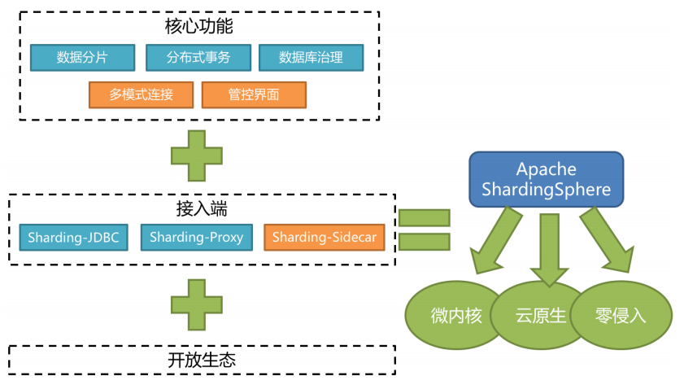
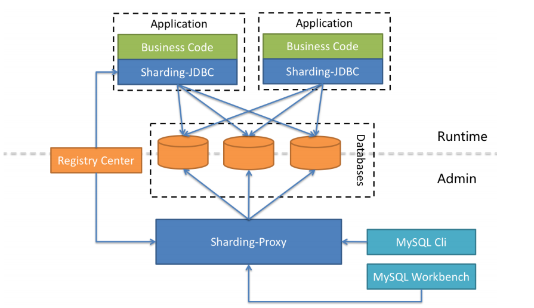
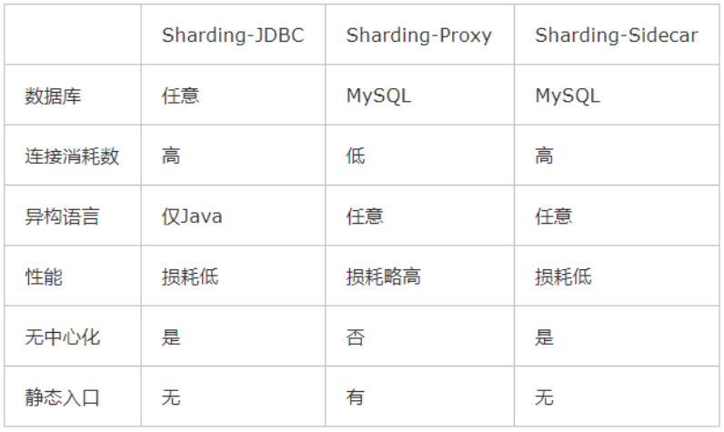

[toc]

### 一、ShardingSphere简介

Apache ShardingSphere是一款**开源的分布式数据库中间件**组成的生态圈。它由**Sharding-JDBC**、**Sharding-Proxy**和**Sharding-Sidecar**（规划中）这3款相互独立的产品组成。 他们均**提供标准化的数据分片**、**分布式事务**和**数据库治理**功能，可适用于如Java同构、异构语言、容器、云原生等各种多样化的应用场景

#### 1. 组成

- **Sharding-JDBC**

  被定位为轻量级Java框架，在Java的JDBC层提供的额外服务，以jar包形式使用

- **Sharding-Proxy**

  被定位为透明化的数据库代理端，提供封装了数据库二进制协议的服务端版本，用于完成对异构语言的支持

- **Sharding-Sidecar**

  被定位为Kubernetes或Mesos的云原生数据库代理，以DaemonSet的形式代理所有对数据库的访问

#### 2. 职能

Sharding-JDBC：作为JDBC中间件接入应用端，负责数据分片及路由

Sharding-Proxy：作为代理中间件接入服务端，方便数据库可视化工具维护及管理

#### 3. 技术支持

#### 4. 下载

ShardingSphere安装包下载：https://shardingsphere.apache.org/document/current/cn/downloads/

使用Git下载工程：git clone https://github.com/apache/incubator-shardingsphere.git