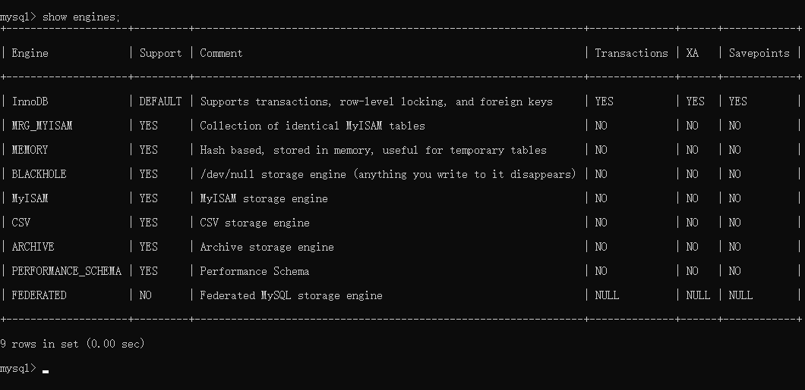

[toc]

## 一、MySQL 存储引擎简介

### 1. 定义

存储引擎位于MySQL 内部结构的第三层，**负责数据的存储与提取**，**与下层的文件系统层交互**。

存储引擎是根据文件系统层的抽象接口定制的一种文件访问机制。

### 2. Mysql 中存储引擎的种类

使用 **`show engines`** 命令，就可以查看当前数据库支持的引擎信息。

- InnoDB：**支持事务**（提交，回滚和崩溃恢复能力，事务安全），**==MySQL5.5及以后为默认引擎==**

- MyISAM：**不支持事务和外键**，访问速度快

- Memory：**利用内存创建表**，访问速度非常快，因为数据在内存，而且**默认使用Hash索引**，但是一旦关闭，数据就会丢失

- Archive：**归档类型引擎**，仅能支持insert和select语句

- CSV：以CSV文件进行数据存储，由于文件限制，**所有列必须强制指定not null**，另外CSV引擎也**不支持索引和分区**，**适合做数据交换的中间表**

- BlackHole: **黑洞**，相当于dev/null，**所有插入数据都不会保存**，**会写入binary日志**

- Federated：可以访问远端MySQL数据库中的表。一个本地表，不保存数据，访问远程表内容。

- MRG_MyISAM：一组MyISAM表的组合，这些MyISAM表必须结构相同，Merge表本身没有数据，对Merge操作可以对一组MyISAM表进行操作。

### 3. InnoDB与MyISAM的对比

#### 3.1 事务和外键

- InnoDB **==支持事务和外键==**，**==通过undo log实现事务回滚==**，适合大量新增和修改操作
- MyISAM **==不支持事务和外键==**，提供**==高速存储和检索==**，适合大量查询操作

#### 3.2 锁机制

- InnoDB **==支持行锁==**，写事务锁定行记录，**==通过索引实现==**
- MyISAM **==支持表锁==**，写事务锁定整张表

#### 3.3 索引结构

- InnoDB 采用**==聚簇索引==**，**==索引和数据==**（记录、行）**==存储在一起==**，**==在ibd文件中==**
- MyISAM 采用**==非聚簇索引==**，索引和数据**==分开存储==**，分别是  **==MYI文件==**  和  **==MYD文件==**

#### 2.4 并发处理能力

- InnoDB 读写阻塞与隔离级别有关，可以采用MVCC（多版本并发控制）来支持高并发

- MyISAM 使用表锁，导致写操作并发能力低，读操作不阻塞，读写阻塞

#### 3.5 存储文件

- InnoDB 表对应两个文件，一个.frm表结构文件，一个.ibd数据文件。**==InnoDB表最大支持64TB==**；

- MyISAM 表对应三个文件，一个.frm表结构文件，一个MYD表数据文件，一个.MYI索引文件。MyISAM**==默认限制是256TB==**。

#### 3.6 崩溃自动恢复

- InnoDB **==支持崩溃自动恢复==**

  原理：在事务提交后生成 **==redo log日志==**，**==保存最近提交的记录==**，当事务提交后系统崩溃，重启后InnoDB 会从 redo log日志中同步最新的数据。

- MyISAM **==不支持崩溃自动恢复==**

#### 3.7 适用场景

- InnoDB

  需要支持事务

  需要支持高并发

  数据更新频繁

  需要支持缓存，减少磁盘IO

- MyISAM

  不需要支持事务

  不需要支持高并发

  数据不常更新，追求快速检索

## 二、InnoDB存储结构

从MySQL 5.5版本开始默认使用InnoDB作为引擎

它==擅长处理事务==，==具有自动崩溃恢复的特性==，在日常开发中使用非常广泛

下面是官方的InnoDB引擎架构图，主要分为 **==内存结构==**和==**磁盘结构**==两大部分

### 内存结构

InnoDB 的内存结构组成：**Buffer Pool**、**Change Buffer**、**Log Buffer**、**Adaptive Hash Index**

#### 1. Buffer Pool（缓冲池，简称BP）

##### 1.1 组成

- 由**==多个 Buffer Pool 实例==**组成
- **==每个Buffer Pool有多个 Chunk块==**
- **==每个 Chunk 块有多个Page页==**，默认**==有 512 Page页==**
- 每个**==Page页 缓存索引和数据==**，默认**==大小16KB==**

##### 1.2 Page页的状态

- **==free page==** ： 空闲page，未被使用

- **==clean page==**：被使用page，数据没有被修改过

- **==dirty page==**：脏页，被使用page，数据被修改过，页中数据和磁盘的数据产生了不一致

##### 1.3 Page页的管理

Buffer Pool的底层采用 **三种链表管理Page页**，分别是以下三种：

- **==free list==** ：表示空闲缓冲区，**管理free page**
- **==flush list==**：表示需要刷新到磁盘的缓冲区，**管理dirty page**，内部 page按修改时间排序。脏页即存在于flush链表，也在LRU链表中，但是两种互不影响，LRU链表负责管理page的可用性和释放，而**flush链表负责管理脏页的刷盘操作**。
- **==lru list==**：表示正在使用的缓冲区，**管理clean page和dirty page**，缓冲区**以midpoint为基点**，前面链表称为**new列表区**，**存放经常访问的数据**，占**63%**；后面的链表称为**old列表区**，**存放使用较少数据**，占**37%**。

##### 1.4 lru list采用的改进型LRU淘汰算法

**==链表分为new和old两个部分==**，加入元素时并不是从表头插入，而是**==从中间midpoint位置插入==**，如果**==数据被访问==**，对应的 **==page页 就会向new列表头部移动==**，如果数据没有被访问，会逐步向old尾部移动，等待淘汰。

每当有**==新的数据读取到 buffer pool时==**，InnoDb引擎会**==判断是否有空闲page页==**，如果有就**==数据存入该free page并且该page从free list列表删除，放入到LRU列表中==**。没有空闲页，就会**==根据LRU算法淘汰LRU链表末尾的page页==**，**==将内存空间释放分配给新的页==**。

##### 1.5 Buffer Pool配置参数

- **`show variables like '%innodb_page_size%'; //查看page页大小`**

- **`show variables like '%innodb_old%'; //查看lru list中old列表参数`**

- **`show variables like '%innodb_buffer%'; //查看buffer pool参数`**

**建议：将innodb_buffer_pool_size设置为总内存大小的60%-80%，**

innodb_buffer_pool_instances可以设置为多个，这样可以避免缓存争夺。

#### 2. Change Buffer（写缓冲区，简称CB）

##### 2.1 作用

避免每次 DML操作都与磁盘进行IO，减少IO次数

在进行 **==DML操作==**时

- 如果BP有其相应的缓冲数据，则**==直接在BP中变更数据==**，后续会有同步至磁盘的机制

- 如果BP没有其相应的缓冲数据，并不会立刻将磁盘页加载到缓冲池，而是**==将DML存入Change Buffer中==**，等**==未来查询该条数据时==**，**==从磁盘读取数据与CB中的DML合并==**，将最终结果**==存入BP==**并返回给查询执行引擎

##### 2.2 Change Buffer配置参数

**==ChangeBuffer占用BufferPool空间==**，默认占**==25%==**，最大允许占50%

可以根据读写业务量来进行调整。参数**``innodb_change_buffffer_max_size;``**

##### 2.3 限制

若 **==DML操作涉及到唯一性索引的约束==**，则需要进行**==唯一性校验==**，**==因此不会走CB==**，**==而是直接查询磁盘==**，进行一次磁盘IO。将查询**==结果存入BP==**，直接**==在BP中修改数据==**。

#### 3. Log Buffer

#### 4. Adaptive Hash Index（自适应哈希索引）

用于**==优化对BP数据的查询==**。InnoDB存储引擎会监控对表索引的查找，如果观察到建立哈希索引可以带来速度的提升，则建立哈希索引，所以称之为自适应。InnoDB存储引擎会自动**==根据访问的频率和模式来为某些页建立哈希索引==**。

#### 5. 工作流程

##### 5.1 当新插入数据时

##### 5.2 当查询刚插入数据的时

##### 5.3当修改刚查询过的数据时

##### 5.4 当修改很久没查询的数据时

### 磁盘结构

### 四、InnoDB线程模型

### 五、InnoDB的文件

