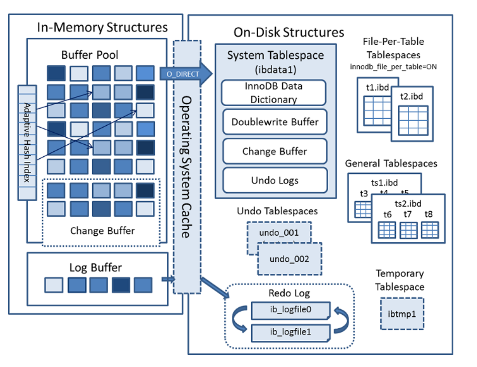
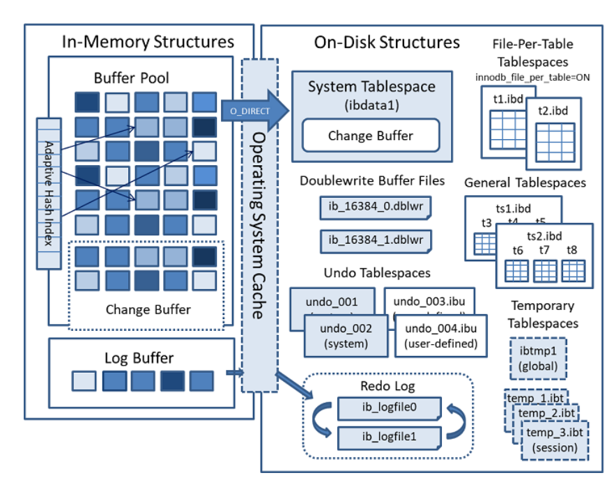
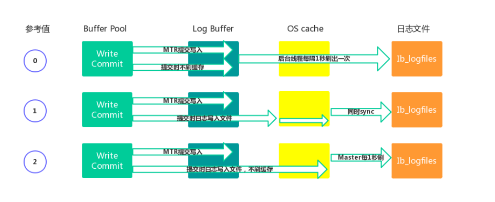
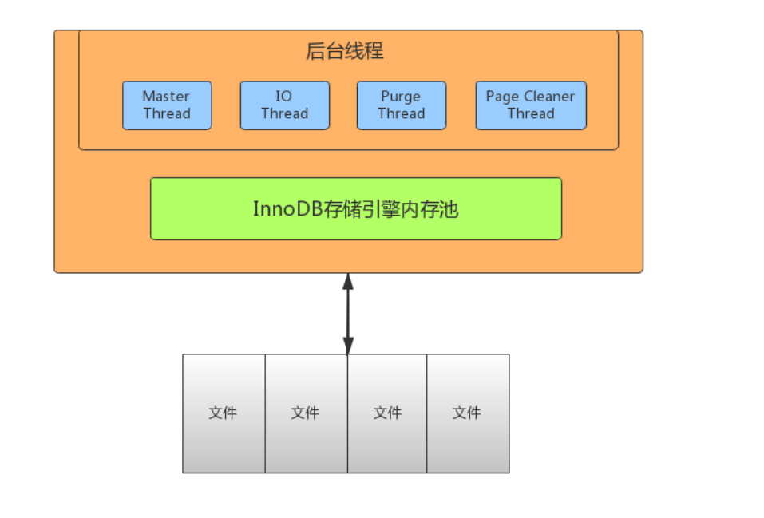

[toc]

## 一、MySQL 存储引擎简介

### 1. 定义

存储引擎位于MySQL 内部结构的第三层，**负责数据的存储与提取**，**与下层的文件系统层交互**。

存储引擎是根据文件系统层的抽象接口定制的一种文件访问机制。


### 2. Mysql 中存储引擎的种类

使用 **`show engines`** 命令，就可以查看当前数据库支持的引擎信息。


- InnoDB：**支持事务**（提交，回滚和崩溃恢复能力，事务安全），**==MySQL5.5及以后为默认引擎==**

- MyISAM：**不支持事务和外键**，访问速度快

- Memory：**利用内存创建表**，访问速度非常快，因为数据在内存，而且**默认使用Hash索引**，但是一旦关闭，数据就会丢失

- Archive：**归档类型引擎**，仅能支持insert和select语句

- CSV：以CSV文件进行数据存储，由于文件限制，**所有列必须强制指定not null**，另外CSV引擎也**不支持索引和分区**，**适合做数据交换的中间表**

- BlackHole: **黑洞**，相当于dev/null，**所有插入数据都不会保存**，**会写入binary日志**

- Federated：可以访问远端MySQL数据库中的表。一个本地表，不保存数据，访问远程表内容。

- MRG_MyISAM：一组MyISAM表的组合，这些MyISAM表必须结构相同，Merge表本身没有数据，对Merge操作可以对一组MyISAM表进行操作。


### 3. InnoDB与MyISAM的对比

#### 3.1 事务和外键

- InnoDB **==支持事务和外键==**，**==通过undo log实现事务回滚==**，适合大量新增和修改操作
- MyISAM **==不支持事务和外键==**，提供**==高速存储和检索==**，适合大量查询操作


#### 3.2 锁机制

- InnoDB **==支持行锁==**，写事务锁定行记录，**==通过索引实现==**
- MyISAM **==支持表锁==**，写事务锁定整张表


#### 3.3 索引结构

- InnoDB 采用**==聚簇索引==**，**==索引和数据==**（记录、行）**==存储在一起==**，**==在ibd文件中==**
- MyISAM 采用**==非聚簇索引==**，索引和数据**==分开存储==**，分别是  **==MYI文件==**  和  **==MYD文件==**


#### 2.4 并发处理能力

- InnoDB 读写阻塞与隔离级别有关，可以采用MVCC（多版本并发控制）来支持高并发

- MyISAM 使用表锁，导致写操作并发能力低，读操作不阻塞，读写阻塞


#### 3.5 存储文件

- InnoDB 表对应两个文件，一个.frm表结构文件，一个.ibd数据文件。**==InnoDB表最大支持64TB==**；

- MyISAM 表对应三个文件，一个.frm表结构文件，一个MYD表数据文件，一个.MYI索引文件。MyISAM**==默认限制是256TB==**。


#### 3.6 崩溃自动恢复

- InnoDB **==支持崩溃自动恢复==**

  原理：在事务提交后生成 **==redo log日志==**，**==保存最近提交的记录==**，当事务提交后系统崩溃，重启后InnoDB 会从 redo log日志中同步最新的数据。

- MyISAM **==不支持崩溃自动恢复==**


#### 3.7 适用场景

- InnoDB

  需要支持事务

  需要支持高并发

  数据更新频繁

  需要支持缓存，减少磁盘IO

- MyISAM

  不需要支持事务

  不需要支持高并发

  数据不常更新，追求快速检索


## 二、InnoDB存储结构

从MySQL 5.5版本开始默认使用InnoDB作为引擎

它==擅长处理事务==，==具有自动崩溃恢复的特性==，在日常开发中使用非常广泛

下面是官方的InnoDB引擎架构图，主要分为 **==内存结构==**和==**磁盘结构**==两大部分

**Mysql 5.6 的InnboDB结构**




**Mysql 5.7 的InnboDB结构**



### 1) InnoDB内存结构

InnoDB 的内存结构组成：**Buffer Pool**、**Change Buffer**、**Log Buffer**、**Adaptive Hash Index**

#### 1. Buffer Pool（缓冲池，简称BP）

##### 1.1 组成

- 由**==多个 Buffer Pool 实例==**组成
- **==每个Buffer Pool有多个 Chunk块==**
- **==每个 Chunk 块有多个Page页==**，默认**==有 512 Page页==**
- 每个**==Page页 缓存索引和数据==**，默认**==大小16KB==**

##### 1.2 Page页的状态

- **==free page==** ： 空闲page，未被使用

- **==clean page==**：被使用page，数据没有被修改过

- **==dirty page==**：脏页，被使用page，数据被修改过，页中数据和磁盘的数据产生了不一致

##### 1.3 Page页的管理

Buffer Pool的底层采用 **三种链表管理Page页**，分别是以下三种：

- **==free list==** ：表示空闲缓冲区，**管理free page**
- **==flush list==**：表示需要刷新到磁盘的缓冲区，**管理dirty page**，内部 page按修改时间排序。脏页即存在于flush链表，也在LRU链表中，但是两种互不影响，LRU链表负责管理page的可用性和释放，而**flush链表负责管理脏页的刷盘操作**。
- **==lru list==**：表示正在使用的缓冲区，**管理clean page和dirty page**，缓冲区**以midpoint为基点**，前面链表称为**new列表区**，**存放经常访问的数据**，占**63%**；后面的链表称为**old列表区**，**存放使用较少数据**，占**37%**。

##### 1.4 lru list采用的改进型LRU淘汰算法

**==链表分为new和old两个部分==**，加入元素时并不是从表头插入，而是**==从中间midpoint位置插入==**，如果**==数据被访问==**，对应的 **==page页 就会向new列表头部移动==**，如果数据没有被访问，会逐步向old尾部移动，等待淘汰。

每当有**==新的数据读取到 buffer pool时==**，InnoDb引擎会**==判断是否有空闲page页==**，如果有就**==数据存入该free page并且该page从free list列表删除，放入到LRU列表中==**。没有空闲页，就会**==根据LRU算法淘汰LRU链表末尾的page页==**，**==将内存空间释放分配给新的页==**。

##### 1.5 Buffer Pool配置参数

- **`show variables like '%innodb_page_size%'; //查看page页大小`**

- **`show variables like '%innodb_old%'; //查看lru list中old列表参数`**

- **`show variables like '%innodb_buffer%'; //查看buffer pool参数`**

**建议：将innodb_buffer_pool_size设置为总内存大小的60%-80%，**

innodb_buffer_pool_instances可以设置为多个，这样可以避免缓存争夺。


#### 2. Change Buffer（写缓冲区，简称CB）

##### 2.1 Change Buffer 作用

避免每次 DML操作都与磁盘进行IO，减少IO次数

在进行 **==DML操作==**时

- 如果BP有其相应的缓冲数据，则**==直接在BP中变更数据==**，后续会有同步至磁盘的机制
- 如果BP没有其相应的缓冲数据，并不会立刻将磁盘页加载到缓冲池，而是**==将DML存入Change Buffer中==**，等**==未来查询该条数据时==**，**==从磁盘读取数据与CB中的DML合并==**，将最终结果**==存入BP==**并返回给查询执行引擎
- **==合并后会清除该记录在Change Buffer 中的DML语句==**

##### 2.2 Change Buffer 配置参数

**==ChangeBuffer占用BufferPool空间==**，默认占**==25%==**，最大允许占50%

可以根据读写业务量来进行调整。参数**``innodb_change_buffffer_max_size;``**

##### 2.3 限制

若 **==DML操作涉及到唯一性索引的约束==**，则需要进行**==唯一性校验==**，**==因此不会走CB==**，**==而是直接查询磁盘==**，进行一次磁盘IO。将查询**==结果存入BP==**，直接**==在BP中修改数据==**。


#### 3. Log Buffer（日志缓冲区）

##### 3.1 Log Buffer 作用

**==DML 操作时会产生Redo和Undo日志==**，这些日志会**==先保存在Log Buffer中==**，然后日志缓冲区的内容**==定期刷新到磁盘log文件中==**。

日志缓冲区满时会自动将其刷新到磁盘，如果**==存在大事务操作时==**，**==增加日志缓冲区可以节省磁盘I/O==**。

##### 3.2 Log Buffer 配置参数

**`innodb_log_buffer_size // 日志缓冲区大小`**

**`innodb_flush_log_at_trx_commit // 参数控制日志刷新行为，默认为1`**

- 0 ： 每隔1秒写日志文件和刷盘操作（写日志文件LogBuffffer-->OS cache，刷盘OScache-->磁盘文件），最多丢失1秒数据

- 1：事务提交，立刻写日志文件和刷盘，数据不丢失，但是会频繁IO操作

- 2：事务提交，立刻写日志文件，每隔1秒钟进行刷盘操作




#### 4. Adaptive Hash Index（自适应哈希索引）

用于**==优化对BP数据的查询==**。InnoDB存储引擎会监控对表索引的查找，如果观察到建立哈希索引可以带来速度的提升，则建立哈希索引，所以称之为自适应。InnoDB存储引擎会自动**==根据访问的频率和模式来为某些页建立哈希索引==**。


#### 5. 结合场景描述流程

##### 5.1 当新插入数据时

**==DML操作==**，先到Buffer pool 查询是否有记录

- 若有记录，则**==直接在Buffer pool中修改记录==**。**==事务提交前生成 undo日志 用于异常回滚恢复==**之前的数据。**==事务提交后生成 redo日志 用于刷盘==**（同步数据到磁盘）。
- 若没有记录，**==则将DML语句存入 Change Buffer==**

##### 5.2 当查询刚插入数据的时

通过前面的场景，得知插入的 DML操作语句存在 Change Buffer中，并且此时 Buffer Pool也没有此条记录。所以**==去磁盘查询==**（磁盘没有该记录），然后到Change Buffer中合并该记录的 DML语句，将结果存到Buffer Pool中

- BP**==先从free list 中查找是否有空闲页==**，若有直接存入，**==然后将该页从free list删除==**，**==交由 LRU list管理==**
- 若没有空闲页，**==则LRU list根据LRU算法淘汰链表末尾page页==**，释放page页数据**==存入新数据==**，并将page页**==移动到midpoint位置==**

##### 5.3当修改刚查询过的数据时

DML操作，先到BP查询是否有记录，查询到记录，直接在BP中修改。事务提交前生成undo日志，提交后生成redo日志。redo日志用于同步数据到磁盘

##### 5.4 当修改很久没查询的数据时

DML操作，**==由于数据很久没被访问，LRU list根据LRU算法淘汰了该记录==**。因此page中没有此纪录。

存入Change Buffer，下次查询的时候，**==从磁盘查到结果与CB的DML合并，将结果存入Buffer Pool。==**


### 2) InnoDB 磁盘结构

InnoDB磁盘由多种表空间组成，用于存储表结构和数据，如下：

- 系统表空间（The System Tablespace）
- 独立表空间（File-Per-Table Tablespaces）
- 通用表空间（General Tablespaces）
- 撤销表空间（Undo Tablespaces）
- 临时表空间（Temporary Tablespaces）

#### 1. 系统表空间（The System Tablespace）

包含InnoDB **==数据字典==**，**==Doublewrite Buffer==**，**==Change Buffer==**，**==Undo Logs==**的存储区域。

系统表空间也默认**==包含任何用户在系统表空间创建的表数据和索引数据==**。系统表空间是一个**==共享的表空间==**因为它是被多个表共享的。该空间的数据文件通过参数 innodb_data_file_path控制，默认值是ibdata1:12M:autoextend(文件名为ibdata1、12MB、自动扩展)。


#### 2. 独立表空间（File-Per-Table Tablespaces）- 主要用的就是这种表空间

**`innodb_file_per_table`**默认开启，**==独立表空间是一个单表表空间==**，**==该表创建于自己的数据文件中==**，而非创建于系统表空间中。

当**`innodb_file_per_table`**选项开启时，表将被创建于表空间中。否则，innodb将被创建于系统表空间中。

每个表文件**==表空间由一个.ibd数据文件==**代表，该文件默认被创建于数据库目录中。表空间的表文件支持动态（dynamic）和压缩（commpressed）行格式。


#### 3. 通用表空间（General Tablespaces）

通用表空间为通过create tablespace语法创建的共享表空间。通用表空间可以创建于mysql数据目录外的其他表空间，其可以容纳多张表，且其支持所有的行格式。

```shell
CREATE TABLESPACE ts1 ADD DATAFILE ts1.ibd Engine=InnoDB; //创建表空 间ts1 
CREATE TABLE t1 (c1 INT PRIMARY KEY) TABLESPACE ts1; //将表添加到ts1 表空间
```


#### 4. 撤销表空间（Undo Tablespaces）

**==撤消日志是在事务开始之前保存的被修改数据的备份==**，用于例外情况时**==回滚事务==**。撤消日志属于**==逻辑日志==**，根据每行记录进行记录

由 **`innodb_undo_tablespaces`**  配置选项控制，默认为0。参数值为0表示使用系统表空间ibdata1。大于0表示使用undo表空间undo_001、undo_002等。

撤销表空间由一个或多个包含Undo日志文件组成。

在**==MySQL 5.7版本之前==**Undo占用的是**==System Tablespace共享区==**，

从**==5.7开始==**将Undo**==从System Tablespace分离了出来==**。


#### 5. 临时表空间（Temporary Tablespaces）

分为session temporary tablespaces 和global temporary tablespace两种。sessiontemporary tablespaces 存储的是用户创建的临时表和磁盘内部的临时表。globaltemporary tablespace储存用户临时表的回滚段（rollback segments ）。mysql服务器正常关闭或异常终止时，临时表空间将被移除，每次启动时会被重新创建。


#### 6. 重做日志(Redo Log)

MySQL以循环方式写入重做日志文件，**==记录InnoDB中所有对Buffer Pool修改的日志==**。当**==出现实例故障==**（像断电），导致数据未能更新到数据文件，则**==数据库重启时须redo==**，**==重新把数据更新到数据文件==**。读写事务在执行的过程中，都会不断的产生redo log。默认情况下，重做日志在磁盘上由两个名为ib_logfile0和ib_logfile1的文件物理表示。


#### 7. 双写缓冲区（Doublewrite Buffer）

在**==BufferPage的page页==**刷新到磁盘真正的位置前，会**==先将数据存在Doublewrite 缓冲区==**。如果在page页写入过程中出现操作系统、存储子系统或mysqld进程崩溃，InnoDB可以在崩溃恢复期间从Doublewrite 缓冲区中找到页面的一个好备份。

**==默认启用双写缓冲区==**，要禁用Doublewrite 缓冲区，可以将 **` innodb_doublewrite`**  设置为0。使用Doublewrite 缓冲区时建议将  **`innodb_flush_method`**  **==设置为O_DIRECT==**。


### 四、InnoDB线程模型

InnoDB线程模型，分为Master Thread、IO Thread、Purge Thread、Page Cleaner Thread四种模型，如下所示：



#### 1. ==IO Thread==

InnoDB中使用了大量的 AIO（Async IO）来做读写处理，这样可以极大提高数据库的性能。

IO Thread 一共有四种Thread，分别为：==**write**==，==**read**==，==**insert buffer**==和==**log thread**==，其中read thread和write thread分别为4个，因此IO Thread一共有10个。

##### 1.1 write thread：负责写操作，将Buffer Pool中的脏页刷新到磁盘。4个

##### 1.2 read thread：负责读取操作，将数据从磁盘加载到缓存page页。4个

##### 1.3 insert buffer thread：负责将Change Buffer中的内容刷新到磁盘，与磁盘的记录合并。1个

##### 1.4 log thread：负责将Log Buffer中的内容刷新到磁盘。1个


#### 2. ==Purge Thread==

**当事务提交后**，Purge Thread则会**回收内存中的 Undo日志**数据

**`show variables like '%innodb_purge_threads%';`**


#### 3. ==Page Cleaner Thread==

**`show variables like '%innodb_page_cleaners%'`**

**作用：**回收内存中undo log

**将脏页中的数据刷新到磁盘**，脏数据刷盘后相应的redo log也就可以覆盖，即可以同步数据，又能达到redo log循环使用的目的，**会调用write thread线程处理**


#### 4. ==Master Thread==

**作用：**作用是**将缓冲池中的数据异步刷新到磁盘** ，保证数据的一致性

Master thread是**InnoDB的主线程**，负责**调度其他各线程**，优先级最高。

##### 4.1 每隔 1 秒的处理

- 刷新日志缓冲区，刷到磁盘

- 合并写缓冲区数据，根据IO读写压力来决定是否操作

- 刷新脏页数据到磁盘，根据脏页比例达到75%才操作（**`innodb_max_dirty_pages_pct`**，**`innodb_io_capacity`**） 

##### 4.2 每隔 10 秒的处理

- 刷新脏页数据到磁盘

- 合并写缓冲区数据

- 刷新日志缓冲区

- **删除无用的undo页**


### 五、InnoDB的文件


