[toc]

## 一、MySQL 存储引擎简介

### 1. 定义

存储引擎位于MySQL 内部结构的第三层，**负责数据的存储与提取**，**与下层的文件系统层交互**。

存储引擎是根据文件系统层的抽象接口定制的一种文件访问机制。


### 2. Mysql 中存储引擎的种类

使用 **`show engines`** 命令，就可以查看当前数据库支持的引擎信息。

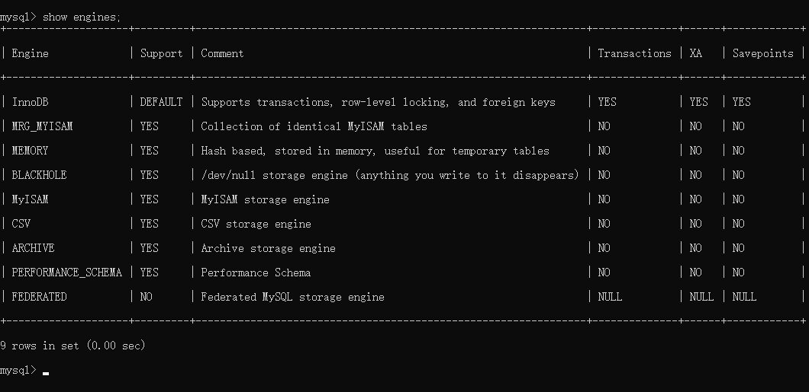

- InnoDB：**支持事务**（提交，回滚和崩溃恢复能力，事务安全），**==MySQL5.5及以后为默认引擎==**

- MyISAM：**不支持事务和外键**，访问速度快

- Memory：**利用内存创建表**，访问速度非常快，因为数据在内存，而且**默认使用Hash索引**，但是一旦关闭，数据就会丢失

- Archive：**归档类型引擎**，仅能支持insert和select语句

- CSV：以CSV文件进行数据存储，由于文件限制，**所有列必须强制指定not null**，另外CSV引擎也**不支持索引和分区**，**适合做数据交换的中间表**

- BlackHole: **黑洞**，相当于dev/null，**所有插入数据都不会保存**，**会写入binary日志**

- Federated：可以访问远端MySQL数据库中的表。一个本地表，不保存数据，访问远程表内容。

- MRG_MyISAM：一组MyISAM表的组合，这些MyISAM表必须结构相同，Merge表本身没有数据，对Merge操作可以对一组MyISAM表进行操作。


### 3. InnoDB与MyISAM的对比

#### 3.1 事务和外键

- InnoDB **==支持事务和外键==**，**==通过undo log实现事务回滚==**，适合大量新增和修改操作
- MyISAM **==不支持事务和外键==**，提供**==高速存储和检索==**，适合大量查询操作


#### 3.2 锁机制

- InnoDB **==支持行锁==**，写事务锁定行记录，**==通过索引实现==**
- MyISAM **==支持表锁==**，写事务锁定整张表


#### 3.3 索引结构

- InnoDB 采用**==聚簇索引==**，**==索引和数据==**（记录、行）**==存储在一起==**，**==在ibd文件中==**
- MyISAM 采用**==非聚簇索引==**，索引和数据**==分开存储==**，分别是  **==MYI文件==**  和  **==MYD文件==**


#### 2.4 并发处理能力

- InnoDB 读写阻塞与隔离级别有关，可以采用MVCC（多版本并发控制）来支持高并发

- MyISAM 使用表锁，导致写操作并发能力低，读操作不阻塞，读写阻塞


#### 3.5 存储文件

- InnoDB 表对应两个文件，一个.frm表结构文件，一个.ibd数据文件。**==InnoDB表最大支持64TB==**；

- MyISAM 表对应三个文件，一个.frm表结构文件，一个MYD表数据文件，一个.MYI索引文件。MyISAM**==默认限制是256TB==**。


#### 3.6 崩溃自动恢复

- InnoDB **==支持崩溃自动恢复（Crash-Safe）==**

  原理：在事务提交后生成 **==redo log日志==**，**==保存最近提交的记录==**，当事务提交后系统崩溃，重启后InnoDB 会从 redo log日志中同步最新的数据。

- MyISAM **==不支持崩溃自动恢复==**


#### 3.7 适用场景

- InnoDB

  需要支持事务

  需要支持高并发

  数据更新频繁

  需要支持缓存，减少磁盘IO

- MyISAM

  不需要支持事务

  不需要支持高并发

  数据不常更新，追求快速检索


## 二、InnoDB 存储结构

从MySQL 5.5版本开始默认使用InnoDB作为引擎

它==擅长处理事务==，==具有自动崩溃恢复的特性==，在日常开发中使用非常广泛

下面是官方的InnoDB引擎架构图，主要分为 **==内存结构==**和==**磁盘结构**==两大部分

**Mysql 5.6 的InnboDB结构**

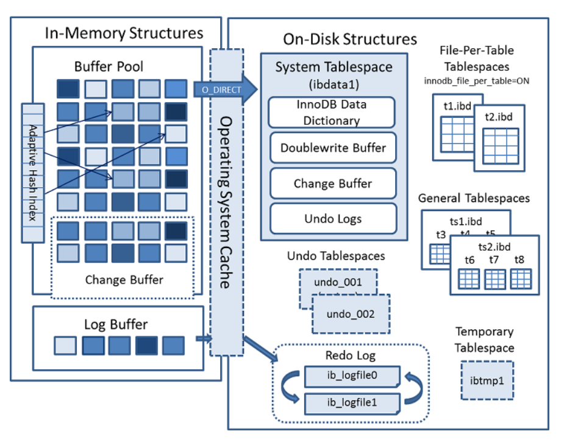


**Mysql 5.7 的InnboDB结构**

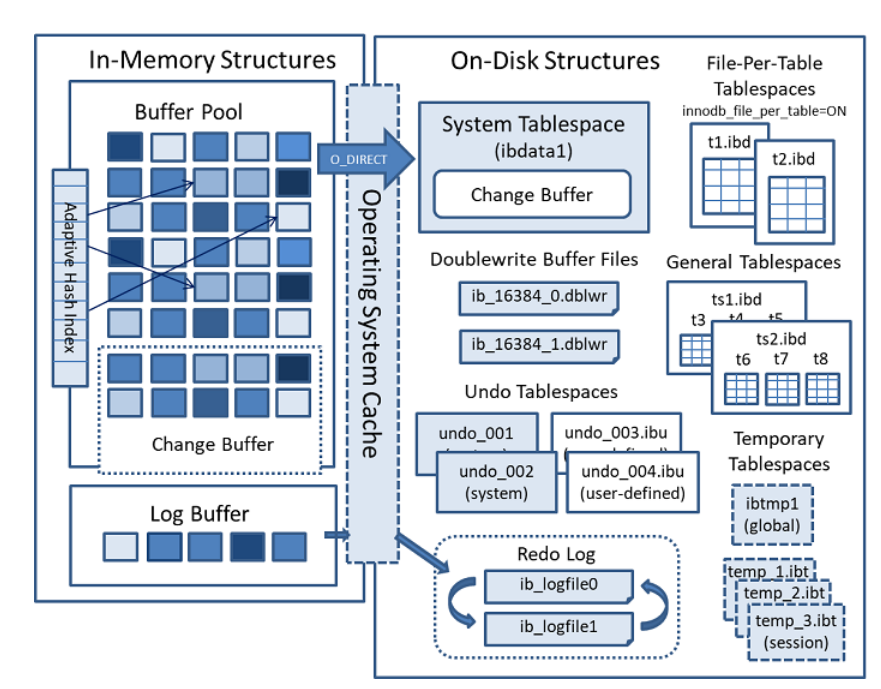

### 1) InnoDB内存结构

InnoDB 的内存结构组成：**Buffer Pool**、**Change Buffer**、**Log Buffer**、**Adaptive Hash Index**

#### 1. Buffer Pool（缓冲池，简称BP）

##### 1.1 组成

- 由**==多个 Buffer Pool 实例==**组成
- **==每个Buffer Pool有多个 Chunk块==**
- **==每个 Chunk 块有多个Page页==**，默认**==有 512 Page页==**
- 每个**==Page页 缓存索引和数据==**，默认**==大小16KB==**

##### 1.2 Page页的状态

- **==free page==** ： 空闲page，未被使用

- **==clean page==**：被使用page，数据没有被修改过

- **==dirty page==**：脏页，被使用page，数据被修改过，页中数据和磁盘的数据产生了不一致

##### 1.3 Page页的管理

Buffer Pool的底层采用 **三种链表管理Page页**，分别是以下三种：

- **==free list==** ：表示空闲缓冲区，**管理free page**
- **==flush list==**：表示需要刷新到磁盘的缓冲区，**管理dirty page**，内部 page按修改时间排序。脏页即存在于flush链表，也在LRU链表中，但是两种互不影响，LRU链表负责管理page的可用性和释放，而**flush链表负责管理脏页的刷盘操作**。
- **==lru list==**：表示正在使用的缓冲区，**管理clean page和dirty page**，缓冲区**以midpoint为基点**，前面链表称为**new列表区**，**存放经常访问的数据**，占**63%**；后面的链表称为**old列表区**，**存放使用较少数据**，占**37%**。

##### 1.4 lru list采用的改进型LRU淘汰算法

**==链表分为new和old两个部分==**，加入元素时并不是从表头插入，而是**==从中间midpoint位置插入==**，如果**==数据被访问==**，对应的 **==page页 就会向new列表头部移动==**，如果数据没有被访问，会逐步向old尾部移动，等待淘汰。

每当有**==新的数据读取到 buffer pool时==**，InnoDb引擎会**==判断是否有空闲page页==**，如果有就**==数据存入该free page并且该page从free list列表删除，放入到LRU列表中==**。没有空闲页，就会**==根据LRU算法淘汰LRU链表末尾的page页==**，**==将内存空间释放分配给新的页==**。

##### 1.5 Buffer Pool配置参数

- **`show variables like '%innodb_page_size%'; //查看page页大小`**

- **`show variables like '%innodb_old%'; //查看lru list中old列表参数`**

- **`show variables like '%innodb_buffer%'; //查看buffer pool参数`**

**建议：将innodb_buffer_pool_size设置为总内存大小的60%-80%，**

innodb_buffer_pool_instances可以设置为多个，这样可以避免缓存争夺。


#### 2. Change Buffer（写缓冲区，简称CB）

##### 2.1 Change Buffer 作用

避免每次 DML操作都与磁盘进行IO，减少IO次数

在进行 **==DML操作==**时

- 如果BP有其相应的缓冲数据，则**==直接在BP中变更数据==**，后续会有同步至磁盘的机制
- 如果BP没有其相应的缓冲数据，并不会立刻将磁盘页加载到缓冲池，而是**==将DML存入Change Buffer中==**，等**==未来查询该条数据时==**，**==从磁盘读取数据与CB中的DML合并==**，将最终结果**==存入BP==**并返回给查询执行引擎
- **==合并后会清除该记录在Change Buffer 中的DML语句==**

##### 2.2 Change Buffer 配置参数

**==ChangeBuffer占用BufferPool空间==**，默认占**==25%==**，最大允许占50%

可以根据读写业务量来进行调整。参数**``innodb_change_buffffer_max_size;``**

##### 2.3 限制

若 **==DML操作涉及到唯一性索引的约束==**，则需要进行**==唯一性校验==**，**==因此不会走CB==**，**==而是直接查询磁盘==**，进行一次磁盘IO。将查询**==结果存入BP==**，直接**==在BP中修改数据==**。


#### 3. Log Buffer（日志缓冲区）

##### 3.1 Log Buffer 作用

**==DML 操作时会产生Redo和Undo日志==**，这些日志会**==先保存在Log Buffer中==**，然后日志缓冲区的内容**==定期刷新到磁盘log文件中==**。

日志缓冲区满时会自动将其刷新到磁盘，如果**==存在大事务操作时==**，**==增加日志缓冲区可以节省磁盘I/O==**。

##### 3.2 Log Buffer 配置参数

**`innodb_log_buffer_size // 日志缓冲区大小`**

**`innodb_flush_log_at_trx_commit // 参数控制日志刷新行为，默认为1`**

- 0： 每秒提交 Redo buffffer ->OS cache -> flflush cache to disk，可能丢失一秒内的事务数据。由后台Master线程每隔 1秒执行一次操作。
- 1：每次事务提交执行 Redo Buffffer -> OS cache -> flflush cache to disk，最安全，性能最差的方式。
- 2：每次事务提交执行 Redo Buffffer -> OS cache，然后由后台Master线程再每隔1秒执行OScache -> flflush cache to disk 的操作。

一般建议选择取值2，因为 MySQL 挂了数据没有损失，整个服务器挂了才会损失1秒的事务提交数据

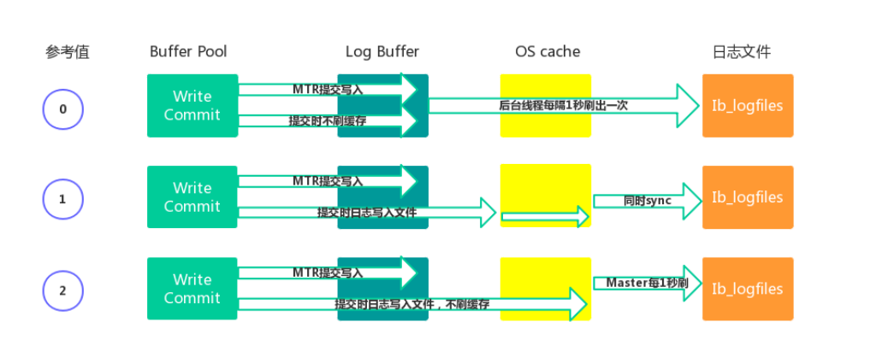


#### 4. Adaptive Hash Index（自适应哈希索引）

用于**==优化对BP数据的查询==**。InnoDB存储引擎会监控对表索引的查找，如果观察到建立哈希索引可以带来速度的提升，则建立哈希索引，所以称之为自适应。InnoDB存储引擎会自动**==根据访问的频率和模式来为某些页建立哈希索引==**。

**开启配置**

```sql
show engine innodb status \G; 
show variables like '%innodb_adaptive%';
```


#### 5. 结合场景描述流程

##### 5.1 当新插入数据时

**==DML操作==**，先到Buffer pool 查询是否有记录

- 若有记录，则**==直接在Buffer pool中修改记录==**。**==事务提交前生成 undo日志 用于异常回滚恢复==**之前的数据。**==事务提交后生成 redo日志 用于刷盘==**（同步数据到磁盘）。
- 若没有记录，**==则将DML语句存入 Change Buffer==**

##### 5.2 当查询刚插入数据的时

通过前面的场景，得知插入的 DML操作语句存在 Change Buffer中，并且此时 Buffer Pool也没有此条记录。所以**==去磁盘查询==**（磁盘没有该记录），然后到Change Buffer中合并该记录的 DML语句，将结果存到Buffer Pool中

- BP**==先从free list 中查找是否有空闲页==**，若有直接存入，**==然后将该页从free list删除==**，**==交由 LRU list管理==**
- 若没有空闲页，**==则LRU list根据LRU算法淘汰链表末尾page页==**，释放page页数据**==存入新数据==**，并将page页**==移动到midpoint位置==**

##### 5.3当修改刚查询过的数据时

DML操作，先到BP查询是否有记录，查询到记录，直接在BP中修改。事务提交前生成undo日志，提交后生成redo日志。redo日志用于同步数据到磁盘

##### 5.4 当修改很久没查询的数据时

DML操作，**==由于数据很久没被访问，LRU list根据LRU算法淘汰了该记录==**。因此page中没有此纪录。

存入Change Buffer，下次查询的时候，**==从磁盘查到结果与CB的DML合并，将结果存入Buffer Pool。==**


### 2) InnoDB 磁盘结构

InnoDB磁盘有多种**表空间文件**，用于存储表结构和数据，另外还有**日志文件**和**缓冲文件**组成。

#### 1. InnoDB 磁盘结构的组成

##### 1.1 系统表空间（The System Tablespace）

包含 **Change Buffer** 的存储区域。

系统表空间也默认**==包含任何用户在系统表空间创建的表数据和索引数据==**。系统表空间是一个**==共享的表空间==**因为它是被多个表共享的。该空间的数据文件通过参数 innodb_data_file_path控制，默认值是ibdata1:12M:autoextend(文件名为**==ibdata1==**、12MB、自动扩展)。


##### 1.2 独立表空间（File-Per-Table Tablespaces）- 主要用的就是这种表空间

**`innodb_file_per_table`**默认开启，**==独立表空间是一个单表表空间==**，**==该表创建于自己的数据文件中==**，而非创建于系统表空间中。

当**`innodb_file_per_table`**选项开启时，表将被创建于表空间中。否则，innodb将被创建于系统表空间中。

每个表文件**==表空间由一个.ibd数据文件==**代表，该文件默认被创建于数据库目录中。表空间的表文件支持动态（dynamic）和压缩（commpressed）行格式。


##### 1.3 通用表空间（General Tablespaces）

通用表空间为通过create tablespace语法创建的共享表空间。通用表空间可以创建于mysql数据目录外的其他表空间，其可以容纳多张表，且其支持所有的行格式。

```shell
CREATE TABLESPACE ts1 ADD DATAFILE ts1.ibd Engine=InnoDB; //创建表空 间ts1 
CREATE TABLE t1 (c1 INT PRIMARY KEY) TABLESPACE ts1; //将表添加到ts1 表空间
```


##### 1.4 撤销表空间（Undo Tablespaces）

**==撤销日志是在事务开始之前保存的被修改数据的备份==**，用于例外情况时**==回滚事务==**。撤消日志属于**==逻辑日志，记录一个变化过程==**，根据每行记录进行记录

由 **`innodb_undo_tablespaces`**  配置选项控制，默认为0。参数值为0表示使用系统表空间ibdata1。大于0表示使用undo表空间undo_001、undo_002等。

由 **`show variables like '%innodb_undo_directory%';`**  配置撤销表空间存储路径

撤销表空间由一个或多个包含Undo日志文件组成。

在**==MySQL 5.7版本之前==**Undo占用的是**==System Tablespace共享区==**，

从**==5.7开始==**将Undo**==从System Tablespace分离了出来==**。


##### 1.5 临时表空间（Temporary Tablespaces）

分为session temporary tablespaces 和global temporary tablespace两种。sessiontemporary tablespaces 存储的是用户创建的临时表和磁盘内部的临时表。globaltemporary tablespace储存用户临时表的回滚段（rollback segments ）。mysql服务器正常关闭或异常终止时，临时表空间将被移除，每次启动时会被重新创建。


##### 1.6 重做日志(Redo Log)

MySQL以循环方式写入重做日志文件，**==记录InnoDB中所有对Buffer Pool修改的日志==**。当**==出现实例故障==**（像断电），导致数据未能更新到数据文件，则**==数据库重启时须redo==**，**==重新把数据更新到数据文件==**。读写事务在执行的过程中，都会不断的产生redo log。默认情况下，重做日志在磁盘上由两个名为ib_logfile0和ib_logfile1的文件物理表示。


##### 1.7 双写缓冲区（Doublewrite Buffer）

在**==BufferPage的page页==**刷新到磁盘真正的位置前，会**==先将数据存在Doublewrite 缓冲区==**。如果在page页写入过程中出现操作系统、存储子系统或mysqld进程崩溃，InnoDB可以在崩溃恢复期间从Doublewrite 缓冲区中找到页面的一个好备份。

**==默认启用双写缓冲区==**，要禁用Doublewrite 缓冲区，可以将 **` innodb_doublewrite`**  设置为0。使用Doublewrite 缓冲区时建议将  **`innodb_flush_method`**  **==设置为O_DIRECT==**。


#### 2. InnoDB 表空间文件的结构

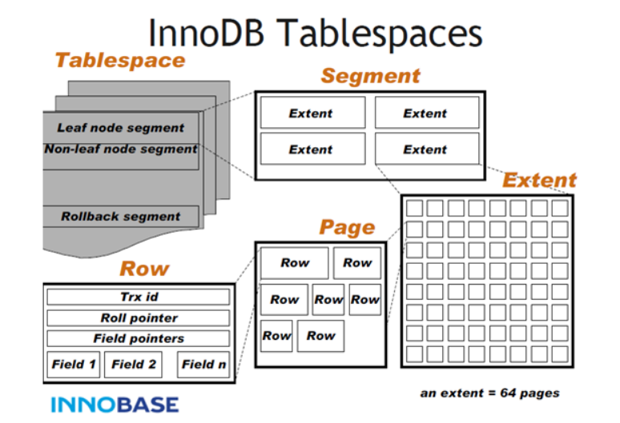

表空间文件结构组成如下：

- 一个 **表空间** 有多个segment段组成，分别有以下几种段
  - **==叶子节点段（数据段）==**
  - **==非叶子节点段（索引段）==**
  - **==回滚段==**
- 一个 **Segment段** 有多个 Extent区 组成，每**创建一个索引，就会多两个segment（叶子段、非叶子段）**
- 一个 **Extent区** 有多个page页 组成，**默认1MB，有 64 个page页**，若**表空间不足会生成新得 Extent**
- 一个 **Page页** 有多个 **row行记录和索引组成** ，page页默认 16KB
- 一个 **Row行** 由**row_id，事务id，回滚指针，field字段**组成。


#### 3. InnoDB 文件存储格式

##### 3.1 查看格式

通过**` SHOW TABLE STATUS`** 命令查看表状态

通过 **`select * from information_schema.innodb_sys_tables; `**查看指定表的文件格式

##### 3.2 文件格式（File-Format）

在早期的InnoDB版本中，文件格式只有一种，随着InnoDB引擎的发展，出现了新文件格式，用于支持新的功能。目前InnoDB只支持两种文件格式：**==Antelope 和 Barracuda==**

- Antelope：先前未命名的，最原始的InnoDB文件格式，它支持两种行格式：**==REDUNDANT 和 COMPACT==**，MySQL 5.6及其以前版本默认格式为Antelope

- Barracuda：新的文件格式。它支持InnoDB的**==所有行格式==**，包括的行格式：**==REDUNDANT 、COMPACT、DYNAMIC和 COMPRESSED==**


##### 3.3 行格式（Row-Format）- 决定行记录的物理存储，影响 DML操作性能

如果在单个page页中容纳更多行，查询和索引查找可以更快地工作，缓冲池中所需的内存更少，写入更新时所需的I/O更少

InnoDB存储引擎支持四种行格式：**REDUNDANT、COMPACT、DYNAMIC和COMPRESSED**

DYNAMIC和COMPRESSED新格式引入的功能有：==数据压缩==、==增强型长列数据的页外存储==和==大索引前缀==。

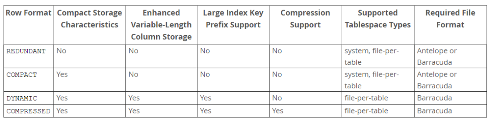

每个表的数据会有很多page页来存储，==每个页中采用B树结构存储==；

如果某些==字段信息过长==，==无法存储在B树节点中==，这时候会==被单独分配空间==，此时被称为==溢出页==，该字段被称为==页外列==。

- REDUNDANT 行格式

  使用REDUNDANT行格式，表会将变长列值的前768字节存储在B树节点的索引记录中，其余的存储在溢出页上。对于大于等于786字节的固定长度字段InnoDB会转换为变长字段，以便能够在页外存储。

- COMPACT 行格式

  与REDUNDANT行格式相比，COMPACT行格式==减少了约20%的行存储空间==，但代价是==增加了某些操作的CPU使用量==。如果系统负载是受缓存命中率和磁盘速度限制，那么COMPACT格式可能更快。如果系统负载受到CPU速度的限制，那么COMPACT格式可能会慢一些。

- DYNAMIC 行格式

  使用DYNAMIC行格式，InnoDB会将表中==长可变长度的列值完全存储在页外==，而索引记录只包含==指向溢出页的20字节指针==。大于或等于768字节的固定长度字段编码为可变长度字段。DYNAMIC行格式支持大索引前缀，最多可以为3072字节，可通过innodb_large_prefifix参数控制。

- COMPRESSED 行格式

  COMPRESSED行格式提供与DYNAMIC行格式相同的存储特性和功能，但==增加了对表和索引数据压缩的支持==。


##### 3.4 设置行格式（Row-Format）

在创建表和索引时，文件格式都被用于每个InnoDB表数据文件（其名称与*.ibd匹配）。修改文件格式的方法是**重新创建表及其索引**，最简单方法是对要修改的每个表使用以下命令：

**`ALTER TABLE 表名 ROW_FORMAT=格式类型;`**


## 三、InnoDB 线程模型

InnoDB线程模型，分为Master Thread、IO Thread、Purge Thread、Page Cleaner Thread四种模型，如下所示：

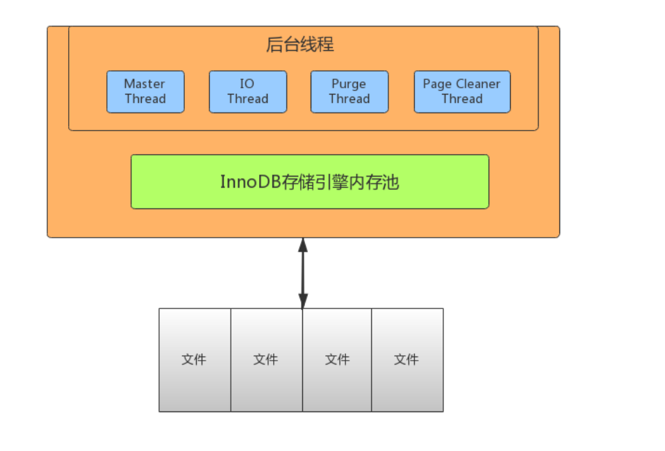

### 1. ==IO Thread==

InnoDB中使用了大量的 AIO（Async IO）来做读写处理，这样可以极大提高数据库的性能。

IO Thread 一共有四种Thread，分别为：==**write**==，==**read**==，==**insert buffer**==和==**log thread**==，其中read thread和write thread分别为4个，因此IO Thread一共有10个。

#### 1.1 write thread：负责写操作，将Buffer Pool中的脏页刷新到磁盘。4个

#### 1.2 read thread：负责读取操作，将数据从磁盘加载到缓存page页。4个

#### 1.3 insert buffer thread：负责将Change Buffer中的内容刷新到磁盘，与磁盘的记录合并。1个

#### 1.4 log thread：负责将Log Buffer中的内容刷新到磁盘。1个


### 2. ==Purge Thread==

**当事务提交后**，Purge Thread则会**回收内存中的 Undo日志**数据

**`show variables like '%innodb_purge_threads%';`**


### 3. ==Page Cleaner Thread==

**`show variables like '%innodb_page_cleaners%'`**

**作用：**回收内存中undo log

**将脏页中的数据刷新到磁盘**，脏数据刷盘后相应的redo log也就可以覆盖，即可以同步数据，又能达到redo log循环使用的目的，**会调用write thread线程处理**


### 4. ==Master Thread==

**作用：**作用是**将缓冲池中的数据异步刷新到磁盘** ，保证数据的一致性

Master thread是**InnoDB的主线程**，负责**调度其他各线程**，优先级最高。

#### 4.1 每隔 1 秒的处理

- 刷新日志缓冲区，刷到磁盘

- 合并写缓冲区数据，根据IO读写压力来决定是否操作

- 刷新脏页数据到磁盘，根据脏页比例达到75%才操作（**`innodb_max_dirty_pages_pct`**，**`innodb_io_capacity`**） 

#### 4.2 每隔 10 秒的处理

- 刷新脏页数据到磁盘

- 合并写缓冲区数据

- 刷新日志缓冲区

- **==删除无用的undo页==**


## 四、Undo Log

### 1. Undo Log 回顾

前文已经多出提到过Undo Log，如==InnoDB内存结构中的 Log Buffer==、==InnoDB磁盘结构的 Undo表空间==

**Undo定义：**意为撤销或取消，以撤销操作为目的，返回指定某个状态的操作 

**Undo Log：**数据库事务开始之前，会将要修改的记录存放到 Undo 日志里，当**事务回滚时或者数据库崩溃时**，可以利用 Undo 日志，**撤销未提交事务，回到提交前的状态**对数据库产生的影响。

Undo Log属于**逻辑日志，记录一个变化过程**。例如执行一个delete，undolog会记录一个insert；执行一个update，undolog会记录一个**相反的update**。


### 2. Undo Log 产生及销毁时机

Undo Log**在事务开始前产生**；事务在提交时，并不会立刻删除 undolog，innodb会将该事务对应的undo log放入到删除列表中，后面会**通过==后台线程purge thread进行回收==处理**。


### 3. Undo Log 的存储

[参考前文介绍的InnoDB磁盘结构](#1.4 撤销表空间（Undo Tablespaces）)

Undo Log ==存储在 Undo表空间文件==中，表空间中的==Rollback Segment存储多个Undo Log==。[查看表空间文件结构](#2. InnoDB 表空间文件的结构)

在innodb 数据文件中包含一种 Rollback Segment回滚段，内部包含1024个Undo Log Segment。

可以通过下面一组参数来控制 Undo表空间文件存储的路径。

**`show variables like '%innodb_undo%';`**


### 4. Undo Log 作用 

#### 4.1 实现事务的原子性

Undo Log 是为了==实现事务的原子性==而出现的产物。如前文介绍，可用于事务回滚。

#### 4.2 实现MVCC（多版本并发控制）

Undo Log 在 InnoDB 存储引擎中用来==实现多版本并发控制==。事务提交之前，Undo Log保存了修改前的版本数据，Undo Log 中的数据可作为  ==数据旧版本快照供其他并发事务进行快照读==。

流程如下，此处不过多解读。

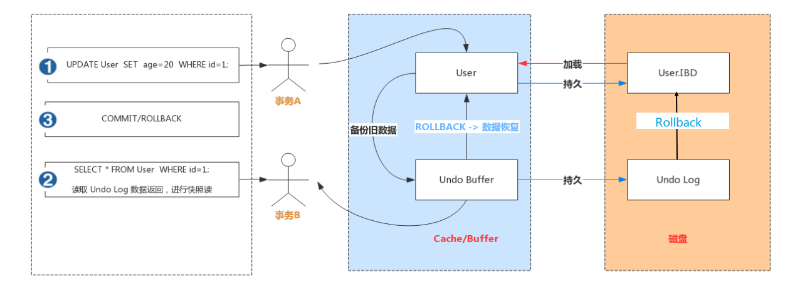


## 五、Redo Log

### 1. Redo Log 回顾

前文已经多出提到过Redo Log，如==InnoDB内存结构中的 Log Buffer==、==InnoDB磁盘结构的 Redo Log空间==

**Redo：**顾名思义就是重做。以恢复操作为目的，在数据库发生意外时重现操作。

**Redo Log：**指事务中修改的任何数据，将最新的数据备份存储的位置（Redo Log），被称为重做日志。


### 2. Redo Log 产生及销毁时机

事务操作的执行，就会生成Redo Log，**==再事务提交时会将Redo Log写入Log Buffer==**，并不是随着事务的提交就立刻写入磁盘文件。**==等事务操作的脏页写入到磁盘之后，Redo Log 的使命也就完成了==**，Redo Log占用的空间就可以重用（被覆盖写入）。


### 3. Redo Log 存储

每个InnoDB存储引擎==至少有1个重做日志文件组（group）==，每个==文件组至少有2个重做日志文件==，默认为ib_logfile0和ib_logfile1。

- 可以通过下面一组参数控制Redo Log存储：

  **`show variables like '%innodb_log%';`**


### 4. Redo Log 刷盘机制

Redo Buffer 持久化到 Redo Log 的策略，可通过  **`Innodb_flush_log_at_trx_commit`**  设置：

**`innodb_log_buffer_size // 日志缓冲区大小`**

**`innodb_flush_log_at_trx_commit // 参数控制日志刷新行为，默认为1`**

- **0：** 每秒提交 Redo buffffer ->OS cache -> flflush cache to disk，可能丢失一秒内的事务数据。由后台Master线程每隔 1秒执行一次操作。
- **1：**每次事务提交执行 Redo Buffffer -> OS cache -> flflush cache to disk，最安全，性能最差的方式。
- **2：**每次事务提交执行 Redo Buffffer -> OS cache，然后由后台Master线程再每隔1秒执行OScache -> flflush cache to disk 的操作。

一般建议选择取值2，因为 MySQL 挂了数据没有损失，整个服务器挂了才会损失1秒的事务提交数据


### 5. Redo Log 作用

#### 5.1 Crash-Safe

==Redo Log== 是为了 ==实现crash-safe== 而出现的产物。防止在发生故障的时间点，==**尚有脏页未写入表的 IBD 文件**==中

此时 MySQL 异常重启 ，**==InnoDB会自动根据 Redo Log 进行重做==**，从而达到事务的  ==**未入磁盘数据进行持久化**==这一特性。


#### 5.2 实现事务的持久性

==Redo Log== 是为了==实现事务的持久性==而出现的产物。防止在发生故障的时间点，==**尚有脏页未写入表的 IBD 文件**==中，在重启 MySQL 服务的时候，**==根据 Redo Log 进行重做==**，从而达到事务的  ==**未入磁盘数据进行持久化**==这一特性。

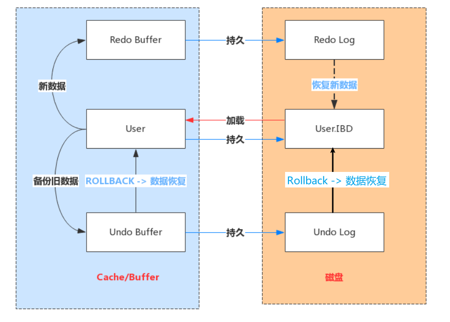


### 6. Redo Log 写入磁盘机制

Redo Log 文件内容是以顺序循环的方式写入文件，写满时则回溯到第一个文件，进行覆盖写。

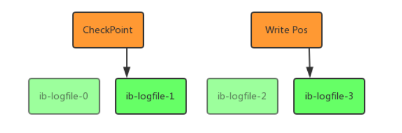

- **write pos：**是当前记录的位置，一边写一边后移，写到最后一个文件末尾后就回到 0 号文件开头
- **checkpoint：**是当前要擦除的位置，也是往后推移并且循环的，擦除记录前要把记录更新到数据文件

如果 write pos 追上checkpoint，表示写满，这时候不能再执行新的更新，得停下来先擦掉一些记录，把 checkpoint推进一下。


## 六、Binary Log

### 1. Binlog 简介

Redo Log 是属于InnoDB引擎所特有的日志，而**==MySQL Server也有自己的日志，即 Binarylog（二进制日志）==**，简称Binlog。

Binlog **==记录所有数据库表结构变更以及表数据修改==** ，不会记录SELECT和SHOW这类操作。

Binlog日志是以事件形式记录，还包含语句所执行的消耗时间。

开启Binlog日志有以下  **==两个最重要的使用场景==**

- **主从复制：**在主库中开启Binlog功能，这样主库就可以把Binlog传递给从库，从库拿到Binlog后实现数据恢复达到主从数据一致性。

- **数据恢复：**通过mysqlbinlog工具来恢复数据。


### 2. Binlog 记录模式

文件记录模式有STATEMENT、ROW和MIXED三种，具体含义如下

#### 2.1 ROW（row-based replication, RBR）

日志中会**==记录每一行数据被修改的情况==**，然后在slave端对相同的数据进行修改

- **优点：**能清楚记录每一个行数据的修改细节，能**==完全实现主从数据同步==**和数据的恢复。

- **缺点：**update/delete等批量操作，会产生大量的日志。如：==alter table==、==update ..where==、==delete .. where==会**==导致很多行记录修改让日志暴涨==**。


#### 2.2 STATMENT（statement-based replication, SBR）

**==记录每一条修改数据的SQL==** 到master的Binlog中，slave在复制的时候SQL进程会解析成和原来master端执行过的相同的SQL再次执行。==简称SQL语句复制==。

- **优点：**日志量小，减少磁盘IO，提升存储和恢复速度

- **缺点：**在某些情况下会导致主从数据不一致，比如==last_insert_id()==、==now()==等函数。


#### 2.3 MIXED（mixed-based replication, MBR）

以上两种模式的混合使用，一般会使用STATEMENT模式保存binlog，对于STATEMENT模式无法复制的操作使用ROW模式保存binlog，MySQL会根据执行的SQL语句选择写入模式。


### 3. Binlog 文件结构

MySQL的 binlog文件中记录的是对数据库的各种修改操作，用来表示修改操作的数据结构是Logevent。

不同的修改操作对应的不同的log event。比较常用的log event有：**Query event**、**Row event**、**Xid event**等。

binlog文件的内容就是各种Log event的集合。

Binlog文件中Log event结构如下图所示：

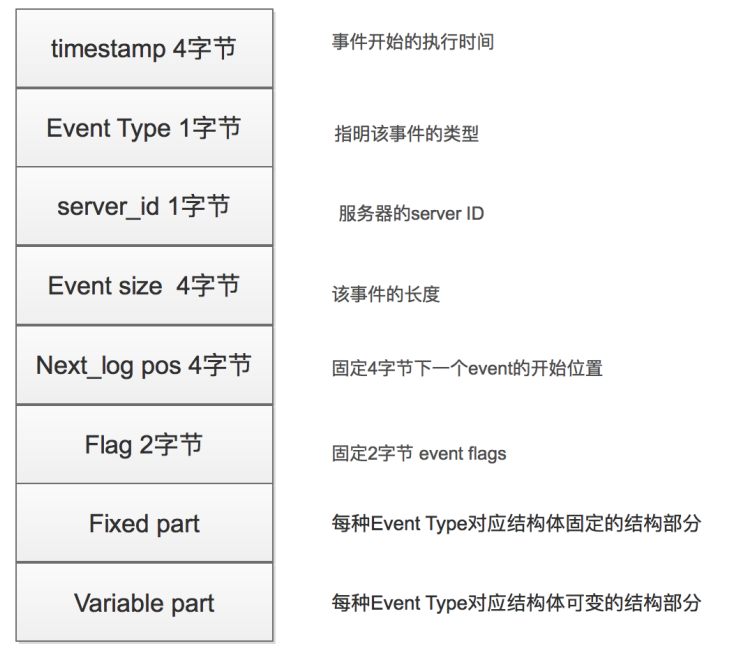


### 4. Binlog 写入机制

- 根据记录模式和操作触发event事件生成log event（事件触发执行机制）

- 将事务执行过程中产生log event写入缓冲区，每个事务线程都有一个缓冲区

  Log Event保存在一个binlog_cache_mngr数据结构中，在**==该结构中有两个缓冲区==**

  一个是**==stmt_cache==**，用于存放不支持事务的信息；

  另一个是**==trx_cache==**，用于存放支持事务的信息。

- 事务在提交阶段会将产生的log event写入到外部binlog文件中

  不同事务以串行方式将log event写入binlog文件中，所以**==一个事务包含的log event信息在binlog文件中是连续的==**，中间不会插入其他事务的log event


### 5. Binlog 参数查看及相关操作

#### 5.1 参数查看

**`show variables like '%log_bin%'; // 查看binlog日志状态`**

**`show variables like '%binlog%'; // 相关参数查看`**

**`show binary logs;//查看日志文件大小`**


#### 5.2 开启及参数配置

修改my.cnf或my.ini配置文件，在[mysqld]下面增加 `log_bin=mysql_bin_log`，重启MySQL服务。

```
#log-bin=ON
#log-bin-basename=mysqlbinlog
# 记录模式
binlog-format=MIXED
# 指定binlog名称
log-bin=mysqlbinlog
```


#### 5.3 利用binlog恢复版本

**使用show binlog events命令**

```
show binary logs; //等价于show master logs; 
show master status; 
show binlog events; 
show binlog events in 'mysqlbinlog.000001';
```


**若需要将日志导出为其他格式，可使用mysqlbinlog 命令**

```
mysqlbinlog "文件名" 
mysqlbinlog "文件名" > "test.sql"
```


**使用 binlog 恢复数据**

mysqldump：定期全部备份数据库数据。

mysqlbinlog：可以做增量备份和恢复操作。

```
//按指定时间恢复 
mysqlbinlog --start-datetime="2020-04-25 18:00:00" --stop- datetime="2020-04-26 00:00:00" mysqlbinlog.000002 | mysql -uroot -p1234

//按事件位置号恢复 
mysqlbinlog --start-position=154 --stop-position=957 mysqlbinlog.000002 | mysql -uroot -p1234
```


#### 5.4 清理Binlog文件

自动清理binlog，可通过以下参数设置

**`expire_logs_days //默认值为0表示没启用。设置为1表示超出1天binlog文件会自动删除掉`**

```
purge binary logs to 'mysqlbinlog.000001'; //删除指定文件
purge binary logs before '2020-04-28 00:00:00'; //删除指定时间之前的文件
reset master; //清除所有文件
```


## 七、Redo Log 和 Binary Log区别

- **==Redo Log 是属于InnoDB引擎功能==**，Binlog是属于**==MySQL Server自带功能，以二进制文件记录==**
- **==Redo Log 属于物理日志==**，记录该数据页更新状态内容，**==Binlog是逻辑日志，记录更新过程==**
- **==Redo Log== **日志是循环写，**==日志空间大小是固定==**，Binlog是追加写入，写完一个写下一个，不会覆盖使用。
- **==Redo Log==** 作为**==服务器异常宕机后事务数据自动恢复使用==**，**Binlog** 可以作为**==主从复制和数据恢复使用==**。**==Binlog没有自动crash-safe能力。==**


