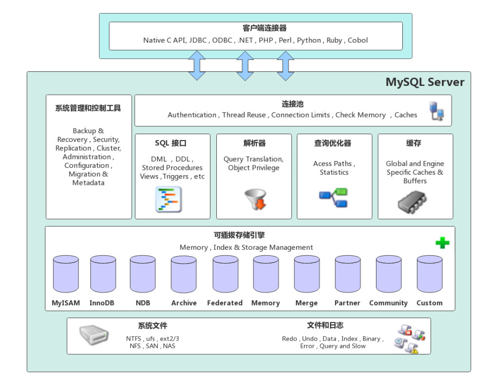
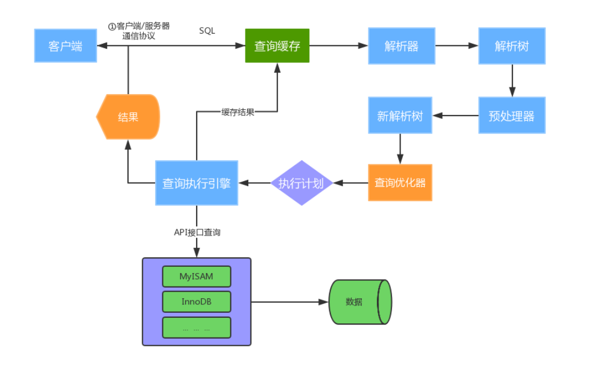

[toc]

### 一、MySQL整体结构设计

MySQL的结构是自顶向下的，大致分为网络连接层、服务层、存储引擎层、文件系统层，如下图所示：

#### 1. 客户端连接层（Client Connectors）

提供与MySQL服务器建立的支持。目前几乎支持所有主流的服务端编程技术，例如常见的 Java、C、Python、.NET等，它们通过各自API技术与MySQL建立连接

#### 2. 服务层（MySQL Server）

服务层是MySQL的核心，它包含以下6个组件

- **系统管理和控制工具：**备份恢复，安全管理，集群管理
- **连接池（Connection pool）：**管理客户端与数据库的连接，并且内部使用线程池，一个线程负责管理一个连接

- **SQL 接口(SQL interface)：**负责接收客户端发送的 SQL 命名，并返回查询结果。包含：DDL、DML、DQL、存储过程、视图、触发器等

- **解析器（Parser）：**负责将 SQL 语句解析成一个**解析树**，并进行预处理**检查语法和词义**（别名是否重复等），生成新的解析树

- **查询优化器（Optimizer）：**将解析树转换成 **执行计划**，并交由执行引擎与存储引擎交互

- **缓存（Cache & Buffer）：**表缓存，记录缓存，权限缓存，引擎缓存等。如果查询命中缓存，则返回缓存的数据

#### 3. 存储引擎层（Pluggable Storage Engines）

存储引擎负责MySQL中数据的存储与提取，**==与底层系统文件进行交互==**，**==每张表文件都可以指定存储引擎==**

MySQL存储引擎是**==插件式==**的，服务器中的查询**执行引擎通过接口与存储引擎进行通信，接口屏蔽了不同存储引擎之间的差异** 。现在有很多种存储引擎，各有各的特点，最常见的是**==MyISAM==**和**==InnoDB==**

#### 4. 文件系统层（File System）

该层负责将数据库的数据和日志存储在文件系统之上，并完成与存储引擎的交互，是文件的物理存储层。主要包含日志文件，数据文件，配置文件，pid 文件，socket 文件等

##### 4.1 日志文件及命令

- **错误日志（Error log）**

  **==默认开启==，`show variables like '%log_error%';`**

  

- **通用查询日志（General query log）**

  **记录一般查询语句，`show variables like '%general%';`**

  

- **二进制日志（binary log）**

  记录了对MySQL数据库执行的更改操作，并且记录了语句的发生时间、执行时长；但是它不记录select、show等不修改数据库的SQL。主要用于数据库恢复和主从复制。

  **`show variables like '%log_bin%'; //是否开启`**

  **`show variables like '%binlog%'; //参数查看`**

  **`show binary logs;//查看日志文件`**

  

- **慢查询日志（Slow query log）**

  记录所有执行时间超时的查询SQL，默认是10秒。

  **`show variables like '%slow_query%'; //是否开启`**

  **`show variables like '%long_query_time%'; //判定慢查询的时长，单位秒`**

##### 4.2 数据文件及命令

**`show variables like '%datadir%'; //查看数据文件存储路径`**

- **db.opt 文件**

  记录这个**库使用的字符集和校验规则**

  

- **frm 文件（表文件）**

  存储与表相关的元数据（meta）信息，包括**==表结构的定义==**信息等，每一张表都会有一个frm 文件

  

- **MYD 文件（MyISAM 的表文件）**

  MyISAM 存储引擎专用，存放 **==MyISAM==表的==数据==**（data)，每一张表都会有一个.MYD 文件

  

- **MYI 文件（MyISAM 的表文件）**

  MyISAM 存储引擎专用，存放 **==MyISAM==表的==索引==相关信息**，每一张 MyISAM 表对应一个 .MYI 文件

  

- **ibd文件和 IBDATA 文件（innoDB 的表文件）**

  存放 **==InnoDB 的数据和索引==**

  **==独享表空间==**使用 .ibd 文件来存放数据，且每一张InnoDB 表对应一个 .ibd 文件

  共享表空间使用 .ibdata 文件，所有表共同使用一个（或多个，自行配置）.ibdata 文件

  

- **ibdata1 文件（表文件）**

  存放 **==InnoDB 的数据和索引==**

  **==系统表空间==**数据文件，存储**==表元数据、Undo log日志==**等 

  

- **ib_logfile0、ib_logfile1 文件**

  **==Redo log==** 日志文件

##### 4.3 配置文件

用于存放MySQL所有的配置信息文件，比如 **my.cnf**、**my.ini** 等

##### 4.4 pid 文件

pid 文件是 mysqld 应用程序在 Unix/Linux 环境下的一个进程文件，和许多其他 Unix/Linux 服务端程序一样，它存放着自己的进程 id。

##### 4.5 socket 文件

socket 文件也是在 Unix/Linux 环境下才有的，用户在 Unix/Linux 环境下客户端连接可以不通过TCP/IP 网络而直接使用 Unix Socket 来连接 MySQL。

### 二、运行机制

MySQL运行机制的流程图，如下所示：

1. [客户端/服务器建立连接](# 1. 客户端/服务端建立连接)
2. [根据查询SQL 查询缓存](#2. 查询缓存)
3. [解析器对 SQL 进行语法解析，生成解析树](#3. 解析器 对SQL进行语法解析，生成解析树)
4. [查询优化器根据 “解析树” 生成最有的 执行计划](#4. 查询优化器根据 "解析树" 生成最有的 执行计划)
5. [查询执行引擎，负责执行 执行计划](#5. 查询执行引擎，负责执行 执行计划)

#### 1. 客户端/服务端建立连接

MySQL 客户端与服务端的通信方式是 “ ==半双工==”。对于每一个 MySQL 的连接，时刻都有一个线程状态来标识这个连接正在做什么

##### 1.1 通讯机制

- ==全双工==：能同时发送和接收数据，例如平时==打电话==

- ==半双工==：指的某一时刻，要么发送数据，要么接收数据，不能同时。例如==早期对讲机==

- ==单工==：只能发送数据或只能接收数据。例如==单行道==

##### 1.2 查看线程状态

**`show full processlist; //查看用户正在运行的线程信息，root用户能查看所有线程，其他用户只能看自己的`**

- id：线程ID，可以使用kill xx；

- user：启动这个线程的用户

- Host：发送请求的客户端的IP和端口号

- db：当前命令在哪个库执行

- Command：该线程正在执行的操作命令

  - Create DB：正在创建库操作

  - Drop DB：正在删除库操作

  - Execute：正在执行一个PreparedStatement

  - Close Stmt：正在关闭一个PreparedStatement

  - Query：正在执行一个语句

  - Sleep：正在等待客户端发送语句

  - Quit：正在退出

  - Shutdown：正在关闭服务器

- Time：表示该线程处于当前状态的时间，单位是秒

- State：线程状态

  - Updating：正在搜索匹配记录，进行修改

  - Sleeping：正在等待客户端发送新请求

  - Starting：正在执行请求处理

  - Checking table：正在检查数据表

  - Closing table : 正在将表中数据刷新到磁盘中

  - Locked：被其他查询锁住了记录

  - Sending Data：正在处理Select查询，同时将结果发送给客户端

- Info：一般记录线程执行的语句，默认显示前100个字符。想查看完整的使用 ==show full processlist;==

#### 2. 查询缓存

若**==开启查询缓存==**并且查询**==SQL 命中缓存==**（SQL是否完全相同），则直接返回缓存的数据。否则交由解析器进行处理，最终将 **==SQL语句和执行引擎返回的查询结果存入缓存==**

##### 2.1 缓存相关的参数-命令

- **`show variables like '%query_cache%'; //查看查询缓存是否启用，空间大小，限制等`**
- **`show status like 'Qcache%'; //查看更详细的缓存参数，可用缓存空间，缓存块，缓存多少等`**

##### 2.2 以下SQL即使开启查询缓存也不缓存

- 查询语句使用 **==SQL_NO_CACHE==**

- 查询的结果 **==大于query_cache_limit设置==**

- 查询中有一些 **==不确定的参数==**，比如now()

#### 3. 解析器 对SQL进行语法解析，生成解析树

1. 若查询缓存未开启或者未命中缓存，则由解析器将 **==SQL 进行语法解析，生成解析树==**
2. **==预处理器==**对解析树进一步处理：**==语法是否合法==**，**==表和字段是否存在==**，**==别名是否冲突==**
3. 最后**==生成新的解析树==**

#### 4. 查询优化器根据 “解析树” 生成最有的 执行计划

MySQL使用很多**==优化策略==**生成**==最优的执行计划==**，可以分为两类：**==静态优化（编译时优化）==**、**==动态优化（运行时优化）==**

##### 4.1 等价交换策略

- 基于联合索引，调整条件位置等
- a < b and a=5 改成b>5 and a=5

##### 4.2 优化count、min、max等函数

- InnoDB 引擎 **==min函数==**只需要找**==索引最左边==**

- InnoDB 引擎 **==max函数==**只需要找**==索引最右边==**

- MyISAM 引擎 **==count(*)==**，**==不需要计算==**，直接返回

##### 4.3 提前终止查询

使用了limit查询，获取limit所需的数据，就不在继续遍历后面数据

##### 4.4 in的优化

MySQL对in查询，会先进行排序，再采用二分法查找数据。比如where id in (2,1,3)，变成 in (1,2,3) 

#### 5. 查询执行引擎，负责执行 执行计划

查询执行引擎 根据  **==查询表的存储引擎类型==**，以及对应的 **==API接口 与底层的存储引擎通信==**（存储引擎缓存或者物理文件），得到查询结果并返回。若开启查询缓存，则将结果存入缓存中。

