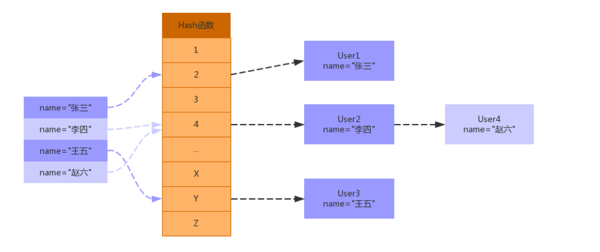

[toc]

## 一、索引基础

MySQL官方对索引定义：是存储引擎 用于**==快速查找记录的一种数据结构==**。需要额外开辟空间和数据维护工作。

索引需要物理存储在数据文件中（InnoDB的.ibd文件，MyISAM的.MYI文件），利用page页存储。

索引可以加快检索速度，但是同时也会 ==降低 DML 操作速度==，索引维护需要代价。


### 1. 索引划分

- **从索引存储结构划分：**B Tree索引、Hash索引、R Tree索引

- **从应用层次划分：**普通索引、唯一索引、主键索引、复合/组合索引、FULLTEXT全文索引

- **从索引键值类型划分：**主键索引、辅助索引（二级索引）

- **从数据存储和索引键值逻辑关系划分：**聚集索引（聚簇索引）、非聚集索引（非聚簇索引）


### 2. 索引类型-应用层次

#### 2.1 普通索引

最基本的索引类型，基于==普通字段==建立的索引，==没有任何限制==

创建普通索引的方法如下：

- CREATE INDEX <索引的名字> ON tablename (字段名);

- ALTER TABLE tablename ADD INDEX [索引的名字] (字段名);

- CREATE TABLE tablename ( [...], INDEX [索引的名字] (字段名) );


#### 2.2 唯一索引

==基于唯一约束的字段==建立的索引，==值必须唯一，但允许有空值== 。在创建或修改表时追加==唯一约束==，就会自动创建对应的唯一索引。

创建唯一索引的方法如下：

- CREATE UNIQUE INDEX <索引的名字> ON tablename (字段名);

- ALTER TABLE tablename ADD UNIQUE INDEX [索引的名字] (字段名);

- CREATE TABLE tablename ( [...], UNIQUE [索引的名字] (字段名) ;


#### 2.3 主键索引

一种==特殊的唯一索引，不允许有空值==。在创建或修改表时追加==主键约束==即可，每个表==只能有一个主键==。

创建主键索引的方法如下：

- CREATE TABLE tablename ( [...], PRIMARY KEY (字段名) );

- ALTER TABLE tablename ADD PRIMARY KEY (字段名);


#### 2.4 复合/组合索引

多个列上建立索引，这种索引叫做组复合索引（组合索引）

复合索引可以代替多个单一索引，相==比多个单一索引复合索引所需的开销更小==

索引同时有两个概念叫做窄索引和宽索引，==窄索引是指索引列为1-2列的索引==，==宽索引也就是索引列超过2列的索引==，设计索引的一个重要原则就是==能用窄索引不用宽索引==

创建组合索引的方法如下：

- CREATE INDEX <索引的名字> ON tablename (字段名1，字段名2...);

- ALTER TABLE tablename ADD INDEX [索引的名字] (字段名1，字段名2...);CREATE TABLE tablename ( [...], INDEX [索引的名字] (字段名1，字段名2...) );


#### 2.5 全文索引

查询操作在数据量比较少时，可以使用like模糊查询，但是对于大量的文本数据检索，效率很低。

如果==使用全文索引，查询速度会比 like 快很多倍==。在MySQL 5.6 以前的版本，只有MyISAM存储引擎支持全文索引，从==MySQL 5.6开始MyISAM和InnoDB存储引擎均支持==

创建全文索引的方法如下：

- CREATE FULLTEXT INDEX <索引的名字> ON tablename (字段名);

- ALTER TABLE tablename ADD FULLTEXT [索引的名字] (字段名);

- CREATE TABLE tablename ( [...], FULLTEXT KEY [索引的名字] (字段名) ;

##### 2.5.1 全文索引相关配置

**`show variables like '%ft%';`**


- 全文索引必须在字符串、文本字段上建立。

- ft_boolean_syntax

  全文索引字段值按 空格、加、减等syntax符号进行切词处理，然后对切词后的内容匹配

  ```sql
  select * from user where match(name) against('aaa');
  ```

- 字段对应的值在最小字符和最大字符之间才有效。（innodb：3-84，myisam：4-84）

- 全文索引匹配查询，==默认使用的是等值匹配==，例如a匹配a，不会匹配ab,ac。如果想==模糊匹配可以在布尔模式下搜索a*==

  ```sql
  select * from user where match(name) against('a*' in boolean mode);
  ```


## 二、深入索引原理

### 1. Hash索引

#### 1.1 Hash索引结构

Hash索引底层实现是由Hash表来实现的，是根据键值 <key,value> 存储数据的结构。非常适合根据key查找value值，也就是单个key查询，或者说等值查询。

其结构如下所示：




#### 1.2 Hash索引在MySQL中的应用

Hash索引在MySQL 中Hash结构主要应用在Memory原生的Hash索引 、InnoDB 自适应哈希索引。

InnoDB存储引擎会 **==监控表上各个page页的查询==**，当InnoDB注意到某些**==索引值访问非常频繁==**时，会在内存中**==基于B+Tree索引==**再**==创建一个哈希索引==**，自动地为某些热点页建立哈希索引来加速访问，使得内存中的 B+Tree 索引具备哈希索引的功能，即能够快速定值访问频繁访问的索引页

在使用Hash索引访问时，一次性查找就能定位数据，等值查询效率要优于B+Tree


#### 1.3 Hash索引的优缺点

**优点：**除留余数法 + 拉链法，所以等值查询很快

**缺点：**范围查询慢，需要扫描整个Hash表


### 2. B-tree索引


## 三、执行计划分析与优化


## 四、查询优化


