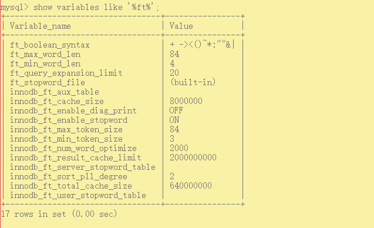

### 全文索引

show variables like '%ft%';

- ft_boolean_syntax

  全文索引字段值要进行切词处理，按syntax字符进行切割，例如b+aaa，切分成b和aaa

- 字段对应的值在最小字符和最大字符之间才有效。（innodb：3-84，myisam：4-84）
- 全文索引必须在字符串、文本字段建立
- 全文索引匹配查询，默认使用的是等值匹配，例如a匹配a，不会匹配ab,ac。如果想匹配可以在布尔模式下搜索a*