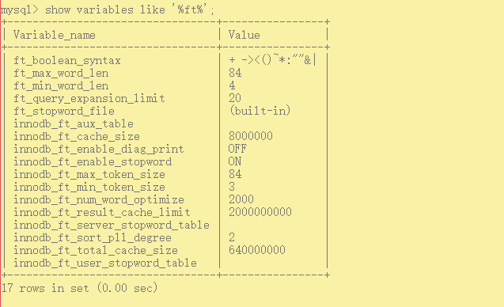
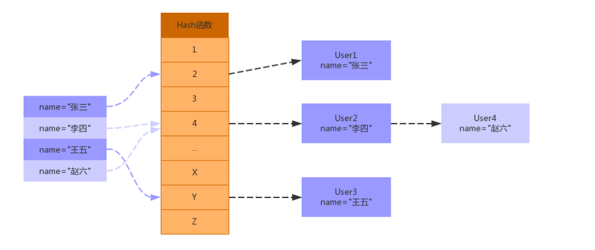
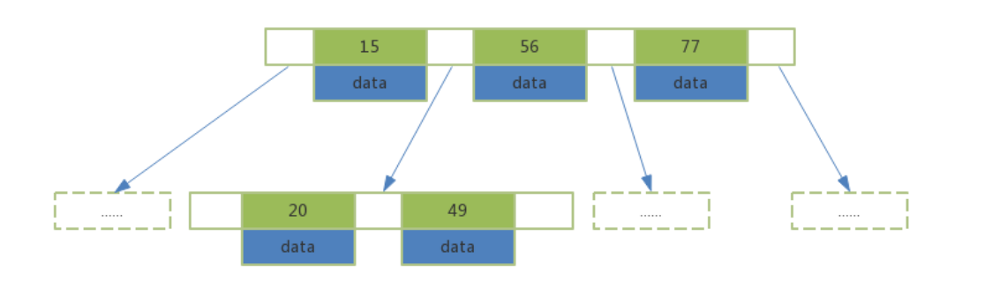
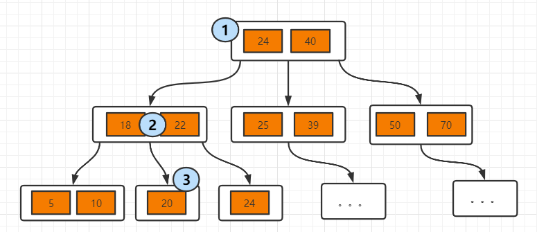
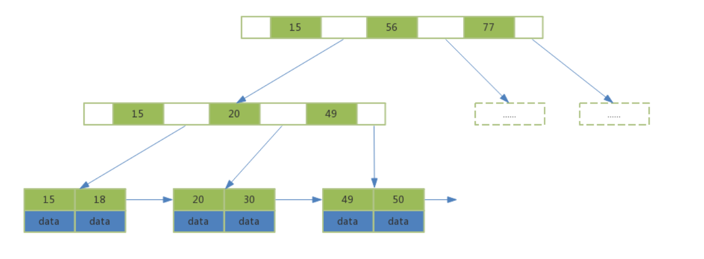
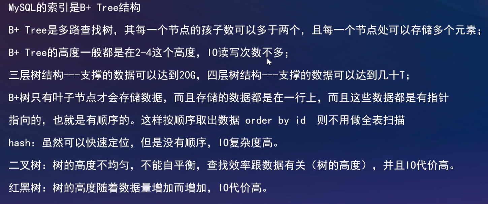
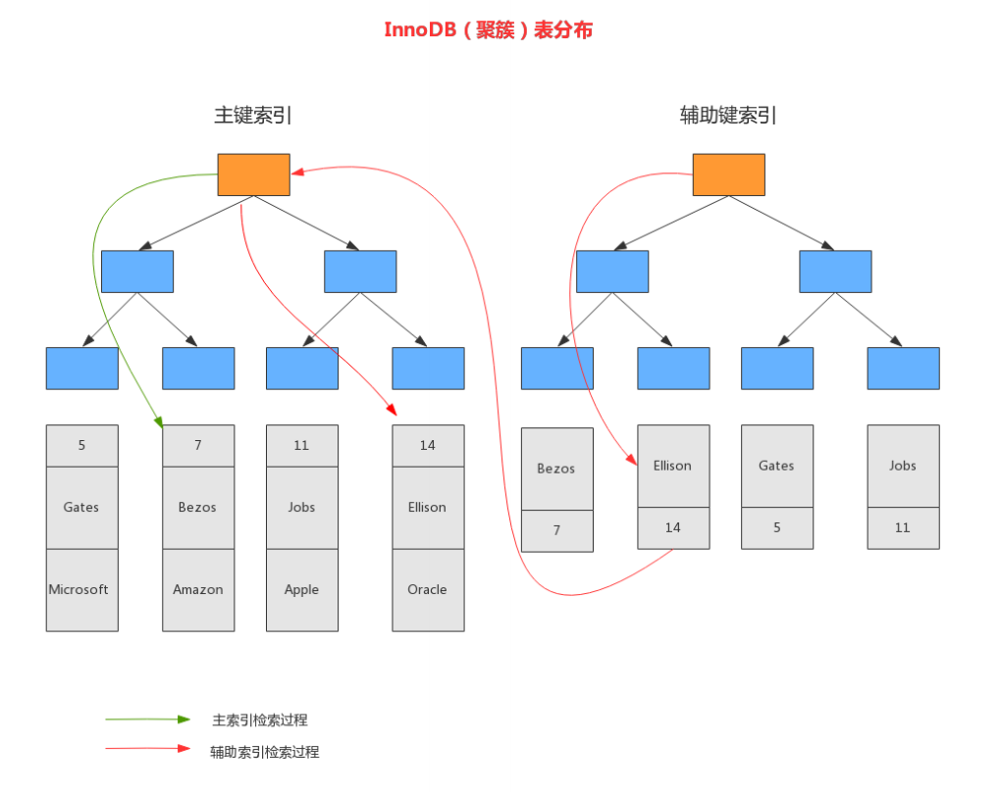
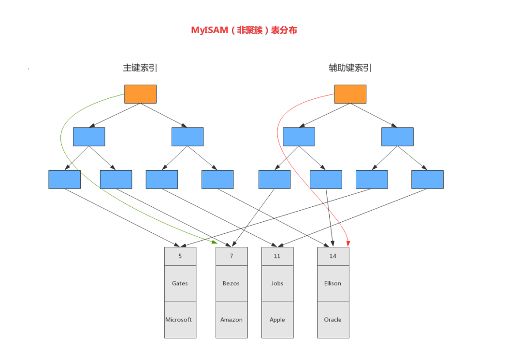

[toc]


## 一、索引基础

MySQL官方对索引定义：是存储引擎 用于**==快速查找记录的一种数据结构==**。需要额外开辟空间和数据维护工作。

索引需要物理存储在数据文件中（InnoDB的.ibd文件，MyISAM的.MYI文件），利用page页存储。

索引可以加快检索速度，但是同时也会 ==降低 DML 操作速度==，索引维护需要代价。


#### 索引的划分

- **从索引存储结构划分：**B Tree索引、Hash索引、R Tree索引
- **从应用层次划分：**普通索引、唯一索引、主键索引、复合/组合索引、FULLTEXT全文索引
- **从索引键值类型划分：**主键索引（就是聚簇索引）、辅助索引（二级索引）
- **从数据存储和索引值逻辑关系划分：**聚集索引（聚簇索引）、非聚集索引（非聚簇索引）


## 二. 应用层次类型的索引

### 1. 普通索引

最基本的索引类型，基于==普通字段==建立的索引，==没有任何限制==

创建普通索引的方法如下：

- CREATE INDEX <索引的名字> ON tablename (字段名);

- ALTER TABLE tablename ADD INDEX [索引的名字] (字段名);

- CREATE TABLE tablename ( [...], INDEX [索引的名字] (字段名) );


### 2. 唯一索引

==基于唯一约束的字段==建立的索引，==值必须唯一，但允许有空值== 。在创建或修改表时追加==唯一约束==，就会自动创建对应的唯一索引。

创建唯一索引的方法如下：

- CREATE UNIQUE INDEX <索引的名字> ON tablename (字段名);

- ALTER TABLE tablename ADD UNIQUE INDEX [索引的名字] (字段名);

- CREATE TABLE tablename ( [...], UNIQUE [索引的名字] (字段名) ;


### 3. 主键索引

一种==特殊的唯一索引，不允许有空值==。在创建或修改表时追加==主键约束==即可，每个表==只能有一个主键==。

创建主键索引的方法如下：

- CREATE TABLE tablename ( [...], PRIMARY KEY (字段名) );

- ALTER TABLE tablename ADD PRIMARY KEY (字段名);


### 4. 复合/组合索引

多个列上建立索引，这种索引叫做组复合索引（组合索引）

复合索引可以代替多个单一索引，相==比多个单一索引复合索引所需的开销更小==

索引同时有两个概念叫做窄索引和宽索引，==窄索引是指索引列为1-2列的索引==，==宽索引也就是索引列超过2列的索引==，设计索引的一个重要原则就是==能用窄索引不用宽索引==

创建组合索引的方法如下：

- CREATE INDEX <索引的名字> ON tablename (字段名1，字段名2...);

- ALTER TABLE tablename ADD INDEX [索引的名字] (字段名1，字段名2...);CREATE TABLE tablename ( [...], INDEX [索引的名字] (字段名1，字段名2...) );


### 5. 全文索引

查询操作在数据量比较少时，可以使用like模糊查询，但是对于大量的文本数据检索，效率很低。

如果==使用全文索引，查询速度会比 like 快很多倍==。在MySQL 5.6 以前的版本，只有MyISAM存储引擎支持全文索引，从==MySQL 5.6开始MyISAM和InnoDB存储引擎均支持==

创建全文索引的方法如下：

- CREATE FULLTEXT INDEX <索引的名字> ON tablename (字段名);

- ALTER TABLE tablename ADD FULLTEXT [索引的名字] (字段名);

- CREATE TABLE tablename ( [...], FULLTEXT KEY [索引的名字] (字段名) ;

#### 5.1 全文索引相关配置

**`show variables like '%ft%';`**



- 全文索引必须在字符串、文本字段上建立。

- ft_boolean_syntax

  全文索引字段值按 空格、加、减等syntax符号进行切词处理，然后对切词后的内容匹配

  ```sql
  select * from user where match(name) against('aaa');
  ```

- 字段对应的值在最小字符和最大字符之间才有效。（innodb：3-84，myisam：4-84）

- 全文索引匹配查询，==默认使用的是等值匹配==，例如a匹配a，不会匹配ab,ac。如果想==模糊匹配可以在布尔模式下搜索a*==

  ```sql
  select * from user where match(name) against('a*' in boolean mode);
  ```


## 三、存储结构类型的索引

### 1. Hash索引

#### 1.1 Hash索引结构

Hash索引底层实现是由Hash表来实现的，是根据键值 <key,value> 存储数据的结构。非常适合根据key查找value值，也就是单个key查询，或者说等值查询。

其结构如下所示：




#### 1.2 Hash索引在MySQL中的应用

Hash索引在MySQL 中Hash结构主要应用在Memory原生的Hash索引 、InnoDB 自适应哈希索引。

- **InnoDB 自适应哈希索引**

  InnoDB 的==自适应Hash索引，应用于内存结构==，InnoDB存储引擎 ==自动的根据索引值的访问频率，为page页中的某个索引值建立Hash索引==。下次访问该热点索引值，可快速定位，而无需遍历B+tree

  开启配置

  ```sql
  show engine innodb status \G; 
  show variables like '%innodb_adaptive%';
  ```

  

#### 1.3 Hash索引的优缺点

**优点：**除留余数法 + 拉链法，所以**==等值查询很快==**

**缺点：==范围查询慢==**，需要**==扫描整个Hash表==**


### 2. B+tree索引

MySQL数据库**==默认索引采用的是B+Tree结构==**，在B-Tree结构上做了优化改造。

在介绍B-tree和B+tree前，先介绍下**[B树的数据结构知识](../../../数据结构与算法/B树)**

#### 2.1 B-tree

##### B树特征

- **索引值和data数据**分布在**整棵树结构中**

- **每个节点**可以存放**多个索引值及对应的data数据**

- 树节点中的多个索引值**从左到右升序排列**



##### B树搜索过程

从根节点开始，对节点内的索引值序列==采用二分法查找==，如果==命中就结束查找==。没有命中会==进入子节点重复查找==过程，直到所对应的的节点指针为空，或已经是叶子节点了才结束。



##### 组合索引的B树

根据前面索引的相关知识，得知B-Tree每个节点的关键字都是由小到大排序的，当使用==复合索引(col1,col2)时，Key的排序为：先按col1排序，当col1相同时再按col2排序==。所以复合索引(col1,col2)支持单个col1列的索引查询，而==单独使用col2缺无法定位索引中的Key值==


#### 2.2 B+tree

##### B+树特征

- **非叶子节点不存储data数据**，只存储索引值，这样便于存储更多的索引值
- **叶子节点包含了所有的索引值和data数据**
- **叶子节点用指针连接**，提高区间的访问性能
- 树节点中的多个索引值**从左到右升序排列**



##### B+树搜索过程

对比B树的结构，单个查询没什么区别。

如果是范围查询的话，==B树需要遍历范围内的所有节点==，而==B+树只需要查找定位两个节点的索引值，然后利用叶子节点的指针进行遍历即可==


### 3. 为什么使用B+tree，而不是B-tree、二叉树、hash、红黑树

 


## 四、键值类型的索引和存储关系的索引

### 1. 存储关系划分的索引

- **聚簇索引：**B+Tree的叶子节点存放主键索引值和行记录（数据本身）就属于聚簇索引

- **非聚簇索引：**如果索引值和行记录分开存放就属于非聚簇索引


### 2. 键值类型划分的索引

- **主键索引：**B+Tree叶子节点的索引值存放的是主键字段值就属于主键索引

- **辅助索引：**如果存放的是非主键值就属于辅助索引（二级索引）


### 3. 主键索引

在InnoDB引擎中，==主键索引采就是聚簇索引结构存储==，详情见下方的聚簇索引


### 4. 聚簇索引

InnoDB ==默认使用主键创建聚簇索引，结构为按主键顺序排序的B+Tree==。

聚簇索引的 B+Tree叶子节点存储主键值和行记录。==所以，聚簇索引存储了完整的数据表（所有行记录）==。InnoDB表只能创建一个聚簇索引

**InnoDB的表要求必须要有聚簇索引：**

- 如果==表定义了主键，则主键索引就是聚簇索引==

- 如果==表没有定义主键，则使用整型的非空Unique列作为聚簇索引==

- 否则InnoDB会从==建一个隐藏的row_id作为聚簇索引==


### 5. 辅助索引（二级索引）

==辅助索引的 B+Tree 叶子节点中只存了索引列值和主键值==。二级索引占用的空间会比聚簇索引小很多， 通常创建辅助索引就是为了提升查询效率。一个表InnoDB只能创建一个聚簇索引，但==可以创建多个辅助索引==。

**辅助索引回表查询过程：**

1. Where语句条件 走辅助索引查询，通过索引列值找到叶子节点的主键值
2. 根据主键值到聚簇索引中，查找B+Tree中对应叶子节点的行记录（这个就是回表查询）




### 6. 非聚簇索引

与InnoDB表存储不同，MyISAM数据表的索引文件和数据文件是分开的，被称为非聚簇索引结构

**B+Tree叶子节点存储的Value是数据的地址，而不是数据本身**



