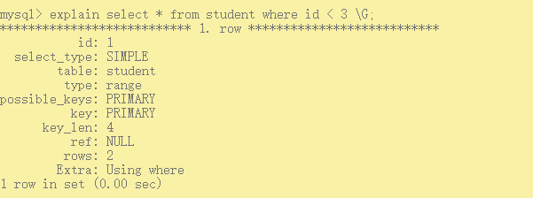
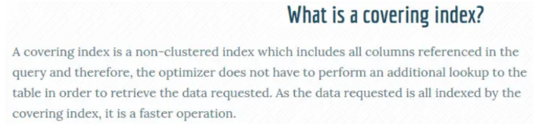

[toc]

## 一、EXPLAIN 查看执行计划

#### 1. 查看执行计划

MySQL 提供了一个 EXPLAIN 命令，它可以对 SELECT 语句进行分析，并输出 SELECT 执行计划的详细信息，供开发人员有针对性的优化。例如：

```sql
EXPLAIN SELECT * from student WHERE id < 3;
```

EXPLAIN 命令的输出内容大致如下：




#### 2. 执行计划分析

##### select_type

表示查询的类型，最常见的是SIMPLE，表示我们的查询没有子查询也没用到UNION查询。

常用的值如下：

- **SIMPLE ：** 表示查询语句**不包含子查询或union**

- **PRIMARY：**表示此查询是**最外层的查询**

- UNION：表示此查询是UNION的第二个或后续的查询

- DEPENDENT UNION：UNION中的第二个或后续的查询语句，使用了外面查询结果

- UNION RESULT：UNION的结果

- SUBQUERY：SELECT子查询语句

- DEPENDENT SUBQUERY：SELECT子查询语句依赖外层查询的结果。


##### type（重要属性）

表示存储引擎查询数据时采用的方式。通过它可以判断出查询是全表扫描还是基于索引的部分扫描。

常用属性值如下，从上至下效率依次增强。

- ALL：表示**全表扫描**，性能最差。

- index：表示**基于索引的全表扫描**，先扫描辅助索引再扫描聚簇索引查找全表数据。与all区别为 **index类型是有序的扫描**

- range：表示**使用索引范围查询**。使用 **>、>=、<、<=、in**等等。

- **ref：**表示使用**非唯一索引（普通的索引）进行单值查询**。

- eq_ref：一般情况下出现在多表join查询，表示前面表的每一个记录，都只能匹配后面表的一行结果。

- **const：**表示使用**主键或唯一索引做等值查询（最多只有一个匹配行），常量查询**。

- NULL：表示不用访问表，速度最快


##### possible_keys

表示查询时能够使用到的索引。注意并不一定会真正使用，显示的是索引名称。


##### key（重要属性）

表示查询时真正使用到的索引，显示的是索引名称。


##### rows（重要属性）

MySQL查询优化器会根据统计信息，估算SQL要查询到结果需要扫描多少行记录。原则上rows是越少效率越高，可以直观的了解到SQL效率高低。


##### key_len

表示查询使用了索引的字节数量。可以判断是否全部使用了组合索引。


##### Extra

Extra表示很多额外的信息，各种操作会在Extra提示相关信息，常见几种如下：

- **Using where**

  表示查询**通过索引回表查询数据**。

- **Using index**

  表示查询通过索引，索引就可以满足所需数据，即**覆盖索引**

- **Using index condition（索引下推 ICP-Index condition Pushdown）**

  表示可能使用了索引下推，减少了不必要的回表操作。对于查找出来的数据，先过滤掉不符合条件的，其余的再去主键索引树上查找。

- **Using filesort**

  表示查询出来的结果**额外排序**，数据量小在内存，大的话在磁盘，因此**有Using filesort建议优化**。

- **Using temprorary**

  查询使用到了临时表，一般出现于去重、分组等操作。


## 二、回表查询

之前介绍过，InnoDB索引有聚簇索引和辅助索引。

聚簇索引的叶子节点存储行记录，InnoDB必须要有，且只有一个。

辅助索引的叶子节点存储的是主键值和索引字段值，通过辅助索引无法直接定位行记录。

通常情况下，需要扫码两遍索引树。**先通过辅助索引定位主键值**，然后**再通过聚簇索引定位行记录**，这就叫做**回表查询**，它的性能比扫一遍索引树低。

总结：**通过索引查询主键值，然后再去聚簇索引查询记录信息**


## 三、覆盖索引



在MySQL官网，类似的说法出现在explain查询计划优化章节，即explain的输出结果==Extra字段为Usingindex时，能够触发索引覆盖==


==**只需要在一棵索引树上就能获取SQL所需的所有列数据**，无需回表，速度更快，这就叫做索引覆盖。==

实现索引覆盖最常见的方法就是：==将被查询的字段，建立到组合索引==。


## 四、最左前缀原则

复合索引使用时遵循最左前缀原则，最左前缀顾名思义，就是最左优先，即查询中使用到最左边的列，那么查询就会使用到索引，如果从索引的第二列开始查找，索引将失效。

根据前面索引的相关知识，得知B+Tree每个节点的关键字都是由小到大排序的，当使用==复合索引(col1,col2)时，Key的排序为：先按col1排序，当col1相同时再按col2排序==。所以复合索引(col1,col2)支持单个col1列的索引查询，而==单独使用col2缺无法定位索引中的Key值==


## 五、索引下推

索引下推(Index Condition Pushdown) ICP 是Mysql5.6之后新增的功能，主要的核心点就在于把数据筛选的过程放在了存储引擎层去处理，而不是像之前一样放到Server层去做过滤。

使用ICP之后我们就是简单的 **通过联合索引中本来就有的数据直接过滤了**，不需要再查到一堆无用的数据去Server层进行过滤，这样的话**减少了回表的次数**和返回的数据，IO次数减少了，对性能有很好的提升

**索引下推一定是在联合索引的情况下**，**根据联合索引本身就有的数据**直接做一次过滤，而不用再进行多次无用的回表再到Server层进行过滤


**创建 `user `表以及复合索引 `user_age`**


**查询执行计划，explain select * from user_demo where age > 18 and username like '张%'; **

结果如下图所示，Extra显示`Using index condition`，则表示使用了索引下推


**该表存在以下两个索引树，一个聚簇索引，一个组合索引（辅助索引）**


**在没有ICP索引下推的时候，这个查询的流程应该是这样（略过无关的细节）：**


1. Mysql Server层调用API查询存储引擎数据
2. 存储引擎根据联合索引首先通过条件找到所有 `age>18` 的数据
3. 找到的每一条数据都根据主键索引进行回表查询，直到找到不符合条件的结果
4. 返回数据给Server层，Server根据条件对结果进行过滤，流程结束


**而有了ICP之后的流程则是这样：**


1. Mysql Server层调用API查询存储引擎数据
2. 存储引擎根据联合索引首先通过条件找到所有 `age>18` 的数据，**根据联合索引中已经存在的 `name` 数据进行过滤，找到符合条件的数据**
3. 根据找到符合条件的数据，回表查询
4. 返回数据给Server层，流程结束


## 六、Like 查询

**面试题：MySQL在使用like模糊查询时，索引能不能起作用？**

回答：MySQL在使用Like模糊查询时，索引是可以被使用的，只有把%字符写在后面才会使用到索引。

- select * from user where name like '%o%'; //不起作用

- select * from user where name like 'o%'; //起作用

- select * from user where name like '%o'; //不起作用


## 七、NULL 查询

对MySQL来说，NULL是一个特殊的值

从概念上讲，==NULL意味着 “一个未知值”==，它的处理方式与其他值有些不同。比如：

- 不能使用=，<，>这样的运算符，对NULL做算术运算的结果都是NULL
- count函数 不会包括NULL行等
- NULL比空字符串需要更多的存储空间等，因为NULL列需要增加额外空间来记录其值是否为NULL


**面试题：如果MySQL表的某一列含有NULL值，那么包含该列的索引是否有效？**

虽然MySQL==可以在含有NULL的列上使用索引==，但NULL和其他数据还是有区别的，不建议列上允许为NULL。==最好设置NOT NULL==，==并给一个默认值==，比如0和 ‘’ 空字符串等，如果是datetime类型，也可以设置系统当前时间或某个固定的特殊值，例如'1970-01-01 00:00:00'。


## 八、排序与索引

**MySQL查询支持 filesort 和 index两种方式的排序**

- filesort是==先查出结果==，然后==在缓存或磁盘进行排序==操作，==效率较低==
  - 双路排序：需要两次磁盘扫描读取，最终得到用户数据。第一次将**排序字段读取出来，然后排序**；第二次再去**读取其他字段数据**
  - 单路排序：从磁盘查询所需的所有列数据，然后**在内存排序**将结果返回
- 使用index是指 ==**利用索引自动实现排序**==，不需另做排序操作，==一般使用复合索引==，==效率会比较高==


执行计划的Extra属性显示Using fifilesort，表示使用了fifilesort排序方式，需要优化。

如果Extra属性显示Using index时，表示覆盖索引，也表示所有操作在索引上完成，也可以使用index排序方式，**==建议大家尽可能采用覆盖索引。==**


**index 的排序查询**

- ==ORDER BY 子句索引列组合满足索引最左前缀原则==

  ```sql
  explain select id from user order by id; //对应(id)、(id,name)索引有效
  ```

  

- ==WHERE子句+ORDER BY子句==索引列组合==满足索引最左前列==

  ```sql
  explain select id from user where age=18 order by name; //对应 (age,name)索引
  ```

  


**filesort 的排序查询**

- 对索引列同时使用了ASC和DESC

  ```sql
  explain select id from user order by age asc,name desc; //对应 (age,name)索引
  ```

  

- WHERE子句和ORDER BY子句满足最左前缀，但where子句使用了范围查询（例如>、<、in等）

  ```sql
  explain select id from user where age>10 order by name; //对应 (age,name)索引
  ```

  

- ORDER BY或者WHERE+ORDER BY索引列没有满足索引最左前列

  ```sql
  explain select id from user order by name; //对应(age,name)索引
  ```

  

- 使用了不同的索引，MySQL每次只采用一个索引，ORDER BY涉及了两个索引

  ```sql
  explain select id from user order by name,age; //对应(name)、(age)两个索 引
  ```

  

- WHERE子句与ORDER BY子句，使用了不同的索引

  ```sql
  explain select id from user where name='tom' order by age; //对应 (name)、(age)索引
  ```

  

- WHERE子句或者ORDER BY子句中索引列使用了表达式，包括函数表达式

  ```sql
  explain select id from user order by abs(age); //对应(age)索引
  ```

  


## 九、查询优化步骤

### 1.定位慢查询

#### 1.1 开启慢查询日志

1. 查看 MySQL 数据库是否开启了慢查询日志和慢查询日志文件的存储位置的命令如下：

   **`SHOW VARIABLES LIKE 'slow_query_log%' `**

2. 通过如下命令开启慢查询日志：

   ```
   SET global slow_query_log = ON; 
   SET global slow_query_log_file = 'OAK-slow.log'; 
   SET global log_queries_not_using_indexes = ON;  # 会记录没有使用索引的查询SQL。
   SET long_query_time = 10; # 指定慢查询的阈值，单位秒。
   ```

   

#### 1.2 查看慢查询日志

- 文本方式查看

  

  - time：日志记录的时间

  - User@Host：执行的用户及主机

  - Query_time：执行的时间

  - Lock_time：锁表时间

  - Rows_sent：发送给请求方的记录数，结果数量

  - Rows_examined：语句扫描的记录条数

  - SET timestamp：语句执行的时间点

  - select....：执行的具体的SQL语句

- 使用mysqldumpslow查看

  MySQL 提供了一个==慢查询日志分析工具mysqldumpslow==，可以通过该工具分析慢查询日志内容。

  在 MySQL bin目录下执行：**`perl mysqldumpslow.pl --help`**

  查看慢查询日志信息：**`perl mysqldumpslow.pl -t 5 -s at C:\ProgramData\MySQL\Data\OAK-slow.log`**


### 2. 慢查询优化

使用==索引未必能提高一条 SQL 的查询效率==，比如`select * from user where id>0; `，此时==依然进行了从最左节点到最右节点的整颗聚簇索引树的扫描==，即全表扫描

#### 2.1 提高索引过滤性

索引过滤性与索引字段、表的数据量、表设计结构都有关系。在Where语句的列上，对过滤性高的一个列或者组合列上建立单个索引或者复合索引。

此时有Extra会有 `using index condition`，即索引下推。条件过滤下沉到存储引擎层，先通过索引过滤一遍结果，在此基础上再进行扫描

#### 2.2 避免全表/全索引扫描

type为 All 或者 Index都是全表扫描，区别是Index扫描扫描有序


#### 2.3 避免大数据量的回表查询，使用覆盖索引


### 3. 分页查询优化

#### 3.1 问题解析

一般性分页查询使用简单的 limit 子句就可以实现。limit格式如下：

**`SELECT * FROM 表名 LIMIT [offset,] rows `**

- 第一个参数指定第一个返回记录行的偏移量，注意从0开始；

- 第二个参数指定返回记录行的最大数目；

- 如果只给定一个参数，它表示返回最大的记录行数目；

**偏移量每次都会从第一条记录开始扫描，若偏移量很大，会拖慢总查询速度。**


#### 3.2 分页查询优化

- 利用覆盖索引

  ```sql
  --select * from user limit 10000,100;
  select id from user limit 10000,100;
  ```

  

- 利用子查询

  使用了id做主键比较(id>=)，并且子查询使用了覆盖索引进行优化。

  ```sql
  --select * from user limit 10000,100; 
  select * from user where id>= (select id from user limit 10000,1) limit 100;
  ```

  

