[toc]


### 1. MySQL安装

#### 1.1下载

```sh
wget https://cdn.mysql.com/archives/mysql-5.7/mysql-5.7.28-1.el7.x86_64.rpm-bundle.tar 
```


#### 1.2 解压

```shell
tar xvf mysql-5.7.28-1.el7.x86_64.rpm-bundle.tar
```


#### 1.3 安装

##### 要移除CentOS自带的mariadb-libs，不然会提示冲突

```shell
rpm -qa|grep mariadb 
rpm -e mariadb-libs-5.5.41-2.el7_0.x86_64 --nodeps
```

##### 由于MySQL的server服务依赖了common、libs、client，所以需要按照以下顺序依次安装。

```shell
rpm -ivh mysql-community-common-5.7.28-1.el7.x86_64.rpm 
rpm -ivh mysql-community-libs-5.7.28-1.el7.x86_64.rpm 
rpm -ivh mysql-community-libs-compat-5.7.28-1.el7.x86_64.rpm 
rpm -ivh mysql-community-client-5.7.28-1.el7.x86_64.rpm 
rpm -ivh mysql-community-server-5.7.28-1.el7.x86_64.rpm 
rpm -ivh mysql-community-devel-5.7.28-1.el7.x86_64.rpm
```

##### 查看是否安装成功

```shell
rpm -qa | grep 软件名称
```


#### 1.4 启动

###### 初始化用户

```sh
mysqld --initialize --user=mysql
```


###### 查看初始密码

```sh
cat /var/log/mysqld.log | grep password
```


###### 启动mysql服务

```sh
systemctl start mysqld
```


###### 配置为开机启动

```sh
systemctl enable mysqld
```


###### 接下来登录mysql，修改默认密码。

```sh
mysql -uroot -p 
mysql> SET PASSWORD = PASSWORD('123456'); 
```


##### 1.5 关闭防火墙

不同的MySQL直接要互相访问，需要关闭Linux的防火墙，否则就要在配置/etc/sysconfifig/iptables中增加规则

```sh
systemctl stop firewalld
```


### 2. 主从架构搭建

#### 1）Master

###### 使用vi /etc/my.cnf命令修改Master配置文件

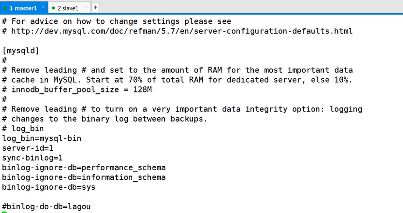

```properties
#bin_log配置 
log_bin=mysql-bin 
server-id=1 
# 每次写入,binlog磁盘写入
sync-binlog=1 
binlog-ignore-db=information_schema 
binlog-ignore-db=mysql 
binlog-ignore-db=performance_schema 
binlog-ignore-db=sys 
```

以下为多主模式配置：

```properties
#bin_log配置 
log_bin=mysql-bin
server-id=1
# 每次写入,binlog磁盘写入
sync-binlog=1
binlog-ignore-db=information_schema
binlog-ignore-db=mysql
binlog-ignore-db=performance_schema
binlog-ignore-db=sys

# （双主添加）relay_log配置 
relay_log=mysql-relay-bin
log_slave_updates=1 
relay_log_purge=0
```


###### 重启服务

```sh
systemctl restart mysqld
```


###### 主库给从库授权以及用户授权

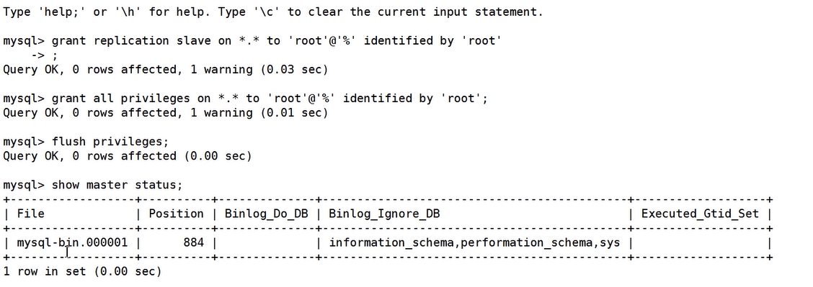

登录MySQL，在MySQL命令行执行如下命令：

```sh
// 授权从库复制
mysql> grant replication slave on *.* to root@'%' identified by '密码'; 

// 授权用户权限
mysql> grant all privileges on *.* to root@'%' identified by '密码'; 
mysql> flush privileges;

//查看主库状态信息，例如master_log_file='mysql-bin.000007',master_log_pos=154 
mysql> show master status;
```


#### 2）Slave

###### 修改Slave的MySQL配置文件my.cnf，两台Slave的server-id分别设置为2和3

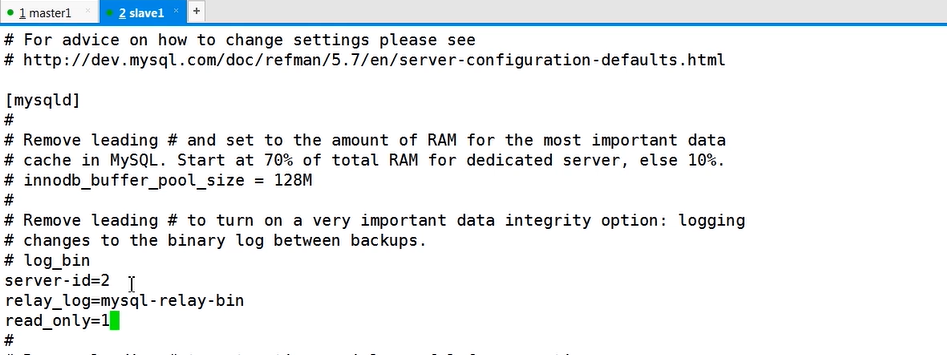

```properties
#服务器ID,从库1是2,从库2是3 
server-id=2 
relay_log=mysql-relay-bin 
read_only=1
```

以下为多主模式的从库配置：

```properties
#bin_log配置 
log_bin=mysql-bin
#服务器ID,从库1是2,从库2是3 
server-id=2 
# 每次写入,binlog磁盘写入
sync-binlog=1
binlog-ignore-db=information_schema
binlog-ignore-db=mysql
binlog-ignore-db=performance_schema
binlog-ignore-db=sys

# （双主添加）relay_log配置 
relay_log=mysql-relay-bin
log_slave_updates=1 
relay_log_purge=0
read_only=1
```


###### 重启

```sh
systemctl restart mysqld
```


###### 重新登陆，使用show slave status \G确认当前是否已经开启从库，是的则stop slave;

###### 用户授权

登录MySQL，在MySQL命令行执行如下命令：

```sh
mysql> grant all privileges on *.* to root@'%' identified by '密码'; 
mysql> flush privileges; 
```


###### 开启同步

登录MySQL，在Slave节点的MySQL命令行执行同步操作，例如下面命令（注意参数与上面showmaster status操作显示的参数一致）

```sh
change master to master_host='192.168.31.199',master_port=3306,master_user='root',master_password ='123456',master_log_file='mysql-bin.000007',master_log_pos=154; 
start slave; // 开启同步

show slave status \G;
```


### 3. 默认异步复制，修改为半同步复制

#### 1）Master节点

###### 登录MySQL，在MySQL命令行执行下面命令安装插件

```sh
install plugin rpl_semi_sync_master soname 'semisync_master.so'; 
show variables like '%semi%';
```


###### 使用vi /etc/my.cnf，修改MySQL配置文件

```properties
# 自动开启半同步复制 
rpl_semi_sync_master_enabled=ON 
# 半同步复制延时
rpl_semi_sync_master_timeout=1000
```


###### 重启MySQL服务

```sh
systemctl restart mysqld
```


#### 2）Slave节点

###### 登录MySQL，在MySQL命令行执行下面命令安装插件

```sh
install plugin rpl_semi_sync_slave soname 'semisync_slave.so';
```


###### 使用vi /etc/my.cnf，修改MySQL配置文件

```properties
# 自动开启半同步复制 
rpl_semi_sync_slave_enabled=ON
```


###### 重启服务

```sh
systemctl restart mysqld
```


#### 3）测试半同步状态

###### 首先通过MySQL命令行检查参数的方式，查看半同步是否开启

```sh
show variables like '%semi%';
```


###### 然后通过MySQL日志再次确认

```sh
cat /var/log/mysqld.log
```


###### 可以看到日志中已经启动半同步信息，例如：

```sh
Start semi-sync binlog_dump to slave (server_id: 2), pos(mysql-bin.000005, 154)
```


### 4. 默认异步复制，修改为并行复制

#### 1）Master节点

###### 登录MySQL，在MySQL命令下执行参数查询

```sql
show variables like '%binlog_group%';
```

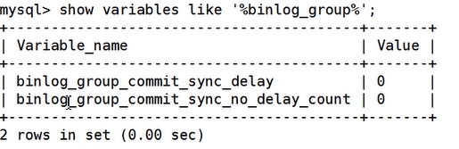

###### 使用vi /etc/my.cnf，修改MySQL配置文件

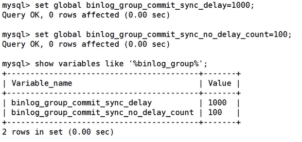

```properties
# 组提交延时
binlog_group_commit_sync_delay=1000
# 每组提交的事务数量
binlog_group_commit_sync_no_delay_count=100
```


###### 若修改配置文件，则重启MySQL

```sh
systemctl restart mysqld
```


#### 2）Slave节点

###### 登录MySQL，在MySQL命令下执行参数查询

```sql
show variables like '%slave%';
```

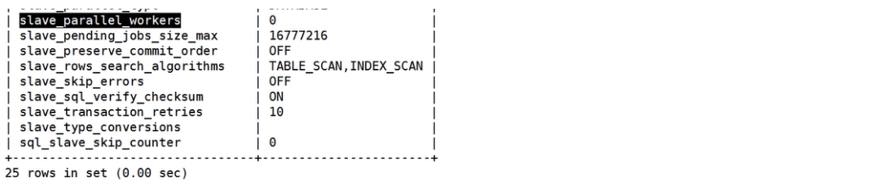


###### 使用vi /etc/my.cnf，修改MySQL配置文件

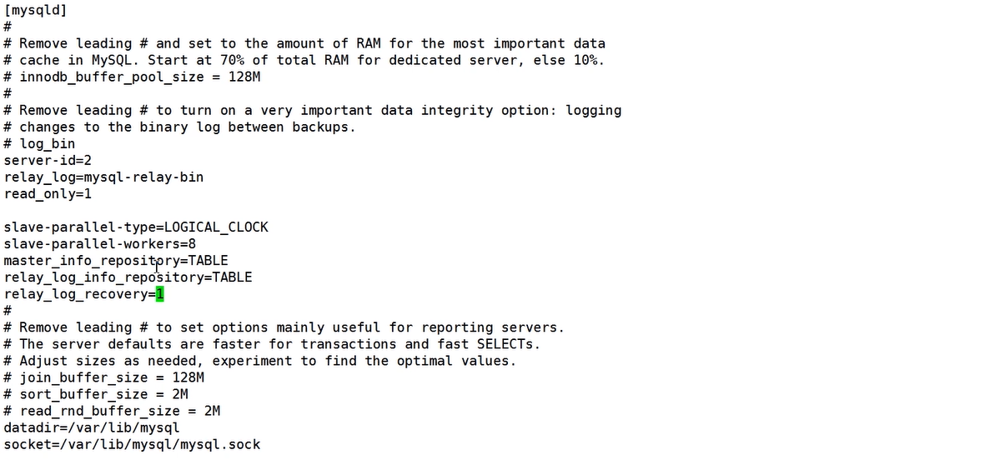

```properties
# 设置为基于组提交的并行复制，为了兼容MySQL5.6，默认值为DATABASE（基于库的并行复制）
slave_parallel_type=LOGICAL_CLOCK
# 工作线程数量
slave_parallel_workers=8
```


###### 登录MySQL，在MySQL命令下执行参数查询

```sql
show variables like '%relay_log%';
```

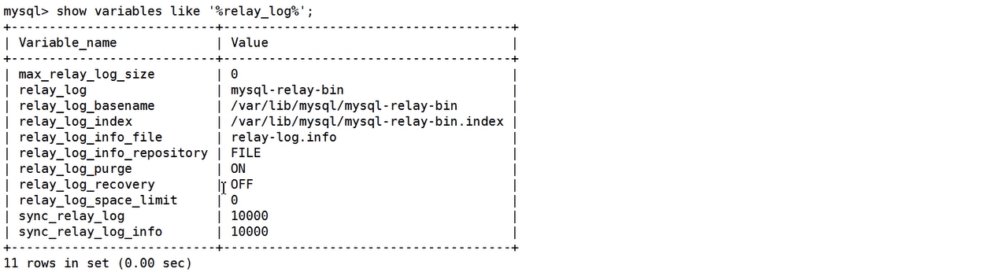

###### 使用vi /etc/my.cnf，修改MySQL配置文件，或使用命令直接设置


```properties
relay_log_recovery=1
relay_log_info_repository=TABLE
master_info_repository=TABLE
```

###### 若修改配置文件，则重启MySQL

```sh
systemctl restart mysqld
```


#### 3）测试

###### Master创建库、表，然后查看从库是否自动复制

###### 查看并行复制日志

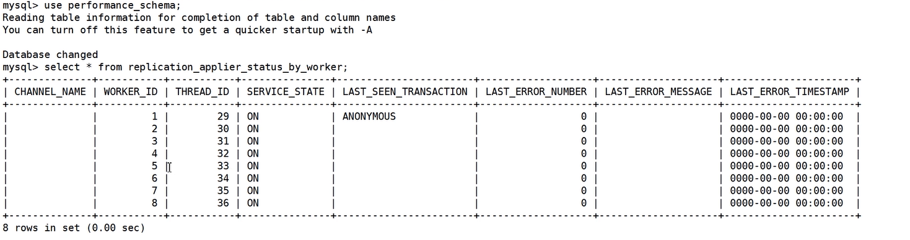

```sql
select * from replication_applier_status_by_worker;
```

###### 查看MySQL日志，确认复制模式

```sh
cat /var/log/mysqld.log
```


### 5. 数据库中间件

使用MySQL Proxy来做代理中间件，完成读写操作的路由。

#### 5.1 单独使用一台服务器做中间件，记得关闭防火墙

#### 5.2 使用wget下载mysql-proxy-0.8.5-linux-el6-x86-64bit.tar.gz

#### 5.3 解压

#### 5.4 vim /etc/mysql-proxy.cnf


```properties
[mysql-proxy]
# 当前系统用户
user=root
# mysql-proxy账号
admin-username=root
# mysql-proxy密码
admin-password=root

# 代理服务器ip
proxy-address=192.168.xx.xx:4040

#主从地址信息
proxy-backend-addresses=192.168.xx.xx:3306
proxy-read-only-backend-addresses=192.168.xx.xx:3306,192.168.xx.xx:3306

#路由脚本
proxy-lua-script=root/mysql-proxy-0.8.5-linux-el6-x86-64bit/share/doc/mysql-proxy/rw-splitting.lua

# 日志
log-file=/var/log/mysql-proxy.log
log-level=debug
# 使用守护进程运行mysqlProxy
daemon=true
# 尝试重启
keepalive=true

```

#### 5.5 修改权限chmod 660 /etc/mysql-proxy.cnf

#### 5.6 修改rw-splitting.lua脚本连接池的最小连接数，由4改为1，只要有一个连接就进行代理操作（进行读写路由）

#### 5.7 启动 ./mysql-proxy-0.8.5-linux-el6-x86-64bit/bin/mysql-proxy --default-file=/etc/mysql-proxy.cnf

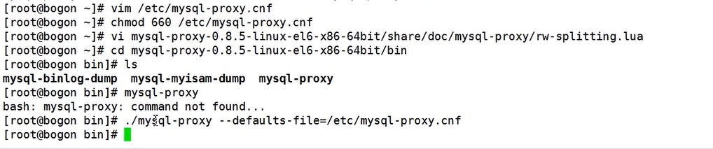

#### 5.8 连接到mysql-proxy

- 使用图形界面工具连接

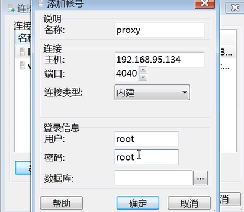

- 使用命令行连接

  `mysql -h192.168.xx.xx -P4040 -uroot -p;`

#### 5.9 直接在代理服务器进行数据库操作，中间件会将指令根据Lua脚本路由到对应的主库或者从库


### 6. mysqldump 

**`mysqldump --all-databases > mysql_backup_all.sql -uroot -p`**

