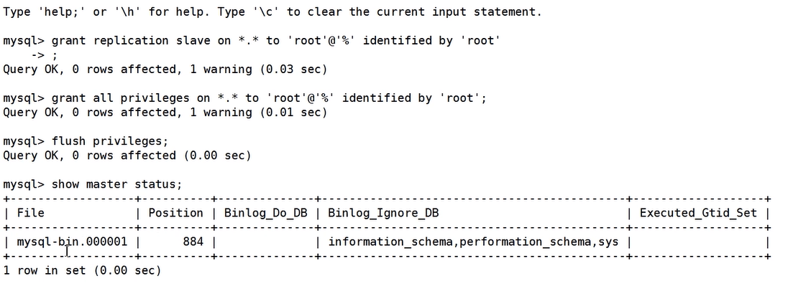

[toc]

### 1. 按照主从架构中的主库配置一台新的主库

#### 1）Master1

###### 使用vi /etc/my.cnf命令修改Master配置文件（基于主从架构的模式，添加一些配置）

```properties
#bin_log配置 
log_bin=mysql-bin
server-id=1
# 每次写入,binlog磁盘写入
sync-binlog=1
binlog-ignore-db=information_schema
binlog-ignore-db=mysql
binlog-ignore-db=performance_schema
binlog-ignore-db=sys

# （双主添加）relay_log配置 
relay_log=mysql-relay-bin
log_slave_updates=1 
relay_log_purge=0

# 双主模式中该主库的id偏移量
auto-increment_offset=1
# 双主模式中id的步长
auto-increment_increment=2
```

###### 重启MySQL

```sh
systemctl restart mysqld;
```

###### 主库给从库授权及用户授权



登录MySQL，在MySQL命令行执行如下命令：

```sh
// 授权从库复制
mysql> grant replication slave on *.* to root@'%' identified by '密码'; 

// 授权用户权限
mysql> grant all privileges on *.* to root@'%' identified by '密码'; 
mysql> flush privileges;

//查看主库状态信息，例如master_log_file='mysql-bin.000007',master_log_pos=154 
mysql> show master status;
```


#### 2）Master2

###### 使用vi /etc/my.cnf命令修改Master配置文件（基于主从架构的模式，添加一些配置）


```properties
#bin_log配置 
log_bin=mysql-bin
server-id=3
# 每次写入,binlog磁盘写入
sync-binlog=1
binlog-ignore-db=information_schema
binlog-ignore-db=mysql
binlog-ignore-db=performance_schema
binlog-ignore-db=sys

# （双主添加）relay_log配置 
relay_log=mysql-relay-bin
log_slave_updates=1 
relay_log_purge=0

# 双主模式中该主库的id偏移量
auto-increment_offset=2
# 双主模式中id的步长
auto-increment_increment=2
```

###### 重启MySQL、登陆MySQL授权，与Master1一致。。


#### 3）双主开启同步

两个主库分别配置为对方的从库


登录MySQL，在Slave节点的MySQL命令行执行同步操作，例如下面命令（注意参数与上面showmaster status操作显示的参数一致）：

```sh
change master to master_host='192.168.31.199',master_port=3306,master_user='root',master_password ='123456',master_log_file='mysql-bin.000007',master_log_pos=154; 

start slave; // 开启同步

show slave status \G;
```


### 2.使用MHA实现双机热备

```
yum install perl-DBD-MySQL perl-Config-Tiny perl-Log-Dispatch perl-Parallel-ForkManager -y
```


- 主库用户名，在master mysql的主库执行下列命令建一个新用户 

- 在所有库执行：create user 'mha'@'%' identified by '123123'; 

- 在所有库执行：grant all on *.* to mha@'%' identified by '123123'; 

- 在所有库执行：flush privileges; 


###### 在MHA服务器，vim /etc/masterha_default.cnf

```properties
[server default] 
user=mha 
password=123456 
port=3306 

#ssh登录账号 
ssh_user=root 

#从库复制账号和密码 
repl_user=root 
repl_password=123456 
port=3306 

#ping次数 
ping_interval=1 


#二次检查的主机 
secondary_check_script=masterha_secondary_check -s 192.168.207.129 -s 192.168.207.130 -s 192.168.207.131
```


###### 在MHA服务器，vim /etc/mha/app1.cnf 

```properties
[server default] 

#MHA监控实例根目录 
manager_workdir=/var/log/mha/app1 


#MHA监控实例日志文件 
manager_log=/var/log/mha/app1/manager.log


#[serverx] 服务器编号 
#hostname 主机名 
#candidate_master 可以做主库 
#master_binlog_dir binlog日志文件目录


[server1] 
hostname=192.168.207.129
candidate_master=1 
master_binlog_dir="/var/lib/mysql"


[server2] 
hostname=192.168.207.130
candidate_master=1 
master_binlog_dir="/var/lib/mysql"


[server3] 
hostname=192.168.207.131
candidate_master=1 
master_binlog_dir="/var/lib/mysql"
```


#### 故障转移主库后，故障恢复手动切换回原主库

###### 启动旧的主库：

```
systemctl start mysqld
```

###### 挂到新主做从库

```shell
change master to master_host='192.168.80.55', master_port=3306, master_user='root',  master_password ='root', master_log_file='xxx', master_log_pos=当前新主节点的日志位置;

start slave; // 开启同步

```

###### 编辑配置文件 /etc/mha/app1.cnf（MHA监控会自动将故障服务器从配置移除）

```
vi   /etc/mha/app1.cnf

#添加节点
```

###### 使用MHA在线切换命令将原主切换回来

结束MHA Manager进程：

```sh
	masterha_stop --global_conf=/etc/masterha/masterha_default.conf --conf=/etc/mha/app1.cnf	
```

执行切换命令：

**注意：**master如果使用ip地址，会报错： 	[error][/usr/share/perl5/vendor_perl/MHA/ServerManager.pm, ln1218] 192.168.80.128 is not alive! 需要将ip地址设置成主机名即可

```sh
masterha_master_switch   --conf=/etc/mha/app1.cnf --master_state=alive --new_master_host=master --new_master_port=3306 --orig_master_is_new_slave --running_updates_limit=10000
```

