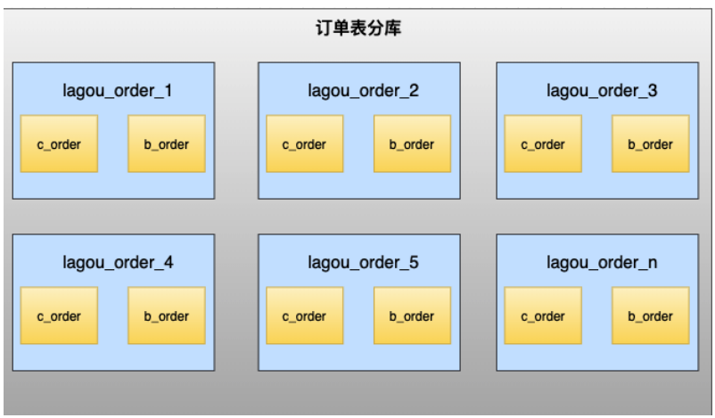

[toc]

## 一、主从模式

### 1. 使用场景

MySQL主从模式是指数据可以从一个MySQL数据库服务器主节点复制到一个或多个从节点。

MySQL 默认采用异步复制方式，这样从节点不用一直访问主服务器来更新自己的数据，从节点可以复制主数据库中的所有数据库，或者特定的数据库，或者特定的表

- ==高可用==

  通过 MHA高可用方案，实现集群故障转移，主库挂了30秒内从库自动升级为主库

- ==读扩展==

  ==[读写分离](#4. 读写分离)==，主写从读，多台从库提高了读的吞吐量，解决读的系统瓶颈。

  可使用应用端中间件（ShardingJDBC）或服务端中间件（MySQL Proxy、Mycat、ShardingSphere）来完成写路由到主机，读负载均衡到某台从机

  在应用中可以在从库追加多个索引来优化查询，主库这些索引可以不加，用于提升写效率。

### 2. 实现原理

##### 2.1 原理图（异步复制模式）

- 主库将数据库的变更操作记录到 ==Binlog日志文件==

- 从库读取主库中的Binlog日志文件信息写入到从库的 ==Relay Log中继日志==

- 从库读取中继日志信息在从库中进行Replay,更新从库数据信息

##### 2.2 线程模型

- ==Master 的BinlogDump Thread==

  Master服务器对数据库更改操作记录在Binlog中，BinlogDump Thread接到写入请求后，读取Binlog信息推送给Slave的I/O Thread

- ==Slave的I/O Thread==

  读取到的Binlog信息写入到本地Relay Log

- ==Slave的SQL Thread==

  检测到Relay Log的变更请求，解析relay log中内容在从库上执行

### 3. 主从架构的复制模式

##### 3.1 异步复制（默认的复制模式）

时序图：

mysql主从复制存在的问题：

- 主库宕机后，数据可能丢失

- 从库只有一个SQL Thread，主库写压力大，复制很可能延时

解决方法：

- 半同步复制---解决数据丢失的问题

- 并行复制----解决从库复制延迟的问题

##### 3.2 半同步复制（MySQL从5.5引入，解决数据丢失的问题）

为了降低数据丢失的概率，Master在某一个时间点等待Slave节点的 ACK（*Ack*nowledgecharacter）消息，接收到ACK消息后才进行事务提交，这也是半同步复制的基础

时序图：

分类：

- 当Master需要在第三步等待Slave返回ACK时，即为 after-commit，半同步复制（MySQL 5.5引入）。

- 当Master需要在第二步等待 Slave 返回 ACK 时，即为 after-sync，增强半同步（MySQL 5.7引入）。

##### 3.3 并行复制（MySQL从5.6引入，改善复制延迟问题）

并行复制称为enhanced multi-threaded slave（简称MTS）

从库的 IO和SQL 线程都是单线程模式工作，因此有了延迟问题，

IO线程将主库的binlog复制到从库，SQL Thread采用多线程并行地对relay log并行执行，减少从库复制延迟。（IO Thread多线程意义不大，主要指的是SQL Thread多线程）

MySQL 5.6的并行复制是基于**库的并行复制**

##### 3.4 并行复制（MySQL 5.7）

MySQL 5.7是通过**对事务进行分组**，当事务提交时，它们将在单个操作中写入到二进制日志中。如果**多个事务能同时提交成功**，那么它们意味着没有冲突，因此**可以在Slave上并行执行**，所以通过在主库上的**binglog中添加组提交信息**。

MySQL 5.7的并行复制基于一个前提：**所有已经处于prepare阶段的事务**，都是可以并行提交的。这些当然也可以在从库中并行提交，因为处理这个阶段的事务都是没有冲突的。在一个组里提交的事务，一定不会修改同一行。这是一种新的并行复制思路，完全摆脱了原来一直致力于为了防止冲突而做的分发算法，等待策略等复杂的而又效率底下的工作。

==InnoDB事务提交采用的是两阶段提交模式。一个阶段是prepare（执行sql，生成undolog、redolog、binlog），另一个是commit。==

为了兼容MySQL 5.6基于库的并行复制，5.7引入了新的变量slave-parallel-type，其可以配置的值有：DATABASE（默认值，基于库的并行复制方式）、LOGICAL_CLOCK（基于组提交的并行复制方式）。

###### 那么如何知道事务是否在同一组中，生成的Binlog内容如何告诉Slave哪些事务是可以并行复制的？

在MySQL 5.7版本中，其设计方式是将组提交的信息存放在GTID中。为了避免用户没有开启GTID功能（gtid_mode=OFF），MySQL 5.7又引入了称之为Anonymous_Gtid的二进制日志event类型ANONYMOUS_GTID_LOG_EVENT。

### 4. 读写分离

主写从读，多台从库提高了读的吞吐量

可使用应用端中间件（ShardingJDBC）或服务端中间件（MySQL Proxy、Mycat、ShardingSphere）来完成写路由到主机，读负载均衡到某台从机

在应用中可以在从库追加多个索引来优化查询，主库这些索引可以不加，用于提升写效率。

##### 4.1 数据库中间件

- MySQL Proxy：是官方提供的MySQL中间件产品可以实现负载平衡、读写分离等。

- MyCat：MyCat是一款基于阿里开源产品Cobar而研发的，基于 Java 语言编写的开源数据库中间件。

- ShardingSphere：ShardingSphere是一套开源的分布式数据库中间件解决方案，它由Sharding-JDBC、Sharding-Proxy和Sharding-Sidecar（计划中）这3款相互独立的产品组成。已经在2020年4月16日从Apache孵化器毕业，成为Apache顶级项目。

- Atlas：Atlas是由 Qihoo 360公司Web平台部基础架构团队开发维护的一个数据库中间件。

- Amoeba：变形虫，该开源框架于2008年开始发布一款 Amoeba for MySQL软件。

##### 4.2 带来的好处：

- 扩展读性能及高可用
- 消除了事务隔离级别的读写锁机制带来的冲突，提升并发性
- 写库的表不建索引（提升写效率），读库的表建立索引（提升查询效率）

##### 4.3 主从同步的延时，一致性问题

- 同一个事务中既有写也有读的情况，都直接在主库上操作
- 对于实时性要求高的业务，直接读主库

- 依靠数据库中间件来完成路由（MySQL Proxy、Mycat、ShardingSphere）

  比如在同步延时 T 时间内，读操作直接路由给主库，同步完成后的读操作路由给从库

##### 4.4 读写的路由机制

###### 4.4.1 ==基于编程和配置实现（应用端）==

在代码中根据操作类型进行路由分配，增删改操作主库，查询操作从库。

这类方法也是目前生产环境下应用最广泛的。

- 优点：程序在代码中实现，不需要增加额外的硬件开支，==可使用应用端中间件（ShardingJDBC）==
- 缺点：运维人员无从下手，如果其中一个数据库宕机了，就需要修改配置重启项目。

###### 4.4.2 ==基于服务器端代理实现（服务器端）==

数据库中间件代理一般介于应用服务器和数据库服务器之间

应用服务器并不直接访问 Master库 或者 Slave库，而是进入MySQL proxy代理服务器，代理服务器接收请求的SQL，根据内部的路由策略 转发到后端master和slave数据库

服务端中间件（MySQL Proxy、Mycat、ShardingSphere）来完成写路由到主机，读负载均衡到某台从机

## 二、双主模式（不建议使用，建议直接使用水平分库分表）

### 1. 使用场景

随着业务的发展，数据库架构可以由主从模式演变为双主模式。双主模式是指两台服务器互为主从，任何一台服务器数据变更，都会通过复制应用到另外一方的数据库中（**注意：**主库发送binlog时，会过滤由其他主库发送过来的事务ID的记录）

- 继承主从模式的特性（就是主从模式基础上增加一台主库）
- 另外，扩展了写的高可用（热备主库，故障可自动转移）

双主双写？双主单写？

双主双写的问题：

- ID冲突

  尚未同步时，多次切换不同主库写，造成双主的ID冲突。（可使用分布式ID解决）

- 事务的并发控制失效

  两个不同的库

高可用架构如下图所示，其中一个Master提供线上服务，另一个Master作为备胎供高可用切换，Master下游挂载Slave承担读请求

随着业务发展，架构会从主从模式演变为双主模式，建议用双主单写，再引入高可用组件，例如Keepalived和MHA等工具，实现主库故障自动切换

### 2. 实现双主高可用组件

##### 2.1 MMM

MMM（Master-Master Replication Manager for MySQL）是一套用来管理和监控双主复制，支持双主故障切换 的第三方软件。

MMM 使用Perl语言开发，虽然是双主架构，但是业务上同一时间只允许一个节点进行写入操作。下图是基于MMM实现的双主高可用架构

- **MMM故障处理机制**

  MMM 包含writer和reader两类角色，分别对应写节点和读节点

  1. 当 writer节点出现故障，程序会自动移除该节点上的VIP
  2. 写操作切换到 Master2，并将Master2设置为writer
  3. 将所有Slave节点会指向Master2
  4. 当 Slave 节点 出现宕机、复制延迟或复制错误，MMM 会移除该节点的 VIP，直到节点恢复正常。

- **MMM 包含monitor和agent两类程序，功能如下：**

  - monitor：监控集群内数据库的状态，在出现异常时发布切换命令，一般和数据库分开部署。
  -  agent：运行在每个 MySQL 服务器上的代理进程，monitor 命令的执行者，完成监控的探针工作和具体服务设置，例如设置 VIP（虚拟IP）、指向新同步节点。

##### 2.2 MHA

MHA（Master High Availability）是一套比较成熟的 MySQL 高可用方案，也是一款优秀的故障切换和主从提升的高可用软件。

在MySQL故障切换过程中，MHA能做到在  ==30秒之内自动完成数据库的故障切换==  操作，并且在进行故障切换的过程中，MHA能在最大程度上  ==保证数据的一致性==，以达到真正意义上的高可用。MHA还  ==支持在线快速将Master切换到其他主机，只需0.5－2秒==

目前MHA ==主要支持一主多从的架构==，要搭建MHA，要求一个复制集群中必须==最少有三台数据库服务器==

**MHA由两部分组成：MHA Manager（管理节点）和MHA Node（数据节点）**

- MHA Manager

  单独部署在一台独立的机器上管理多个master-slave集群，也可以部署在一台slave节点上。负责检测master是否宕机、控制故障转移、检查MySQL复制状况等

- MHA Node

  运行在每台MySQL服务器上，不管是Master角色，还是Slave角色，都称为Node，是被监控管理的对象节点。

  负责保存和复制master的二进制日志、识别差异的中继日志事件并将其差异的事件应用于其他的slave、清除中继日志

**MHA故障处理机制（自动将最新数据的slave提升为新的master）**

- 把宕机master的binlog保存下来

- 根据binlog位置点找到最新的slave

- 用最新slave的relay log修复其它slave

- 将保存下来的binlog在最新的slave上恢复

- 将最新的slave提升为master

- 将其它slave重新指向新提升的master，并开启主从复制

**MHA优点**

- 自动故障转移快

- 主库崩溃不存在数据一致性问题

- 性能优秀，支持半同步复制和异步复制

- 一个Manager监控节点可以监控多个集群

## 三、分库分表

### 1. 背景

- 刚开始我们的系统只用了**单机数据库**

- 随着用户的不断增多，考虑到系统的高可用和越来越多的用户请求，我们开始使用数据库**主从架构**

- 当用户量级和业务进一步提升后，==写请求越来越多==，这时我们开始使用了**==分库分表==**

互联网系统需要处理大量用户的请求。比如==微信日活用户破10亿，海量的用户每天产生海量的数量==；美团外卖，每天都是几千万的订单，那这些系统的==用户表、订单表、交易流水表==等是如何处理呢？

#### 1.1 为什么要分库分表

- 单库数据量太大

  服务器的TPS、内存、IO和磁盘空间都是有上限的，数据量太大造成MySQL性能瓶颈

- 单表数据量太大

  单表数据量大，存储引擎层面来说，表空间过大存储的page页多，数据检索效率变慢，插入/更新B树结构变化导致写效率低

### 2. 分库分表简介

在分布式存储系统中，数据需要分散存储在多台设备上，分片就是把数据库横向扩展到多个数据库服务器上的一种有效的方式，其主要目的就是为**突破单节点数据库服务器的 I/O、CPU、内存限制**，解决数据库扩展性问题

- 横向扩展：一个库变多个库，加机器数量

- 纵向扩展：优化机器性能，加高配CPU或内存

==数据量只增不减，历史数据又必须要留存==，非常容易==成为性能的瓶颈==，而要解决这样的数据库瓶颈问题，==“读写分离”和缓存往往都不合适==，目前比较普遍的方案就是使用NoSQL/NewSQL或者采用分库分表

分库分表方案：只分库、只分表、分库又分表。

拆分方式

- **[垂直/纵向拆分（根据业务逻辑拆分后，行记录数并不会变）](#1.1 垂直拆分（根据业务逻辑拆分后，行记录数并不会变）)**
  - 分库：根据业务逻辑，将表按库进行分离
  - 分表：将多字段大表，拆分成小字段的多个表，解决表中字段过多问题

- **[水平/横向拆分（拆分后，行记录数变少）](#1.2 水平拆分（拆分后，行记录数变少）)**
  - 分库：根据分片键，分片策略将一张含有很多记录数的表水平切分至多个库中，每个库都有这张表，并且每个表保存部分数据
  - 分表：根据分片键，分片策略将一张含有很多记录数的表水平切分至多个库或表中，拆分成几张结构相同的表

### 3. 拆分方式

日常工作中，我们通常会同时使用两种拆分方式

- 垂直拆分更偏向于产品/业务/功能拆分的过程
- 在技术上我们更关注水平拆分的方案

#### 3.1 垂直拆分（根据业务逻辑拆分后，行记录数并不会变）

垂直拆分又称为纵向拆分，有以下两种类型

- [垂直分库](#垂直分库)：根据业务逻辑，将表按库进行分离
- [垂直分表](#垂直分表)：将多字段大表，拆分成小字段的多个表，解决表中字段过多问题

应用时有垂直分库和垂直分表两种方式，==一般谈到的垂直拆分主要指的是垂直分库==

##### 垂直分库

微服务架构时，业务切割得足够独立，数据也会按照业务切分，==保证业务数据隔离==，大大提升了数据库的吞吐能力

将用户表、简历、职位表拆分到不同的数据库中

##### 垂直分表

表中字段太多且包含大字段的时候，在查询时对数据库的IO、内存会受到影响（字段太多导致行记录跨页存储，影响搜索速度），同时更新数据时，产生的binlog文件会很大，MySQL在主从同步时也会有延迟的风险

##### 垂直拆分优点

- ==按照业务规则拆分后，业务清晰==

- 易于数据的维护和扩展
- 可以使得行数据变小，一个数据块 (Block) 就能存放更多的数据，在查询时就会减少 I/O 次数
- 可以达到最大化利用 Cache 的目的，具体在垂直拆分的时候可以将不常变的字段放一起，将经常改变的放一起
- 便于实现冷热分离的数据表设计模式

##### 垂直拆分缺点

- 主键出现冗余，需要管理冗余列

- 会引起表连接 JOIN 操作，可以通过在业务服务器上进行 join 来减少数据库压力，提高了系统的复杂度

- 依然存在单表数据量过大的问题
- 事务处理复杂

#### 3.2 水平拆分（拆分后，行记录数变少）

水平拆分又称为横向拆分

- [水平分库](#水平分库)：根据分片键，分片策略将一张含有很多记录数的表水平切分至多个库中，每个库都有这张表，并且每个表保存部分数据
- [水平分表](#水平分表)：根据分片键，分片策略将一张含有很多记录数的表水平切分至多个表中，拆分成几张结构相同的表

##### 水平分库

将单表的数据切分到多个服务器上去，每个服务器具有相应的库与表，只是==表中数据集合不同==。 水平分库分表能够有效的缓解单机和单库的性能瓶颈和压力，突破IO、连接数、硬件资源等的瓶颈

##### 水平分表

水平分表是将一张含有很多记录数的表水平切分，不同的记录可以分开保存，拆分成几张结构相同的表。

如果一张表中的记录数过多，那么会对数据库的读写性能产生较大的影响，读写的速度极慢，此时就需要使用水平分表来解决这个问题

##### 水平拆分注意点

- **不跨库**，保证同一类的数据都在同一个服务器上面。

- 数据在切分之前，需要考虑如何高效的进行数据获取，如果每次查询都要跨越多个节点，就需要谨慎使用。

##### 水平拆分优点

- 拆分规则设计好，join 操作基本可以数据库做

- 不存在单库大数据，高并发的性能瓶颈

- 切分的表的结构相同，==应用层改造较少==，只需要增加路由规则即可

- 提高了系统的稳定性和负载能力

##### 水平拆分缺点

- 拆分规则难以抽象

- 跨库Join性能较差

- ==分片事务的一致性难以解决==

- 数据扩容的难度和维护量极大

### 4. 分布式主键策略

在很多中小项目中，我们往往直接使用数据库自增特性来生成主键ID，这样确实比较简单。而在分库分表的环境中，数据分布在不同的数据表中，不能再借助数据库自增长特性直接生成，否则会造成不同数据表主键重复。下面介绍几种ID生成算法。

[详细见架构设计之分布式解决方案汇总](D:\Wanfeng\Learn4ever\Cloudnotes\体系化学习\架构\分布式理论与架构设计\集群及分布式解决方案汇总\集群及分布式解决方案汇总.md)，此处不过多介绍

#### 4.1 UUID

除聚集索引以外的所有索引都称为辅助索引。在InnoDB中，二级索引中的每条记录都包含行的主键列，以及为二级索引指定的列。InnoDB使用这个主键值来搜索聚集索引中的行。如果主键是长的，则此索引使用更多的空间，因此主键短是有利的

 如果UUID作为数据库主键，在InnoDB引擎下，UUID的无序性可能会引起数据位置频繁变动，影响性能

#### 4.2 雪花算法SNOWFLAKE（略）

#### 4.3 数据库ID表（略）

#### 4.4 Redis生成ID（略）

### 5. 分片规则（水平拆分的方案）

#### 5.1 分片概念

分片是属于水平拆分方案

分片（Sharding）就是用来确定数据在多台存储设备上分布的技术。

数据分片是根据指定的==分片键==和==分片策略==将数据水平拆分，拆分成多个数据片后分散到多个数据存储节点中。

- **分片键**：用于划分和定位表的字段，一般使用ID或者时间字段。
- **分片策略**：分片的算法及规则

#### 5.2 分片策略

##### Range范围分片

- 时间：按照年、月、日去切分。例如order_2020、order_202005、order_20200501

- 地域：按照省或市去切分。例如order_beijing、order_shanghai、order_chengdu

- 大小：从0到1000000一个表。例如1000001-2000000放一个表，每100万放一个表

##### [hash取模/普通hash分片](D:\Wanfeng\Learn4ever\Cloudnotes\体系化学习\架构\分布式理论与架构设计\集群及分布式解决方案汇总\集群及分布式解决方案汇总.md)

- 用户ID取模
- 商品ID取模

##### [一致性hash分片](D:\Wanfeng\Learn4ever\Cloudnotes\体系化学习\架构\分布式理论与架构设计\集群及分布式解决方案汇总\一致性Hash算法.md)

- 优点：解决数据倾斜，以及增加或删除节点时，不会出现大规模数据迁移

#### 5.3 分片案例

##### 站内信

- 用户Id hash

  用户只能看到发送给自己的消息，其他用户是不可见的，这种情况下是按照==用户ID hash分库==，在用户查看历史记录翻页查询时，==所有的查询请求都在同一个库内==

##### 用户表

- 范围法

  以用户ID为划分依据，将数据水平切分到两个数据库实例，如：1到1000W在一张表，1000W到2000W在一张表，这种情况会出现单表的负载较高

- hash

  根据用户ID，将用户数据分到不同库

  - 如果在登录场景下，用户输入手机号和验证码进行登录，这种情况下，登录时是不是需要扫描所有分库的信息？

    ==最终方案：==用户信息采用ID做切分处理，同时存储用户ID和手机号的映射的关系表（新增一个关系表），关系表采用手机号进行切分。可以通过关系表根据手机号查询到对应的ID，再定位用户信息。

##### 流水表

- 时间维度

  可以根据每天新增的流水来判断，选择按照年份分库，还是按照月份分库，甚至也可以按照日期分库

##### 订单表

在拉勾网，求职者（下面统称C端用户）投递企业（下面统称B端用户）的职位产生的记录称之为订单表。在线上的业务场景中，C端用户看自己的投递记录，每次的投递到了哪个状态，B端用户查看自己收到的简历，对于合适的简历会进行下一步沟通，同一个公司内的员工可以协作处理简历

**如何能同时满足C端和B端对数据查询，不进行跨库处理？**

==最终方案：==为了同时满足两端用户的业务场景，采用空间换时间，将一次的投递记录存为两份，C端的投递记录以用户ID为分片键，B端收到的简历按照公司ID为分片键

#### 5.4 分片技巧

##### 映射关系表

对于有些需要关联查询的表，在进行分库分表时，为了建立其关联关系，可以使用数据字典表，作为一个映射关系表

### 6. 扩容方案

横向扩展需要解决的问题

- 数据迁移问题

- 分片规则改变

- 数据同步、时间点、数据一致性

以解决方案

- 停机扩容
- 平滑扩容

#### 6.1 停机扩容

##### 适用场景

- 小型网站

- 大部分游戏

- 对高可用要求不高的服务

##### 步骤

1. 站点发布一个公告，例如：“为了为广大用户提供更好的服务，本站点将在今晚00:00-2:00之间升级，给您带来不便抱歉"；
2. 时间到了，停止所有对外服务；
3. 新增n个数据库，然后写一个数据迁移程序，将原有x个库的数据导入到最新的y个库中。比如分片规则由%x变为%y；
4. 数据迁移完成，修改数据库服务配置，原来x个库的配置升级为y个库的配置
5. 重启服务，连接新库重新对外提供服务

##### 回滚方案

- 万一数据迁移失败，需要将配置和数据回滚，改天再挂公告。

##### 优点

- 简单

##### 缺点

- 停止服务，缺乏高可用

- ==运维、程序员压力山大==，需要在指定时间完成

- 如果有问题没有及时测试出来启动了服务，运行后发现问题，数据会丢失一部分，难以回滚。

#### 6.2 平滑扩容

数据库扩容的过程中，如果想要持续对外提供服务，保证服务的可用性，平滑扩容方案是最好的选择。平滑扩容就是将数据库数量扩容成原来的2倍

平滑扩容方案能够实现n库扩2n库的平滑扩容，增加数据库服务能力，降低单库一半的数据量。其核心原理是：成倍扩容，避免数据迁移。

##### 适用场景：

大型网站

对高可用要求高的服务

##### 步骤

- 新增2个数据库

- 配置双主进行数据同步（先测试、后上线）

  

- 数据同步完成之后，配置双主双写（同步因为有延迟，如果时时刻刻都有写和更新操作，会存在不准确问题）

  

- 数据同步完成后，删除双主同步，修改数据库配置，并重启；

  

- 此时已经扩容完成，但此时的数据并没有减少，新增的数据库跟旧的数据库一样多的数据，此时还需要写一个程序，清空数据库中多余的数据

  - User1去除 uid % 4 = 2的数据；

  - User3去除 uid % 4 = 0的数据；

  - User2去除 uid % 4 = 3的数据；

  - User4去除 uid % 4 = 1的数据；

##### 优点

- 扩容期间，服务正常进行，保证高可用

- 相对停机扩容，时间长，项目组压力没那么大，出错率低

- 扩容期间遇到问题，随时解决，不怕影响线上服务

- 可以将每个数据库数据量减少一半

##### 缺点

- 程序复杂、配置双主同步、双主双写、检测数据同步等

- 后期数据库扩容，比如成千上万，代价比较高

### 7. 跨库关联问题

- 全局表（字典表）：基础数据/配置数据，所有库都拷贝一份

- 字段冗余：可以使用字段冗余就不用join查询了

- 系统层组装：可以在业务层分别查询出来，然后组装起来，逻辑较复杂

## 四、混合模式(主从+分库分表)

### 分表+读写分离

在数据量达到500万的时候，这时数据量预估千万级别，我们可以将数据进行分表存储

### 分库分表+读写分离

在数据量继续扩大，这时可以考虑分库分表，将数据存储在不同数据库的不同表中，如下：

