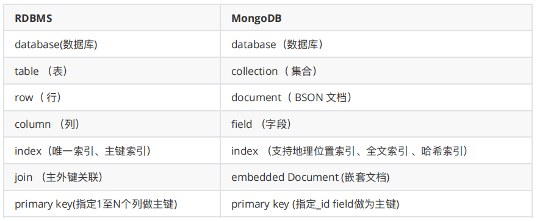
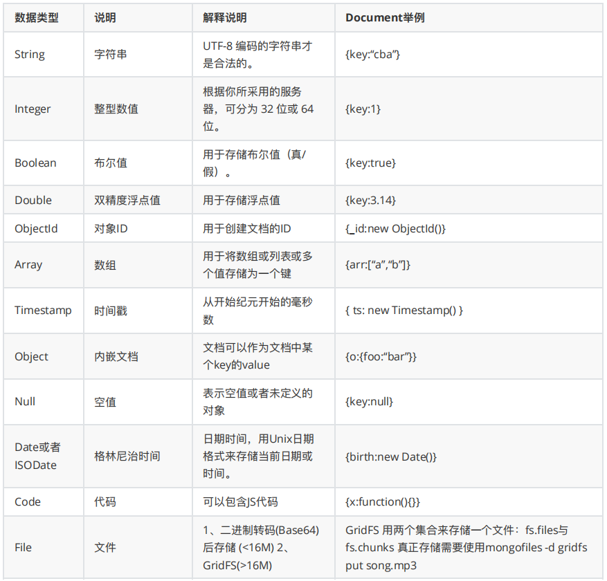

[toc]


## 一、MongoDB 简介

MongoDB是⼀款高性能的NoSQL(Not Only SQL 不仅仅SQL)数据库，基于分布式存储。由 C++ 编写，可以为 WEB 应用提供可扩展、高性能、易部署的数据存储解决⽅案。


### 1. 与RDBMS比较




### 2. BSON（文档存储类型）

BSON是⼀种类json的⼀种⼆进制形式的存储格式，简称Binary JSON，但是 BSON 有 JSON 没有的⼀些数据类型，如Date、ISODate。`{key:value,key2:value2}`，这是⼀个BSON的例⼦，**key 是字符串类型**，value的类型可以是字符串，double，Array，ISODate等类型

 MongoDB使用了 BSON这种结构来存储数据，概念也是文档(Document)，Document也可以理解成关系数据库中的⼀条记录（Record），不过 Document的变化更丰富⼀些，如 Document可以嵌套。




### 3. 安装

- **下载社区版 MongoDB 4.1.3**

  去官网下载对应的MongoDB 然后上传到Linux虚拟机

- **将压缩包解压即可**

  `tar -zxvf MongoDB-linux-x86_64-4.1.3.tgz`

- **启动**

  `./bin/mongod`

- **指定配置文件方式的启动**

  `./bin/mongod -f mongo.conf`

- **配置案例案例及说明**

  ```
  dbpath=/data/mongo/
  port=27017
  bind_ip=0.0.0.0
  fork=true
  logpath = /data/mongo/MongoDB.log
  logappend = true
  auth=false
  ```

  | 参数      | 说明                         |
  | --------- | ---------------------------- |
  | dbpath    | 数据库目录，默认/data/db     |
  | port      | 监听的端口，默认27017        |
  | bind_ip   | 监听IP地址，默认全部可以访问 |
  | fork      | 是否已后台启动的方式登陆     |
  | logpath   | 日志路径                     |
  | logappend | 是否追加日志                 |
  | auth      | 是开启用户密码登陆           |
  | config    | 指定配置文件                 |

- **启动**

  ```sh
  #默认host及端口
  ./bin/mongo
  
  #指定host及端口
  ./bin/mongo --host=主机 --port=端口 
  ```

  

### 4. GUI工具

GUI 管理工具有 MongoDB Compass Community，NoSQLBooster（mongobooster）和Navicat


### 5. MongoDB命令

#### 5.1 DDL 操作

```
查看数据库
 show dbs;
切换数据库 如果没有对应的数据库则创建
 use 数据库名;
创建集合 
 db.createCollection("集合名")
查看集合
 show tables;
 show collections;
删除集合
 db.集合名.drop();
删除当前数据库
 db.dropDatabase();
```


#### 5.2 DML 操作

##### 5.2.1 添加数据

```
db.集合名.insert(⽂档)

db.lg_resume_preview.insert({name:"张晓峰",birthday:new ISODate("2000-07-01"),expectSalary:15000,gender:0,city:"bj"})
没有指定 _id 这个字段 系统会⾃动⽣成 当然我们也可以指定 _id
```


##### 5.2.2 查询数据

```
```


1、 索引原理（为什么这么快）


2、 存储引擎原理（为什么这么快）


3、 怎么保证数据不丢失


4、 高可用集群


5、 实战


6、安装认证，监控，备份恢复