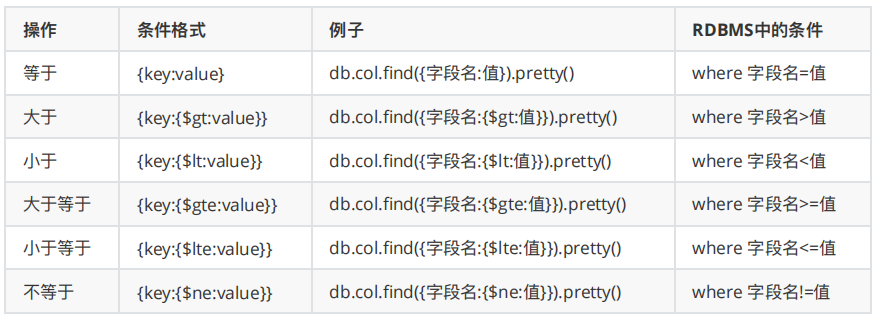
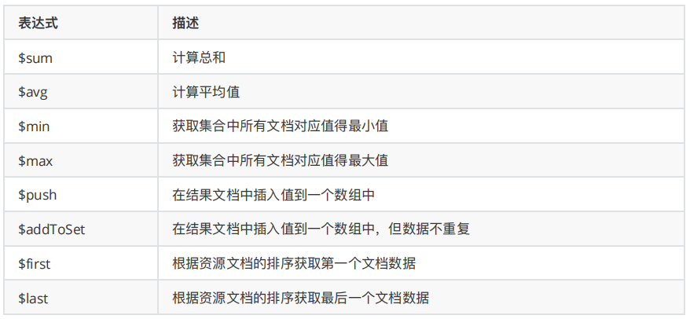

[toc]


## 一、MongoDB 简介

MongoDB是⼀款高性能的NoSQL(Not Only SQL 不仅仅SQL)数据库，基于分布式存储。由 C++ 编写，可以为 WEB 应用提供可扩展、高性能、易部署的数据存储解决⽅案。


### 1. 与RDBMS比较


### 2. BSON（文档存储类型）

BSON是⼀种类json的⼀种⼆进制形式的存储格式，简称Binary JSON，但是 BSON 有 JSON 没有的⼀些数据类型，如Date、ISODate。`{key:value,key2:value2}`，这是⼀个BSON的例⼦，**key 是字符串类型**，value的类型可以是字符串，double，Array，ISODate等类型

 MongoDB使用了 BSON这种结构来存储数据，概念也是文档(Document)，Document也可以理解成关系数据库中的⼀条记录（Record），不过 Document的变化更丰富⼀些，如 Document可以嵌套。


### 3. 安装

- **下载社区版 MongoDB 4.1.3**

  去官网下载对应的MongoDB 然后上传到Linux虚拟机

- **将压缩包解压即可**

  `tar -zxvf MongoDB-linux-x86_64-4.1.3.tgz`

- **启动**

  `./bin/mongod`

- **指定配置文件方式的启动**

  `./bin/mongod -f mongo.conf`

- **配置案例及说明**

  ```
  dbpath=/data/mongo/
  port=27017
  bind_ip=0.0.0.0
  fork=true
  logpath = /data/mongo/MongoDB.log
  logappend = true
  auth=false
  ```

  | 参数      | 说明                         |
  | --------- | ---------------------------- |
  | dbpath    | 数据库目录，默认/data/db     |
  | port      | 监听的端口，默认27017        |
  | bind_ip   | 监听IP地址，默认全部可以访问 |
  | fork      | 是否已后台启动的方式登陆     |
  | logpath   | 日志路径                     |
  | logappend | 是否追加日志                 |
  | auth      | 是开启用户密码登陆           |
  | config    | 指定配置文件                 |

- **连接**

  ```sh
  #默认host及端口
  ./bin/mongo
  
  #指定host及端口
  ./bin/mongo --host=主机 --port=端口 
  ```


### 4. GUI工具

GUI 管理工具有 MongoDB Compass Community，NoSQLBooster（mongobooster）和Navicat


### 5. DDL 操作

```js
/**查看数据库**/
 show dbs;
/**切换数据库 如果没有对应的数据库则创建**/
 use 数据库名;
/**创建集合 **/
 db.createCollection("集合名")
/**查看集合**/
 show tables;
 show collections;
/**删除集合**/
 db.集合名.drop();
/**删除当前数据库**/
 db.dropDatabase();
```


### 6. CURD 操作

#### 6.1 添加数据

插入单条：db.集合名.insert(⽂档)

插入多条：db.集合名.insert([⽂档,⽂档])

```js
/**插入单条**/
db.resume_preview.insert({name:"张晓峰",birthday:new ISODate("2000-07-01"),expectSalary:15000,gender:0,city:"bj"})

/**插入多条条**/
db.resume_preview.insert(
	[{name:"李丽",birthday:new Date("1996-05-01 14:20:09"),gender:0,expectSalary:21000,city:"sz"},
    {name:"李平",birthday:new Date("1997-07-01 14:20:09"),gender:0,expectSalary:22000,city:"sz"}
    ]
)
```

没有指定 `_id` 这个字段，系统会自动生成，也可以指定。其类型是ObjectId 类型是一个12字节 BSON 类型数据，格式如下：

- 前4个字节表示时间戳 

  ObjectId("5eb3ce52479dfe245ca9af77").getTimestamp() 可获取 _id中得时间戳

- 接下来的3个字节是机器标识码

- 紧接的两个字节由进程id组成（PID）

- 最后三个字节是随机数。


#### 6.2 查询数据

##### 6.2.1 比较条件查询

db.集合名.find(条件)



```js
/** 查所有 */
db.resume_preview.find()
/** 单条件等值查询 */
db.resume_preview.find({expectSalary:18000})
db.resume_preview.find({city:"bj"})
/** 单条件等值查询另类写法 */
db.resume_preview.find({expectSalary:{$eq:18000}})
/** 不等于查询 */
db.resume_preview.find({expectSalary:{$ne:18000}})

/** 大于查询 */
db.resume_preview.find({expectSalary:{$gt:18000}})
/* 多条件查询，逗号隔开 */
db.resume_preview.find({expectSalary:{$ne:18000},name:"李山"})


```

##### 6.2.2 逻辑条件查询

```js
/**and条件，每个键(key)以逗号隔开**/
db.集合名.find({key1:value1, key2:value2}).pretty()
/**or条件，每个键(key)以逗号隔开**/
db.集合名.find({$or:[{key1:value1}, {key2:value2}]}).pretty()
/**not条件，每个键(key)以逗号隔开**/
db.集合名.find({key:{$not:{$操作符:value}}).pretty()
/** in条件 **/
db.集合名.find({name:{$in: [null,{}]}})
```

##### 6.2.3分页查询

```js
/** db.集合名.find({条件}).sort({排序字段:排序方式})).skip(跳过的⾏数).limit(⼀⻚显示多少数据) **/
db.集合名.find({}).sort({ expectSalary:-1 }).skip(2).limit(2)
```


#### 6.3 更新数据

```js
db.集合名.update(
	<query>,
 	<update>,
 	{
 		upsert: <boolean>,
 		multi: <boolean>,
 		writeConcern: <document>
 	}
)
```

- **query：**update的查询条件，类似sql update查询内where后⾯的

- **update：**update的对象和⼀些更新的操作符（如$set,$inc...）等，也可以理解为sql update的set

  - $set：设置字段值

  - $unset：删除指定字段

  - $inc：对修改的值进行自增

- **upsert：**可选，如果不存在update的记录，是否插入objNew

  - true，插入
  - 默认false，不插⼊

- **multi：**可选，是否更新全部符合条件的数据

  - true，按条件查出来多条记录全部更新
  - 默认false，只更新找到的第⼀条记录

- **writeConcern：**可选，⽤来指定mongod对写操作的回执行为比如写的行为是否需要确认

```js
/** 更新expectSalary:18000 更新成 28000 */
db.resume_preview.update({expectSalary:18000}, 
    {$set:{expectSalary:28000}}, 
    { multi: false, upsert: false}
)
/** 更新expectSalary:38000 更新成 28000，没有数据，则插入一条28000数据 */
db.resume_preview.update({expectSalary:38000}, 
    {$set:{expectSalary:28000}}, 
    { multi: false, upsert: true}
)
/** 将李丽这条记录的预期工资 -10000 */
db.resume_preview.update({name:"李丽"}, 
    {$inc:{expectSalary:-10000}}, 
    { multi: false, upsert: false}
)
```


#### 6.4 删除数据

```js
db.集合名.remove(
 	<query>,
 	{
 		justOne: <boolean>,
 		writeConcern: <document>
 	}
)
```

- **query：**可选，删除的文档的条件
- **justOne：**可选，如果设为 true 或 1，则只删除一个文档，如果不设置该参数，或使用默认值 false，则删除所有匹配条件的⽂档
- **writeConcern：**可选，用来指定mongod对写操作的回执行行为

```js
/** 删除所有数据 */
db.resume_preview.remove({})

/** 删除所有符合条件的数据 */
db.resume_preview.remove({expectSalary:18000})

/** 只删除一条符合条件的数据 */
db.resume_preview.remove({city:"bj"}, {justOne: true})
```


### 7. 聚合操作

MongoDB不允许Pipeline的单个聚合操作占用过多的系统内存，如果⼀个聚合操作消耗20%以上的内存，那么MongoDB直接停止操作，并向客户端输出错误消息

#### 7.1 单目的聚合操作

count() 和 distinct()

```js
db.resume_preview.find().count()
db.resume_preview.distinct("city")
db.resume_preview.count()
```


#### 7.2 聚合管道查询(Aggregation Pipeline)

用于统计数据(诸如统计平均值,求和等)，并返回计算后的数据结果

通过`db.集合名.aggregate([{},{},..])` 方法构建和使用聚合管道，每个文档通过多个阶段（stage）组成的管道，经过一系列处理，输出相应的结果

**管道操作如下**：

- **$group：**将集合中的文档分组，可用于统计结果。

- **$project：**修改输入文档的结构。可以用来重命名、增加或删除域，也可以用于创建计算结果以及嵌套文档

- **$match：**用于过滤数据，只输出符合条件的文档。`$match`使⽤MongoDB的标准查询操作。

- **$limit：**用来限制MongoDB聚合管道返回的文档数。

- **$skip：**在聚合管道中跳过指定数量的文档，并返回余下的文档。

- **$sort：**将输入文档排序后输出。

- **$geoNear：**输出接近某一地理位置的有序文档。

**表达式如下**：



**案例如下**：

```js
/** 按照city 进行分组 统计每个city出现的次数*/
db.resume_preview.aggregate([{$group: { _id: "$city",city_count:{$sum:1}}}])

/** 按照city 进行分组 统计每个city 中expectSalary的平均值  */
db.resume_preview.aggregate([{$group: { _id: "$city",avg_sal:{$avg:"$expectSalary"}}}])
     
/** 按照city 进行分组 统计每个city的值放入一个数组中  */
db.resume_preview.aggregate([{$group: { _id: "$city",city_name:{$push:"$city"}}}])
db.resume_preview.aggregate([{$group: { _id: "$city",city_name:{$addToSet:"$city"}}}])

/** 求平均值并重新命名返回列名 **/
db.resume_preview.aggregate(
[{$group : {_id: "$city", avgSal:{$avg:"$expectSalary"}}},
 {$project : {city: "$city",  sal : "$avgSal"}}
])

/** 返回出现次数大于等于2的城市 **/
db.resume_preview.aggregate(
[{$group:{_id: "$city",city_count:{$sum : 1}}},
 {$match:{city_count:{$gte:2}}}
])

/** 统计num_tutorial出现次数，并降序 **/
db.resume_preview.aggregate(
[{$group : {_id: "$city", num_tutorial : {$sum : 1}}},
 {$sort: {num_tutorial:-1}}
]) 

/** 计算中心点最近的三个点 */
db.company.aggregate([
   {
     $geoNear: {
        near: { type: "Point", coordinates: [116.482451,39.914176 ] },
        key: "loc",
        distanceField: "dist.calculated"
     }
   },
   { $limit: 3 }
])
```


#### 7.3 MapReduce 编程模型

聚合管道查询速度快于MapReduce，但是MapReduce的强大之处在于能够在多台Server上并行执行复杂的聚合逻辑

MapReduce是⼀种计算模型，简单的说就是将⼤批量的工作（数据）分解（MAP）执行，然后再将结果合并成最终结果（REDUCE）

```js
db.集合名.mapReduce(
 	function() {emit(key,value);}, //map 函数
 	function(key,values) {return reduceFunction}, //reduce 函数
 	{
 		out: collection,
 		query: document,
 		sort: document,
 		limit: number,
 		finalize: <function>,
 		verbose: <boolean>
 	}
)
```

 MapReduce 要实现两个函数 Map 函数和 Reduce 函数。Map 函数调用 emit(key, value)，遍历 collection 中所有的记录,，将 key 与 value 传递给 Reduce 函数进行处理。

- **map：**是JavaScript 函数，负责将每⼀个输⼊⽂档转换为零或多个⽂档，⽣成键值对序列,作为 reduce 函数参数

- **reduce：**是JavaScript 函数，对map操作的输出做合并的化简的操作（将key-value变成key-values，也就是把values数组变成⼀个单⼀的值value）

- **out：**统计结果存放集合

- **query：**一个筛选条件，只有满足条件的⽂档才会调用map函数。

- **sort：**和limit结合的sort排序参数（也是在发往map函数前给⽂档排序），可以优化分组机制

- **limit：**发往map函数的⽂档数量的上限（要是没有limit，单独使⽤sort的用处不⼤）

- **finalize：**可以对reduce输出结果再⼀次修改

- **verbose：**是否包括结果信息中的时间信息，默认为fasle

**案例**

```js
db.resume_preview.mapReduce(
   function() { emit(this.city,this.expectSalary); },
   function(key, values) {return Array.avg(values)},
   {  
      query:{expectSalary:{$gt: 22000}}
      out:"total"
   }
)
db.total.find() 
```