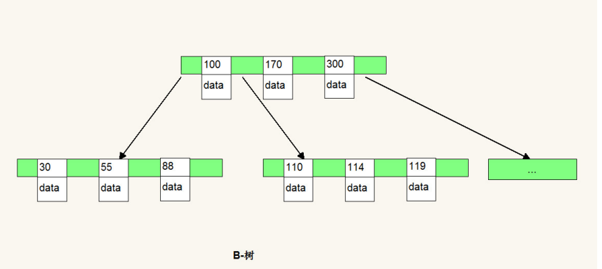
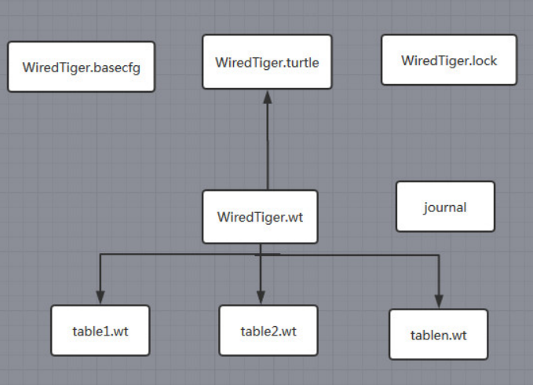
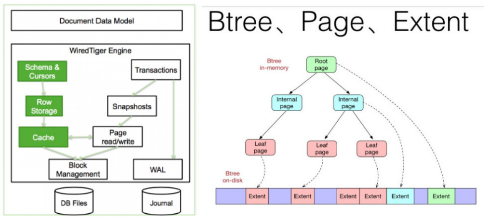
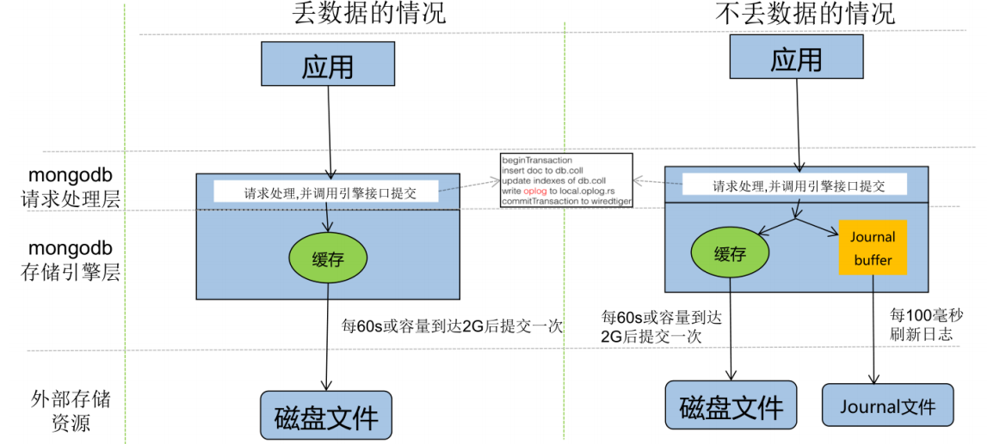

[toc]

### 一、MongoDB的索引

#### 1. 索引类型

##### 1.1 单键索引 Single Field

- 普通单键索引

  ```js
  db.集合名.createIndex({"字段名" : 排序方式}) 
  ```

  **注意：**单键索引的排序顺序无关紧要，因为MongoDB可以在任⼀方向读取索引

- TTL（ **Time To Live**）单键索引

  规定时间之后⾃动删除，只能在单字段上建立，并且字段类型必须是**日期类型**

  ```js
  db.集合名.createIndex({"日期字段":排序方式}, {expireAfterSeconds: 秒数})
  ```

- 唯一索引

  ```js
  db.集合.createIndex({name:1},{unique:true})
  ```

  

##### 1.2 复合索引 Compound Index

在多个字段上建立索引，适合多字段条件查询

**注意：**制作复合索引时要注意的重要事项包括：字段顺序与索引方向。

```js
db.集合名.createIndex( { "字段名1" : 排序方式, "字段名2" : 排序方式 } )
```


##### 1.3 多健索引

针对属性包含数组数据的情况，对数组中每⼀个element创建索引，Multikey indexes支持Strings，Numbers和Nested Documents


##### 1.4 地理空间索引 Geospatial Index

针对地理空间坐标数据创建索引

创建地理空间索引：`db.company.ensureIndex({loc : "2dsphere"})`

- 2dsphere索引，用于存储和查找球面上的点

- 2d索引，用于存储和查找平面上的点

**2dsphere测试**

```js
db.company.insert(
   {
     loc : { type: "Point", coordinates: [ 116.482451, 39.914176 ] },
     name: "大望路地铁",
     category : "Parks"
   }
)

db.company.insert(
   {
     loc : { type: "Point", coordinates: [ 116.492451, 39.934176 ] },
     name: "test1",
     category : "Parks"
   }
)

db.company.insert(
   {
     loc : { type: "Point", coordinates: [ 116.462451, 39.954176 ] },
     name: "test2",
     category : "Parks"
   }
)


db.company.insert(
   {
     loc : { type: "Point", coordinates: [ 116.562451, 38.954176 ] },
     name: "test3",
     category : "Parks"
   }
)

db.company.insert(
   {
     loc : { type: "Point", coordinates: [ 117.562451, 37.954176 ] },
     name: "test4",
     category : "Parks"
   }
)

db.company.ensureIndex( { loc : "2dsphere" } )
db.company.find({
    "loc" : { 
        "$geoWithin" : {
          "$center":[[116.482451,39.914176],0.05] 
        }
    }
})

/** 计算中心点最近的三个点 */
db.company.aggregate([
   {
     $geoNear: {
        near: { type: "Point", coordinates: [116.482451,39.914176 ] },
        key: "loc",
        distanceField: "dist.calculated"
     }
   },
   { $limit: 3 }
])
```

**2d测试**

```js
/** 2d 测试  */
db.places.drop()
db.places.insert({"name": "Temple1","tile": [32, 22]})
db.places.insert({"name": "Temple2","tile": [30, 22]})
db.places.insert({"name": "Temple3","tile": [28, 21]})
db.places.insert({"name": "Temple4","tile": [34, 27]})
db.places.insert({"name": "Temple5","tile": [34, 26]})
db.places.insert({"name": "Temple6","tile": [39, 28]})

db.places.find({})
 
db.places.ensureIndex({"tile" : "2d"}, {"min" : -90, "max" : 90, "bits" : 20}) 
 
db.places.find({"tile": {"$within": {"$box": [[0, 0], [30, 30]]}}})
```


##### 1.5 全文索引/倒排索引

针对 String 内容的文本查询，Text Index支持任意属性值为 String 或String 数组元素的索引查询

**注意：**一个集合仅支持最多⼀个Text Index，中文分词不理想，推荐ES

```js
db.textTextIndex.createIndex({description:"text"});

db.textTextIndex.find({"$text": {"$search": "two"}});
```


##### 1.6 哈希索引

针对属性的哈希值进⾏索引查询，当要使⽤Hashed index时，MongoDB能够⾃动的计算hash值，⽆需程序计算hash值。注：hash index仅⽀持等于查询，不⽀持范围查询。

```js
db.集合.createIndex({"字段": "hashed"})
```


#### 2. 索引底层原理

MongoDB使用 B-Tree，所有节点都有Data域，只要找到指定索引就可以进行访问，单次查询从结构上来看要快于MySql




#### 3. 索引管理与执行计划

##### 3.1 索引管理

- 创建索引并在后台运行

  ```js
  db.COLLECTION_NAME.createIndex({"字段":排序方式}, {background: true});
  ```

- 获取针对某个集合的索引

  ```js
  db.COLLECTION_NAME.getIndexes()
  ```

- 索引的大小

  ```js
  db.COLLECTION_NAME.totalIndexSize()
  ```

- 索引的重建

  ```js
  db.COLLECTION_NAME.reIndex()
  ```

- 索引的删除

  ```js
  db.COLLECTION_NAME.dropIndex("INDEX-NAME")
  db.COLLECTION_NAME.dropIndexes()
  注意: _id 对应的索引是删除不了的
  ```


##### 3.2 执行计划

explain()也接收不同的参数，通过设置不同参数我们可以查看更详细的查询计划

- **queryPlanner：**queryPlanner是默认参数，具体执行计划信息参考下⾯的表格
  - namespace：要查询的集合（该值返回的是该query所查询的表）数据库.集合
  - winningPlan：被选中的执⾏计划
  - winningPlan.stage被选中执⾏计划的stage(查询方式)
    - COLLSCAN：全表扫描
    - IXSCAN：索引扫描（是IndexScan，这就说明我们已经命中索引了）
    - FETCH：根据索引去检索文档
    - SHARD_MERGE：合并分片结果
    - IDHACK：针对_id进行查询等
  - winningPlan.keyPattern：所扫描的index内容
  - winningPlan.indexName：所选用的index
  - winningPlan.isMultiKey：是否是Multikey
  - filter：过滤条件
  
- **executionStats：**executionStats会返回执行计划的⼀些统计信息(有些版本中和allPlansExecution等同)

  - executionSuccess：是否执行成功

  - **nReturned：这条语句返回的文档数**

  - **executionTimeMillis：这条语句的执行耗时**

  - **totalKeysExamined：索引扫描次数**

  - **totalDocsExamined：文档扫描次数**

    最理想的状态是nReturned=totalKeysExamined=totalDocsExamined

  - nReturned：查询结果数量

  - executionTimeMillisEstimate：检索document获得数据的时间

  - inputStage.executionTimeMillisEstimate：该查询扫描⽂档 index所⽤时间

- **allPlansExecution：**包含了queryPlanner参数 和 executionStats的拼接


#### 4. 慢查询

##### 4.1开启内置的查询分析器,记录读写操作效率

```sh
 db.setProfilingLevel(n,m)
```

n的取值如下：

- 0表示不记录

- 1表示记录慢速操作，如果值为1，m必须赋值单位为ms，用于定义慢速查询时间的阈值

- 2表示记录所有的读写操作

##### 4.2 查询监控结果

```sh
db.system.profile.find().sort({millis:-1}).limit(3)
```

##### 4.3 分析慢速查询

 应用程序设计不合理、不正确的数据模型、硬件配置问题,缺少索引等

##### 4.4 解读explain结果 确定是否缺少索引


### 二、MongoDB 数据模式

#### 1. 内嵌

##### 1.1 描述

内嵌的方式指的是把相关联的数据保存在同一个文档结构之中。MongoDB的文档结构允许一个字段或者一个数组内的值作为一个嵌套的文档。

##### 1.2 适用

- 数据对象之间有包含关系 ,一般是数据对象之间有一对多或者一对一的关系 。 

- 需要经常一起读取的数据。

- 有 map-reduce/aggregation 需求的数据放在一起，这些操作都只能操作单个 collection。

#### 2. 引用

##### 2.1 描述

引用方式通过存储数据引用信息来实现两个不同文档之间的关联,应用程序可以通过解析这些数据引用来访问相关数据。

##### 2.2 适用

- 当内嵌数据会导致很多数据的重复，并且读性能的优势又不足于覆盖数据重复的弊端 。 

- 需要表达比较复杂的多对多关系的时候 。 

- 大型层次结果数据集 嵌套不要太深。


### 三、WiredTiger存储引擎及原理

MongoDB支持的存储引擎有MMAPv1，WiredTiger和InMemory

InMemory存储引擎用于将数据只存储在内存中，只将少量的元数据(meta-data) 和诊断日志（Diagnostic）存储到硬盘文件中

从 **Mongodb3.2开始默认的存储引擎是 WiredTiger**，3.2版本之前的默认存储引擎是 MMAPv1，Mongodb4.x 版本不再支持MMAPv1存储引擎

#### 1. WiredTiger 引擎配置

```
storage:
	journal:
		enabled: true
	dbPath: /data/mongo/
	##是否⼀个库⼀个⽂件夹
	directoryPerDB: true
	##数据引擎
	engine: wiredTiger
	##WT引擎配置
	WiredTiger:
		engineConfig:
			##WT最⼤使⽤cache（根据服务器实际情况调节）
			cacheSizeGB: 2
			##是否将索引也按数据库名单独存储
			directoryForIndexes: true
			journalCompressor:none （默认snappy）
    	##表压缩配置
    	collectionConfig:
      		blockCompressor: zlib (默认snappy,还可选none、zlib)
    	##索引配置
    	indexConfig:
      		prefixCompression: true
```


#### 2. WiredTiger 引擎 VS MMAPV1引擎

- **文档空间分配方式**

  WiredTiger 存储结构使用的是B-Tree存储

  MMAPV1，线性存储，需要Padding

- **并发级别**

  WiredTiger文档级别锁

  MMAPV1引擎使用表级锁

- **数据压缩**

  ST支持 Snappy (默认) 和 zlib压缩

  MMAPV1 无压缩。

- **内存使用**

   WiredTiger 可以指定内存的使用大小

- **Cache使用**

  WT引擎使用了二阶缓存WiredTiger Cache，File System Cache来保证Disk上的数据的最终⼀致性

  MMAPv1 没有缓存


#### 3. WiredTiger 引擎包含的文件及作用



WiredTiger.basecfg：存储基本配置信息，与 ConfigServer有关系

**WiredTiger.lock：**定义锁操作

**table*.wt：**存储各张表的数据

WiredTiger.wt：存储table* 的元数据

WiredTiger.turtle：存储WiredTiger.wt的元数据

**journal：**存储 WAL(Write Ahead Log) 记录，类似InnoDB的Undo Log


#### 4. WiredTiger 引擎原理

##### 4.1 写请求

该引擎写操作默认写入 Cache，并持久化到 **WAL (Write Ahead Log)**，每60s或Log文件达到2G做一次 **checkpoint** 产生快照文件。WiredTiger初始化时，恢复至最新的快照状态，然后再根据WAL/Journal日志恢复数据，保证数据的完整性。



WiredTiger采用Copy on write的方式管理写操作（insert、update、delete），写操作会先缓存在cache里，持久化时，写操作不会在原来的leaf page上进行，而是写入新分配的page，每次checkpoint都会产生一个新的root page。


##### 4.2 保证数据一致性

在数据库宕机时 , 为保证 MongoDB 中数据的持久性，MongoDB 使用了 Write Ahead Logging 向磁盘上的 journal 文件预先进行写入。除了 journal 日志，MongoDB 还使用检查点（checkpoint）来保证数据的一致性，当数据库发生宕机时，我们就需要 checkpoint 和 journal 文件协作完成数据的恢复工作

