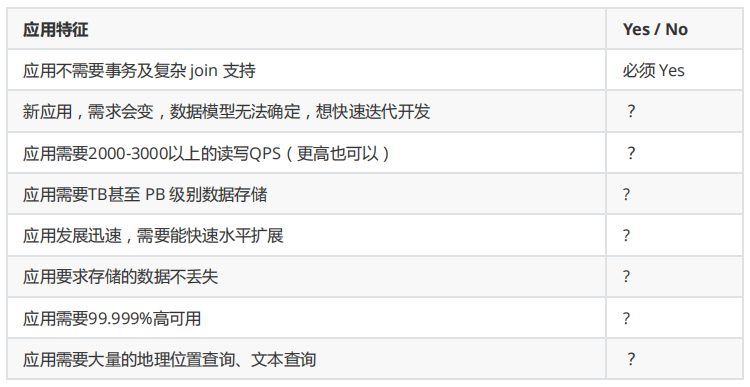

[toc]

### 一、应用场景

#### 1. 适用场景

- **游戏场景**

  使用 MongoDB 存储游戏用户信息，用户的装备、积分等直接以内嵌文档的形式存储，方便查询、更新。

- 物流场景

  使用 MongoDB **存储订单信息，订单状态在运送过程中会不断更新**，以 MongoDB 内嵌数组的形式来存储，一次查询就能将订单所有的变更读取出来。

- **社交场景**

  使用 MongoDB 存储存储用户信息，以及用户发表的朋友圈信息，通过地理位置索引**实现附近的人、地点等功能。**

- **物联网场景**

  使用 MongoDB 存储所有接入的智能设备信息，以及设备汇报的日志信息，并对这些信息进行多维度的分析。

- 直播

  使用 MongoDB 存储用户信息、礼物信息等。


#### 2. 是否适用

以下任意满足三项，即表示适用




### 二、应用

#### 1. JAVA 访问原生MongoDB

##### 添加依赖

```xml
<dependency>
    <groupId>org.mongodb</groupId>
    <artifactId>mongo-java-driver</artifactId>
    <version>3.10.1</version>
</dependency>
```

##### 应用

```java
public void insert() {
    MongoClient mongoClient = new MongoClient("192.168.211.133",37017);
    // 获取数据库对象
    MongoDatabase mongodb = mongoClient.getDatabase("lg_resume");
    // 获取集合对象
    MongoCollection<Document> collection = mongodb.getCollection("resume_preview");
    //  构建Document 对象  并插入到集合中
    Document document = Document.parse("{name:'lisi',city:'北京',birth_day:new ISODate('2001-08-01'),expectSalary:18000}");
    collection.insertOne(document);
    mongoClient.close();
}

public void find() {
    MongoClient mongoClient = new MongoClient("192.168.211.133", 37017);
    // 获取数据库对象
    MongoDatabase mongodb = mongoClient.getDatabase("lg_resume");
    // 获取集合对象
    MongoCollection<Document> collection = mongodb.getCollection("lg_resume_preview");
    // 要根据expectSalary 降序排列
    Document sortDocument = new Document();
    sortDocument.append("expectSalary", -1);
    FindIterable<Document> findIterable = collection.find().sort(sortDocument);
    for (Document document : findIterable) {
        System.out.println(document);
    }
    mongoClient.close();
}

public void findFilters() {
    MongoClient mongoClient = new MongoClient("192.168.211.133", 37017);
    // 获取数据库对象
    MongoDatabase mongodb = mongoClient.getDatabase("lg_resume");
    // 获取集合对象
    MongoCollection<Document> collection = mongodb.getCollection("lg_resume_preview");
    // 要根据expectSalary 降序排列
    Document sortDocument = new Document();
    sortDocument.append("expectSalary", -1);
    //FindIterable<Document>  findIterable =  collection.find(Document.parse("{expectSalary:{$gt:21000}}")).sort(sortDocument);
    FindIterable<Document> findIterable = collection.find(Filters.gt("expectSalary", 21000)).sort(sortDocument);
    for (Document document : findIterable) {
        System.out.println(document);
    }
    mongoClient.close();
}
```


#### 2. Spring 整合MongoDB

##### 添加依赖

```xml
<dependency>
    <groupId>org.springframework.data</groupId>
    <artifactId>spring-data-mongodb</artifactId>
    <version>2.0.9.RELEASE</version>
</dependency>
```

##### Spring命名空间

applicationContext.xml

```xml
<?xml version="1.0" encoding="UTF-8"?>
<beans xmlns="http://www.springframework.org/schema/beans"
       xmlns:xsi="http://www.w3.org/2001/XMLSchema-instance" xmlns:context="http://www.springframework.org/schema/context"
       xmlns:mongo="http://www.springframework.org/schema/data/mongo"
       xsi:schemaLocation="
    http://www.springframework.org/schema/beans http://www.springframework.org/schema/beans/spring-beans.xsd
    http://www.springframework.org/schema/context http://www.springframework.org/schema/context/spring-context.xsd
    http://www.springframework.org/schema/data/mongo http://www.springframework.org/schema/data/mongo/spring-mongo.xsd">

    <mongo:db-factory id="mongoDbFactory" client-uri="mongodb://192.168.211.133:37017/lg_resume"></mongo:db-factory>
    <bean id="mongoTemplate"  class="org.springframework.data.mongodb.core.MongoTemplate">
        <constructor-arg index="0" ref="mongoDbFactory"></constructor-arg>
    </bean>
    <context:component-scan base-package="com.lagou"></context:component-scan>
</beans>
```

##### 实体类

```java
import java.util.Date;

public class Resume {
    public Resume(String id, String name, String city, Date birthday, double expectSalary) {
        this.id = id;
        this.name = name;
        this.city = city;
        this.birthday = birthday;
        this.expectSalary = expectSalary;
    }

    private  String id;
    private  String name;
    private  String city;
    private  Date   birthday;
    private  double  expectSalary;
    
    //getter..
    //setter..
}
```

##### dao层

```java
public interface ResumeDAO {
    void  insertResume(Resume  resume);
    /** 根据name 获取Resume 对象 */
    Resume  findByName(String  name);
    List<Resume>  findList(String  name);
    /** 根据name  和  expectSalary 查询 */
    List<Resume>  findListByNameAndExpectSalary(String name,double expectSalary);
}
```

```java
import com.lg.bean.Resume;
import com.lg.dao.ResumeDAO;
import org.springframework.beans.factory.annotation.Autowired;
import org.springframework.data.mongodb.core.MongoTemplate;
import org.springframework.data.mongodb.core.query.Criteria;
import org.springframework.data.mongodb.core.query.Query;
import org.springframework.stereotype.Repository;

import java.util.List;

@Repository("resumeDao")
public class ResumeDAOImpl implements ResumeDAO {
    @Autowired
    private MongoTemplate  mongoTemplate;

    @Override
    public void insertResume(Resume resume) {
        //mongoTemplate.insert(resume);
        mongoTemplate.insert(resume,"lg_resume_datas");
    }

    @Override
    public Resume findByName(String name) {
        Query  query = new Query();
        query.addCriteria(Criteria.where("name").is(name));
        List<Resume> datas = mongoTemplate.find(query,Resume.class,"lg_resume_datas");
        return  datas.isEmpty()?null:datas.get(0);
    }

    @Override
    public List<Resume> findList(String name) {
        Query  query = new Query();
        query.addCriteria(Criteria.where("name").is(name));
        List<Resume> datas = mongoTemplate.find(query,Resume.class,"lg_resume_datas");
        return  datas;
    }

    @Override
    public List<Resume> findListByNameAndExpectSalary(String name, double expectSalary) {
        Query  query = new Query();
        //query.addCriteria(Criteria.where("name").is(name).andOperator(Criteria.where("expectSalary").is(expectSalary)));
        query.addCriteria(Criteria.where("name").is(name).andOperator(Criteria.where("expectSalary").is(expectSalary)));
        return  mongoTemplate.find(query,Resume.class,"lg_resume_datas");
    }
}
```

##### 应用

```java
public static void main(String[] args) {
    ClassPathXmlApplicationContext  applicationContext =
        new ClassPathXmlApplicationContext("applicationContext.xml");
    ResumeDAO  resumeDao = applicationContext.getBean("resumeDao",ResumeDAO.class);
    Resume  resume  = new Resume();
    resume.setName("lisi");
    resume.setCity("北京");
    Date  date = null;
    String  dateStr = "yyyy-MM-dd hh:mm:ss";
    SimpleDateFormat  simpleDateFormat  = new SimpleDateFormat(dateStr);
    try {
        date = simpleDateFormat.parse("2003-10-02 11:13:14");
    } catch (ParseException e) {
        e.printStackTrace();
    }
    resume.setBirthday(date);
    resume.setExpectSalary(28000);
    resumeDao.insertResume(resume);


    Resume  resume  =resumeDao.findByName("lisi");
    System.out.println(resume);
    List<Resume> datas = resumeDao.findList("zhangsan");
    System.out.println(datas);
    List<Resume> datas2 = resumeDao.findListByNameAndExpectSalary("zhangsan",25000);
    System.out.println(datas2);
}
```


#### 3. SpringBoot 整合MongoDB（MongoTemplate方式）

##### 添加依赖

```xml
<dependency>
    <groupId>org.springframework.boot</groupId>
    <artifactId>spring-boot-starter-data-mongodb</artifactId>
    <version>2.2.2.RELEASE</version>
</dependency>
```

##### 全局配置

```properties
spring.data.mongodb.host=192.168.211.133
spring.data.mongodb.port=37017
spring.data.mongodb.database=lg_resume


# 开启安全认证
spring.data.mongodb.username=wanfeng
spring.data.mongodb.password=123456
```

##### 实体类

```java
import java.util.Date;

public class Resume {
    public Resume(String id, String name, String city, Date birthday, double expectSalary) {
        this.id = id;
        this.name = name;
        this.city = city;
        this.birthday = birthday;
        this.expectSalary = expectSalary;
    }

    private String id;
    private String name;
    private String city;
    private Date birthday;
    private  double  expectSalary;
    
    //getter..
    //setter..
}

```

##### dao层

```java
import com.lagou.bean.Resume;

import java.util.List;

public interface ResumeDAO {
    void  insertResume(Resume resume);
    /** 根据name 获取Resume 对象 */
    Resume  findByName(String name);
    List<Resume> findList(String name);
    /** 根据name  和  expectSalary 查询 */
    List<Resume> findListByNameAndExpectSalary(String name, double expectSalary);

}

```

```java
import com.lg.bean.Resume;
import com.lg.dao.ResumeDAO;
import org.springframework.beans.factory.annotation.Autowired;
import org.springframework.data.mongodb.core.MongoTemplate;
import org.springframework.data.mongodb.core.query.Criteria;
import org.springframework.data.mongodb.core.query.Query;
import org.springframework.stereotype.Repository;

import java.util.List;

@Repository("resumeDao")
public class ResumeDAOImpl implements ResumeDAO {
    @Autowired
    private MongoTemplate mongoTemplate;


    @Override
    public void insertResume(Resume resume) {
        //mongoTemplate.insert(resume);
        mongoTemplate.insert(resume,"lg_resume_datas");
    }

    @Override
    public Resume findByName(String name) {
        Query query = new Query();
        query.addCriteria(Criteria.where("name").is(name));
        List<Resume> datas = mongoTemplate.find(query,Resume.class,"lg_resume_datas");
        return  datas.isEmpty()?null:datas.get(0);
    }

    @Override
    public List<Resume> findList(String name) {
        Query query = new Query();
        query.addCriteria(Criteria.where("name").is(name));
        List<Resume> datas = mongoTemplate.find(query,Resume.class,"lg_resume_datas");
        return  datas;
    }

    @Override
    public List<Resume> findListByNameAndExpectSalary(String name, double expectSalary) {
        Query query = new Query();
        //query.addCriteria(Criteria.where("name").is(name).andOperator(Criteria.where("expectSalary").is(expectSalary)));
        query.addCriteria(Criteria.where("name").is(name).andOperator(Criteria.where("expectSalary").is(expectSalary)));
        return  mongoTemplate.find(query,Resume.class,"lg_resume_datas");
    }
}
```

##### 应用

```java
import com.lg.bean.Resume;
import com.lg.dao.ResumeDAO;
import org.springframework.boot.SpringApplication;
import org.springframework.boot.autoconfigure.SpringBootApplication;
import org.springframework.context.ApplicationContext;
import org.springframework.context.support.ClassPathXmlApplicationContext;

import java.text.ParseException;
import java.text.SimpleDateFormat;
import java.util.Date;
import java.util.List;

@SpringBootApplication
public class MongoTemplateMain {
    public static void main(String[] args) {
        /* ClassPathXmlApplicationContext applicationContext =
                new ClassPathXmlApplicationContext("applicationContext.xml"); */
        ApplicationContext  applicationContext  = SpringApplication.run(MongoTemplateMain.class,args);
        ResumeDAO  resumeDao = applicationContext.getBean("resumeDao",ResumeDAO.class);
        Resume  resume  = new Resume();
        resume.setName("lisi22");
        resume.setCity("北京");
        Date date = null;
        String  dateStr = "yyyy-MM-dd hh:mm:ss";
        SimpleDateFormat  simpleDateFormat  = new SimpleDateFormat(dateStr);
        try {
            date = simpleDateFormat.parse("2003-11-02 11:13:14");
        } catch (ParseException e) {
            e.printStackTrace();
        }
        resume.setBirthday(date);
        resume.setExpectSalary(28000);
        resumeDao.insertResume(resume);
        System.out.println("resume="+resume);

        Resume  resume2  =resumeDao.findByName("lisi");
        System.out.println(resume2);
        List<Resume> datas = resumeDao.findList("zhangsan");
        System.out.println(datas);
        List<Resume> datas2 = resumeDao.findListByNameAndExpectSalary("zhangsan",25000);
        System.out.println(datas2);
    }
}
```


#### 4. SpringBoot 整合MongoDB（Repository方式）

主要是Repository接口 继承 MongoRepository，方法具体参考:https://docs.spring.io/spring-data/jpa/docs/current/reference/html/#jpa.query-methods.query-creation

类似于Spring-data-jpa，可自定义方法，如：定义find/read/get 等开头的方法进行查询 

##### 添加依赖

```xml
<dependency>
    <groupId>org.springframework.boot</groupId>
    <artifactId>spring-boot-starter-data-mongodb</artifactId>
    <version>2.2.2.RELEASE</version>
</dependency>
```

##### 全局配置

```properties
spring.data.mongodb.host=192.168.211.133
spring.data.mongodb.port=27017
spring.data.mongodb.database=lagou_resume

# 开启安全认证
spring.data.mongodb.username=wanfeng
spring.data.mongodb.password=123456
```

##### 实体类

```java
import org.springframework.data.mongodb.core.mapping.Document;

import java.util.Date;

@Document("lg_resume_datas")
public class Resume {
    public Resume(String id, String name, String city, Date birthday, double expectSalary) {
        this.id = id;
        this.name = name;
        this.city = city;
        this.birthday = birthday;
        this.expectSalary = expectSalary;
    }

    private String id;
    private String name;
    private String city;
    private Date birthday;
    private  double  expectSalary;
    
    //getter..
    //setter..
}

```

##### Repository接口

继承MongoRepository接口类似于JPA规范，内部实现CURD

```java
import com.lg.bean.Resume;
import org.springframework.data.mongodb.repository.MongoRepository;

import java.util.List;

public interface ResumeRepository extends MongoRepository<Resume,String> {
    List<Resume>  findByNameEquals(String name);
    List<Resume>  findByNameAndExpectSalary(String name,double expectSalary);
}
```

##### 应用

```java
import com.lg.bean.Resume;
import com.lg.repository.ResumeRepository;
import org.springframework.boot.SpringApplication;
import org.springframework.boot.autoconfigure.SpringBootApplication;
import org.springframework.context.ApplicationContext;

@SpringBootApplication
public class MongoRepositoryMain {
    public static void main(String[] args) {
        ApplicationContext  applicationContext = SpringApplication.run(MongoRepositoryMain.class,args);
        ResumeRepository  resumeRepository = applicationContext.getBean(ResumeRepository.class);
        System.out.println(resumeRepository.findAll());
        System.out.println(resumeRepository.findByNameEquals("zhangsan"));
        System.out.println(resumeRepository.findByNameAndExpectSalary("zhangsan",25000)); 
        
        
        Resume resume  = new Resume();
        resume.setName("chengdaotest");
        resume.setExpectSalary(1);
        resume.setCity("bj");
        resumeRepository.save(resume);
    }
}
```

