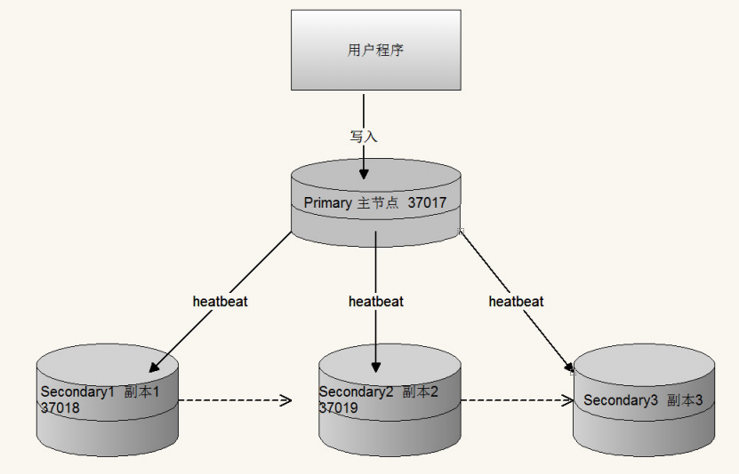
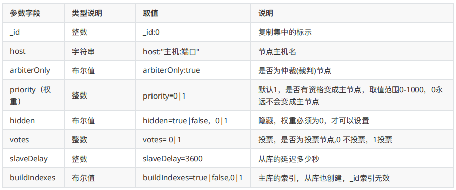
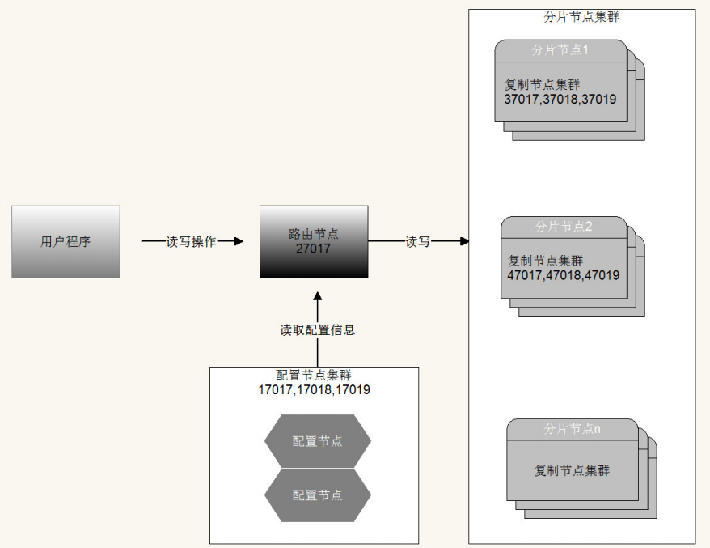

[toc]

### 一、复制集搭建

#### 1. 复制集简介

复制集是由⼀组拥有相同数据集的mongod实例做组成的集群

复制集是一个集群，它是2台及2台以上的服务器组成，以及复制集成员包括 **Primary主节点**，**secondary从节点**和**投票节点**

复制集提供了数据的冗余备份，并在多个服务器上存储数据副本，提⾼了数据的可用性,保证数据的安全性




#### 2. 复制集作用

- 高可用

  防止单点故障

- 灾难备份

  当发生故障时，可以从其他节点恢复用于备份。

- 功能隔离

  在备节点上执行读操作，减少主节点的压力比如：用于分析、报表，数据挖掘，系统任务等。


#### 3. 复制集搭建

##### 主节点配置 mongo_37017.conf

```sh
# 主节点配置 
dbpath=/data/mongo/data/server1
bind_ip=0.0.0.0
port=37017
fork=true
logpath=/data/mongo/logs/server1.log
replSet=lagouCluster
```

##### 从节点1配置 mongo_37018.conf

```sh
dbpath=/data/mongo/data/server2
bind_ip=0.0.0.0
port=37018
fork=true
logpath=/data/mongo/logs/server2.log
replSet=lagouCluster
```

##### 从节点2配置 mongo_37019.conf

```sh
dbpath=/data/mongo/data/server3
bind_ip=0.0.0.0
port=37019
fork=true
logpath=/data/mongo/logs/server3.log
replSet=lagouCluster
```

##### 初始化节点配置

启动三个节点 然后进⼊任意⼀个节点 运⾏如下命令：

```sh
var cfg ={"_id":"lagouCluster",
 	"protocolVersion" : 1,
 	"members":[
 		{"_id":1,"host":"192.168.211.136:37017","priority":10},
 		{"_id":2,"host":"192.168.211.136:37018"}
 	]
}

rs.initiate(cfg)
rs.status()
```

复制集成员配置参数说明



重新加载配置

```sh
var cfg ={"_id":"lagouCluster",
 	"protocolVersion" : 1,
 	"members":[
 		{"_id":1,"host":"192.168.211.136:37017","priority":10},
 		{"_id":2,"host":"192.168.211.136:37018","priority":0},
 		{"_id":3,"host":"192.168.211.136:37019","priority":5},
 		{"_id":4,"host":"192.168.211.136:37020","arbiterOnly":true}
 	]
};


// 重新装载配置，并重新⽣成集群节点。
rs.reconfig(cfg)
//重新查看集群状态
rs.status()
```

##### 节点的动态增删

```sh
增加节点
rs.add("192.168.211.136:37019")
删除slave 节点
rs.remove("192.168.211.136:37019")
```

##### 配置及添加仲裁节点

和上⾯的配置步骤相同 只是增加了 ⼀个特殊的仲裁节点

```sh
注⼊节点 执⾏ rs.addArb("IP:端⼝");
rs.addArb("192.168.207.135:37020")
```

##### 复制集操作演示

主节点：插⼊数据

从节点默认不能读取数据。调用 rs.slaveOk() 解决

保证高可用，在集群当中如果主节点挂掉后，集群自动在从节点中选举一个重新做为主节点，通过rs.status()查看


### 二、分片集群搭建

#### 1. 分片集群概念



分片集群由以下3个服务组成：

- Shards Server：每个shard由一个或多个mongod进程组成，用于存储数据。

- Router Server：数据库集群的请求入口，所有请求都通过Router(mongos)进行协调，不需要在应用程序添加⼀个路由选择器，Router(mongos)就是⼀个请求分发中心它负责把应⽤程序的请求转发到对应的Shard服务器上。

- Config Server：配置服务器。存储所有数据库元信息（路由、分片）的配置

分片核心概念

- 片键（shard key）

  为了在数据集合中分配⽂档，MongoDB使⽤分片主键分割集合。

- 区块（chunk）

  在⼀个shard server内部，MongoDB还是会把数据分为chunks，每个chunk代表这个shard server内部⼀部分数据。MongoDB分割分片数据到区块，每⼀个区块包含基于分片主键的左闭右开的区间范围。

- 分片策略

  - 范围分片（Range based sharding）

  - hash分片（Hash based sharding）

  - 组合片键 A + B(散列思想 不能是直接hash)

    ⼀般是粗粒度+细粒度进行组合，如A为按范围分的字段，B为类似散列的字段（如姓名等平均分布的字段）


#### 2. 配置config节点集群（3个节点）

##### 节点1：config-17017.conf

```shell
# 数据库⽂件位置
dbpath=config/config1
#⽇志⽂件位置
logpath=config/logs/config1.log
# 以追加⽅式写⼊⽇志
logappend=true
# 是否以守护进程⽅式运⾏
fork = true
bind_ip=0.0.0.0
port = 17017
# 表示是⼀个配置服务器
configsvr=true
#配置服务器副本集名称
replSet=configsvr
```

##### 节点2：config-17018.conf

```sh
# 数据库⽂件位置
dbpath=config/config2
#⽇志⽂件位置
logpath=config/logs/config2.log
# 以追加⽅式写⼊⽇志
logappend=true
# 是否以守护进程⽅式运⾏
fork = true
bind_ip=0.0.0.0
port = 17018
# 表示是⼀个配置服务器
configsvr=true
#配置服务器副本集名称
replSet=configsvr
```

##### 节点3：config-17019.conf

```sh
# 数据库⽂件位置
dbpath=config/config3
#⽇志⽂件位置
logpath=config/logs/config3.log
# 以追加⽅式写⼊⽇志
logappend=true
# 是否以守护进程⽅式运⾏
fork = true
bind_ip=0.0.0.0
port = 17019
# 表示是⼀个配置服务器
configsvr=true
#配置服务器副本集名称
replSet=configsvr
```

##### 启动所有config节点

```sh
./bin/mongod -f config/config-17017.conf
./bin/mongod -f config/config-17018.conf
./bin/mongod -f config/config-17019.conf
```

##### 进入任意config节点

```sh
./bin/mongo --port 17017
```

##### 指定admin数据库，并添加 config节点集群 

```sh
use admin
```

```sh
var cfg ={"_id":"configsvr",
	"members":[
		{"_id":1,"host":"192.168.207.135:17017"},
		{"_id":2,"host":"192.168.207.135:17018"},
		{"_id":3,"host":"192.168.207.135:17019"}]
};
```

```sh
rs.initiate(cfg)
rs.status()
```


#### 3. 配置shard分片集群

##### shard1集群搭建37017到37019

节点1：shard1-37017.conf

```sh
dbpath=shard/shard1/shard1-37017
bind_ip=0.0.0.0
port=37017
fork=true
logpath=shard/shard1/logs/shard1-37017.log
replSet=shard1
shardsvr=true
```

节点2：shard1-37018.conf

```sh
dbpath=shard/shard1/shard1-37018
bind_ip=0.0.0.0
port=37018
fork=true
logpath=shard/shard1/logs/shard1-37018.log
replSet=shard1
shardsvr=true
```

节点3：shard1-37019.conf

```sh
dbpath=shard/shard1/shard1-37019
bind_ip=0.0.0.0
port=37019
fork=true
logpath=shard/shard1/logs/shard1-37019.log
replSet=shard1
shardsvr=true
```

##### shard2集群搭建47017到47019

节点1：shard2-47017.conf

```sh
dbpath=shard/shard2/shard2-47017
bind_ip=0.0.0.0
port=47017
fork=true
logpath=shard/shard2/logs/shard2-47017.log
replSet=shard2
shardsvr=true
```

节点2：shard2-47018.conf

```sh
dbpath=shard/shard2/shard2-47018
bind_ip=0.0.0.0
port=47018
fork=true
logpath=shard/shard2/logs/shard2-47018.log
replSet=shard2
shardsvr=true
```

节点3：shard2-47019.conf

```sh
dbpath=shard/shard2/shard2-47019
bind_ip=0.0.0.0
port=47019
fork=true
logpath=shard/shard2/logs/shard2-47019.log
replSet=shard2
shardsvr=true
```

##### 启动所有shard节点

```sh
./bin/mongod -f shard/shard1/shard1-37017.conf
./bin/mongod -f shard/shard1/shard1-37018.conf
./bin/mongod -f shard/shard1/shard1-37019.conf
./bin/mongod -f shard/shard2/shard2-47017.conf
./bin/mongod -f shard/shard2/shard2-47018.conf
./bin/mongod -f shard/shard2/shard2-47019.conf
```

##### 配置shard1复制集

进入shard1集群任意的一个节点

```sh
./bin/mongo --port 37017
```

配置复制集

```sh
var cfg ={"_id":"shard1",
	"protocolVersion" : 1,
	"members":[
		{"_id":1,"host":"192.168.207.135:47017"},
		{"_id":2,"host":"192.168.207.135:47018"},
		{"_id":3,"host":"192.168.207.135:47019","arbiterOnly":true}
	]
};
rs.initiate(cfg)
rs.status()
```

##### 配置shard2复制集

进入shard1集群任意的一个节点

```sh
./bin/mongo --port 47017
```

配置复制集

```sh
var cfg ={"_id":"shard2",
	"protocolVersion" : 1,
	"members":[
		{"_id":1,"host":"192.168.207.135:47017"},
		{"_id":2,"host":"192.168.207.135:47018"},
		{"_id":3,"host":"192.168.207.135:47019","arbiterOnly":true}
	]
};
rs.initiate(cfg)
rs.status()
```


#### 4. 配置和启动route节点

route-27017.conf

```sh
port=27017
bind_ip=0.0.0.0
fork=true
logpath=route/logs/route.log
configdb=configsvr/192.168.207.135:17017,192.168.207.135:17018,192.168.207.135:17019
```

启动路由节点使⽤ mongos （注意不是mongod）

```sh
./bin/mongos -f route/route-27017.conf
```


#### 5. route节点中添加分片节点

进入路由mongos

```sh
mongo --port 27017
```

查看状态

```sh
sh.status() 
```

配置分片

```sh
sh.addShard("shard1/192.168.207.135:37017,192.168.207.135:37018,192.168.207.135:37019,192.168.207.135:37020"); 
sh.addShard("shard2/192.168.207.135:47017,192.168.207.135:47018,192.168.207.135:47019");
```

查看配置分片后的状态

```sh
sh.status()
```


#### 6. route节点中开启数据库和集合分片(指定片键)

继续使⽤mongos完成分片开启和分片大小设置

```sh
为数据库开启分片功能
sh.enableSharding("lagou_resume")
为指定集合开启分片功能
sh.shardCollection("lagou_resume.lagou_resume_datas",{"name" : "hashed"})
```


#### 7. 向route节点插入数据测试

通过路由循环向集合中添加数

```sh
use lagou_resume;
for(var i=1;i<= 1000;i++){
 	db.lagou_resume_datas.insert({"name":"test"+i,
 	salary:(Math.random()*20000).toFixed(2)});
}
```

最后分别进行 shard1 和 shard2 两个分片节点中的数据库进行验证


### 三、安全认证

MongoDB 默认是没有账号的，可以直接连接，无需身份验证。实际项目中肯定是要权限验证的，否则后果不堪设想

#### 1. 安全认证-创建用户及授权

MongoDB 服务端开启安全检查之前，⾄少需要有⼀个管理员账号，admin 数据库中的用户都被视为管理员如果 admin 库没有任何用户的话，即使在其他数据库中创建了用户，启用身份验证，默认的连接方式依然会有超级权限，即仍然可以不验证账号密码照样能进行CURD，安全认证相当于无效

##### 相关参数

- user：创建的用户名称，如 admin、root 、lagou

- pwd：用户登录的密码

- roles：为用户分配的⻆⾊，不同的角色拥有不同的权限，参数是数组，可以同时设置多个

- role：角色，MonngoDB 已经约定好的用户，不同的⻆⾊对应不同的权限 后⾯会对role做详细解释 

- db：数据库实例名称，如 MongoDB 4.0.2 默认⾃带的有 admin、local、config、test 等，即为哪个数据库实例 设置用户

##### 创建管理员

```sh
use admin


db.createUser({
	user:"root",
	pwd:"123456",
	roles:[{role:"root",db:"admin"}]
})
```

##### 创建普通用户

为 mydb1 数据库创建了两个用户，zhangsan 拥有读写权限，lisi 拥有只读权限，密码都是123456.

```sh
>show dbs
admin 0.000GB
config 0.000GB
local 0.000GB
mydb1 0.000GB

use mydb1
db.createUser({
	user:"zhangsan",
	pwd:"123456",
	roles:[{role:"readWrite",db:"mydb1"}]
})

db.createUser({
	user:"lisi",
	pwd:"123456",
	roles:[{role:"read",db:"mydb1"}]
})
```

##### 以auth 方式启动mongod

可通指令指定auth方式启动，也可以在节点配置中添加auth=true 参数

```sh
./bin/mongod -f conf/mongo.conf --auth
```

##### 进入mongodb验证

用户未认证，连show dbs都无法执行。并且认证后，只能在自己权限范围内的数据库中进行操作

```sh
> db.auth("zhangsan","123456")
1
> show dbs
mydb1 0.000GB
> show tables
c1
c2
```


#### 2. 用户相关操作

##### 修改密码

```sh
db.changeUserPassword( 'root' , 'rootNew' );
```

##### 添加角色

```sh
db.grantRolesToUser( '用户名' , [{ role: '角色名' , db: '数据库名'}])
```

##### 删除用户

```sh
db.dropUser("⽤户名")
```


#### 3. 角色类别

##### 内置角色

```
read：允许⽤户读取指定数据库————————————常用
readWrite：允许⽤户读写指定数据库————————————常用
dbAdmin：允许⽤户在指定数据库中执⾏管理函数，如索引创建、删除，查看统计或访问system.profile
userAdmin：允许⽤户向system.users集合写⼊，可以找指定数据库⾥创建、删除和管理⽤户
clusterAdmin：只在admin数据库中可⽤，赋予⽤户所有分⽚和复制集相关函数的管理权限
readAnyDatabase：只在admin数据库中可⽤，赋予⽤户所有数据库的读权限
readWriteAnyDatabase：只在admin数据库中可⽤，赋予⽤户所有数据库的读写权限
userAdminAnyDatabase：只在admin数据库中可⽤，赋予⽤户所有数据库的userAdmin权限
dbAdminAnyDatabase：只在admin数据库中可⽤，赋予⽤户所有数据库的dbAdmin权限
root：只在admin数据库中可⽤。超级账号，超级权限————————————常用
dbOwner：库拥有者权限，即readWrite、dbAdmin、userAdmin⻆⾊的合体
```

##### 用户对应的角色

```
数据库用户角色：read、readWrite
数据库管理角色：dbAdmin、dbOwner、userAdmin
集群管理角色：clusterAdmin、clusterManager、clusterMonitor、hostManager
备份恢复角色：backup、restore
所有数据库角色：readAnyDatabase、readWriteAnyDatabase、userAdminAnyDatabase、dbAdminAnyDatabase
超级用户角色：root
这⾥还有几个角色间接或直接提供了系统超级用户的访问（dbOwner 、userAdmin、userAdminAnyDatabase）
```


#### 4. 分片集群安全认证

##### 开启安全认证之前 进行路由创建管理员和普通用户

```sh
use admin
db.createUser({
	user:"root",
    pwd:"123456",
    roles:[{role:"root",db:"admin"}]
})


use lagou_resume
db.createUser({
	user:"chengdao",
	pwd:"123456",
	roles:[{role:"readWrite",db:"lagou_resume"}]
})
```

##### 关闭所有的config节点、shard节点 和 route节点

可通过一下工具一键关闭所有mongodb进程

```sh
安装psmisc 
 yum install psmisc
安装完之后可以使⽤killall 命令 快速关闭多个进程
 killall mongod
```

##### 生成密钥文件 并修改权限

```sh
openssl rand -base64 756 > data/mongodb/testKeyFile.file
chmod 600 data/mongodb/keyfile/testKeyFile.file
```

##### 配置节点集群和分片节点集群开启安全认证和指定密钥文件

```sh
auth=true
keyFile=data/mongodb/testKeyFile.file
```

##### 在路由配置文件中 设置密钥文件

```sh
keyFile=data/mongodb/testKeyFile.file
```

##### 启动所有的配置节点 分片节点 和 路由节点 使用路由进行权限验证

```sh
./bin/mongod -f config/config-17017.conf
./bin/mongod -f config/config-17018.conf
./bin/mongod -f config/config-17019.conf
./bin/mongod -f shard/shard1/shard1-37017.conf
./bin/mongod -f shard/shard1/shard1-37018.conf
./bin/mongod -f shard/shard1/shard1-37019.conf
./bin/mongod -f shard/shard2/shard2-47017.conf
./bin/mongod -f shard/shard2/shard2-47018.conf
./bin/mongod -f shard/shard2/shard2-47019.conf
./bin/mongos -f route/route-27017.conf
```

##### Spring boot 连接安全认证的分片集群

```properties
spring.data.mongodb.username=账号
spring.data.mongodb.password=密码
#spring.data.mongodb.uri=mongodb://账号:密码@IP:端⼝/数据库名
```

