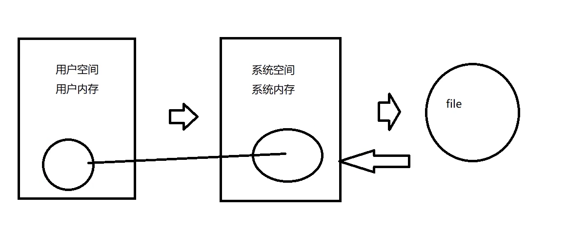

### redis核心原理

重点：持久化、底层数据结构、通信模式/请求数据格式（RESP协议）、IO多路复用、事件处理机制

持久化：

- RDB：存储二进制快照，可能丢数据

  

- AOF：存命令

  

数据结构

- 动态字符串
- 条约表
- 压缩列表
- 整数集合

事件处理机制：

两类事件

### redis企业实战

重点：缓存架构设计、缓存问题、分布式锁

- 缓存架构设计：

所以每个微服务最好都有一个自己的Redis集群

极端情况可能发生

- 缓存穿透：大量访问不存在的Key

- 缓存雪崩：某时间点大批量失效

- 缓存击穿：大量访问某个redis某个key，导致redis宕机

- 数据不一致

- hot key

  自研热点key发现服务，同时做一个热点key请求限流 ，热点迁移服务，之后就可以正常请求

- 本地缓存更新策略
  - Guava 主动更新
  - Guava 被动更新

### redis高可用方案

重点：官方cluster集群

