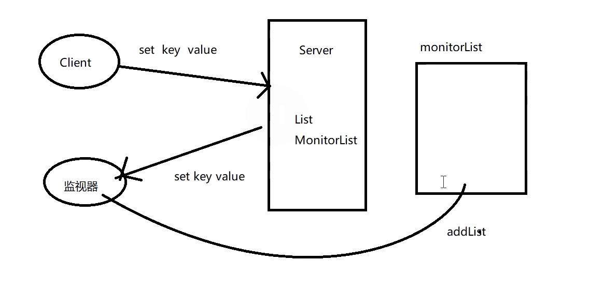
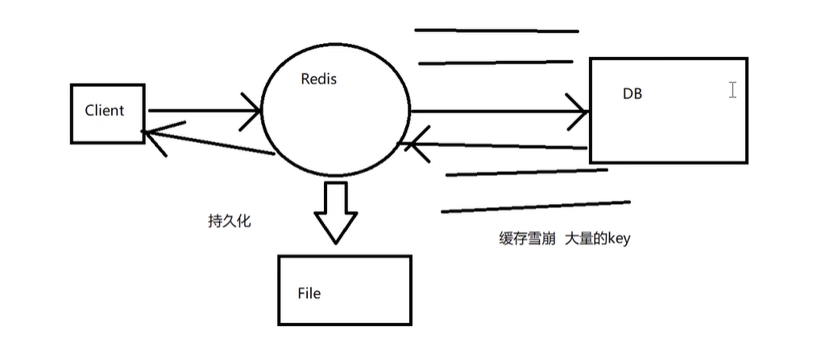
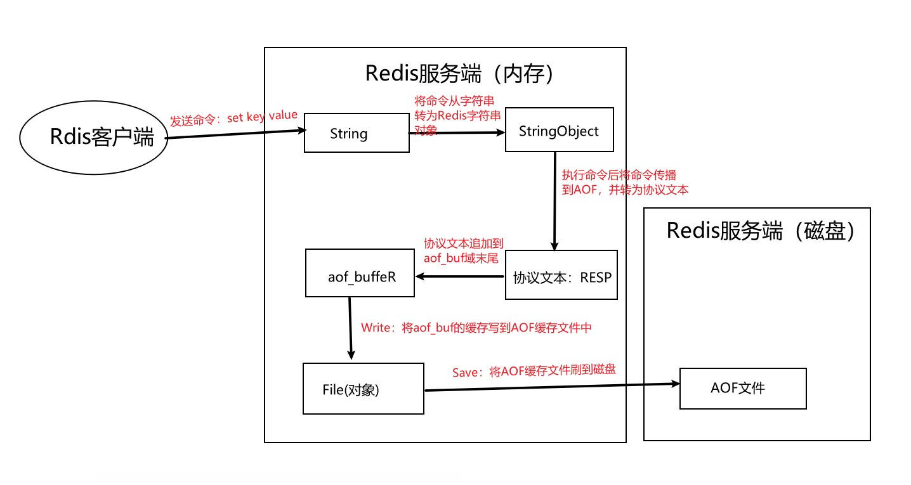

### redis扩展功能

重点：Lua脚本、事务

Nginx 引入Lua脚本对应的模块 = kong网关


订阅/发布：类似于消息队列的发布消息与消费消息，实现哨兵模式、分布式锁


弱事务（无法完全保证原子性与隔离性）：通过muti与exec组成一个commandlist命令集合发送给server端来执行

- 无法完全保证原子性
  - 保证原子性：server端检查语法，若语法有误，则将标识为DIRTY_EXEC，然后清空commandlist，保证了事务的原子性
  - 无法保证原子性：语法正确，但是中间发生错误（如`set name01 2      lpush name01 1,2,3`，name01类型已经为String，却又使用了list类型，导致执行失败），此时第一条执行成功，第二条执行失败，无法保证事务的原子性

- 无法保证隔离性

  server端在执行事务A的命令时，可能会插入事务B的命令

- 事务操作
  - multi：开启
  - exec：提交
  - watch：监视某个key，后面紧跟multi的事务。若此时别的客户端修改这个key，则所有监视这个key的客户端的事务都将清空
  - unwatch：清空监视


lua：lua是一种脚本语言，可作为插件来扩展应用程序的功能，如：

- redis通过lua实现读写分离；通过lua提供性能以及加强事务

- nginx的高并发模块；一致性hash负载均衡

redis整合lua

- 直接使用eval执行lua语句，客户端每次执行eval都要向server发送lua语句，然后编译。缺点：即占用带宽，又需要重复编译

  ```lua
  eval "return redis.call('set',KEYS[1],ARGV[1])" 1 n1 zhaoyun
  ```

- 使用EvalSha执行script load lua语句生成的sha1，sha1对应redis server中缓存的编译好的lua语句。

- 编写lua脚本，然后直接执行

  - test.lua

    ```lua
    return redis.call('set',KEYS[1],ARGV[1])
    ```

  - 执行test.lua

    ```sh
    ./redis-cli -h 127.0.0.1 -p 6379 --eval test.lua name:6 , caocao #，两边有空格
    ```

  - list.lua

    ```lua
    local key=KEYS[1] 
    
    local list=redis.call("lrange",key,0,-1); 
    
    return list;
    ```

  - 执行list.lua

    ```sh
    ./redis-cli -h 127.0.0.1 -p 6379 --eval list.lua listname:01
    ```





### redis核心原理

重点：持久化、底层数据结构、事件处理机制

持久化：



- RDB：存储二进制快照，可能丢数据

  

- AOF：存命令

  

数据结构

- 动态字符串
- 条约表
- 压缩列表
- 整数集合

事件处理机制：

两类事件


### redis企业实战

重点：缓存架构设计、缓存问题、分布式锁

- 缓存架构设计：


所以每个微服务最好都有一个自己的Redis集群


极端情况可能发生

- 缓存穿透：大量访问不存在的Key

- 缓存雪崩：某时间点大批量失效

- 缓存击穿：大量访问某个redis某个key，导致redis宕机

- 数据不一致

- hot key

  自研热点key发现服务，同时做一个热点key请求限流 ，热点迁移服务，之后就可以正常请求

- 本地缓存更新策略
  - Guava 主动更新
  - Guava 被动更新


### redis高可用方案

重点：官方cluster集群


