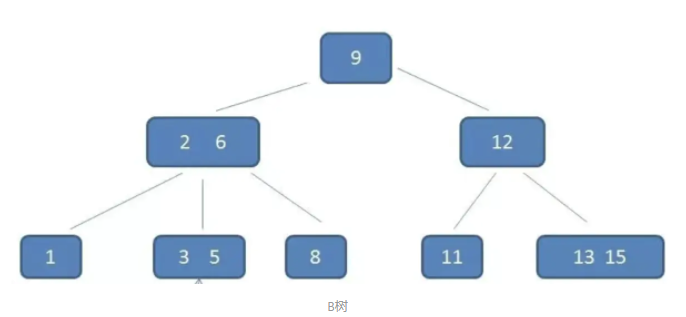
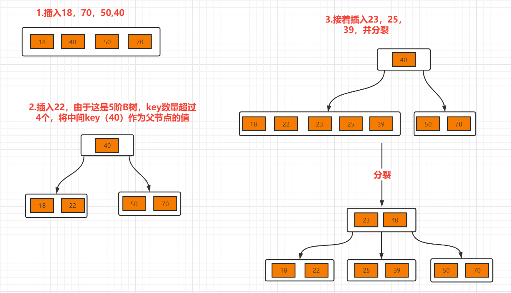
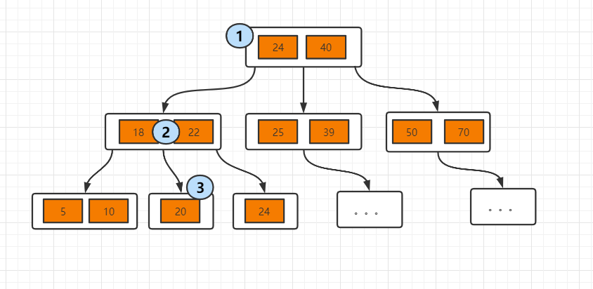
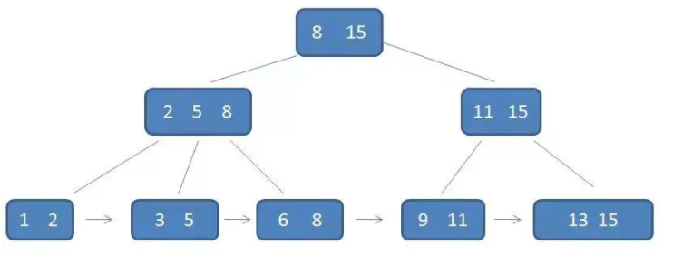

[toc]

## B树对比二叉树

B树的时间复杂度与二叉树一样，均为`O(logN)`。然而**Ｂ树出现是因为磁盘IO。**

当在大量数据存储中，查询时我们不能一下子将所有数据加载到内存中，只能逐一加载磁盘页，每个磁盘页对应树的节点。造成大量磁盘IＯ操作（最坏情况下为树的高度）。**平衡二叉树由于树深度过大而造成磁盘IO读写过于频繁**，进而导致效率低下。

所以，我们为了减少磁盘ＩＯ的次数，就你必须降低树的深度，将“瘦高”的树变得“矮胖”。

## 一、B树

### 1. 简介

描述一颗 B树时需要指定它的阶数，阶数即为树的度，当度为 2 时，就是我们常见的二叉搜索树。而B树，根结点的阶数M >= 2（至少有两个子节点）

B 树又叫**==多路平衡排序树==**。**一棵m阶的B 树 (m叉树)的特性如下**：

- B树中所有节点的**==子节点数中的最大值称为B树的阶，记为M==**
- 每个节点==最多有m-1个**关键字**==（可以存有的键值对）
- 最大叶子结点数量：$m^{k-1}$（K为树高）
- 所有的==叶子结点都位于同一层==（比如上面的图片中我没有了11 13 15，那么我12就没有存在的意义了，就需要调整整个树的布局）
- 每个节点中的关键字都按照**==从小到大的顺序排列==**

### 2. 插入过程

B树的排列规则：

- **判断当前结点key的个数是否小于等于m-1，如果满足，直接插入即可**
- **如果不满足，将节点的中间的key将这个节点分为左右两部分，中间的节点放到父节点中即可。**

例子：在5阶B树中，结点最多有4个key,最少有2个key（注意：下面的节点统一用一个节点表示key和value）。

### 3. 搜索过程

B树查找规则

- **从根节点开始，对节点内的索引值序列采用二分法查找，如果命中就结束查找。**
- **没有命中会进入子节点重复查找过程，直到所对应的的节点指针为空，或已经是叶子节点了才结束**

## 二、B+树

### 1. B+树B树的不同点

每个叶子节点都有一个指针，指向下一个数据，形成一个有序链表。

- B+ 树元素自底向上插入
- 非叶子节点不存储数据，只存储索引，数据都存储在叶子节点。
- 节点的key值从小到大的顺序排列
- 每个叶子节点都存有相邻叶子结点的指针，叶子节点本身依关键字的大小自小而大顺序链接。
- 父节点存有右子节点第一个元素的索引值。

### 搜索过程

对比B树的结构，单个查询没什么区别。如果是范围查询的话，B树需要遍历范围内的所有节点，而B+树只需要查找头尾两个节点，然后通过叶子链表读到范围内所有的键值
