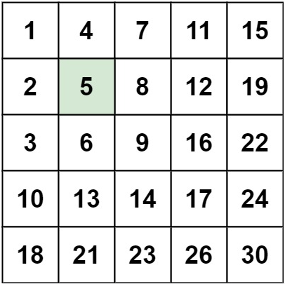

[toc]

### [240. 搜索二维矩阵 II](https://leetcode-cn.com/problems/search-a-2d-matrix-ii/)

编写一个高效的算法来搜索 m x n 矩阵 matrix 中的一个目标值 target 。该矩阵具有以下特性：

- 每行的元素从左到右升序排列。

- 每列的元素从上到下升序排列。



#### 思路：

从矩阵的右上角看，类似于一个二叉排序树


#### 题解

- 顺序查找 $O(mn)$
- 二分查找 $O(mlog_2n)$
- 二叉排序树 $O(log_2mn)$

```java
class Solution {
    // 顺序查找
    // public boolean searchMatrix(int[][] matrix, int target) {
    //     for(int i = 0; i < matrix.length; i++){
    //         for(int j = 0; j < matrix[i].length; j++){
    //             if(matrix[i][j] == target){
    //                 return true;
    //             }
    //         }
    //     }
    //     return false;
    // }

    // 二分查找
    // public boolean searchMatrix(int[][] matrix, int target) {
    //     for(int i = 0; i < matrix.length; i++){
    //         int low = 0;
    //         int high = matrix[i].length-1;
    //         int mid;

    //         while(high >= low){
    //             mid = low + (high-low)/2;
    //             if(matrix[i][mid] == target){
    //                 return true;
    //             }else if(matrix[i][mid] > target){
    //                 high = mid -1;
    //             }else{
    //                 low = mid + 1;
    //             }
    //         }

    //     }
    //     return false;
    // }

    // 类二叉排序数(从矩阵的右上角开始遍历)
    public boolean searchMatrix(int[][] matrix, int target) {
        int x=0,y=matrix[0].length-1;
        while(x<matrix.length && y >= 0){
            if(matrix[x][y] == target){
                return true;
            } else if(target > matrix[x][y]){
                x++;
            } else {
                y--;
            }
        }
        return false;
    }
}
```

