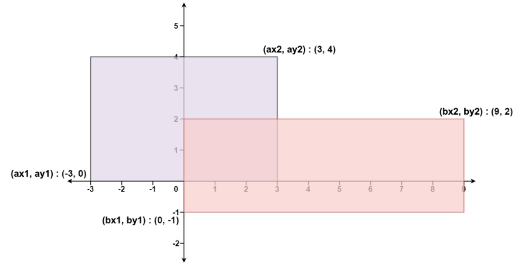

[toc]

### 力扣之[223. 矩形面积](https://leetcode-cn.com/problems/rectangle-area/)

给你 二维 平面上两个 由直线构成的 矩形，请你计算并返回两个矩形覆盖的总面积。

每个矩形由其 左下 顶点和 右上 顶点坐标表示：

第一个矩形由其左下顶点 (ax1, ay1) 和右上顶点 (ax2, ay2) 定义。
第二个矩形由其左下顶点 (bx1, by1) 和右上顶点 (bx2, by2) 定义。

**示例 1：**



#### 题解

```java
class Solution {
    public int computeArea(int ax1, int ay1, int ax2, int ay2, int bx1, int by1, int bx2, int by2) {
        int area = (ax2-ax1)*(ay2-ay1) + (bx2-bx1)*(by2-by1);
        int defLength = Math.min(ax2,bx2) - Math.max(ax1,bx1);
        int defWidth = Math.min(ay2,by2) - Math.max(ay1,by1);
        int defArea = Math.max(defLength,0) * Math.max(defWidth,0);

        return area -defArea;
    }
}
```

