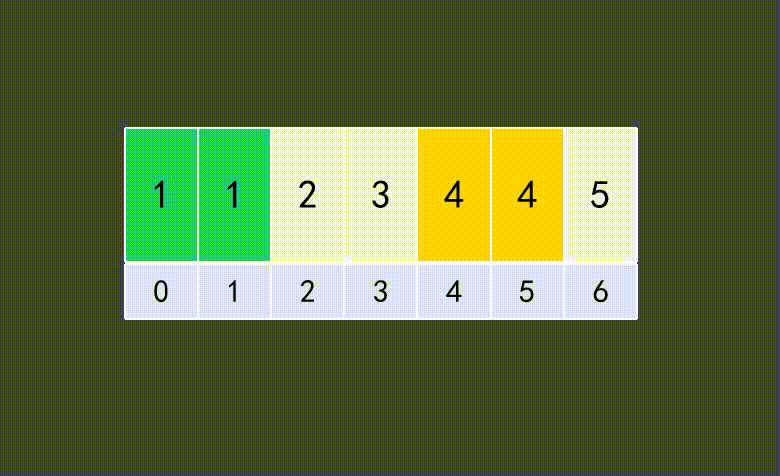

[toc]

### **双层for循环可以使用双指针来优化**

### [26. 删除有序数组中的重复项](https://leetcode-cn.com/problems/remove-duplicates-from-sorted-array/)

给你一个 升序排列 的数组 nums ，请你 原地 删除重复出现的元素，使每个元素 只出现一次 ，返回删除后数组的新长度。元素的 相对顺序 应该保持 一致 。

由于在某些语言中不能改变数组的长度，所以必须将结果放在数组nums的第一部分。更规范地说，如果在删除重复项之后有 k 个元素，那么 nums 的前 k 个元素应该保存最终结果。

将最终结果插入 nums 的前 k 个位置后返回 k 。

不要使用额外的空间，你必须在 原地 修改输入数组 并在使用 O(1) 额外空间的条件下完成。

#### 示例

```
示例 1：

输入：nums = [1,1,2]
输出：2, nums = [1,2,?]
解释：函数应该返回新的长度 2 ，并且原数组 nums 的前两个元素被修改为 1, 2 。不需要考虑数组中超出新长度后面的元素。
示例 2：

输入：nums = [0,0,1,1,1,2,2,3,3,4]
输出：5, nums = [0,1,2,3,4,?,?,?,?,?]
解释：函数应该返回新的长度 5 ， 并且原数组 nums 的前五个元素被修改为 0, 1, 2, 3, 4 。不需要考虑数组中超出新长度后面的元素。
```

#### 暴力解法

时间复杂度：$O(n^2)$

空间复杂度：O(1)

- 依次遍历比较

- 不同：向后遍历，i++；
- 相同：后面所有元素前移一位；

```java
public int removeDuplicates(int[] nums) {
    int length = nums.length; // 数组长度
    // 1.遍历数组
    for (int i = 0; i < length - 1; ) {
        // 2.依次比较相邻的元素
        if (nums[i] != nums[i + 1]) {
            // 2.1.不同：向后遍历
            i++;
        } else {
            // 2.2.相同：后面所有元素前移一位
            for (int j = i + 1; j < length - 1; j++) {
                nums[j] = nums[j + 1];
            }
            // 3.每遇到重复元素，数组长度缩减1
            length--;
        }
    }
    return length;
}
```

#### 优化思路



时间复杂度：O(n)

空间复杂度：O(1)

- 使用双指针，一个目标位，一个待移动位。
- 两个指针的值相同，目标位不变，待移动位后移1位
- 两个指针的值不同，目标位后移1位，待移动位赋值给目标位，待移动位后移1位

```java
class Solution {
    public int removeDuplicates(int[] nums) {
        int target = 0;// 目标位

        for(int rear = 1;rear < nums.length;rear++){// 待移动位
            // 相同，目标位不变，待移动位后移1位
            // 不同，目标位后移1位，待移动位赋值给目标位，待移动位后移1位
            if(nums[target] != nums[rear]){
                nums[++target] = nums[rear];
            }
        }
        return target+1;
    }
}
```


