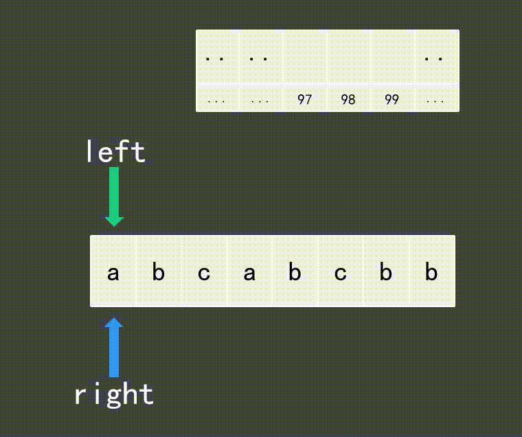

[toc]

### [1. 两数之和](https://leetcode-cn.com/problems/two-sum/)

给出一个整数数组 numbers 和一个目标值 target，请在数组中找出两个加起来等于目标值的数，你给出的函数twoSum 需要返回这两个数字的下标（index1，index2）组成的数组，需要满足 index1 小于index2.。注意：**下标是1开始**，保证给出的数组中只存在唯一解。例如：

给出的数组为 [20, 70, 110, 150] , 目标值为90

返回一个数组 [1,2] ，numbers1+numbers2=20+70=90

#### 思路：

使用哈希表存储值，当目标值与遍历的元素值差，在哈希表中已经存储，则此程序完成

#### 题解

$O(n)$

```java
class Solution {
    public int[] twoSum (int[] numbers, int target) {
        Map<Integer,Integer> map = new HashMap();
        for(int i=0; i < numbers.length; i++){
            if(!map.containsKey(numbers[i])){
                map.put(numbers[i],i);
            }
            int diff = target - numbers[i];
            if(map.containsKey(diff) && map.get(diff) != i){
                return new int[]{map.get(diff),i};
            }
        }
        return new int[2];
    }
}
```


### [187. 重复的DNA序列](https://leetcode-cn.com/problems/repeated-dna-sequences/)

所有 DNA 都由一系列缩写为 'A'，'C'，'G' 和 'T' 的核苷酸组成，例如："ACGAATTCCG"。在研究 DNA 时，识别 DNA 中的重复序列有时会对研究非常有帮助

编写一个函数来找出所有目标子串，目标子串的长度为 10，且在 DNA 字符串 s 中出现次数超过一次。

```java
输入：s = "AAAAACCCCCAAAAACCCCCCAAAAAGGGTTT"
输出：["AAAAACCCCC","CCCCCAAAAA"]
```


#### 思路

使用哈希表存储建，并判断该键是否存储超过一次

#### 题解

$O(n)$

```java
class Solution {
    public List<String> findRepeatedDnaSequences(String s) {
        Map<String,Integer> map = new HashMap<>();
        List<String> list = new ArrayList<>();

        for(int i=0;i<s.length()-9;i++){
            int j = i+10;
            String sub = s.substring(i,j);

            if (map.put(sub,1) != null && !list.contains(sub)){
                list.add(sub);
            }
        }

        return list;
    }
}
```


### [3. 无重复字符的最长子串](https://leetcode-cn.com/problems/longest-substring-without-repeating-characters/)

给定一个字符串 `s` ，请你找出其中不含有重复字符的 **最长子串** 的长度。

#### 示例

```
示例 1:

输入: s = "abcabcbb"
输出: 3 
解释: 因为无重复字符的最长子串是 "abc"，所以其长度为 3。
示例 2:

输入: s = "bbbbb"
输出: 1
解释: 因为无重复字符的最长子串是 "b"，所以其长度为 1。
示例 3:

输入: s = "pwwkew"
输出: 3
解释: 因为无重复字符的最长子串是 "wke"，所以其长度为 3。
     请注意，你的答案必须是 子串 的长度，"pwke" 是一个子序列，不是子串。
```

#### 暴力解法

时间复杂度：O(n^3)

- 遍历并截取子串：O(n^3)
- 实际时间消耗巨大

空间复杂度：O(n^2)

- 子串都是常量：O(n^2)
- 子串都是字符串常量，实际空间消耗巨大

```java
public int lengthOfLongestSubstring(String s) {
    int len;
    if (s == null || (len = s.length()) == 0) {
        return 0;
    }

    int maxLength = 1; // 最长子串的长度。默认值1：原字符串有数据，至少是1

    // 1.遍历字符串，生成所有的不含重复字符的子串
    for (int start = 0; start < len; start++) { // 遍历子串的起始字符
        for (int end = start + 1; end < len; end++) { // 遍历子串的终止字符
            String subStr = s.substring(start, end); // 截取当前字符的前置子串
            // 当前字符在前面的子串中已出现，则跳过该字符
            if (subStr.indexOf(s.charAt(end)) != -1) {
                break;
            }
            // 2.统计最长子串的长度
            int subLen = end + 1 - start; // 子串长度
            if (subLen > maxLength)
                maxLength = subLen;
        }
    }
    return maxLength;
}
```

#### 优化思路

时间复杂度：O(n)

空间复杂度：O(1)

- 双层for循环可以使用双指针来优化
- 避免生成子串常量
- 首位指针后移时，都需要判断该值是否存在



```java
public int lengthOfLongestSubstring(String s) {
    int res = 0,            // 最长子串的计算结果
        left = 0,           // 子串起始索引
        right = 0,          // 子串结束索引
        len = s.length();   // 字符串长度
    // 1.哈希表中填充ASCII码表不包含的数值作为默认值：-1
    int[] arr = new int[128];
    for (int i = 0; i < arr.length; i++)
        arr[i] = -1;
    // 2.遍历字符串的所有字符
    while (right < len) {
        int c = s.charAt(right);
        if (arr[c] != -1) { // 检测该字符是否已出现：已出现
            // 出现，则移动左指针，直接定位到上次出现的下一个索引
            int start0 = arr[c] + 1;
            // 2.1.使用双指针定位子串索引：左指针直接定位
            left = left >= start0 ? left : start0; // 只往右不往左
        }
        arr[c] = right; // 无论是否重复，记录该字符最后一次出现的索引
        // 3.计算子串长度，记录最大值：右索引+1 - 左索引
        int size = right + 1 - left;
        res = res > size ? res : size;
        // 2.2.使用双指针定位子串索引：右指针始终自增
        right++;
    }
    return res;
}
```

```java
public int lengthOfLongestSubstring(String s) {
    int res = 0, left = 0, right = 0, len = s.length();
    // 1.定义哈希表，支持ASCII码表的全部字符
    char[] chs = new char[128];
    // 2.遍历字符串的所有字符
    while (right < len) { // 右指针后移，不超过源字符串长度
        char rightChar = s.charAt(right); // 右指针字符
        char c = chs[(chs.length - 1) & hash(rightChar)]; // hash算法计算索引
        if (rightChar != c) { // 未重复出现
            // 2.1.记录到哈希表，移动右指针，计算长度
            char v = s.charAt(right++);
            // 将不重复字符记录到哈希表中
            chs[(chs.length - 1) & hash(v)] = v;
            // 3.每次记录子串长度，并计算最大值
            int size = right - left; // 每个不重复子串的长度
            res = res > size ? res : size; // 取较大值
        } else { // 重复出现
            // 2.2.删除左指针元素，移动左指针。重复检查右指针元素是否还存在
            char leftChar = s.charAt(left++);
            chs[(chs.length - 1) & hash(leftChar)] = '\u0000';
        }
    }
    return res;
}
```

