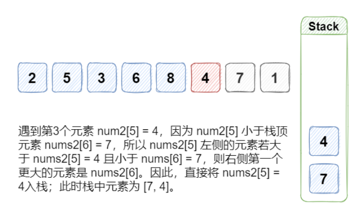

[toc]

### [496. 下一个更大元素 I](https://leetcode-cn.com/problems/next-greater-element-i/)

给你两个 没有重复元素 的数组 `nums1 `和 `nums2 `，其中`nums1 `是 `nums2 `的子集。

请你找出 `nums1 `中每个元素在 `nums2 `中的下一个比其大的值。

`nums1 `中数字 x 的下一个更大元素是指 x 在 `nums2 `中对应位置的右边的第一个比 x 大的元素。如果不存在，对应位置输出 `-1` 。

```
输入: nums1 = [4,1,2], nums2 = [1,3,4,2].
输出: [-1,3,-1]
解释:
    对于 num1 中的数字 4 ，你无法在第二个数组中找到下一个更大的数字，因此输出 -1 。
    对于 num1 中的数字 1 ，第二个数组中数字1右边的下一个较大数字是 3 。
    对于 num1 中的数字 2 ，第二个数组中没有下一个更大的数字，因此输出 -1 。
```




#### 条件：请设计O(m+n)的时间复杂度的算法

#### 思路：

- 从数组的尾端开始，逐一入栈；
- 若栈不为空，进栈前与栈顶元素比较大小，若栈顶元素小则将栈顶元素出栈；

- 此时，若栈空则元素右边无大值；若栈不为空，则栈顶值为该元素的右边大值，将结果存入哈希表
- 然后将新元素入栈

```java
class Solution {
    
    //     //暴力法 O(mn)
    // public int[] nextGreaterElement(int[] nums1, int[] nums2) {
    //     int[] res = new int[nums1.length];
    //     int j = 0;

    //     for(int n : nums1){
    //         int i = 0;
    //         while(n != nums2[i]){
    //             i++;
    //         }
    //         while(++i < nums2.length && nums2[i] < n){
                
    //         }
    //         if(i >= nums2.length){
    //             res[j++] = -1;
    //         } else {
    //             res[j++] = nums2[i];
    //         }
    //     }
    //     return res;
    // }

    public int[] nextGreaterElement(int[] nums1, int[] nums2) {
        ArrayDeque<Integer> stack = new ArrayDeque<>();
        Map<Integer,Integer> map = new HashMap<Integer,Integer>(10);
        Integer top,value;
     
        for(int i=nums2.length-1; i > -1; i--){
            top = stack.peek();
            value = nums2[i];

            // check
            while(top != null && value > top){
                stack.pop();
                top = stack.peek();
            }

            if(top == null){
                map.put(value,-1);
            } else {
                map.put(value,top);
            }

            stack.push(value);

        }
        
        for(int i=0; i < nums1.length ; i++){
            nums1[i] = map.get(nums1[i]);
        }
        return nums1;
    }
}
```


### [1021. 删除最外层的括号](https://leetcode-cn.com/problems/remove-outermost-parentheses/)

#### 示例

> 输入：s = "(()())(())"
>
> 输出："()()()"
>
> 解释：输入字符串为 "(()())(())"，原语化分解得到 "(()())" + "(())"，删除每个部分中的最外层括号后得到 "()()" + "()" = "()()()"。

#### 思路

时间复杂度：O(n)

空间复杂度：O(n)

- 遍历字符串，将符合要求的字符串剔除最外层 '()' ，放入StringBuffer中
- 利用栈的FILO的思想，当遇到 '(' 时往里放，当遇到 ')' 时往外出
- 优化：不使用栈的对象，减少内存的消耗。我们有了栈的思想，可以直接一个计数器里代替

```java
class Solution {
    public String removeOuterParentheses(String s) {
        int count = 0;
        StringBuffer buffer = new StringBuffer();
        int lastOption = 0;

        for (int i = 0; i < s.length(); i++) {
            char c = s.charAt(i);
            if ('(' == c){
                count++;
            } else {
                count--;
            }

            if (count == 0){
                buffer.append(s.substring(lastOption+1,i));
                lastOption = i + 1;
            }
        }

        return buffer.toString();
    }
}
```

#### 优化思路

时间复杂度：O(n)

空间复杂度：O(n)

- 省去截取字符串的操作，依次将符合要求的字符放入StringBuffer中

```java
class Solution {
    public String removeOuterParentheses(String s) {
        int count = 0;
        StringBuffer buffer = new StringBuffer();
        int lastOption = 0;

        for (int i = 0; i < s.length(); i++) {
            char c = s.charAt(i);
            if ('(' == c){
                if(count > 0){buffer.append(c);}
                count++;
            } else {
                count--;
                if(count > 0){buffer.append(c);}
            }
        }

        return buffer.toString();
    }
}
```

