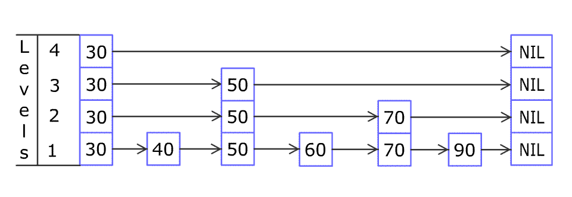

**本质是一种二分查找的链表**。通过在原始链表上**创建多级索引，实现有序链表的二分查找**，每次查找都能过滤剩余一半的数据，相当于链表版的二分查找，**时间复杂度是$O(log_2n)$**

其结构特点如下：

- skiplist由**很多层有序链表组成**
- **最底层是原始链表**，包含**所有元素**
- 最底层**之上每一层链表都是索引层**，上层索引是下层索引的子集
- 每个结点有两个指针，**一个指向同层右边的结点**，**一个指向下层的结点**
- 跳表的**head结点**是**最高层的第一个结点**

操作特点如下：

- 查找元素，从 head 开始，从左到右、从上到下依次查找并比较
  - 如果 right 指向的结点为null，即尾节点，则下移
  - 如果 结点值 等于 target则返回
  - 如果 target 大 则继续往右
  - 如果 target 小 则往下

- 添加元素允许重复
- **添加**元素，**定位**新元素在原始链表要**插入的位置**，然后插入；然后通过**抛硬币**的方式**决定是否创建索引，概率50%**；若**超过当前索引层**，则**新建索引链表的头结点**，并创建该元素的索引结点
- 删除重复元素时，只删前一个
- **删除**元素时，找到目标，**从索引到原始元素，逐层删除**

若要插入80和45示意图如下：



```java
class Skiplist {
    final int HEAD_VALUE = -1;  // 链表头节点的值
    final Node HEAD = new Node(HEAD_VALUE);
    Node head;        // 最左上角的头节点，所有操作的开始位置
    int levels;       // 当前层级，即 head 节点所在的最高层数
    public Skiplist() {
        head = HEAD;
        levels = 1;
    }
    class Node {
        int val;          // 数据域
        Node right, down; // 指针域：向右，向下

        Node(int val) {
            this(val, null, null);
        }

        Node(int val, Node right, Node down) {
            this.val = val;
            this.right = right;
            this.down = down;
        }
    }

    
    
    public boolean search(int target) {
        Node n = head;
        while (n != null) {
            // 1.在同一层级上向右查找，直到链表结尾，或者找到
            while (n.right != null && n.right.val < target) {
                n = n.right;
            }
            // 2.若找到，返回true
            Node right = n.right; // 要查找的节点
            if (right != null && right.val == target) {
                return true;
            }
            // 3.若右侧数据较大，向下一层
            n = n.down;
        }
        return false;
    }

    
    
    public boolean erase(int num) {
        boolean exist = false;
        Node n = head;
        while (n != null) {
            // 1.获取该指定数据节点的前一个节点
            while (n.right != null && n.right.val < num) {
                n = n.right;
            }
            // 2.与当前层链表断开
            Node right = n.right; // 要删除的节点
            if (right != null && right.val == num) {
                n.right = right.right;
                right.right = null; // help GC
                exist = true;
            }
            // 3.删除下一层
            n = n.down;
        }
        return exist;
    }


    public void add(int num) {
        // 1.定位插入位置：原链表中 >= num 的最小节点前
        Node node = head; // 从 head 开始查找
        // 节点向下，可能是生成索引的位置，使用数组记录这些节点
        Node[] nodes = new Node[levels];
        int i = 0; // 操作上述数组
        while (node != null) { // node==null 时，到达原链表
            // 在同一层级上向右查找，直到链表结尾，或者找到
            while (node.right != null && node.right.val < num) {
                node = node.right;
            }
            // 右侧为结尾 or 右侧值大 or 右侧值相同
            nodes[i++] = node;
            // 继续查找下一层的位置
            node = node.down;
        }

        // 2.插入新节点
        node = nodes[--i]; // nodes中最后一个元素
        Node newNode = new Node(num, node.right, null);
        node.right = newNode;

        // 3.根据扔硬币决定（是否）生成索引
        addIndicesByCoinFlip(newNode, nodes, i);
    }


    private void addIndicesByCoinFlip(Node target, Node[] nodes, int indices) {
        Node downNode = target;
        Random random = new Random();
        int coins = random.nextInt(2); // 0 or 1, 50% 概率
        // 1.抛硬币，在现有跳表层数范围内建立索引
        while (coins == 1 && indices > 0) {
            Node prev = nodes[--indices]; // 数组的倒数第二个元素，level 2
            Node newIndex = new Node(target.val, prev.right, downNode);
            prev.right = newIndex;

            downNode = newIndex;
            coins = random.nextInt(2);
        }
        // 2.抛硬币，决定是否建立一层超出跳表层数的索引层
        if (coins == 1) { // 新建一个索引层级
            // 新建索引节点和 head 节点
            Node newIndex = new Node(target.val, null, downNode);
            Node newHead = new Node(HEAD_VALUE, newIndex, head);
            head = newHead; // head 指针上移
            levels++; // 跳表层数加 1
        }
    }
}
```

