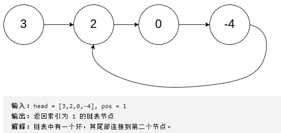
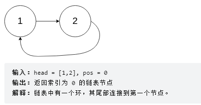
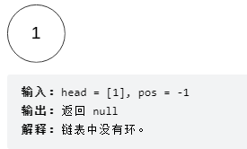
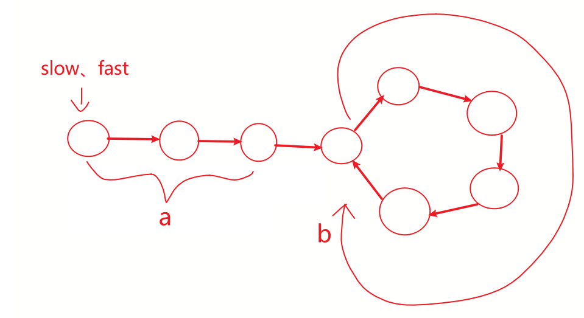
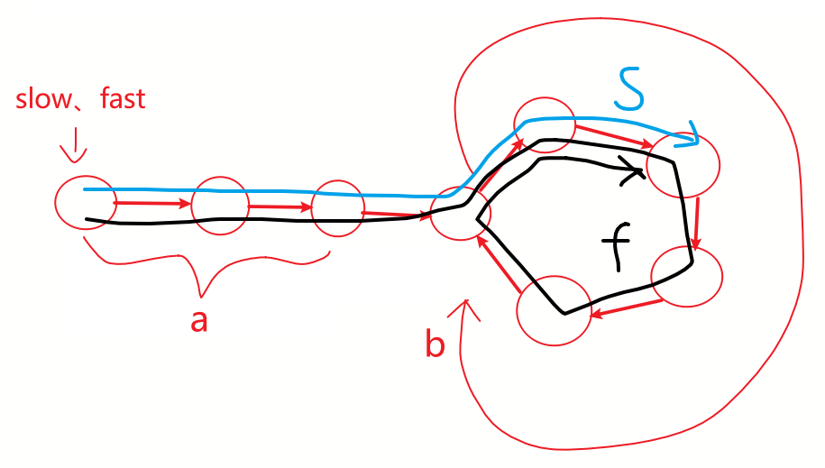

[toc]

### [237. 删除链表中的节点](https://leetcode-cn.com/problems/delete-node-in-a-linked-list/)

请编写一个函数，用于 删除单链表中某个特定节点 。在设计函数时需要注意，你无法访问链表的头节点 head ，只能直接访问 要被删除的节点 。

题目数据保证需要删除的节点 不是末尾节点 。

#### 示例


```java
输入：head = [4,5,1,9], node = 5
输出：[4,1,9]
解释：指定链表中值为 5 的第二个节点，那么在调用了你的函数之后，该链表应变为 4 -> 1 -> 9
```

#### 思路

- 将待删除的下个节点的值赋给待删除节点
- 删除节点

```java
/**
 * Definition for singly-linked list.
 * public class ListNode {
 *     int val;
 *     ListNode next;
 *     ListNode(int x) { val = x; }
 * }
 */
class Solution {
    public void deleteNode(ListNode node) {
        //if(node.next == null) return;

        node.val = node.next.val;
        node.next = node.next.next;
    }
}
```

```c++
/**
 * Definition for singly-linked list.
 * struct ListNode {
 *     int val;
 *     ListNode *next;
 *     ListNode(int x) : val(x), next(NULL) {}
 * };
 */
class Solution {
public:
    void deleteNode(ListNode* node) {
        node->val = node->next->val;
        node->next = node->next->next;
    }
};
```


### [2. 两数相加](https://leetcode-cn.com/problems/add-two-numbers/)

给你两个 非空 的链表，表示两个非负的整数。它们每位数字都是按照 逆序 的方式存储的，并且每个节点只能存储 一位 数字。

请你将两个数相加，并以相同形式返回一个表示和的链表。

你可以假设除了数字 0 之外，这两个数都不会以 0 开头。

#### 示例


```
输入：l1 = [2,4,3], l2 = [5,6,4]
输出：[7,0,8]
解释：342 + 465 = 807.
```


#### 思路：

时间复杂度：O(m+n)

空间复杂度：O(max(m,n))

- 自己实现链表的求表长、下标读取元素的方法
- 遍历两个链表，从下标0开始相加，逢十进一，`1` 加在较长的链表上

```java
/**
 * Definition for singly-linked list.
 * public class ListNode {
 *     int val;
 *     ListNode next;
 *     ListNode() {}
 *     ListNode(int val) { this.val = val; }
 *     ListNode(int val, ListNode next) { this.val = val; this.next = next; }
 * }
 */
class Solution {
    public ListNode addTwoNumbers(ListNode l1, ListNode l2) {
        ListNode res = new ListNode();
        ListNode temp = res;
        int size1 = getsize(l1);
        int size2 = getsize(l2);
        int size = Math.max(size1,size2);


        for(int i=0; i<size; i++){
            ListNode node1 = searchNode(l1,i);
            ListNode node2 = searchNode(l2,i);
            int newVal = node1.val + node2.val;

            if(newVal > 9){
                ListNode node = size1 > size2 ? node1 : node2;
                newVal = newVal%10;
                if(node.next != null) {
                    node.next.val += 1;
                }
                else {
                    node.next = new ListNode(1);
                    size++;
                }
            }

            if(i == 0) {
                temp.val = newVal;
            } else {
                temp.next = new ListNode(newVal);
                temp = temp.next;
            }

        }
        return res;
    }

    public ListNode searchNode(ListNode node,int index){
        ListNode temp = node;
        int i = 0;

        while(temp.next != null && i < index){
            temp = temp.next;
            i++;
        }
        if(i == index) return temp;
        else return new ListNode(0);
        
    }

    public int getsize(ListNode node){
        ListNode temp = node;
        int i = 0;

        while(temp.next != null){
            temp = temp.next;
            i++;
        }
        return i+1;
    }
}
```

#### 优化思路

时间复杂度：O(max(m,n))

空间复杂度：O(max(m,n))

```java
public ListNode addTwoNumbers(ListNode l1, ListNode l2) {
    ListNode p = l1, q = l2; // 原链表的两个遍历指针
    ListNode resultHead = new ListNode(-1); // 结果链表的头结点head
    ListNode curr = resultHead; // 结果链表的遍历指针，代表当前操作的节点
    int carry = 0; // 进位
    // 1.遍历两个链表
    while (p != null || q != null) { // 以较长的链表为准
        // 获取当前节点值：链表较短，已无节点，取0
        int x = (p != null) ? p.val : 0;
        int y = (q != null) ? q.val : 0;
        // 2.对应位置的节点数值相加
        int sum = carry + x + y;
        carry = sum / 10; // 如何得到进位：和对10求整，得到此次计算的进位
        int num = sum % 10; // 存放到新链表节点中的数值
        // 3.将计算结果插入新链表尾部
        curr.next = new ListNode(num); // 创建新节点，追加到结果链表的尾部
        curr = curr.next; // 结果链表的当前节点向后移动
        // 循环的迭代部分：原链表的两个遍历指针
        p = p == null ? p : p.next;
        q = q == null ? q : q.next;
    }
    if (carry > 0) { // 处理进位节点
        curr.next = new ListNode(carry);
    }
    return resultHead.next;
}
```


### [142. 环形链表 II](https://leetcode-cn.com/problems/linked-list-cycle-ii/)

给定一个链表的头节点  head ，返回链表开始入环的第一个节点。 如果链表无环，则返回 null。

如果链表中有某个节点，可以通过连续跟踪 next 指针再次到达，则链表中存在环。 为了表示给定链表中的环，评测系统内部使用整数 pos 来表示链表尾连接到链表中的位置（索引从 0 开始）。如果 pos 是 -1，则在该链表中没有环。注意：pos 不作为参数进行传递，仅仅是为了标识链表的实际情况。

不允许修改 链表。

#### 示例








#### 暴力解题-hash表

- 遍历链表，将遍历过的结点放入hash表，遍历过程中发现hash表中已经有此结点，则表示是环入口了

```java
public class Solution {
    public ListNode detectCycle(ListNode head) {
        ListNode pos = head;
        Set<ListNode> visited = new HashSet<ListNode>();
        while (pos != null) {
            if (visited.contains(pos)) {
                return pos;
            } else {
                visited.add(pos);
            }
            pos = pos.next;
        }
        return null;
    }
}
```


#### 优化-双指针





- 两个指针**fast**和**slow**从链表头结点出发，**head到环的入口为a个结点**（不包含环的入口），**环为b个结点**
- 假设一：**fast走两步**，**slow走一步**。在相遇点， fast走过**路程为 f**，slow走过**路程为s**；
- 则有相遇点表达式：$f = 2s$  和  $f = s + nb$（看图，在相遇点时fast结点肯定比slow结点多走n个环）
- 由相遇点的两个表达式得出  $f = 2nb$ 以及 $s = nb$ 结论


- 假设二：有一个 **totol** 指针，从head出发经过n轮环到达环入口，则有表达式  $T = a + nb$

- 由 $s = nb$ 和 $T = a + nb$ 得出**结论：在相遇点的slow指针，再走a个结点，就是环的入口结点**
- **由上述结论得知：当fast和slow相遇时，另起一个指针从head结点走a步，每次走一步，而slow继续前进走a个结点，他们相遇时就是环的入口结点**

```java
/**
 * Definition for singly-linked list.
 * class ListNode {
 *     int val;
 *     ListNode next;
 *     ListNode(int x) {
 *         val = x;
 *         next = null;
 *     }
 * }
 */
// public class Solution {
//     public ListNode detectCycle(ListNode head) {
//         if(head == null 
//         || head.next == null 
//         || head.next.next == null) {return null;}

//         ListNode fast = head.next.next,slow = head.next;
//         while(fast != slow){
//             fast = fast.next;
//             slow = slow.next;
//             if(fast == null || slow == null){
//                 return null;
//             }
//             fast = fast.next;
//             if(fast == null){
//                 return null;
//             }
//         }
//         fast = head;
//         while(fast != slow){
//             fast = fast.next;
//             slow = slow.next;
//         }
//         return fast;
//     }
// }


public class Solution {
    public ListNode detectCycle(ListNode head) {
        if(head == null) {return null;}

        ListNode fast = head,slow = head;
        while(fast != null){
            fast = fast.next;
            if(fast == null){
                return null;
            } else {
                fast = fast.next;
            }
            slow = slow.next;
           if(fast == slow){
                fast = head;
                while(fast != slow){
                    fast = fast.next;
                    slow = slow.next;
                }
                return fast;
            }
        }
        return null;
    }
}
```
