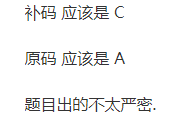

[toc]

### 二进制

**以 Java 基本数据类型 `int `为例，int 占 4 个字节，对应 32 个bit位**

##### 最大值二进制如下

`0111  1111  1111  1111  1111  1111  1111  1111`

其中**最高位是符号位**，**0代表正数**。转为10进制为 $2^{31} -1$

##### 最小值二进制如下

`1000  0000  0000  0000  0000  0000  0000  0000`

其中**最高位是符号位**，**1代表负数**。转为10进制为$ -(2^{31})$

**发现：int最大值原码 +1 刚好是int的最小值**

##### 核心理论

**一个数字在计算机中都是以二进制补码的形式存储的**

- 反码
  - 正数，则它的反码与原码相同；
  - 负数，则符号位为1，其余各位是对原码取反；
- **补码：利用溢出，我们可以将减法变成加法（计算机没有减法运算，所以通过加法实现）**
  - 正数，则它的原码、反码、补码相同
  - 负数，符号位为1，其余各位是对原码取反，然后加1


##### 为什么 0xffffffff 是 -1？

`0xffffffff`是16进制的数，f 对应数字15，转换为二进制为 `1111  1111  1111  1111  1111  1111  1111  1111`

根据上述理论，0xffffffff，在计算机中的存储为二进制补码，过程如下：

- **原码：**`1111  1111  1111  1111  1111  1111  1111  1111`
- **反码：**`1000  0000  0000  0000  0000  0000  0000  0000`
- **补码（反码 +1）：**`1000  0000  0000  0000  0000  0000  0000  0001`

- 所以 0xffffffff 在计算机中的值为 -1





### 通过正整数获得该负整数的二进制

1. 先求正整数的二进制
2. 对正数二进制取反（包括符号）
3. 对反码进行 加1 操作（补码）

4. 最终获得的就是该正数负数形式的二进制


### 位运算符

- << 左移（右边用0补齐）
  - 等价于  乘以2的幂次方
  - 5<<3 = 40
- \>> 右移（右边超出消除，左边用0补齐）
  - 等价于  除以2的幂次方
  - 5>>1 =  2
- & 位与
  - 位与运算结果为数值 （注意：逻辑与的运算结果为布偶值，有假则为假，全真为真）
  - 位数对齐运算，有0则为0，全1才为1
    5&6----101&110-----100------4
- | 位或
  - 位或运算结果为数值 （注意：逻辑或的运算结果为布偶值，有真则为真，全假为假）
  - 位数对齐运算，有1则为1，全0才为0
    5|6----101|110----111------7
- ^ 位异或
  - 运算结果为数值
  - 位数对齐运算，相同为0，不同为1
    5^6 ---- 101^110----011-----3


### 位运算应用

**取模**

`a % (Math.pow(2,n))` 等价于 `a & ( Math.pow(2,n)-1)`

```java
取模操作： a % (Math.pow(2,n))	33 % 16 = 1
等价于：a&( Math.pow(2,n)-1)	33 & 15 = 1
```

**判断是否为2的幂次方**

```java
(n & -n) == n ? 是2的幂次方 : 非2的幂次方
```

**判断奇偶**

```java
(n & 1) == 0 ? 偶 : 奇
```

**正数平均数**

```java
(x&y)+((x^y)>>1);
```

**不用临时变量交换两个数**

```java
x ^= y;
y ^= x;
x ^= y;
```

