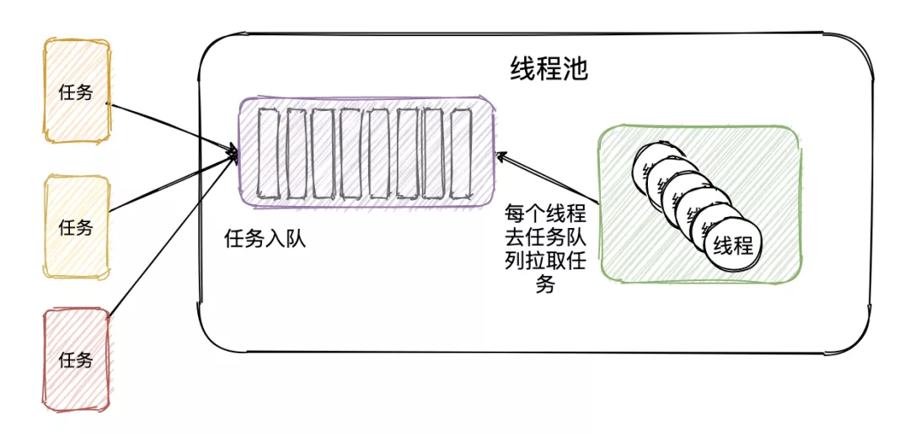

```java
public class YesThreadPool {
    
    BlockingQueue<Runnable> taskQueue; //存放任务的阻塞队列
    List<YesThread> threads; //线程列表
    
    YesThreadPool(BlockingQueue<Runnable> taskQueue,int threadSize) {
        this.taskQueue = taskQueue;
        threads = new ArrayList<>(threadSize);
        // 初始化线程，并定义名称
        IntStream.rangeClosed(1,threadSize).forEach((i) -> {
            YesThread thread = new YesThread("yes-taskthread-"+ i);
            thread.start();
            threads.add(thread);
        });
    }
    // 提交任务将任务存放到阻塞队列中
    public void execute(Runnable task) throws InterruptedException {
        taskQueue.put(task);
    }
    
    // 自定义线程,不断循环的去阻塞队列获取任务
    class YesThread extends Thread { 
        
        public YesThread(String name) {
            super(name);
        }
        
        @Override
        public void run() {
            while (true) {
                Runnable task = null;
                try {
                    task = taskQueue.take(); //不断从任务队列获取任务
                } catch (InterruptedException e) {
                    logger.error("记录点东西.....", e);
                }
                task.run(); //执行
            }
        }
    }
}
```

