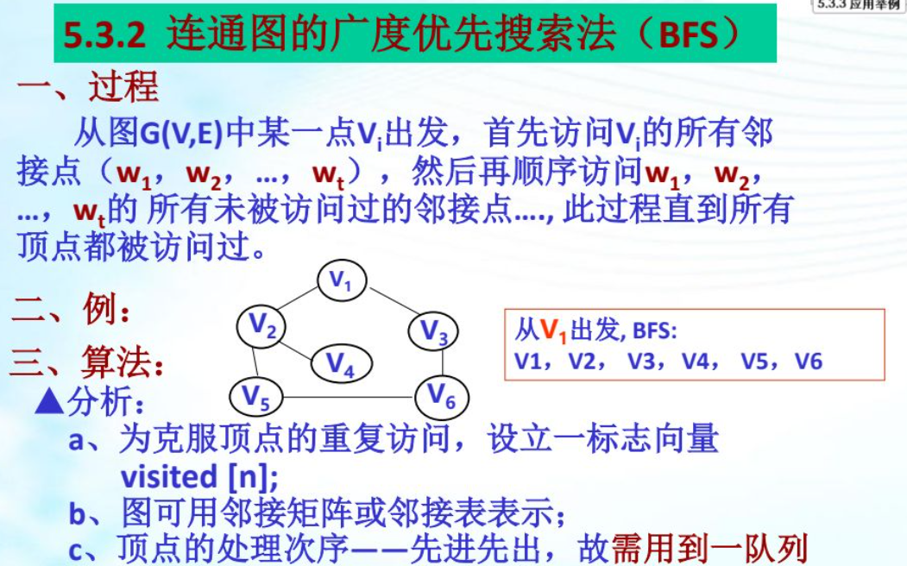

[toc]

### 一、图定义

- ==有向图==的边集表示为==尖括号==

### 二、图的基本术语

- ==无向完全图的边数： $n*(n-1)/2$==

- ==有向完全图的边数： $n*(n-1)$==

### 三、图的度及有向图入/出度

==度：表示某顶点相连的边个数==

假设 $V_i$ 是有向图的一个顶点

- 出度： $V_i$ 发出去的边
- 入度：指向 $V_i$ 的边

**==图的边数： 所有顶点的度的合 除以 2==**

### 四、图的存储

#### 1. 邻接矩阵

二维数组中 $A[i][j]$ 表示如下

- ==$i$ 到 $j$ 的边==

- 1 表示顶点 i 和 j  邻接
- 0表示顶点 i 和 j 不邻接

##### 1.1 无向图的矩阵绘制：

- $G1[1][1]$ 为 顶点1 和 顶点1 的邻接，自身邻接为0
- $G1[1][2]$ 和 $G1[2][1]$  为 顶点1 和 顶点2 的邻接，都为1
- ==已知顶点数n，边数e，则 元素1个数= $2e$，元素 0 个数=$n^2-2e$==

##### 1.2 有向图的矩阵绘制

- $G1[2][3]$ 为 顶点2 到 顶点3 的邻接，为1
- ==已知顶点数n，边数e，则 元素1个数=  $e$，元素 0 个数=$n^2-e$==

#### 2. 邻接表

- ==顺序存储 + 链式存储==

##### 2.1 无向图的表绘制：

##### 2.2 有向图的表绘制：

### 五、图的遍历

#### 1. 遍历方法

##### 1.1 设置一个辅助向量 visited[]，避免重复访问，用来标志是否访问过

##### 1.2 使用深度/广度优先遍历

#### 2. 深度优先搜索-DFS（类似先序遍历）

##### 2.1 ==深度优先遍历邻接矩阵==

时间复杂度 $O(n^2)$

##### 2.2 ==深度优先遍历邻接表==

时间复杂度 $O(n+e)$

#### 3. 广度优先搜索-BFS（类似层次遍历）

##### 3.1 ==广度优先遍历邻接表==

### 六、最小生成树

一个图的最小生成树是图所有生成树中权总和最小的生成树

**==应用：==**如连通城市间的公路，总造价最低的方案

#### 1. Prim 算法

b、c、d、e为 带权图a 生成最小树的过程

#### 2. 克鲁斯卡尔(Kruskal)算法

在 图a 为初始图，构造最小生成树过程如图 5-18b、c、d、e、f

### 七、拓扑排序

- ==有向图且没有环路==，才有拓扑排序

- 拓扑排序==不唯一==

- 拓扑排序过程：

  1. 找==入度为0==的顶点A；

  2. ==擦除==上一步找到的==顶点A 及其边==；

  3. ==重复==1和2的步骤

