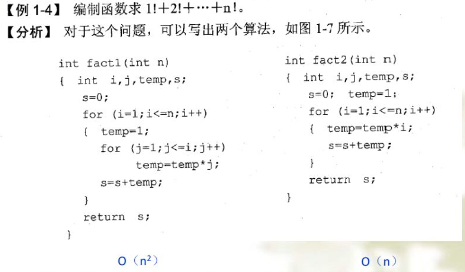

[toc]

### 一、数据结构

==数据结构是计算机组织数据（逻辑关系）和存储数据的方式==，包含数据的==逻辑结构==、==存储结构==和基本的==运算==

数据可由若干个数据元素组成，而数据元素又可由若干个数据项组成。 数据结构是相互之间存在一种或多种特定关系的数据元素的集合

#### 1. 逻辑结构

定义了数据间的逻辑关系，与数据元素本身的形式、内容、相对位置、个数无关

- **==集合==**

任意两个结点之间都**没有邻接关系**，组织形式**松散**。

- **==线性结构==**

结点按逻辑关系依次排列形成一条“**链**”，结点之间一个一个**依次相邻接**，包含**线性表、栈、队列（栈和队列运算受限的线性表）**

- **==树结构==**

具有**分支、层次**特性，其形态像自然界中的树，上层的结点可以和下层多个结点相邻接，但下层结点只能和上层的一个结点相邻接

- **==图结构==**

**最复杂**，其中任何**两个结点都可以**相邻接

#### 2. 存储结构

数据的逻辑结构在计算机中的实现称为**数据的存储结构**

- **==顺序结构==**

指所有存储结点存放在一个**连续的存储区**里。利用结点在存储器中的**相对位置**来表示数据元素之间的逻辑关系。

**特点：**静态分配空间（预先分配内存）、插入删除需要移动其他元素、随机存取

- **==链式结构==**

指每个存储结点除了含有一个数据元素外，还包含指针，每个指针指向一个与本结点有逻辑关系的结点，用**指针**表示数据元素之间的逻辑关系

**特点：**动态分配空间、插入删除不移动元素、不随机存取

- **==索引结构==**

- **==hash结构==**

#### 3. 运算

**运算**是指在某种逻辑结构上施加的操作，即对逻辑结构的加工

运算包括：**建立、查找、读取、插入和删除**等。 

线性表、栈和队列中的元素具有相同的逻辑结构（即线性结构），但有不同的运算集， 它们是不同的数据结构

### 二、算法分析

#### 1. 评价算法好坏的因素

正确性：能正确地实现预定的功能，满足具体问题的需要。

易读性：易于阅读、理解和交流，便于调试、修改和扩充

**健壮性：**即使输入非法数据，算法也能适当地做出反应或进行处理，不会产生预料不到的运行结果

**时空性：**一个算法的时空性是指该算法的时间性能（或时间效率）和空间性能（或空间效率），前者是算法包含的计算量，后者是算法需要的存储量。

#### 2. 时间复杂度（常用大O表示法）

##### 2.1 大O表示法

$T(n) = n^2 + n^3$，此算法的时间复杂度量级为$O(n^3)$，所以记作 $T(n) = O(n^3)$

##### 2.2 时间复杂度常见的阶数

- 常数阶 $O(1)$（即算法的时间复杂度与输入规模 n 无关）； 

- 对数阶 $O(log_2n)$ 

- 线性阶 $O(n)$
- 线性对数阶 $O(nlog_2n)$

- 多项式阶 $O(n^C)$，C 为大于 1 的正整数，常见的多项式阶有 $O(n^2)$ 和 $O(n^3)$ 

- 指数阶 $O(C^n)$，C 为大于 1 的正整数，常见的指数阶有 $O(2^n)$

常见的时间复杂度的比较：$O(1)<O(log_2n)＜O(n) <O(nlog_2n) <O(n^2)<O(n^3)<O(n^4)<O(2^n)$

通常认为，时间复杂度具有指数阶的算法是实际不可计算的，而阶数低于平方阶的算法是高效率的

#### 3. 空间复杂度（常用大O表示法）

对一个算法在运行过程中临时占用存储空间大小的量度。存储空间量应包括

- 程序代码所占用的空间； 

- 输入数据所占用的空间； 

- **辅助变量所占用的空间**，在估算算法空间复杂度时，一般==只需要分析辅助变量所占用的空间==

