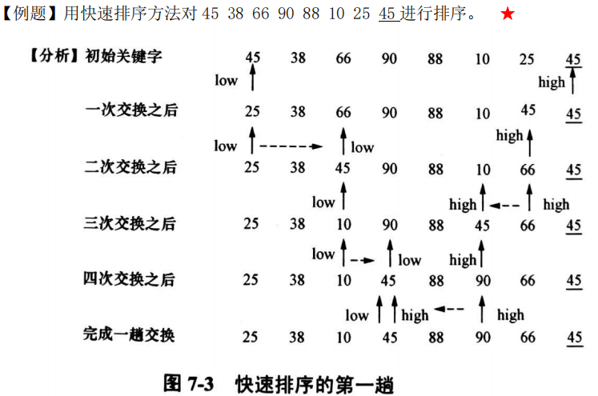
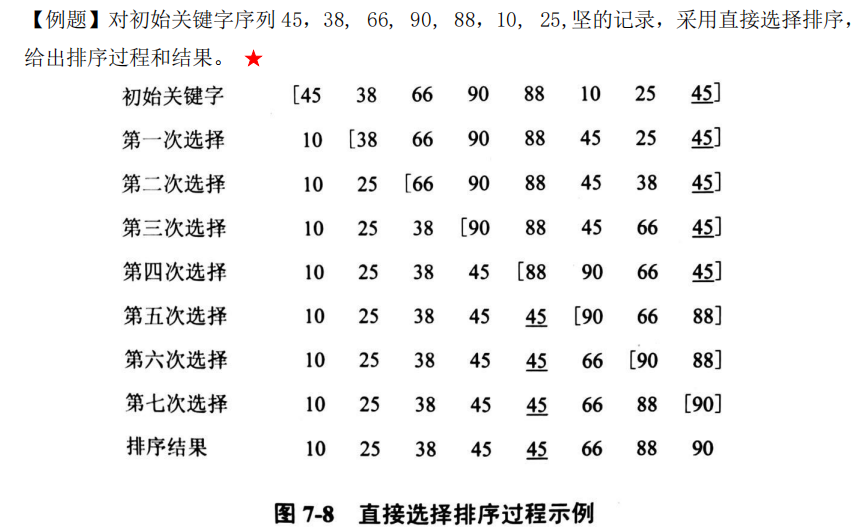

[toc]


## 一、查找算法

### 1. 顺序表查找

#### 1.1 顺序查询


```c++
 /*
 在顺序表 T 中，从后往前查找键值等于 key 的数据元素,若找到，则返回该元素在 T中的位置, 否则返回 0,标记查找不成功
 */
int SearchSqTable (SqTable T, KeyType key){ 
    T.elem[0].key=key; //设置岗哨
    i=T.n; //设置比较位置初值
    
    while{T.elem[i].key!=key) 
    	i--; //未找到时，修改比较位置继续查找
    return i;
}
```

#### 1.2 算法分析

- 时间复杂度：==$O(n)$==

- 优点：简单，对表的存储结构没要求

- 缺点：效率低


---


### 2. 有序表查找

#### 2.1 二分查找

二分查找(Binary Search)的查找过程为每次用给定值与处在表的中间位置的数据元素的键值进行比较，确定给定值的所在区间，然后逐步缩小查找区间

- 设置一个初始区间，左边界和右边界分别是 下标0 和 下边n-1
- 区间的中位数 与 目标值比较
- 根据判断来缩减区间

```c++
/*在有序表 T 中，用二分查找法查找键值等于 key 的元素，变量 low,hig 分别标记查找
区间的下界和上界*/
int SearchBin{SqTable T,KeyType key){
    int low,high;
	low=1;high=T.n; //置查找区间初值
    
	while (low<=high){ //区间长度不为 0 时继续查找
		mid= (low+high) /2; //对区间进行折半
		if (key==T.elem[mid].key) 
            return mid;
		else if(key<T.elem[mid] .key) 
            high=mid-1; //在前半区间查找
		else 
            low=mid+1; //在后半区间查找
	}
	return 0; //查找不成功，则返回
}
```

#### 2.2 算法分析

- 时间复杂度：==$O(log_2n)$==
- 查找长度不超过 $[log_2n]$+1
- 优点：效率高
- 缺点：必须是有序的顺序存储线性表


---


### 3. 索引顺序表查找（分块查询）

索引顺序表是结合了==索引表==和==顺序表==的优点构造的一种带索引的存储结构

- 索引表有序，块内无序，块间有序

- 先使用二分查找索引表
- 再通过顺序查找顺序表


#### 3.1 算法分析

介于顺序表查找和有序表查找之间


---


### 4. 二叉排序树


- 若它的左子树不空，则左子树上所有结点的键值均小于它的根结点键值； 

- 若它的右子树不空，则右子树上所有结点的键值均大于它的根结点键值； 

- 根的左、右子树也分别为二叉排序树

二叉排序树的中序遍历序列刚好是键值的递增序列

#### 4.1 搜索二叉排序树（使用深度优先搜索）

时间复杂度：==$O(n)$ 和 $O(log_2n)$ 之间==

```c++
BinTree SearchBST(BinTree bst ,KeyType key){
    if (bst==NULL) 
        return NULL; //不成功时返回 NULL 作为标记
	else if (key==bst->key) 
        return bst; //成功时返回结点地址
	else if(key<bst->key)
		return SearchBST (bst->lchild, key); //继续在左子树中查找
	else
		return SearchBST (bst->rchild, key); //继续在右子树中查找
}
```

#### 4.2 创建二叉排序数

**插入的原则是**：必须要保证==插入一个新结点后，仍为一棵二叉排序树==。这个结点是查找不成功时查找路径上访问的最后一个结点的左孩子或右孩子


#### 4.3 二叉排序树查找分析

二叉排序树上的平均查找长度是介于O(n)和O(log2n)之间的，其查找效率与树的形态有关

若二叉排序树为完全二叉树，则平均查找长度为 ==$O(log_2n)$==


---


### 5. 哈希表

#### 5.1 常用hash的方法

- 数字分析法

- **==除留余数法==**
- 平方取中法
- 基数转换法

#### 5.2 解决冲突的方法

##### 线性探测法

若取模后下标值为 $i$ ，若有冲突， 则 ==$i+1$==。。。，直到有空位


##### 二次探测法

若取模后下标值为 $i$ ，若有冲突， 则 ==$i +1^2，-1^2 , +2^2，-2^2$==，。。。，直到有空位


##### **==链地址法==**

链地址是对每一个同义词都==建一个单链表==来解决冲突。


##### 多重hash法

##### 公共溢出区法


#### 5.3 链地址法散列表-基本算法

**结构**

```c++
const int n=20; //定义表长

typedef struct TagNode{ 
    KeyType key; //关键字
	struct TagNode *next; //其他域
}*Pointer,Node;
typedef Pointer LinkHash[n];
```

**查找**

```c++
/*在散列表 HP 中查找键值等于 key 的结点，成功时返回指向该结点的指针，不成功时返回空指针*/
Pointer SearchLinkHash(KeyType key, LinkHash HP){
    i=H (key); //计算 key 的散列地址
	P=HP [i]; //同义词子表表头指针传给 p
	
    if (p==NULL) 
        return NULL;
	while (p->key!=key)
		p=p->next; //未达同义词子表表尾且未找到时，继续扫描
	return p;
}
```

**插入**

```c++
//若散列表 HP 中无键值为 key 的结点，则插入一个这样的结点
void InsertLinkHash(KeyType key,LinkHash HP){

    if ((SearchLinkHash(key,HP))==NULL){ 
        i=H(key);
        q=Pointer malloc(size(Node)); 
        q->key=key; //生成新结点
        q->next=HP[i];//旧的首结点成为新结点的next结点
        HP[i]=q; //前插法插入新结点
    } 
}
```


#### 5.4 优缺点

直接通过hash函数计算key的hash值作为存储下标，查找效率高；但是发生冲突时得解决冲突


----

---


## 二、排序算法

### 1. 排序概述

**排序定义：**排序就是将一组对象按照规定的次序重新排列的过程，排序往往是为检索服务的

**稳定性：**相同大小的两个数据，若==在排序前和排序后相对位置没发生变化==，则是稳定排序。

n 个记录的序列为{R1，R2,…，Rn}，其相应的键值序列为{k1， k2，…，kn},假设Ki=Kj，==若在排序前的序列中 Ri在 Rj之前，经过排序后，Ri仍在 Rj之前，则称所用的排序方法是稳定的==；反之，则称所用的排序方法是不稳定的。

| 排序方法     | **平均时间**              | 最坏情况     | 空间复杂度  | 稳定性 |
| ------------ | ------------------------- | ------------ | ----------- | ------ |
| 直接插入排序 | $O(n^2)$     最好为$O(n)$ | $O(n^2)$     | $O(1)$      | 稳定   |
| 冒泡排序     | $O(n^2)$    最好为$O(n)$  | $O(n^2)$     | $O(1)$      | 稳定   |
| 快速排序     | $O(nlog_2n)$              | $O(n^2)$     | $O(log_2n)$ | 不稳定 |
| 直接选择排序 | $O(n^2)$                  | $O(n^2)$     | $O(1)$      | 不稳定 |
| 堆排序       | $O(nlog_2n)$              | $O(nlog_2n)$ | $O(1)$      | 不稳定 |
| 归并排序     | $O(nlog_2n)$              | $O(nlog_2n)$ | $O(n)$      | 稳定   |

- 插入排序（直接插入排序、折半插入排序、表插入排序、希尔排序）
- 交换排序（冒泡排序、快速排序）
- 选择排序（直接选择排序、堆排序）
- 归并排序


---

### 2. 插入排序

#### 2.1 直接插入排序

直接插入排序(Straight Insertion Sorting)是一种简单的排序方法

思想：依次将每个记录插入到一个已排好序的有序表中去，从而得到一个新的、记录数增加 1的有序表。直接插入排序类似图书馆中整理图书的过程

==下标 0==作用：

- ==作用1：==暂存待插入元素；
- ==作用2：==作为岗哨；

##### 直接插入排序过程

- 设置  下标$i_0$ 岗哨，将待插入元素存入
- 第一个元素下标 $i_1$ 无需插入，所以从第二个元素 下标为 $i_2$ 开始插入比较。。
- 若大小相同，则不往前插入


##### 算法

- 待插入元素存入岗哨（0下标）
- 由于0下标作为岗哨，下标1不需要排序比较，所以从下标2开始遍历
- 比较时，将岗哨（待插入元素）与 i-1 比较

```c++
void StraightlnsertSort(List R,int n){ //对顺序表 R 进行直接插入排序
	int i,j;
    
    //n 为表长，从第二个记录起进行插入
	for (i=2;i<=n;i++) { 
        R[0]=R[i]; //第 i 个记录复制为岗哨
       	j=i-1;
        
        //与岗哨比较，直至键值不大于岗哨键值
        while (R[0].key<R[j].key) { 
            R[j+1]=R[j]; //将第 j 个记录赋值给第 j+1 个记录
            j--; 
        }

        R[j+1]=R[0]; //将第 i 个记录插入到序列中
} }
```

##### 算法分析

- 稳定性：稳定排序

- 时间复杂度：$O(n^2)$

- 空间复杂度：$O(1)$


#### 2.2 折半插入排序

#### 2.3 表插入排序

#### 2.4 希尔排序


---

### 3. 交换排序

交换排序的基本思想：比较两个记录键值的大小，如果这两个记录键值的大小出现逆序，则交换这两个记录，这样将键值较小的记录向序列前部移动，键值较大的记录向序列后部移动

#### 3.1 冒泡排序

##### 冒泡排序排序过程

- ==从左往右两两交换比较，将最大的沉淀到最右边==
- 大小相同的则不交换
- 剩余的元素，继续上面的过程


##### 算法

在算法实现时，定义一个整型变量 endsort，在每一次排序之前，先将它置为 0，若在一趟起泡中交换了记录，则将它置为 1。当一次循环结束时，我们再检查 endsort，若endsort 的值为 0 便终止算法

```c++
void BubbleSort (List R,int n){ 
    int i,j,temp,endsort; 

    for(i=1;i<=n-1;i++){
        // 循环中记录未做交换，则说明已经有序
        endsort=0; 

        for (j=1;j<=n-i;j++){ 
            //若逆序则交换记录
            if (R[j].key>R[j+1].key) { 
                temp=R[j]; 
                R[j]=R[j+1]; 
                R[j+1]=temp; 
                endsort=1; 
            } 
        }
    if (endsort==0) 
        break;
    } 
}
```

##### 算法分析

- 稳定性：稳定排序

- 时间复杂度：$O(n^2)$

- 空间复杂度：$O(1)$


#### 3.2 快速排序

快速排序(Quick Sorting)是交换排序的一种，实质上是==对冒泡排序的一种改进==

##### 快速排序过程

**==思想==：将区间内的第一个元素，通过比较，==将比它小的所有元素移到其左边==，将比它==大的所有元素移到其右边。得到左右两个区间后，分别再进行刚才的操作，直到全部拍完以后==**



- 无序序列，初始low 为下标0，初始high 为下标n-1
- 将初始的无序区间内的第一个元素 ==45==，与 high位的 45 比较，序列==合适，则不交换==，==high 的下标 -1，此时元素是25==
- low位的45 与 high位的 25 比较，不合适，则交换，high位变成45，==low+1，此时元素是38==
- low位的38 与 high位的 45 比较，合适，则不交换，==low的下标+1，此时元素是66==
- low位的66 与 high位的 45 比较，不合适，则交换，low位变成45，==high-1，此时元素是10==
- 。。。

**==说明：==**上述是一趟的排序过程，目的是通过交换，将无序区间的开头元素移到区间的中间位。然后对剩下的无序区间重复进行排序

当对整个记录序列 R 进行快速排序时，只需调用 QuickSort(R，1，n)即可。图 7-3 给出了第一次划分的结果。图 7-4 给出了快速排序的完整过程，图中方括号表示无序区


##### 算法

```c++
// 一趟快速排序的算法
int QuickPartition(List R, int low, int high){
    //对 R [low] , R [low+1] , R [high]子序列进行一趟快速排序
    x=R[low]; //置初值
    while (low<high){
        while ((low<high) && (R[high].key>=x.key) ) 
            high--; 
        R[low]=R[high]; //自尾端进行比较，将比 x 键值小的记录移到低端 
        while ((low<high) && (R[low],key<=x.key)) low++; 
        R[high]=R[low]; //自首端进行比较，将比 x 键值大的记录移动到高端
    }
    R[low] =x; //一趟快速排序结束，将 x 移到其最终位置 
    return low;
}

// 完整快速排序
void Quicksort(List R,int low,int high){ 
    //对记录序列 R[low], R[low+l],R[high]进行快速排序 
    if(low<high){ 
        temp=QuickPartition(R,low,high); 
        Quicksort(R,low,temp-1); 
        Quicksort(R,temp+1,high); 
    }
}
```

##### 算法分析

- 稳定性：不稳定排序

- 时间复杂度：==$O(nlog_2n)$==，最坏情况下即基本有序的序列进行排序，称为了单边树，最坏时间复杂度为 ==$O(n^2)$==

- 空间复杂度：$O(log_2n)$

- 对于较小的 n 值该算法效果不明显；反之，对较大的 n 值效果较好。


---

### 4. 选择排序

#### 4.1 直接选择排序（树的）

##### 选择排序过程

- 先找到最小的与 i=0 交换
- 再找第二小的与 i=1 交换
- 再找第三小的与 i=2 交换



**==基本思想：==**在第 i 次选择操作中，通过 n-i 次键值间比较，从 n-i+1 个记录中选出键值最小的记录，并和第 i(1≤i≤n-1)个记录交换。

##### 算法

```c++
void SelectSort (List R,int n){ 
    int min,i,j;
	//每次循环，选择出一个最小键值
    for(i=1;i<=n-1;i++) { 
        min=i; //假设第 i 个记录键值最小
        for (j=i+1;j<=n;j++)
            if (R[j].key<R[min].key) 
                min=j;//记录下键值较小记录的下标
        if (min!=i) 
            //将最小键值记录和交换第 i 个记录交换
            //swap(R[min],R[i]);
            temp=R[i];
            R[i] = R[min];
            R[min]=temp;
    } 
}
```

##### 算法分析

- 稳定性：不稳定排序

  

- 时间复杂度：==$O(n^2)$==

- 空间复杂度：$O(1)$

- 算法简单，容易实现，不管是否有序，始终都是要经过n-1次查找，但不适宜于 n 较大的情况


#### 4.2 堆排序（基于完全二叉树）

##### 堆定义

- 最小堆：一颗完全二叉树，每个结点都大于他的双亲结点，根结点最小
- 最大堆：一颗完全二叉树，每个结点都小于他的双亲结点，根结点最大


##### 完全二叉树序列建堆过程

- **==先找到最后一个带子结点的结点（i/2）==**
- 然后依次与子结点比较，**==交换最小的子结点==**，最终最小的值称为二叉树的根结点


##### 堆排序的过程

堆排序的过程，就是不断建堆的过程，每次建堆后，将最后一个叶子结点替换为根结点，并将原根结点输出

若在输出堆顶的最小键值之后，使得剩余的 n-1 个键值重新建成一个堆，则可得到 n 个键 值中的次最小值。如此反复执行，便能得到有序序列，这个过程称之为堆排序


##### 算法

```c++
//对 R [n]进行堆排序，排序完成后,R 中记录按关键字自大至小有序排列
void HeapSort(List R){
    int i;
    for (i=n/2;i>=1;i--)
        Shit(R,i,n); //从第 n/2 个记录开始进行筛选建堆
    for (i=n; i>=2;i--){
        swap (R [l] ,R [i]); //将堆顶记录和堆中最后一个记录互换 
        Sift(R,l,i-l ); //调整 R[1]使 R[1]，…，R[i-1]变成堆
    }
}
```

##### 算法分析

- 时间复杂度：$O(nlog_2n)$

- 空间复杂度：$O(1)$  ， 仅需一个根结点与最后的叶子结点交换的空间

- 稳定性：不稳定


---

### 5. 归并排序

==归并的含义：==将两个或两个以上的有 序表合并成一个新的有序表。

==合并的方法：==比较各子序列的第一个记录的键值，最小的一个 就是排序后序列的第一个记录的键值。取出这个记录，继续比较各子序列现有的第一个记录 的键值，便可找出排岸后的第二个记录。如此继续下去，最终可以得到排序结果。 因此==归并排序的基础是合并==。

#### 5.1 二路归并排序

##### 二路归并排序过程

二路归并排序即是将两个有序表合并成一个有序表的排序方法

- 将待排序序列，两两合并成子有序序列
- 再将两个有序序列两两合并

###### 有序序列的合并算法Merge

将两个有序子序列合并


```c++
void Merge(List a,List R, int h,int m,int n){
    //将 ah,…，am和 am+1,…，an两个有序序列合并成一个有序序列 Rh,…，Rn
    k=h; j=m+1; //k,j 置成文件的起始位置

    //将 a 中记录从小到大合并入 R 
    while ((h<=m) && (j<=n)) { 
        //a[h]键值小，送入 R[k]并修改 h 值
        if (a[h].key<=a[j].key){ 
            R[k]=a[h]; 
            h++;
        } 
        //a[j]键值小，送入 R[k]并修改 j 值
        else  { 
            R[k]=a[j]; 
            j++;
        }
        k++;
    }

    //j>n,将 ah,…,am剩余部分插入 R 的末尾
    while (h<=m) {
        R[k] =a[h];
        h++;
        k++;
    }
    //h>m,将 am+1,…,an剩余部分插入 R 的末尾
    while (j<=n) {
        R[k] =a[j];
        j++;
        k++;
    }
}
```

###### 算法 MergePass

**==思想：==**

假设待排序序列中有 n 个记录，可看成是 n 个有序的子序列，每个序列的长度为 1。

首先将每相邻的两个记录合 并，得到 `[n/2]` 个较大的有序子序列，每个子序列包含 `2` 个记录，再将上述子序列两两合 并，得到 [[n/2]/2] 个有序子序列，如此反复，直至得到一个长度为 n 的有序序列为止， 排序结束


```c++
/*在含有 n 个记录的序列 a 中，将长度各为 m 的相邻两个有序子序列合并成长度为 2m 的一 个有 序序列，并把结果存入 b 中*/
void MergePass(List a,List b,int n,int m){
    i=1;
    while (i<=n-2*m+1){
        merge(a,b, i, i+m-1, i+2*m-1); //将序列 ai,…,ai+m-1和序列 ai+h,…,ai+2*h-1合并成序列 bi,…,bi+2*m-1
        i+=2*m; //下标 i 移动 2*m
    }
    
    //m<剩余序列长度<2m
    if (i+m-1<n){
        merge(a,b,i,i+m-1,n); //将序列 ai,…,ai+m-1和序列 ai+m,…,an合并成序列 bi,…,bn
    } else{
        for(t=i;t<=n;t++) 
            b[t]=a[t]; //剩余序列长度<m,将 ai,…,an合复制 bi,…,bn
    }
}
```

###### 算法 MergeSort

二路归并排序算法描述如下

```c++
//将序列 a1，a2，…，an按关键字的递增次序进行排序，b 也定义为 list 类型
void MergeSort (List a, int n){
    m=1; //m 为子序列长度，初始值为 1
    //创建集合b...
    
    while (m<n){
        MergePass(a,b,n,m); //将序列 a 中有序子序列合并到 b 
        m=2*m; //子序列长度扩大 1 倍 
        MergePass(b,a,n,m); //将序列 b 中有序子序列合并到 a 
        m=2*m; //子序列长度扩大 1 倍
    }
}
```

##### 算法分析

- 时间复杂度：$O(nlog_2n)$
- 空间复杂度：$O(n)$
- 稳定性：稳定
