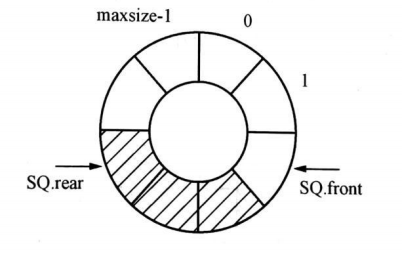
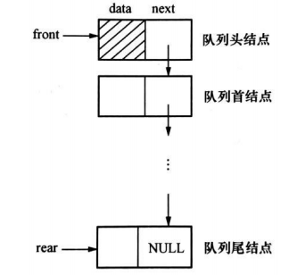

[toc]

### 一、栈

#### 1. 栈简介

==**栈（Stack）是运算受限的线性表**==，是一种==**后进先出（Last In First Out）的线性表**==，又称为后进先出线性表

栈的运算被限制于栈顶，进行插入（进栈）和删除（出栈）的一端称为栈顶，另一端称为栈底

不含任何数据元素的栈称为空栈。 处于栈顶位置的数据元素称为栈顶元素

函数的**==嵌套调用==**和程序**==递归==**的处理都是用**==栈来实现==**的


#### 2. 基本运算

- 初始化 InitStack(S)：构造一个空栈 S； 

- 判栈空 EmptyStack(S)：若栈 S 为空栈，则结果为 1，否则结果为 0； 

- 进栈 Push(S, x)：将元素 x 插入栈 S 中，使 x 成为栈 S 的栈顶元素； 

- 出栈 Pop(S)：删除栈顶元素； 

- 取栈顶 GetTop(S)：返回栈顶元素。


#### 3. 存储结构

- 顺序存储实现的栈称为==顺序栈==。通常用一个一维数组和一个记录栈顶位置的变量来实现栈的顺序存储
- 链式存储实现的栈称为==链栈==，链栈可以用带头结点的单链表来实现，由于每个结点空间都是动态分配产生，链栈不用预先考虑容量的大小


#### 4. 顺序栈

栈空:stk->top == 0

- 当空栈，栈顶下标值 `stk->top == 0`，如果此时做出栈运算，则产生“下溢”。 

- 栈已满，栈顶下标值 `stk->top == maxsize-1`，如果再进行进桟操作，会发生“上溢”。

**顺序栈结构**

- maxsize 为顺序栈的容量。 

- data [maxsize]为存储栈中数据元素的数组。 

- top 栈顶位置的下标变量，常用整型表示，范围为 0〜(maxsize-1)。

```c++
const int maxsize=6; //顺序桟的容量 
typedef struct seqstack { 
    DataType data[maxsize]; //存储栈中数据元素的数组 
    int top; //标志栈顶下标
} SeqStk;
```

**初始化**

```c++
int InitStack(SeqStk *stk) { 
    stk->top=0; 
    return 1; 
}
```

**判栈空**

```c++
int EmptyStack(SeqStk *stk){
    //若栈为空，则返回值 1，否则返回值 0
    if (stk->top==0) 
        return 1; 
    else return 0;
}
```

**进栈**

```c++
//若栈未满，元素 x 进栈 stk 中，否则提示出错信息 
int Push(SeqStk *stk, DataType x) {
    //判断找是否满 
    if (stk->top == maxsize-1){ 
        error ("栈已满"); 
        return0;
    } else { 
        stk->top++; //栈未满，top 值加 1
        stk->data[stk->top]=x; //元素 x 进桟 
        return 1;
    } 
}
```

**出栈**

```c++
int Pop {SeqStk *stk) { 
    //判断是否下溢（栈空）
    if (stk->top == 0) { 
        error(“下溢”); 
        return 0; 
    }
    //未下溢，栈顶元素出栈
    else  { 
        stk->top--; //top 值减 1 
        return 1; 
    } 
}
```

**取栈顶元素**

```c++
//取栈顶数据元素,栈顶数据元素逋过参数返回
DataType GetTop(SeqStk *stk){
    if (EmptyStack(stk)) 
        return NULLData; //栈空，返回 NULLData 
    else 
        return stk->data[stk->top]; //返回栈顶数据元素
}
```


#### 5. 链栈

LS 指向链表的头结点，首结点是栈顶结点，==LS->next 指向栈顶结点==，尾结点为栈底结点。各结点通过链域的连接组成栈，由于每个结点空间都是动态分配产生，链栈不用预先考虑容量的大小。 

**链栈结构**

```c++
typedef struct node { 
    DataType data; 
    struct node *next; 
}LkStk;
```

**初始化 **

```c++
void InitStack(LkStk *LS) { 
    LS=(LkStk *) malloc(sizeof(LkStk));
    LS->next=NULL; //建立一个空找 
}
```

**判栈空 **

```c++
//若栈为空则返回值 1，否则返回值 0
int EmptyStack(LkStk *LS){
    if (LS->next==NULL) 
        return 1; 
    else 
        return 0;
}
```

**进栈**

```c++
void Push (LkStk *LS, DataType x){
    LkStk *temp; 
    temp=(LkStk *)malloc(sizeof(LkStk)); //temp 指向申请的新结点 
    temp->data=x; //新结点的 data 域赋值为 
    x temp->next=LS->next; //temp 的 next 域指向原来的栈顶结点 
    LS->next=temp; //指向新的找顶结点
}
```

**出栈**

```c++
//栈顶数据元素通过参数返回，它的直接后继成为新的栈顶
int Pop(LkStk *LS){
    LkStk *temp;
    //判断栈是否为空
    if (LS->next != NULL){
        temp=LS->next; //temp 指向栈顶结点 
        LS->next=temp->next; //原栈顶的下一个结点成为新的栈顶 
        free(temp); //释放原栈顶结点空间 
        return 1;
    }
    else 
        return 0；
}
```

**取栈顶元素**

```c++
DataType GetTop(LkStk *LS) { 
    if (!EmptyStack(LS))
        return LS->next->data; //若栈非空，返回栈顶数据元素
    else 
        return NULLData; //否则返回空元素
}
```


### 二、队列

#### 1. 队列简介

==**队列（Queue）是运算受限的线性表**==，是一种**==先进先出(First In First Out) 的线性表==**，又称为先进先出线性表

队列的运算被限制于两端，进行**==插入（入队）的一端称为队尾==**，进行**==删除（出队）的一端称为队首==**

操作系统中**==进程调度==**、网络管理中的**==打印服务==**等都是用**==队列==**来实现的。


#### 2. 基本运算

- 队列初始化 InitQueue(Q)：设置一个空队列 Q； 

- 判队列空 EmptyQueue(Q)：若队列 Q 为空，则返回值为 1，否则返回值为 0； 

- 入队列 EnQUeUe(Q，x)：将数据元素 x 从队尾一端插入队列，使其成为队列的新尾元素； 

- 出队列 OutQueue(Q)：删除队列首元素； 

- 取队列首元素 GetHead(Q)：返回队列首元素的值。


#### 3. 存储结构

- 顺序存储实现的队列称为==顺序队列==。由一个一维数组（用于存储队列中元素）及==两个分别指示队列首和队列尾元素的变量==组成，这两个变量分别称为 ==队列首指针== 和 ==队列尾指针==
- 链式存储实现的队列称为==链队列==，使用一个带有头结点的单链表来表示队列。==头指针指向链表的头结点==，单链表的 ==头结点的 next 指向队列首结点==，==尾指针指向队列尾结点==，即单链表的最后一个结点


#### 4. 循环顺序队列

**循环队列**：为了避免入队列的"假溢出"（rear一直+++），将存储队列元素的一维数组首尾相接，形成一个环状，**==即取模运算将指针一直落在队列上==**




- 队列空， `CQ.rear==CQ.front`，如果此时做出队列运算，则产生“下溢”。 

- 队列满（尾指针追上首指针）， `(CQ.rear+1) % maxsize==CQ.front`，如果再进行进队列操作，会发生“上溢”。

**顺序队列结构**

front 和 rear 定义为整型变量，实际取值范围是 0〜(maxsize-1)。

- front 指向队列首元素的前一个单元，**==循环队列的 front指针指向的节点不存储数据，所以队首为front+1==**
- rear 指向实际的队列尾元素单元。

```c++
const int maxsize=20; 
typedef struct seqqueue { 
    DataType data[maxsize]; 
    int front,rear; 
}SeqQue; SeqQue SQ;
```

**循环队列初始化**

```c++
void InitQueue (CycQue CQ) {
    CQ.front=0; 
    CQ.rear=0;
}
```

**循环队列判空**

```c++
int EmptyQueue(CycQue CQ) { 
    if (CQ.rear==CQ.front) 
        return 1; //队列为空，返回 1 
    else
        return 0; //队列不为空，返回 0 
}
```

**入队列**

SQ.rear=(SQ.rear+1) % maxsize; 

SQ.data[SQ.rear]=x;

```c++
int EnQueue (CycQue CQ, DataType x){ 
    if ((CQ.rear+1) % maxsize==CQ.front){ 
        error(“队列满”); //队列满，入队列失败 
        return 0; 
    } else {
        CQ.rear =(CQ.rear+1) % maxsize;
        CQ.data[CQ.rear] = x; 
        return 1; //入队列成功 
    } 
}
```

**出队列**

SQ.fronts(SQ.front+1)% maxsize;

```c++
int OutQueue(CycQue CQ){
    if (CQ.rear==CQ.front){ 
        error(“队列空”); //判断队列是否为空 
        return 0; //对列为空，出队列失败 
    } else {
        CQ.front= (CQ.front+1) % maxsize; //不为空，出队列 
        return 1; //出队列成功 
    }
}
```

**取队列首元素**

```c++
DataType GetHead(CycQue CQ){ 
    if (CQ.rear==CQ.front) //判断队列是否为空 
        return NULLData; //队列为空，返回空数据标志 
    else {
        return CQ.data[(CQ.front+1)% maxsize]; 
    } 
}
```


#### 5. 链队列

链式存储实现的队列称为==链队列==，使用一个带有头结点的单链表来表示队列。==头指针指向链表的头结点==，单链表的 ==头结点的 next 指向队列首结点==，==尾指针指向队列尾结点==，即单链表的最后一个结点



**链队列结构**

```c++
typedef struct LinkQueueNode{ 
    DataType data; 
    struct LinkQueueNode *next; 
} LkQueNode; 

typedef struct LkQueue{ 
    LkQueNode *front, *rear; 
}LkQue;
```

**链队列初始化**

```c++
void InitQueue(LkQue *LQ){
    LkQueNode *temp; 
    temp= (LkQueNode *)malloc (sizeof (LkQueNode)); //生成队列的头结点 
    LQ->front=temp; //队列头才旨针指向队列头结点 
    LQ->rear=temp; //队列尾指针指向队列尾结点 
    (LQ->front) ->next=NULL; 
}
```

**链队列判空**

```c++
int EmptyQueue(LkQue LQ){ 
    if (LQ.rear==LQ.front) 
        return 1; //队列为空 
    else 
        return 0; 
}
```

**入队列**

```c++
void EnQueue(LkQue *LQ;DataType x){ 
    LkQueNode *temp; 
    temp=(LkQueNode *)malloc(sizeof(LkQueNode)); 
    temp->data=x; 
    temp->next=NULL; 
    (LQ->rear)->next=temp; //新结点入队列
    LQ->rear=temp; //置新的队列尾结点 
}
```

**出队列**

```c++
OutQueue(LkQue *LQ){ 
    LkQueNode *temp; 
    if (EmptyQueue(CQ)){ //判队列是否为空 
        error(“队空”); //队列为空 
        return 0; 
    }else { //队列非空 
        temp=(LQ->front) ->next; //使 temp 指向队列的首结点 
        (LQ->front) ->next=temp->next; //修改头结点的指针域指向新的首结点 
        if (temp->next==NULL) 
            LQ->rear=LQ->front; //无首结点时，front 和 rear 都指向头结点 
        free(temp);
        return 1;
    }
}
```

**取队列首元素**

```c++
DataType GetHead (LkQue LQ){ 
    LkQueNode *temp; 
    if (EmptyQueue(CQ)){ 
        return NULLData; //判队列为空，返回空数据标志 
    } else {
        temp=LQ.front->next; 
        return temp->data; //队列非空，返回队列首结点元素 
    } 
}
```


