[toc]

### 一、树

#### 1. 定义

树（Tree）是一类重要的数据结构，是 n(n>=0) 个结点的有限集合，一棵树满足以下两个条件：

- 当 n=0 时，称为空树
- 当 n>0 时，**有且仅有一个称为根的结点**，除根结点外，其余结点分 m(m≥0)个互不相交的非空集合 T1，T2，…，Tm，这些集合中的每一个都是一棵树，称为根的子树
- 结点间具有层次关系，每一层结点只能和上一层中的至多一个结点相关，但可能和下一层的多个结点相关


#### 2. 相关术语

1. **结点的度：**树上任一结点所拥有的子树的数目称为该结点的度。

2. **叶子：**度为 0 的结点称为叶子或终端结点。

3. **树的度：**一棵树中所有结点的度的最大值称为该树的度。

4. **子节点：**结点的子树结点为孩子（或称子结点）

5. **结点的层次：**从根开始算起，根的层次为 1,其余结点的层次为其双亲的层次加 1。

6. **树的高度：**一棵树中所有结点层次数的最大值称为该树的高度或深度。

7. **有序树：**若树中各结点的子树从左到右是有次序的，不能互换，称为有序树。有序树

   中最左边子树的根称为第 1 个孩子，左边第 i 个子树的根称为第 i 个孩子。

8. **无序树：**若树中各结点的子树是无次序的，可以互换，则称为无序树。


#### 3. 运算

- **求根 Root** (T)：求树 T 的根结点
- **求双亲** Parent(T, X)：求结点 X 在树 T 上的双亲结点；若 X 是树 T 的根或 X 不在 T上，则结果为一'特殊标志
- **求孩子** Child(T，X，i)：求树 T 上结点 X 的第 i 个孩子结点；若 X 不在 T 上或 X 没有第 i 个孩子，则结果为一特殊标志
- **建树** Create(X, T1 , …，Tk), k>1：建立一棵以 X 为根，以 T1，…，Tk为第 1,…，k棵子树的树
- **剪枝** Delete (T，X, i)：删除树 T 上结点 X 的第 i 棵子树；若 T 无第 i 棵子树， 则为空操作
- **遍历** TraverseTree(T)：遍历树，即访问树中每个结点，且每个结点仅被访问一次


#### 4. 树的存储结构

##### 4.1 ==孩子链表表示法==

孩子域(child)和指针域(next)，孩子域存储其中一个孩子的序号，指针域指向其下一个孩子的结点

**不带双亲的孩子链表表示法**

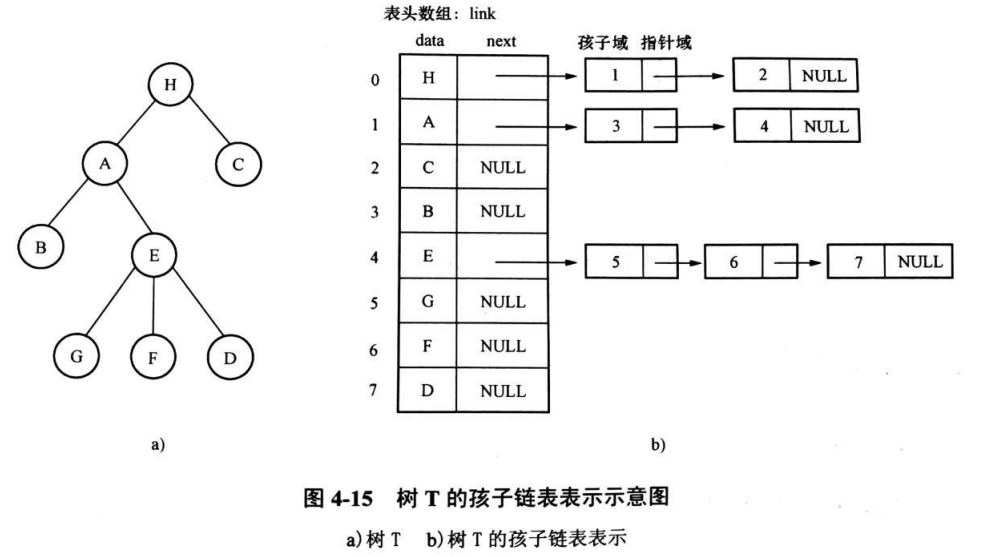

为了便于找到双亲，可在各个头结点中增加一个双亲域以存储双亲在头结点数组中 的下标值

**带双亲的孩子链表表示法**

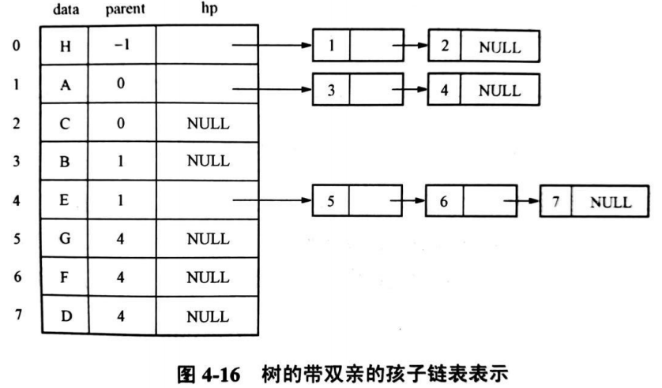


##### 4.2 ==孩子兄弟链表表示法==

存储时每个结点除了数据域外，还有指向该结点的第一个孩子和下一个兄弟结点的指针

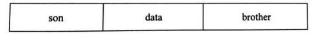

与二叉树的二叉链表法不同：

- 二叉链表的结点左、右指针分别 ==指向左、右孩子==。
- 树的孩子兄弟链表中结点的两个指针分别 ==指向孩子和兄弟==。

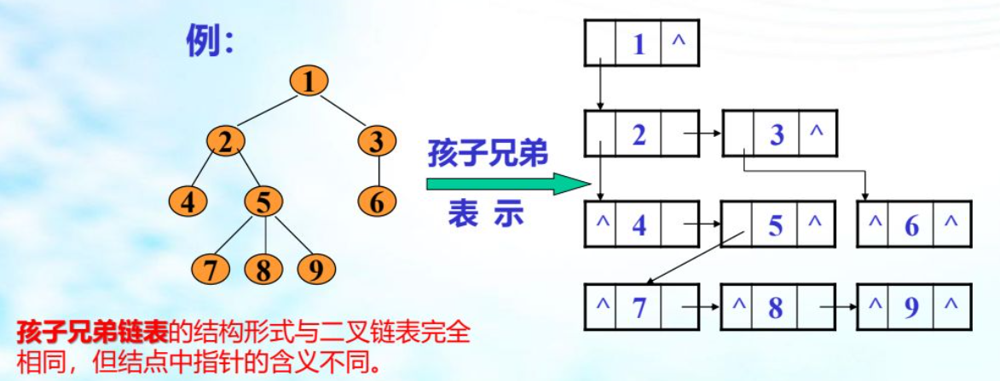


##### 4.3 双亲表示法

双亲表示法由一个一维数组构成。数组的每个分量包含两个域：数据域和双亲域

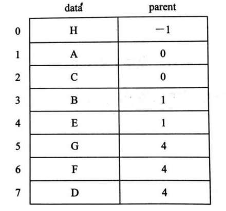

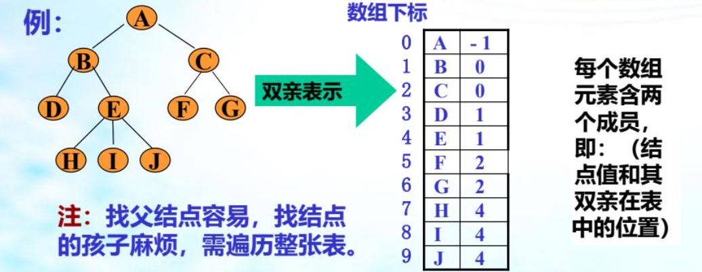


#### 5. 树、森林与二叉树的关系

##### 5.1 树转换成二叉树 

- ==所有兄弟结点相连==
- ==断开除第一个子结点外的所有子结点==
- 以根结点为轴心按顺时针的方向旋转 45°角

树转换成二叉树，==没有右子节点==

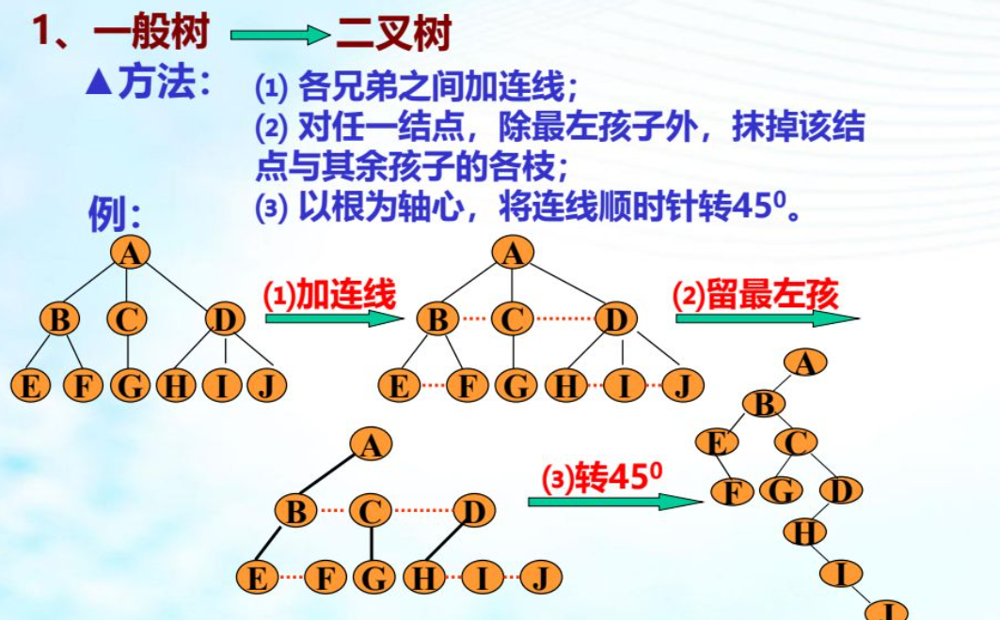


##### 5.2 森林转换成二叉树 

- 将==森林中所有树转成二叉树==
- 将所有树的根==作为兄弟结点相连（相当于接在右子节点处）==

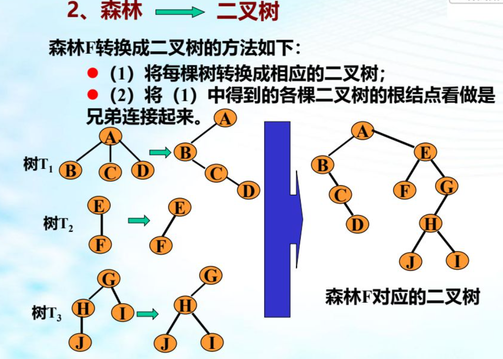


##### 5.3 二叉树转换成树/森林

1. 断开二叉树根结点与右孩子的连线，得到两棵二叉树，其中一棵是以二叉树 A 的根结点为根的二叉树 B1，另一棵是以根结点的右孩子 E 为根结点的二叉树 B2。

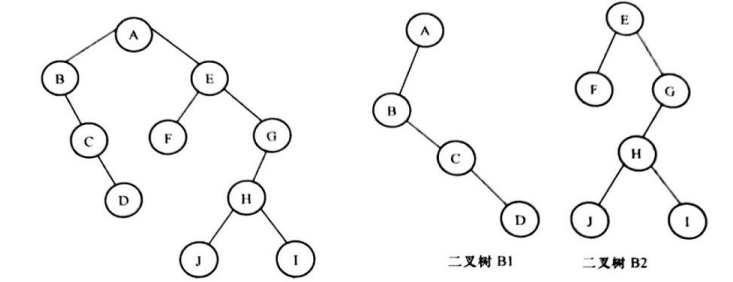

2. 在二叉树 B1 中，连接 A 与 C，A 与 D。然后将 B 和 C 的连线断开，C 和 D 的连线断开

3. 重复步骤1、2步骤对 B2 进行转换

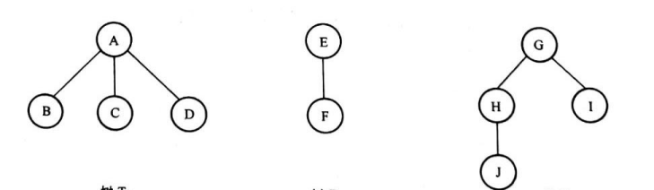

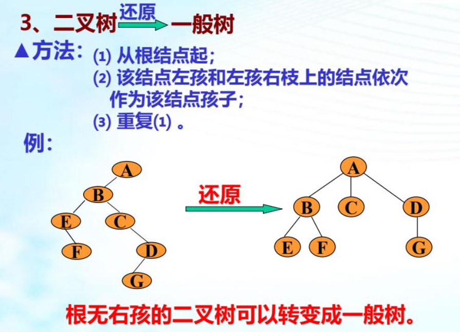


#### 6. 树的遍历

##### 6.1 先序遍历（对应二叉树的先序序列）

若树非空，则

①访问根结点；

②依次先序遍历根的各棵子树 T1，…，Tm。 

##### 6.2 后序遍历（对应二叉树中序序列）

若树非空，则

①依次后序遍历根的各棵子树 T1，…，Tm。

②访问根结点。

##### 6.3 层次遍历

①若树非空，访问根结点；

②若第 i（i≥1）层结点已被访问，第 i+1 层结点尚未访问，则从左到右依次访问第 i+1 层结点。


#### 7. 森林的遍历 

##### 7.1 先序遍历（对应二叉树的先序序列）

若树非空，则

①访问森林中第一棵树的根结点；

②先序遍历森林第一棵树的根结点的子树组成的森林；

③先序遍历除去第一棵树之外其余的树组成的森林。

##### 7.2 中序遍历（对应二叉树的中序序列）

若树非空，则

①中序遍历森林中第一棵树的根结点的子树组成的森林；

②访问第一棵树的根结点；

③中序遍历除去第一棵树之外其余的树组成的森林。


#### 8. 哈夫曼（Huffman）树及算法

给定一组值 p1…，pk，如何构造一棵有 k 个叶子且分别以这些值为权的判定树，使得**其平均比较次数最小**。满足上述条件的判定树称为**哈夫曼树**。用哈夫曼算法，可以构造出一 棵具有最小带权路径长度的二叉树

现在以表 4-1 为例，按上述哈夫曼算法求哈夫曼树的构造过程。

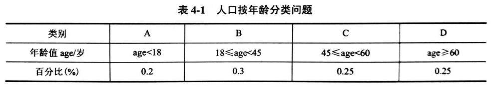

分析过程：

1. 由给定的值{p1，…，pk}构造森林 F= {A,B,C,D}
2. ==从 F 选取根结点的权最小==的两棵二叉树 A 和 C，构造一棵分别以 A 和 C 为左、右子 树的新的二叉树 Th，置  X 根结点的权为 Ti和 Tj根结点的权值之和
3. 从 F 中删去 A、C，并将 X 加入 F。若 F 中仍多于一棵二叉树，则返回第二步，直到 F 中只 含一棵二叉树为止，这棵二叉树就是哈夫曼树
4. 合并后，==左侧结点权重 <= 右侧结点权重==

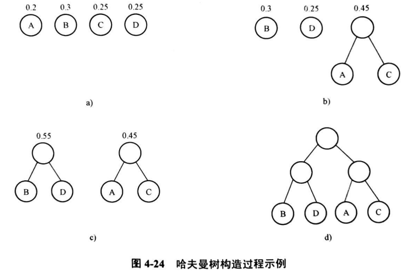

由上述哈夫曼算法可知，假设初始森林中共有 n 棵二叉树，由此可知，最终求得的哈夫曼树中共有 **==2n-1==** 个结点，其中 n 个叶结点是初始森林中的 n 个结点，并且哈夫曼树中 ==没有度数为 1== 的分支结点

**有度数为 1 的分支结点**


#### 9. 哈夫曼（Huffman）编码

该二叉树中 每个结点的==左分支标志“0”==，每个结点的==右分支标志为“1”==，这样，从根到每个叶结点 形成序列，将该序列作为叶结点对应字符的编码，由此得到的二进制编码称为哈夫曼编码


设某通信系统中一个待传输的文本有 6 个不同字符，它们的出现频率分别是0.5，0.8，1.4，2.2，2.3，2.8，试设计哈夫曼编码。

【分析】由题意，共有 n=6 个不同的字符，字符的频率序列为 p= {0.5, 0.8, 1.4, 2.2, 2.3, 2.8}，以这些频率作为权值，构造一棵哈夫曼树，并对其进行哈夫曼编码，结果如图4-25

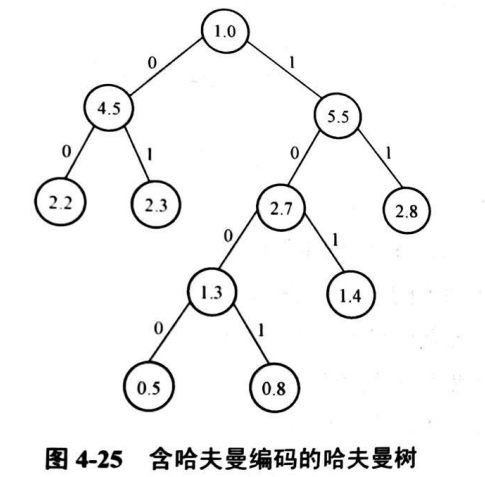

出现频率为 0.5 的字符编码为 1000

出现频率为 0.8 的字符编码为 1001 

出现频率为 1.4 的字符编码为 101 

出现频率为 2.2 的字符编码为 00 

出现频率为 2.3 的字符编码为 01 

出现频率为 2.8 的字符编码为 11


### 二、==二叉树==

#### 1. 定义

二叉树（Binary Tree）是 n(n≥0)个元素的有限集合，是度为二的树

该集合或者为空，或者由一个根及两棵互不相交的左子树和右子树组成，其中左子树和右子树也均为二叉树

基本形态如下

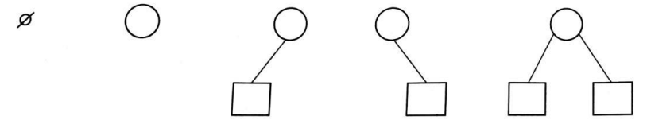


#### 2. 基本运算

- **初始化 Initiate(BT)：**建立一棵空二叉树，BT=0。

- **求双亲 Parent(BT, X)：**求出二叉树 BT 上结点 X 的双亲结点，若 X 是 BT 的根或 X 根本不是 BT 上的结点，运算结果为 NULL。

- **求左孩子 Lchild(BT，X)/右孩子 Rchild(BT，X)：**分别求出二叉树 BT 上结点 X 的左、右孩子；若 X 为 BT 的叶子或 X 不在 BT 上，运算结果为 NULL。

- **建二叉树 Create (BT)：**建立一棵二叉树 BT。

- **先序遍历 PreOrder(BT)：**按先序对二叉树 BT 进行遍历，每个结点被访问一次且仅被访问一次，若 BT 为空，则运算为空操作。

- **中序遍历 InOrder (BT)：**按中序对二叉树 BT 进行遍历，每个结点被访问一次且仅被访问一次，若 BT 为空，则运算为空操作。

- **后序遍历 PostOrder(BT)：**按后序对二叉树 BT 进行遍历，每个结点被访问一次且仅被访问一次，若 BT 为空，则运算为空操作。


#### 3. 满二叉树和完全二叉树

##### 3.1 满二叉树

==满二叉树==是，深度为 K 的树 且 ==总结点数为 $2^k-1$== （K为树高）的树

**特性：**满二叉树总结点数 = ==$2^k-1$==

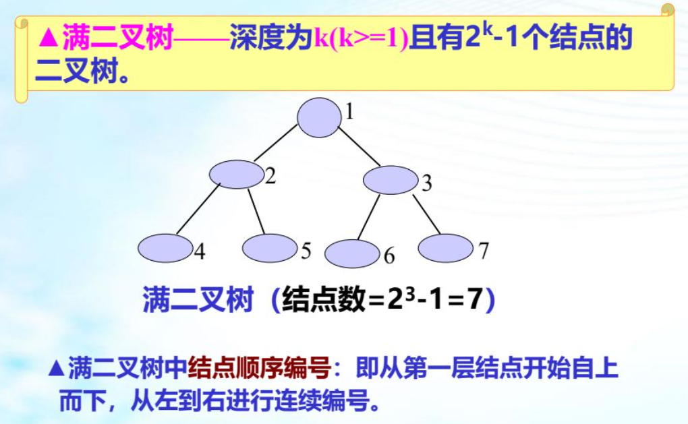


##### 3.2 完全二叉树

==完全二叉树==是，深度为 K 的树 且 ==K-1层的结点是满的== 且 ==叶子结点左连续==的

**特性：** 

- ==$2^k -1$== > 完全二叉树总结点数 > ==$2^{k-1}$==  
- 叶子结点数为==偶数时度1结点为0==；==奇数时度1结点为1==

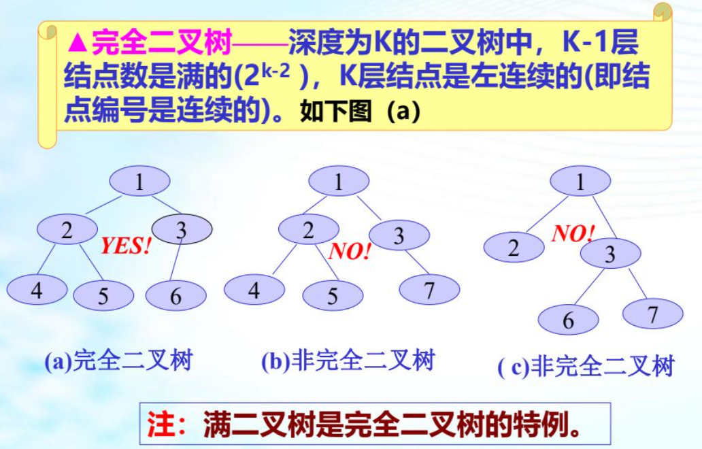


#### ==4. 特性==

- 二叉树==第 i（i≥1）层==上最多有 ==$2 ^ {i-1}$== 个结点。

- 深度为 k（k≥1）的二叉树最多有 ==$2^k-1$== 个结点。

- 叶子结点数 $n_0$，度为2的结点数为 $n_2$ ，则 ==$n_0$ = $n_2$ +1==

  叶子结点数 $n_0$，度为4的结点数为 $n_4$ ，则 ==$n_0$ =$n_2$ + 2$n_3$ + 3$n_4$  +1==

- 含有 n 个结点的完全二叉树的深度为 ==⌊log2n⌋+1==，⌊X⌋ 表示不大于X的最大整数

   ==$2^k -1$== > 完全二叉树总结点数 > ==$2^{k-1}$==  

- 将一棵有 n 个结点的完全二叉树按层编号，则对任一编号为 i（1≤i≤n）的结点 A 有：
  - 若 i=1，则结点 A 是根；
  - 若 i>1,则 A 的双亲 Parent(A)的编号为 ==$⌊i/2⌋$==
  - 若 2×i>n，则结点 A无子结点；否则 A 的==左子结点==的编号为 ==$2×i$==
  - 若 2×i+1>n，则结点 A 无右子结点；否则，A 的==右子结点==的编号为 ==$2×i+1$==


#### 5. 存储结构

- 顺序存储结构

  在某些情况下，二叉树的顺序存储结构也很有用。

- 链式存储结构

  链式存储结构在插入删除结点时较方便

##### 5.1 顺序二叉树

如果需要顺序存储的非完全二叉树，首先必须用某种方法将其==转化为完全二叉树==，为此可==增设若干个虚拟结点==。**这种方法的缺点是造成了空间的浪费。**

如下图例子：

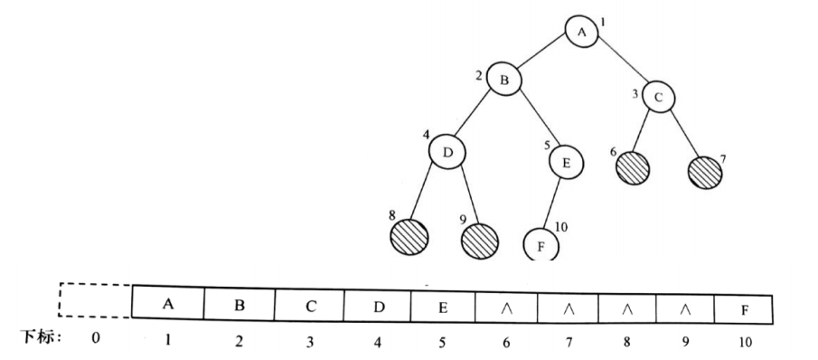


##### 5.2 ==链式二叉树==

二叉树有不同的链式存储结构，其中最常用的是==二叉链表与三叉链表==。

- 二叉链表的访问只能从根指针开始
- 三叉链表中每个结点增加一个指针域 parent，用于指向该结点的双亲

###### 5.2.1 ==二叉链表==

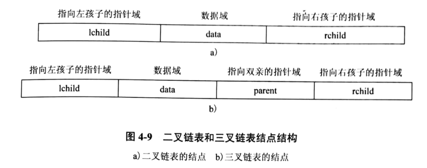


###### 5.2.2 ==三叉链表==

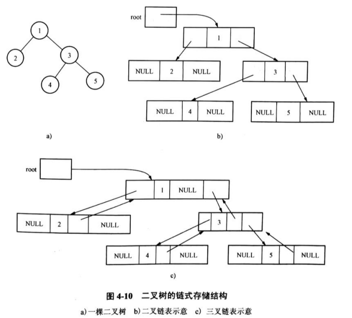


#### 6. ==二叉树的遍历及代码实现==

##### 6.1 二叉树遍历方式

- 先序遍历（深度优先）：根-左-右
- 中序遍历：左-根-右
- 后续遍历：左-右-根
- 层次遍历（广度优先遍历）：从二叉树的第一层（根结点）开始，逐层向下遍历，在每一层上按从左到右的顺序对结点逐个访问。层次遍历可以**用一个队列**来实现，利用FIFO原则


##### 6.2 先序遍历（DFS-深度优先）

若被遍历的二叉树为空，执行空操作；否则，依次执行下列操作：

(1) 访问根结点；

(2) 先序遍历左子树；

(3) 先序遍历右子树。

###### 递归实现

- C++

  ```c++
  void preorder(BinTree bt){
      if (bt!=NULL) { 
  		printf("%d\n",bt->value); //访问根结点 bt 
  		preorder (bt ->lchild); //先序遍历左子树
  		preorder (bt ->rchild); //先序遍历右子树
  	} 
  }
  ```

- JAVA

  ```java
  class Solution {
      public List<Integer> inorderTraversal(TreeNode root) {
          List<Integer> res = new ArrayList<Integer>();// 记录目标序列
          inorder(root, res); // 递归遍历二叉树
          return res;
      }
      public void inorder(TreeNode root, List<Integer> res) {
          // 处理二叉树为空的边界问题 
          // 判断遍历指针已经到达叶子结点下一层，可以返回
          if (root == null) {return; } 
  
          res.add(root.val);// 访问根结点
          inorder(root.left, res); // 先遍历左子树结点
          inorder(root.right, res); // 再遍历右子树结点
      }
  }
  ```

###### 非递归实现

- C++

  ```c++
  void PreOrder(BinTree t){
      BinTree p;
      LkStk *LS; // LS 为指向链栈的指针
      if(t==NULL) return;
      InitStack (LS);
      p=t;
      //循环条件是当指针或找至少有一个不为空
      while(p!=NULL ||！EmptyStack(LS)){
          if (p!=NULL){
              printf("%d\n",bt->value); //访问结点的数据 
              Push(LS,p); //将当前指针压入栈中 
              p=p->lchild; //将指针指向 P 的左孩子
          } else {
              p=Gettop(LS); //取栈顶元素 
              Pop(LS); //出栈 
              p=p->rchild; //指针指向它的右孩子
          }
      }
  }
  ```

- JAVA

  ```java
  class Solution {
      public List<Integer> inorderTraversal(TreeNode root) {
          List<Integer> res = new ArrayList<Integer>();// 记录目标序列
          Deque<TreeNode> stk = new LinkedList<TreeNode>();// 显式模拟栈
         // 判断结点是否被访问完
         // 处理二叉树为空的特殊情况rrer
          while (root != null || !stk.isEmpty()) {
              // 根据中序遍历顺序，第一个结点是一棵树的最左边的结点
              while (root != null) {
                  stk.push(root);
                  res.add(root.val); // 更新目标序列
                  root = root.left;// 
              }
              root = stk.pop();  // 出栈
              root = root.right; // 根据中序遍历顺序，根节点之后应该遍历右结点
          }
          return res;
      }
  }
  ```

  


##### 6.3 中序遍历

若被遍历的二叉树为空，执行空操作；否则，依次执行下列操作：

(1) 中序遍历左子树；

(2) 访问根结点；

(3) 中序遍历右子树。

###### 递归实现

- C++

  ```c++
  void inorder(BinTree bt){
      if (bt!=NULL) { 
  		inorder (bt ->lchild); //先序遍历左子树
          printf("%d\n",bt->value); //访问根结点 bt 
  		inorder (bt ->rchild); //先序遍历右子树
  	} 
  }
  ```

- JAVA

  ```java
  class Solution {
      public List<Integer> inorderTraversal(TreeNode root) {
          List<Integer> res = new ArrayList<Integer>();// 记录目标序列
          inorder(root, res); // 递归遍历二叉树
          return res;
      }
      public void inorder(TreeNode root, List<Integer> res) {
          // 处理二叉树为空的边界问题 
          // 判断遍历指针已经到达叶子结点下一层，可以返回
          if (root == null) {return; } 
  
          inorder(root.left, res); // 先遍历左子树结点
          res.add(root.val);// 访问根结点
          inorder(root.right, res); // 再遍历右子树结点
      }
  }
  ```

  

###### 非递归实现

- C++

  ```c++
  void PreOrder(BinTree t){
      BinTree p;
      LkStk *LS; // LS 为指向链栈的指针
      if(t==NULL) return;
      InitStack (LS);
      p=t;
      //循环条件是当指针或找至少有一个不为空
      while(p!=NULL ||！EmptyStack(LS)){
          if (p!=NULL){
              Push(LS,p); //将当前指针压入栈中 
              p=p->lchild; //将指针指向 P 的左孩子
          } else {
              p=Gettop(LS); //取栈顶元素 
              Pop(LS); //出栈 
              printf("%d\n",bt->value); //访问结点的数据 
              p=p->rchild; //指针指向它的右孩子
          }
      }
  }
  ```

- JAVA

  ```java
  class Solution {
      public List<Integer> inorderTraversal(TreeNode root) {
          List<Integer> res = new ArrayList<Integer>();// 记录目标序列
          Deque<TreeNode> stk = new LinkedList<TreeNode>();// 显式模拟栈
         // 判断结点是否被访问完
         // 处理二叉树为空的特殊情况rrer
          while (root != null || !stk.isEmpty()) {
              // 根据中序遍历顺序，第一个结点是一棵树的最左边的结点
              while (root != null) {
                  stk.push(root);
                  root = root.left;// 
              }
              root = stk.pop();  // 出栈
              res.add(root.val); // 更新目标序列
              root = root.right; // 根据中序遍历顺序，根节点之后应该遍历右结点
          }
          return res;
      }
  }
  ```


##### 6.4 后序遍历

若被遍历的二叉树为空，执行空操作；否则，依次执行下列操作：

(1) 后序遍历左子树；

(2) 后序遍历右子树；

(3) 访问根结点。

###### 递归实现

```c++
void postorder(BinTree bt){
    if (bt!=NULL) { 
		postorder (bt ->lchild); //先序遍历左子树
		postorder (bt ->rchild); //先序遍历右子树
        printf("%d\n",bt->value); //访问根结点 bt 
	} 
}
```

###### 非递归实现

在后序遍历过程中，结点在第一次出栈后，还需再次 入栈，也就是说，结点要两次入栈，两次出栈，遍历结点是在结点的第二次出栈时进行


##### 6.5 层次遍历（BFS-广度优先，使用队列完成）

从二叉树的第一层（根结点）开始，逐层向下遍历，在每一层上按从左到右的顺序对结点逐个访问

- C++

  ```c++
  void levelorder(BinTree bt) {
      LkQue Q;
      InitQueue(&Q); //初始化队列
      if (bt!=NULL){
          EnQueue(&Q, bt); //根结点入队列
          while (!EmptyQueue(Q)){
              p=Gethead(&Q);
              outQueue(&Q); //结点出队列
              printf("%d\n",bt->value); //被访问结点
              if (p->lchild!=NULL) EnQueue (&Q,p->lchild) ; //左孩子结点入队列
              if (p->rchild!=NULL) EnQueue (&Q,p->rchild) ; //右孩子结点入队列
          }
      }
  }
  ```

- JAVA

  ```java
  class Solution {
      public int maxDepth(TreeNode root) {
          if (root == null) {return 0;} // 考虑树为空的特殊情况 BFS无法自动处理
          Queue<TreeNode> queue = new LinkedList<TreeNode>();// 使用队列来记录各层节点
          queue.offer(root);// 根节点入队
          int res = 0;// 目标值
          while (!queue.isEmpty()) { // 判断是否还有没有遍历完的节点
              int size = queue.size(); // 开始遍历新一层节点前，队列里即为新一层全部节点 
              while (size > 0) {  // 需将这一层节点全都遍历完
                  TreeNode node = queue.poll();// 遍历节点
                  if (node.left != null) {
                      queue.offer(node.left);// 左子树入队列
                  }
                  if (node.right != null) {
                      queue.offer(node.right);// 右子树入队列
                  }
                  size--;
              } 
              res++;// 新一层节点遍历完成，目标值 +1
          }
          return res;
      }
  }
  ```


##### 6.6 二叉树遍历综合题

利用二叉树结点的 ==先序序列+中序序列== 或者 ==后序序列+中序序列==，可以确定这棵二叉树。

1. 给定两个序列，可通过先序或后序确定每层的根
2. 然后根据中序确定左子树和右子树

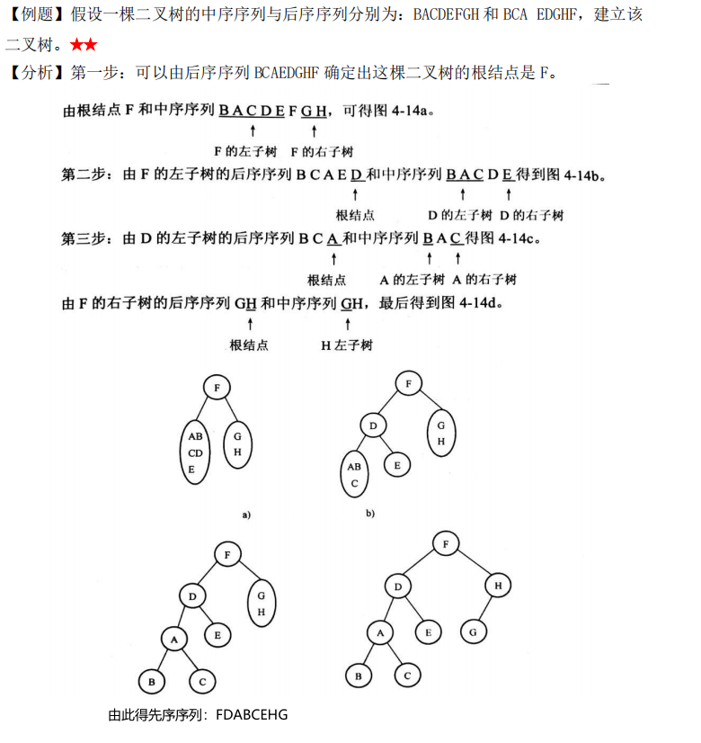


##### 6.7 求二叉树的高

利用二叉树遍历的递归算法，求二叉树的髙度。

- C++

  ```c++
  int height(BinTree bt){
      if(bt == NULL){
          return 0; //叶子结点的子树的高度为 0
      } else {
      	int m = height(bt->lchild); //左子树的高度
          int n = height(bt->rchild); //右子树的高度
          return (m > n ? m : n) + 1;
      }
  }
  ```

- JAVA

  ```java
  // 递归三要素
  // 1）确定函数等价关系式（参数，返回值）。参数是传入树的根节点，返回值是树的深度
  public int maxDepth(TreeNode root) {
      // 2)确定结束条件。如果节点为空，返回0
      // 且此处可以处理二叉树为空的corner case 
      if(root == null) { return 0; }
      // 3)函数主功能。分别求左右子树最大深度，返回左右子树深度最大值 + 1
      //   即为当前节点为根节点的树的最大深度
      int leftTreeDepth=maxDepth(root.left);
      int rightTreeDepth=maxDepth(root.right);
      return Math.max(leftTreeDepth,rightTreeDepth)+1
  }
  ```


##### 6.8 求二叉树的叶子结点数

利用二叉树遍历的递归算法，求二叉树的叶子结点数

```c++
int leafcoint(BinTree bt){
    if(bt == null){
        return 0;
    }
    
    if(bt->lchild == NULL && bt->rchild == NULL){
        return 1;
    } 
    
    int l = leafcoint(bt->lchild);
    int r = leafcoint(bt->rchild);
    return l+r;
}
```
